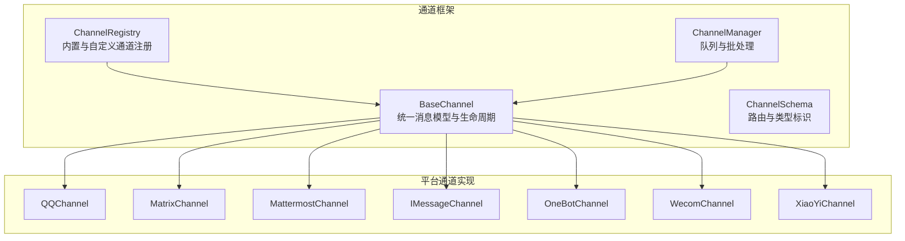
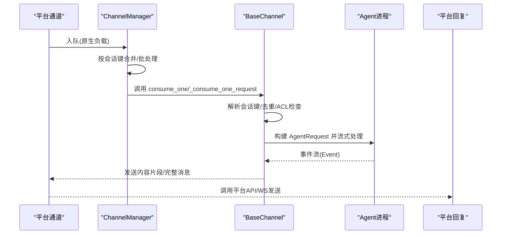
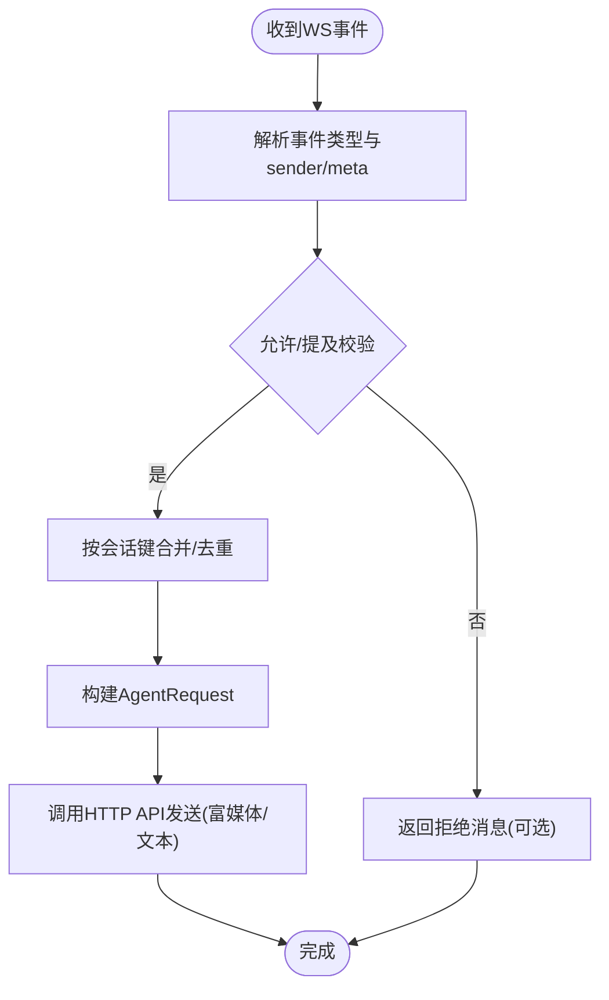
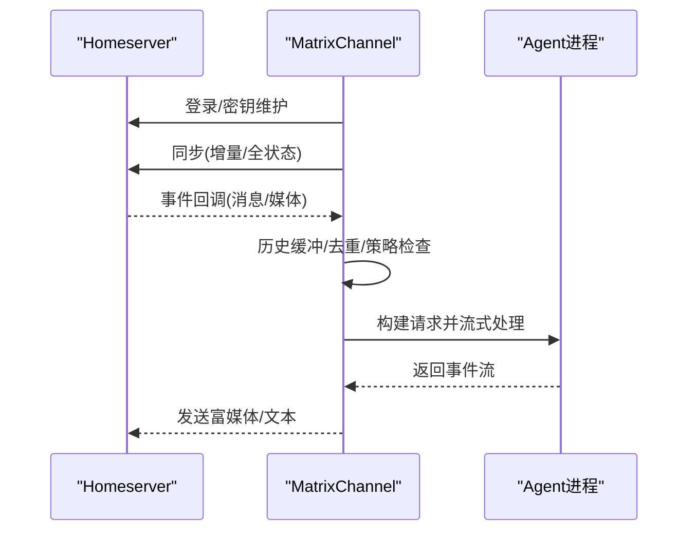
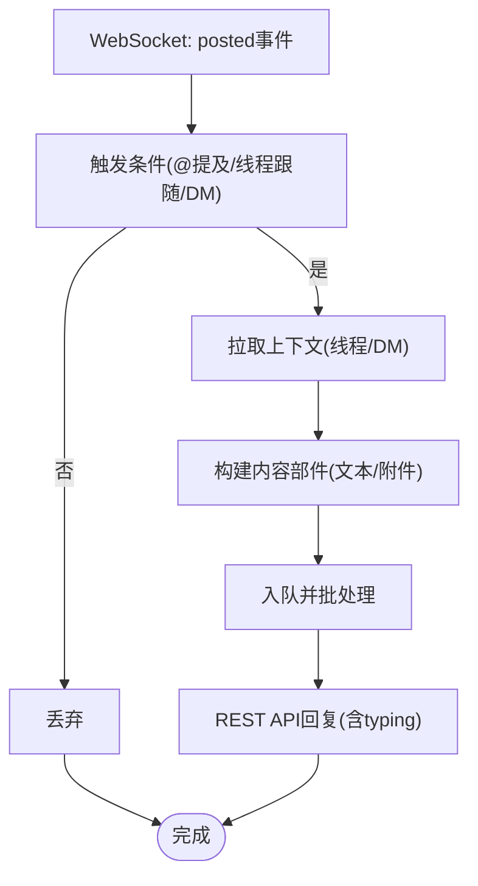
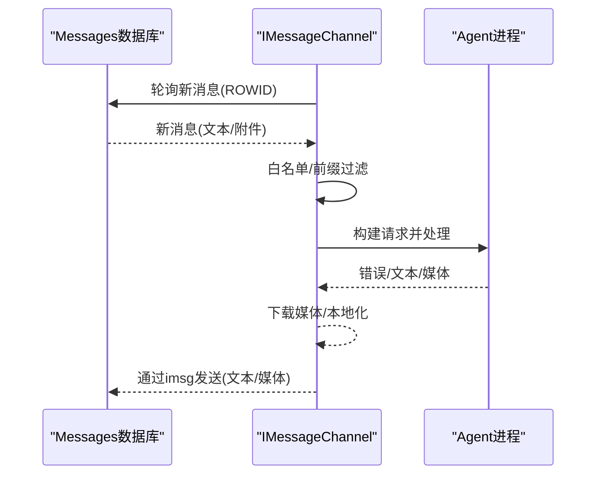
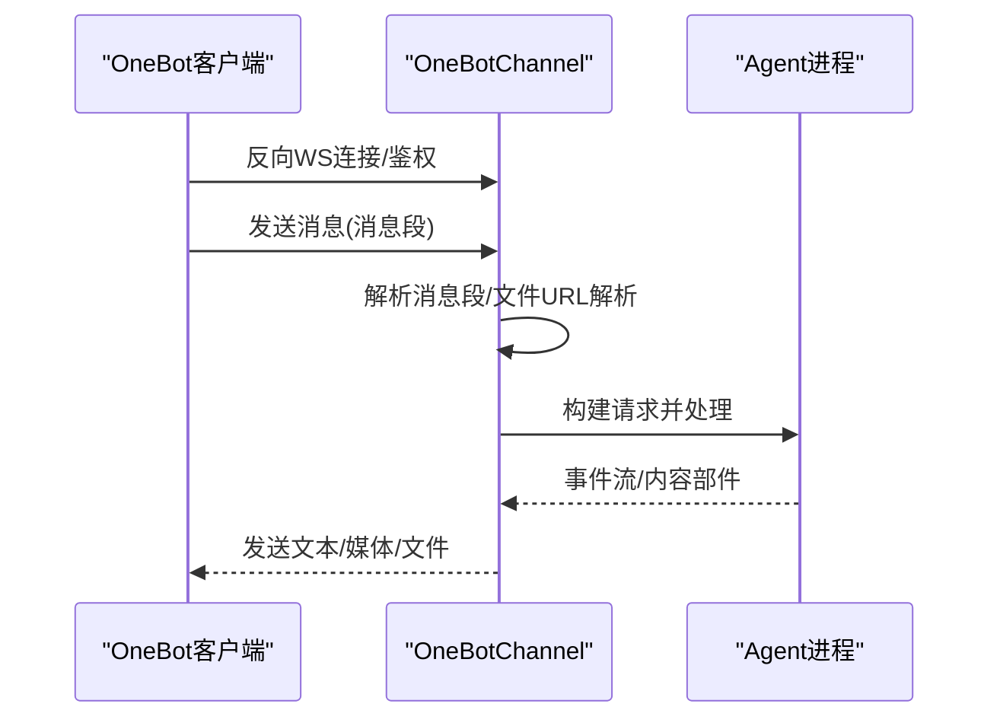
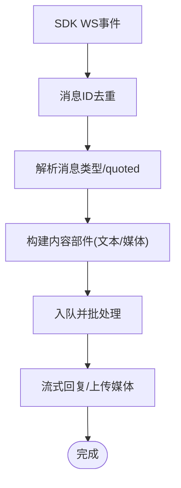
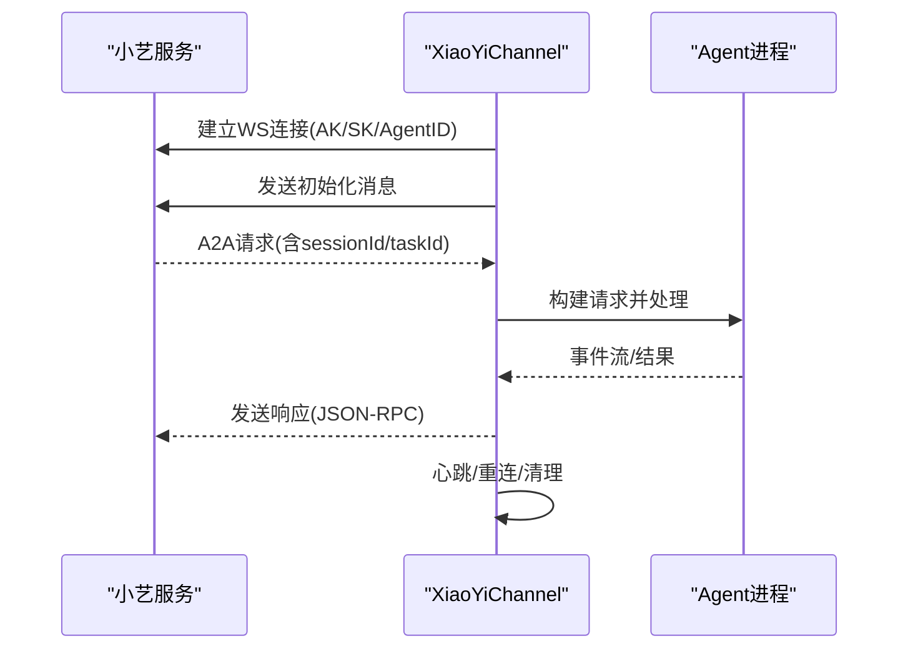
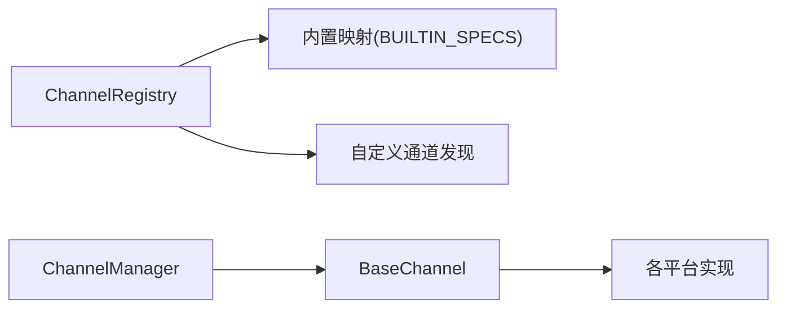

# 其他平台集成

<cite>
**本文档引用的文件**
- [src/qwenpaw/app/channels/base.py](file://src/qwenpaw/app/channels/base.py)
- [src/qwenpaw/app/channels/manager.py](file://src/qwenpaw/app/channels/manager.py)
- [src/qwenpaw/app/channels/registry.py](file://src/qwenpaw/app/channels/registry.py)
- [src/qwenpaw/app/channels/schema.py](file://src/qwenpaw/app/channels/schema.py)
- [src/qwenpaw/app/channels/qq/channel.py](file://src/qwenpaw/app/channels/qq/channel.py)
- [src/qwenpaw/app/channels/matrix/channel.py](file://src/qwenpaw/app/channels/matrix/channel.py)
- [src/qwenpaw/app/channels/mattermost/channel.py](file://src/qwenpaw/app/channels/mattermost/channel.py)
- [src/qwenpaw/app/channels/imessage/channel.py](file://src/qwenpaw/app/channels/imessage/channel.py)
- [src/qwenpaw/app/channels/onebot/channel.py](file://src/qwenpaw/app/channels/onebot/channel.py)
- [src/qwenpaw/app/channels/wecom/channel.py](file://src/qwenpaw/app/channels/wecom/channel.py)
- [src/qwenpaw/app/channels/xiaoyi/channel.py](file://src/qwenpaw/app/channels/xiaoyi/channel.py)
</cite>

## 目录
1. [简介](#简介)
2. [项目结构](#项目结构)
3. [核心组件](#核心组件)
4. [架构总览](#架构总览)
5. [详细组件分析](#详细组件分析)
6. [依赖关系分析](#依赖关系分析)
7. [性能考量](#性能考量)
8. [故障排查指南](#故障排查指南)
9. [结论](#结论)
10. [附录](#附录)

## 简介
本文件面向需要在多即时通讯平台（QQ频道、Matrix、Mattermost、iMessage、OneBot、企业微信、小艺）中集成智能体应用的工程师与运维人员。文档基于仓库中的通道框架与各平台实现，系统性说明：
- 各平台的消息格式差异、接入方式与限制
- 权限与安全注意事项
- 配置参数对比与最佳实践
- 性能优化建议与平台选择指南
- 常见问题与调试技巧

## 项目结构
通道系统采用统一的基类与管理器模式，所有平台均继承自统一的基类，并通过注册表动态加载。管理器负责队列化、批处理与去重合并，确保跨平台的一致行为。

**图表来源**
- [src/qwenpaw/app/channels/base.py:70-127](file://src/qwenpaw/app/channels/base.py#L70-L127)
- [src/qwenpaw/app/channels/manager.py:68-113](file://src/qwenpaw/app/channels/manager.py#L68-L113)
- [src/qwenpaw/app/channels/registry.py:20-36](file://src/qwenpaw/app/channels/registry.py#L20-L36)
- [src/qwenpaw/app/channels/schema.py:12-48](file://src/qwenpaw/app/channels/schema.py#L12-L48)

**章节来源**
- [src/qwenpaw/app/channels/base.py:70-127](file://src/qwenpaw/app/channels/base.py#L70-L127)
- [src/qwenpaw/app/channels/manager.py:68-113](file://src/qwenpaw/app/channels/manager.py#L68-L113)
- [src/qwenpaw/app/channels/registry.py:20-36](file://src/qwenpaw/app/channels/registry.py#L20-L36)
- [src/qwenpaw/app/channels/schema.py:12-48](file://src/qwenpaw/app/channels/schema.py#L12-L48)

## 核心组件
- 统一基类 BaseChannel：定义消息模型、会话解析、去重合并、发送钩子与错误处理骨架；各平台仅需实现解析与发送细节。
- ChannelManager：统一队列与批处理，支持按会话键合并、优先级与控制命令分流、任务跟踪与取消。
- 注册表 ChannelRegistry：内置平台映射与自定义通道发现，支持插件式扩展。
- 通道模式 ChannelSchema：统一通道类型标识与路由句柄转换。

关键特性
- 会话键与去重：按会话键合并同会话消息，避免并发冲突。
- 控制命令分流：识别“/stop”等控制命令，绕过队列直接响应。
- 安全与策略：支持白名单/黑名单、@提及策略、工具输出过滤与思维内容过滤。

**章节来源**
- [src/qwenpaw/app/channels/base.py:557-658](file://src/qwenpaw/app/channels/base.py#L557-L658)
- [src/qwenpaw/app/channels/manager.py:39-66](file://src/qwenpaw/app/channels/manager.py#L39-L66)
- [src/qwenpaw/app/channels/registry.py:190-195](file://src/qwenpaw/app/channels/registry.py#L190-L195)
- [src/qwenpaw/app/channels/schema.py:12-48](file://src/qwenpaw/app/channels/schema.py#L12-L48)

## 架构总览
下图展示从平台事件到智能体处理再到平台回复的完整链路，以及统一队列与批处理的作用。

**图表来源**
- [src/qwenpaw/app/channels/manager.py:39-66](file://src/qwenpaw/app/channels/manager.py#L39-L66)
- [src/qwenpaw/app/channels/base.py:659-758](file://src/qwenpaw/app/channels/base.py#L659-L758)

**章节来源**
- [src/qwenpaw/app/channels/manager.py:39-66](file://src/qwenpaw/app/channels/manager.py#L39-L66)
- [src/qwenpaw/app/channels/base.py:659-758](file://src/qwenpaw/app/channels/base.py#L659-L758)

## 详细组件分析

### QQ频道（QQChannel）
- 接入方式：WebSocket接收事件，HTTP API回复；支持富媒体上传与图片直发。
- 消息格式：按事件类型映射 sender 与 meta 字段，支持 C2C/频道/群组/私信等。
- 特殊限制：
  - 文本消息禁止 URL；若被拒，自动清洗或回退为纯文本。
  - Markdown 发送受限，失败时回退为普通文本。
  - 消息序列号与类型需匹配（C2C/群组）。
- 安全与权限：支持访问令牌缓存与刷新；断线重连与指数退避。
- 性能优化：批量合并、去重缓冲、媒体下载本地化。

**图表来源**
- [src/qwenpaw/app/channels/qq/channel.py:104-124](file://src/qwenpaw/app/channels/qq/channel.py#L104-L124)
- [src/qwenpaw/app/channels/qq/channel.py:336-400](file://src/qwenpaw/app/channels/qq/channel.py#L336-L400)

**章节来源**
- [src/qwenpaw/app/channels/qq/channel.py:104-124](file://src/qwenpaw/app/channels/qq/channel.py#L104-L124)
- [src/qwenpaw/app/channels/qq/channel.py:336-400](file://src/qwenpaw/app/channels/qq/channel.py#L336-L400)
- [src/qwenpaw/app/channels/qq/channel.py:508-530](file://src/qwenpaw/app/channels/qq/channel.py#L508-L530)
- [src/qwenpaw/app/channels/qq/channel.py:591-624](file://src/qwenpaw/app/channels/qq/channel.py#L591-L624)

### Matrix（MatrixChannel）
- 接入方式：使用 matrix-nio 连接 Homeserver，支持明文与端到端加密。
- 消息格式：Markdown 转 HTML；支持富媒体下载与本地缓存。
- 特殊限制：长轮询超时需大于HTTP请求超时；DM房间检测依赖缓存。
- 安全与权限：支持设备密钥持久化与自动维护；支持白名单/组策略与@提及要求。
- 性能优化：历史缓冲、增量同步、typing指示循环、去重历史上下文。

**图表来源**
- [src/qwenpaw/app/channels/matrix/channel.py:340-482](file://src/qwenpaw/app/channels/matrix/channel.py#L340-L482)
- [src/qwenpaw/app/channels/matrix/channel.py:567-677](file://src/qwenpaw/app/channels/matrix/channel.py#L567-L677)

**章节来源**
- [src/qwenpaw/app/channels/matrix/channel.py:340-482](file://src/qwenpaw/app/channels/matrix/channel.py#L340-L482)
- [src/qwenpaw/app/channels/matrix/channel.py:567-677](file://src/qwenpaw/app/channels/matrix/channel.py#L567-L677)

### Mattermost（MattermostChannel）
- 接入方式：WebSocket 监听 posted 事件，REST API 回复；支持 typing 指示。
- 消息格式：按 DM/群组/线程区分会话；支持附件下载与类型分类。
- 特殊限制：消息分片上限；线程参与记录与上下文补充策略。
- 安全与权限：支持白名单/组策略与提及要求；首次会话拉取上下文。
- 性能优化：线程上下文懒取、typing 循环、附件本地化。

**图表来源**
- [src/qwenpaw/app/channels/mattermost/channel.py:298-357](file://src/qwenpaw/app/channels/mattermost/channel.py#L298-L357)
- [src/qwenpaw/app/channels/mattermost/channel.py:461-567](file://src/qwenpaw/app/channels/mattermost/channel.py#L461-L567)

**章节来源**
- [src/qwenpaw/app/channels/mattermost/channel.py:298-357](file://src/qwenpaw/app/channels/mattermost/channel.py#L298-L357)
- [src/qwenpaw/app/channels/mattermost/channel.py:461-567](file://src/qwenpaw/app/channels/mattermost/channel.py#L461-L567)

### iMessage（IMessageChannel）
- 接入方式：轮询 macOS/iOS Messages 数据库（SQLite），通过 imsg 命令发送。
- 消息格式：文本为主；支持媒体下载与本地化；按聊天行ID去重。
- 特殊限制：无群聊支持；对 base64 大小有上限；需 imsg 可执行文件。
- 安全与权限：支持白名单/黑名单；可配置前缀过滤。
- 性能优化：线程轮询、本地媒体目录、错误降级为占位符。

**图表来源**
- [src/qwenpaw/app/channels/imessage/channel.py:231-306](file://src/qwenpaw/app/channels/imessage/channel.py#L231-L306)
- [src/qwenpaw/app/channels/imessage/channel.py:354-443](file://src/qwenpaw/app/channels/imessage/channel.py#L354-L443)

**章节来源**
- [src/qwenpaw/app/channels/imessage/channel.py:231-306](file://src/qwenpaw/app/channels/imessage/channel.py#L231-L306)
- [src/qwenpaw/app/channels/imessage/channel.py:354-443](file://src/qwenpaw/app/channels/imessage/channel.py#L354-L443)

### OneBot（OneBotChannel）
- 接入方式：反向 WebSocket 服务器，由客户端（如 NapCat/go-cqhttp/Lagrange）连接。
- 消息格式：OneBot v11 消息段解析为内容部件；支持文件URL解析。
- 特殊限制：文件段需通过 API 获取真实下载地址；媒体仅消息立即处理。
- 安全与权限：支持访问令牌认证；支持提及要求与会话共享策略。
- 性能优化：echo-RPC API 调用；分片发送文本；媒体直传。

**图表来源**
- [src/qwenpaw/app/channels/onebot/channel.py:220-275](file://src/qwenpaw/app/channels/onebot/channel.py#L220-L275)
- [src/qwenpaw/app/channels/onebot/channel.py:304-377](file://src/qwenpaw/app/channels/onebot/channel.py#L304-L377)

**章节来源**
- [src/qwenpaw/app/channels/onebot/channel.py:220-275](file://src/qwenpaw/app/channels/onebot/channel.py#L220-L275)
- [src/qwenpaw/app/channels/onebot/channel.py:304-377](file://src/qwenpaw/app/channels/onebot/channel.py#L304-L377)

### 企业微信（WecomChannel）
- 接入方式：aibot WebSocket SDK，支持流式回复与富媒体上传。
- 消息格式：单聊/群聊会话键；quoted 消息转内容部件；媒体下载与本地化。
- 特殊限制：媒体上传采用分块协议；消息ID去重；语音走ASR文本。
- 安全与权限：白名单/组策略；欢迎语；处理中提示。
- 性能优化：分块上传、压缩图片、去重窗口管理。

**图表来源**
- [src/qwenpaw/app/channels/wecom/channel.py:346-420](file://src/qwenpaw/app/channels/wecom/channel.py#L346-L420)
- [src/qwenpaw/app/channels/wecom/channel.py:706-800](file://src/qwenpaw/app/channels/wecom/channel.py#L706-L800)

**章节来源**
- [src/qwenpaw/app/channels/wecom/channel.py:346-420](file://src/qwenpaw/app/channels/wecom/channel.py#L346-L420)
- [src/qwenpaw/app/channels/wecom/channel.py:706-800](file://src/qwenpaw/app/channels/wecom/channel.py#L706-L800)

### 小艺（XiaoYiChannel）
- 接入方式：A2A 协议 WebSocket 客户端，支持心跳与重连。
- 消息格式：JSON-RPC 包装的 A2A 请求；按会话ID与任务ID路由。
- 特殊限制：大文本分片发送；文件下载本地化；最大重连次数。
- 安全与权限：AK/SK/AgentID 认证头；连接复用与设置更新。
- 性能优化：连接复用、心跳保活、任务映射清理。

**图表来源**
- [src/qwenpaw/app/channels/xiaoyi/channel.py:350-420](file://src/qwenpaw/app/channels/xiaoyi/channel.py#L350-L420)
- [src/qwenpaw/app/channels/xiaoyi/channel.py:491-556](file://src/qwenpaw/app/channels/xiaoyi/channel.py#L491-L556)

**章节来源**
- [src/qwenpaw/app/channels/xiaoyi/channel.py:350-420](file://src/qwenpaw/app/channels/xiaoyi/channel.py#L350-L420)
- [src/qwenpaw/app/channels/xiaoyi/channel.py:491-556](file://src/qwenpaw/app/channels/xiaoyi/channel.py#L491-L556)

## 依赖关系分析
- 内置平台映射：注册表集中声明内置通道与类名，便于按需启用。
- 动态加载：未启用的内置通道不会强制依赖第三方库。
- 自定义通道：扫描自定义目录，注入 HTTP 路由（需以 /api/ 开头）。

**图表来源**
- [src/qwenpaw/app/channels/registry.py:20-36](file://src/qwenpaw/app/channels/registry.py#L20-L36)
- [src/qwenpaw/app/channels/registry.py:97-129](file://src/qwenpaw/app/channels/registry.py#L97-L129)
- [src/qwenpaw/app/channels/manager.py:108-213](file://src/qwenpaw/app/channels/manager.py#L108-L213)

**章节来源**
- [src/qwenpaw/app/channels/registry.py:20-36](file://src/qwenpaw/app/channels/registry.py#L20-L36)
- [src/qwenpaw/app/channels/registry.py:97-129](file://src/qwenpaw/app/channels/registry.py#L97-L129)
- [src/qwenpaw/app/channels/manager.py:108-213](file://src/qwenpaw/app/channels/manager.py#L108-L213)

## 性能考量
- 批处理与去重：统一队列按会话键合并，减少重复处理与平台压力。
- 历史上下文：按需拉取（首次会话/线程间隙），避免全量历史。
- 媒体本地化：下载至本地目录，降低平台带宽与二次下载成本。
- 超时与重试：平台API/WS连接设置合理超时与指数退避。
- 工具与思维过滤：通过渲染样式开关减少冗余输出，缩短往返时间。

[本节为通用指导，无需具体文件引用]

## 故障排查指南
- 通道启动失败
  - 检查环境变量/配置项是否正确（如 OneBot 的 access_token、XiaoYi 的 AK/SK/AgentID）。
  - 查看注册表日志，确认第三方库可用性。
- 消息未到达
  - 核对 ACL/提及策略；检查 allowlist 与 deny_message。
  - 对于 OneBot，确认文件URL解析成功；对于 Mattermost，确认线程跟随与首次会话上下文拉取。
- 媒体发送失败
  - iMessage：检查 imsg 可执行文件与文件大小限制；失败时回退为占位符。
  - WeCom：检查分块上传与媒体ID返回；注意图片压缩。
  - QQ：确认富媒体路径与类型匹配。
- 连接异常
  - XiaoYi：查看心跳与重连日志；确认连接复用与停止流程。
  - Matrix：检查 E2EE 密钥与同步令牌持久化。

**章节来源**
- [src/qwenpaw/app/channels/onebot/channel.py:713-778](file://src/qwenpaw/app/channels/onebot/channel.py#L713-L778)
- [src/qwenpaw/app/channels/mattermost/channel.py:666-765](file://src/qwenpaw/app/channels/mattermost/channel.py#L666-L765)
- [src/qwenpaw/app/channels/wecom/channel.py:706-800](file://src/qwenpaw/app/channels/wecom/channel.py#L706-L800)
- [src/qwenpaw/app/channels/qq/channel.py:508-530](file://src/qwenpaw/app/channels/qq/channel.py#L508-L530)
- [src/qwenpaw/app/channels/xiaoyi/channel.py:686-720](file://src/qwenpaw/app/channels/xiaoyi/channel.py#L686-L720)

## 结论
通过统一的通道框架，系统实现了跨平台的一致行为与可扩展性。不同平台在消息格式、权限策略与API限制上存在差异，但均可通过统一的去重、批处理与渲染策略获得稳定体验。建议在生产环境中结合平台特性启用相应优化（如历史上下文、媒体本地化、分块上传与心跳保活）。

[本节为总结性内容，无需具体文件引用]

## 附录

### 平台配置参数对比（摘要）
- 通用参数
  - enabled：是否启用
  - bot_prefix：消息前缀
  - dm_policy/group_policy/allow_from/deny_message：白名单/黑名单与拒绝文案
  - filter_tool_messages/filter_thinking：工具输出与思维内容过滤
  - require_mention：群聊@要求（部分平台）
- 平台特有参数
  - QQ：app_id/client_secret/markdown_enabled/media_dir/max_reconnect_attempts
  - Matrix：homeserver/access_token/encryption/device_name/sync_timeout_ms
  - Mattermost：url/bot_token/media_dir/show_typing/thread_follow_without_mention
  - iMessage：db_path/poll_sec/media_dir/max_decoded_size
  - OneBot：ws_host/ws_port/access_token/share_session_in_group
  - 企业微信：bot_id/secret/media_dir/welcome_text/max_reconnect_attempts
  - 小艺：ak/sk/agent_id/ws_url/task_timeout_ms/media_dir

**章节来源**
- [src/qwenpaw/app/channels/qq/channel.py:757-800](file://src/qwenpaw/app/channels/qq/channel.py#L757-L800)
- [src/qwenpaw/app/channels/matrix/channel.py:300-312](file://src/qwenpaw/app/channels/matrix/channel.py#L300-L312)
- [src/qwenpaw/app/channels/mattermost/channel.py:170-207](file://src/qwenpaw/app/channels/mattermost/channel.py#L170-L207)
- [src/qwenpaw/app/channels/imessage/channel.py:94-159](file://src/qwenpaw/app/channels/imessage/channel.py#L94-L159)
- [src/qwenpaw/app/channels/onebot/channel.py:111-170](file://src/qwenpaw/app/channels/onebot/channel.py#L111-L170)
- [src/qwenpaw/app/channels/wecom/channel.py:152-214](file://src/qwenpaw/app/channels/wecom/channel.py#L152-L214)
- [src/qwenpaw/app/channels/xiaoyi/channel.py:128-201](file://src/qwenpaw/app/channels/xiaoyi/channel.py#L128-L201)

### 平台选择与迁移策略
- 选择依据
  - 企业内网/合规：企业微信、OneBot（生态丰富）、iMessage（苹果生态）。
  - 开源与自托管：Matrix（去中心化）、Mattermost（开源）。
  - 社交/泛用户：QQ频道（国内用户多）。
- 迁移建议
  - 保持会话键一致性（resolve_session_id）以延续对话上下文。
  - 统一渲染样式与过滤策略，保证用户体验一致。
  - 逐步替换通道实现，保留旧通道一段时间用于回滚。

[本节为概念性内容，无需具体文件引用]