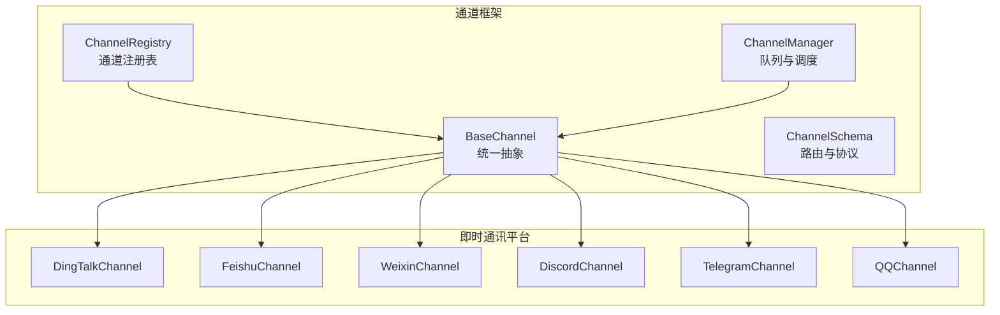
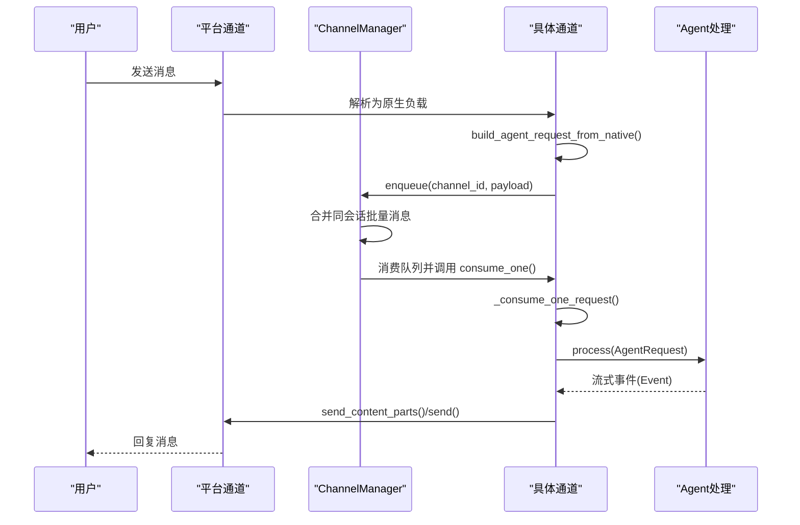
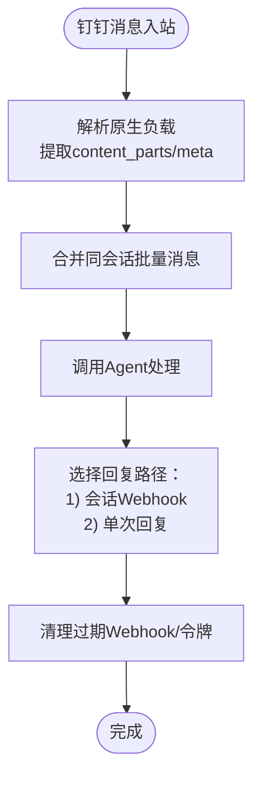
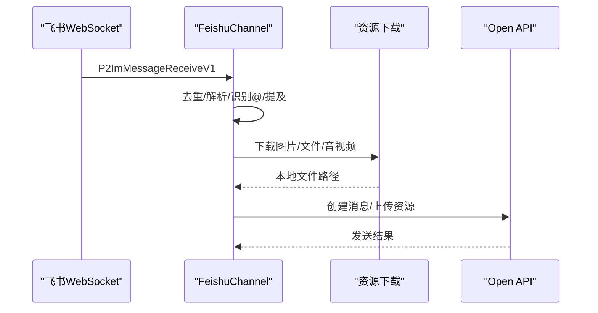
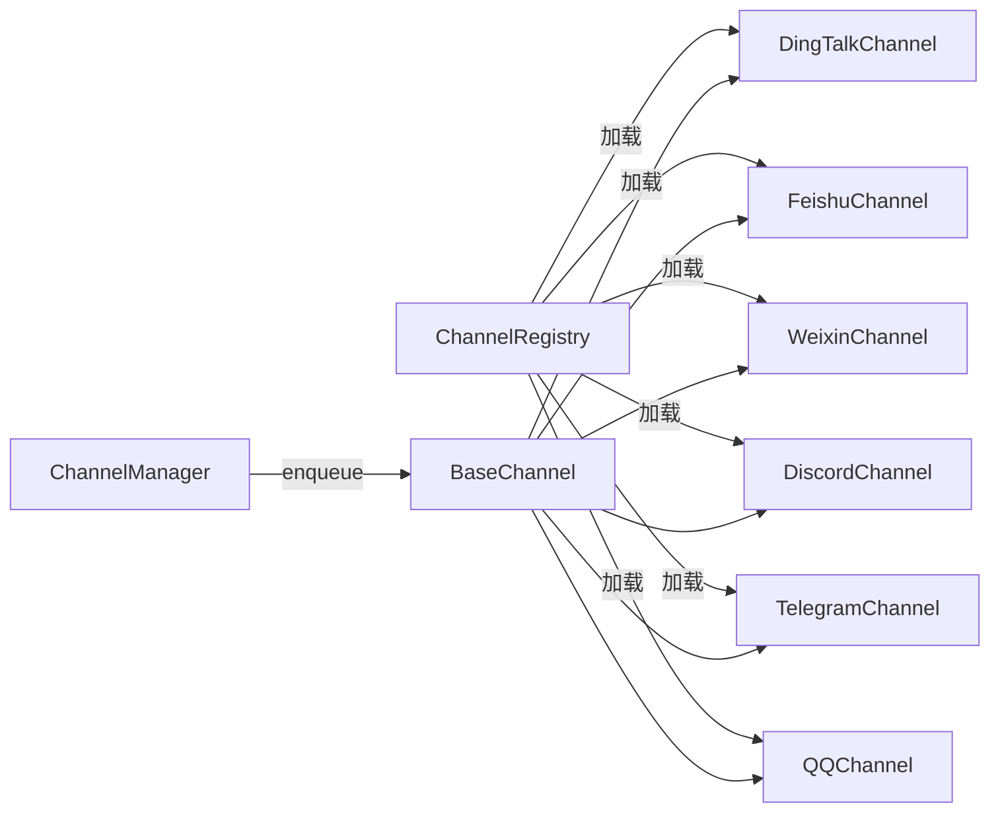
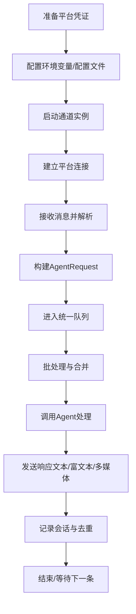

# 平台集成指南

<cite>
**本文档引用的文件**
- [src/qwenpaw/app/channels/base.py](file://src/qwenpaw/app/channels/base.py)
- [src/qwenpaw/app/channels/manager.py](file://src/qwenpaw/app/channels/manager.py)
- [src/qwenpaw/app/channels/registry.py](file://src/qwenpaw/app/channels/registry.py)
- [src/qwenpaw/app/channels/schema.py](file://src/qwenpaw/app/channels/schema.py)
- [src/qwenpaw/app/channels/dingtalk/channel.py](file://src/qwenpaw/app/channels/dingtalk/channel.py)
- [src/qwenpaw/app/channels/feishu/channel.py](file://src/qwenpaw/app/channels/feishu/channel.py)
- [src/qwenpaw/app/channels/weixin/channel.py](file://src/qwenpaw/app/channels/weixin/channel.py)
- [src/qwenpaw/app/channels/discord_/channel.py](file://src/qwenpaw/app/channels/discord_/channel.py)
- [src/qwenpaw/app/channels/telegram/channel.py](file://src/qwenpaw/app/channels/telegram/channel.py)
- [src/qwenpaw/app/channels/qq/channel.py](file://src/qwenpaw/app/channels/qq/channel.py)
</cite>

## 目录
1. [简介](#简介)
2. [项目结构](#项目结构)
3. [核心组件](#核心组件)
4. [架构总览](#架构总览)
5. [详细组件分析](#详细组件分析)
6. [依赖关系分析](#依赖关系分析)
7. [性能考虑](#性能考虑)
8. [故障排除指南](#故障排除指南)
9. [结论](#结论)
10. [附录](#附录)

## 简介
本指南面向在QwenPaw平台上集成即时通讯平台（钉钉、飞书、微信、Discord、Telegram、QQ等）的开发者与运维人员。文档系统性阐述各平台的认证机制、API调用方式、消息格式适配、功能差异与限制、配置参数、环境变量、安全配置以及消息内容转换与多媒体支持策略，并提供完整的集成流程图与配置示例。

## 项目结构
QwenPaw采用“统一通道框架 + 多平台适配器”的设计：所有即时通讯平台通过统一的BaseChannel抽象接入，由ChannelManager负责队列管理与消费调度，注册表负责发现与加载内置及自定义通道实现。

**图表来源**
- [src/qwenpaw/app/channels/base.py:70-127](file://src/qwenpaw/app/channels/base.py#L70-L127)
- [src/qwenpaw/app/channels/manager.py:68-116](file://src/qwenpaw/app/channels/manager.py#L68-L116)
- [src/qwenpaw/app/channels/registry.py:190-195](file://src/qwenpaw/app/channels/registry.py#L190-L195)
- [src/qwenpaw/app/channels/schema.py:12-50](file://src/qwenpaw/app/channels/schema.py#L12-L50)

**章节来源**
- [src/qwenpaw/app/channels/base.py:70-127](file://src/qwenpaw/app/channels/base.py#L70-L127)
- [src/qwenpaw/app/channels/manager.py:68-116](file://src/qwenpaw/app/channels/manager.py#L68-L116)
- [src/qwenpaw/app/channels/registry.py:190-195](file://src/qwenpaw/app/channels/registry.py#L190-L195)
- [src/qwenpaw/app/channels/schema.py:12-50](file://src/qwenpaw/app/channels/schema.py#L12-L50)

## 核心组件
- BaseChannel：统一的通道抽象，定义消息解析、请求构建、发送流程、会话标识、去重与防抖、渲染风格控制等通用能力。
- ChannelManager：统一队列与消费者管理，负责批量合并、优先级分类、任务跟踪与取消、通道生命周期管理。
- ChannelRegistry：内置通道注册表与自定义通道发现，支持按需懒加载与错误隔离。
- ChannelSchema：通道类型标识、路由地址模型与消息转换协议。

关键特性
- 统一内容模型：使用运行时内容类型（文本、图片、视频、音频、文件、拒绝）进行消息建模。
- 去重与防抖：基于消息ID与时间窗口合并，避免重复与抖动。
- 会话管理：通过resolve_session_id生成稳定会话键，支持群聊/私聊/频道场景。
- 渲染与过滤：可配置显示工具详情、过滤思考过程、内部工具可见性等。

**章节来源**
- [src/qwenpaw/app/channels/base.py:70-127](file://src/qwenpaw/app/channels/base.py#L70-L127)
- [src/qwenpaw/app/channels/base.py:557-651](file://src/qwenpaw/app/channels/base.py#L557-L651)
- [src/qwenpaw/app/channels/base.py:659-757](file://src/qwenpaw/app/channels/base.py#L659-L757)
- [src/qwenpaw/app/channels/manager.py:39-65](file://src/qwenpaw/app/channels/manager.py#L39-L65)
- [src/qwenpaw/app/channels/manager.py:223-299](file://src/qwenpaw/app/channels/manager.py#L223-L299)
- [src/qwenpaw/app/channels/registry.py:45-87](file://src/qwenpaw/app/channels/registry.py#L45-L87)
- [src/qwenpaw/app/channels/schema.py:12-50](file://src/qwenpaw/app/channels/schema.py#L12-L50)

## 架构总览
下图展示从消息入站到出站的端到端流程，包括队列合并、会话解析、处理与发送。

**图表来源**
- [src/qwenpaw/app/channels/manager.py:39-65](file://src/qwenpaw/app/channels/manager.py#L39-L65)
- [src/qwenpaw/app/channels/manager.py:362-446](file://src/qwenpaw/app/channels/manager.py#L362-L446)
- [src/qwenpaw/app/channels/base.py:659-757](file://src/qwenpaw/app/channels/base.py#L659-L757)
- [src/qwenpaw/app/channels/base.py:446-535](file://src/qwenpaw/app/channels/base.py#L446-L535)

## 详细组件分析

### 钉钉（DingTalk）
- 认证与连接
  - 使用Stream回调与机器人鉴权；支持会话Webhook主动发送；令牌缓存与自动刷新。
  - 支持AI卡片流式渲染与多消息合并。
- 消息格式与适配
  - 文本、Markdown、图片、文件、音视频等；支持会话Webhook持久化与恢复。
  - 会话ID短键策略，便于定时任务查找。
- 安全与限制
  - 消息去重（message_id）、会话Webhook过期处理、失败清理。
  - Webhook有效期限制，建议结合Open API作为备用路径。
- 关键配置
  - 环境变量：DINGTALK_CHANNEL_ENABLED、DINGTALK_CLIENT_ID、DINGTALK_CLIENT_SECRET、DINGTALK_BOT_PREFIX、DINGTALK_MESSAGE_TYPE、DINGTALK_CARD_TEMPLATE_ID、DINGTALK_CARD_TEMPLATE_KEY、DINGTALK_ROBOT_CODE、DINGTALK_MEDIA_DIR、DINGTALK_DM_POLICY、DINGTALK_GROUP_POLICY、DINGTALK_ALLOW_FROM、DINGTALK_DENY_MESSAGE、DINGTALK_REQUIRE_MENTION、DINGTALK_CARD_AUTO_LAYOUT。
- 多媒体与富文本
  - 支持Markdown与卡片模板；图片/文件下载至本地媒体目录；音频转文本后参与对话。

**图表来源**
- [src/qwenpaw/app/channels/dingtalk/channel.py:319-346](file://src/qwenpaw/app/channels/dingtalk/channel.py#L319-L346)
- [src/qwenpaw/app/channels/dingtalk/channel.py:766-800](file://src/qwenpaw/app/channels/dingtalk/channel.py#L766-L800)
- [src/qwenpaw/app/channels/dingtalk/channel.py:452-512](file://src/qwenpaw/app/channels/dingtalk/channel.py#L452-L512)

**章节来源**
- [src/qwenpaw/app/channels/dingtalk/channel.py:112-301](file://src/qwenpaw/app/channels/dingtalk/channel.py#L112-L301)
- [src/qwenpaw/app/channels/dingtalk/channel.py:319-346](file://src/qwenpaw/app/channels/dingtalk/channel.py#L319-L346)
- [src/qwenpaw/app/channels/dingtalk/channel.py:452-512](file://src/qwenpaw/app/channels/dingtalk/channel.py#L452-L512)
- [src/qwenpaw/app/channels/dingtalk/channel.py:766-800](file://src/qwenpaw/app/channels/dingtalk/channel.py#L766-L800)

### 飞书（Feishu/Lark）
- 认证与连接
  - WebSocket长连接接收事件；Open API发送消息；支持企业自建域与加密配置。
- 消息格式与适配
  - 文本、富文本(post)、图片、文件、音视频；自动下载资源到本地媒体目录。
  - 会话ID区分群聊与个人聊天，带应用ID后缀以区分多机器人。
- 安全与限制
  - 事件去重（message_id）、过期消息过滤（时钟偏移校正）、昵称缓存。
  - 严格限制消息长度与类型，必要时降级为纯文本。
- 关键配置
  - 环境变量：FEISHU_CHANNEL_ENABLED、FEISHU_APP_ID、FEISHU_APP_SECRET、FEISHU_BOT_PREFIX、FEISHU_ENCRYPT_KEY、FEISHU_VERIFICATION_TOKEN、FEISHU_MEDIA_DIR、FEISHU_DM_POLICY、FEISHU_GROUP_POLICY、FEISHU_ALLOW_FROM、FEISHU_DENY_MESSAGE、FEISHU_REQUIRE_MENTION、FEISHU_DOMAIN。

**图表来源**
- [src/qwenpaw/app/channels/feishu/channel.py:592-800](file://src/qwenpaw/app/channels/feishu/channel.py#L592-L800)
- [src/qwenpaw/app/channels/feishu/channel.py:330-366](file://src/qwenpaw/app/channels/feishu/channel.py#L330-L366)
- [src/qwenpaw/app/channels/feishu/channel.py:418-473](file://src/qwenpaw/app/channels/feishu/channel.py#L418-L473)

**章节来源**
- [src/qwenpaw/app/channels/feishu/channel.py:158-307](file://src/qwenpaw/app/channels/feishu/channel.py#L158-L307)
- [src/qwenpaw/app/channels/feishu/channel.py:330-366](file://src/qwenpaw/app/channels/feishu/channel.py#L330-L366)
- [src/qwenpaw/app/channels/feishu/channel.py:592-800](file://src/qwenpaw/app/channels/feishu/channel.py#L592-L800)

### 微信（WeChat iLink Bot）
- 认证与连接
  - HTTP API长轮询接收消息；HTTP API发送消息；支持二维码登录与令牌持久化。
- 消息格式与适配
  - 文本、图片（AES-128-ECB加密CDN）、语音（ASR）、文件、视频；自动解密与下载。
  - 会话ID区分私聊与群聊，支持上下文令牌缓存用于主动发送。
- 安全与限制
  - 消息去重（context_token）、速率限制与重试、超时保护。
- 关键配置
  - 环境变量：WEIXIN_CHANNEL_ENABLED、WEIXIN_BOT_TOKEN、WEIXIN_BOT_TOKEN_FILE、WEIXIN_BASE_URL、WEIXIN_BOT_PREFIX、WEIXIN_MEDIA_DIR、WEIXIN_DM_POLICY、WEIXIN_GROUP_POLICY、WEIXIN_ALLOW_FROM、WEIXIN_DENY_MESSAGE。

**章节来源**
- [src/qwenpaw/app/channels/weixin/channel.py:60-201](file://src/qwenpaw/app/channels/weixin/channel.py#L60-L201)
- [src/qwenpaw/app/channels/weixin/channel.py:207-281](file://src/qwenpaw/app/channels/weixin/channel.py#L207-L281)
- [src/qwenpaw/app/channels/weixin/channel.py:491-760](file://src/qwenpaw/app/channels/weixin/channel.py#L491-L760)

### Discord
- 认证与连接
  - 使用discord.py客户端；启用消息内容意图；支持代理与认证。
- 消息格式与适配
  - 文本、图片、视频、音频、文件；自动拆分超过2000字符的消息块；保留代码块闭合。
  - 会话ID基于频道或私聊用户ID。
- 安全与限制
  - 消息ID去重队列；可配置是否接受其他机器人消息；支持白名单与@检测。
- 关键配置
  - 环境变量：DISCORD_CHANNEL_ENABLED、DISCORD_BOT_TOKEN、DISCORD_HTTP_PROXY、DISCORD_HTTP_PROXY_AUTH、DISCORD_BOT_PREFIX、DISCORD_DM_POLICY、DISCORD_GROUP_POLICY、DISCORD_ALLOW_FROM、DISCORD_DENY_MESSAGE、DISCORD_REQUIRE_MENTION、DISCORD_ACCEPT_BOT_MESSAGES。

**章节来源**
- [src/qwenpaw/app/channels/discord_/channel.py:42-110](file://src/qwenpaw/app/channels/discord_/channel.py#L42-L110)
- [src/qwenpaw/app/channels/discord_/channel.py:111-274](file://src/qwenpaw/app/channels/discord_/channel.py#L111-L274)
- [src/qwenpaw/app/channels/discord_/channel.py:358-431](file://src/qwenpaw/app/channels/discord_/channel.py#L358-L431)

### Telegram
- 认证与连接
  - 使用python-telegram-bot Application；支持代理；轮询模式启动。
- 消息格式与适配
  - 文本、图片、视频、音频、文件；HTML富文本发送；自动拆分消息块。
  - 会话ID基于chat_id；支持主题线程ID。
- 安全与限制
  - 上传大小限制（50MB）；错误分类处理（Too Large、Forbidden、Retry After等）。
  - 打字指示器循环发送，超时自动停止。
- 关键配置
  - 环境变量：TELEGRAM_CHANNEL_ENABLED、TELEGRAM_BOT_TOKEN、TELEGRAM_HTTP_PROXY、TELEGRAM_HTTP_PROXY_AUTH、TELEGRAM_BOT_PREFIX、TELEGRAM_DM_POLICY、TELEGRAM_GROUP_POLICY、TELEGRAM_ALLOW_FROM、TELEGRAM_DENY_MESSAGE、TELEGRAM_REQUIRE_MENTION、TELEGRAM_SHOW_TYPING。

**章节来源**
- [src/qwenpaw/app/channels/telegram/channel.py:264-334](file://src/qwenpaw/app/channels/telegram/channel.py#L264-L334)
- [src/qwenpaw/app/channels/telegram/channel.py:363-437](file://src/qwenpaw/app/channels/telegram/channel.py#L363-L437)
- [src/qwenpaw/app/channels/telegram/channel.py:528-548](file://src/qwenpaw/app/channels/telegram/channel.py#L528-L548)
- [src/qwenpaw/app/channels/telegram/channel.py:654-770](file://src/qwenpaw/app/channels/telegram/channel.py#L654-L770)

### QQ
- 认证与连接
  - WebSocket接收事件；HTTP API发送消息；AppId/ClientSecret换取Access Token；支持沙箱环境。
- 消息格式与适配
  - 文本、Markdown、图片、音视频、文件；支持富媒体上传与URL直发。
  - 会话类型区分C2C/Guild/Direct/Group；消息序号与去重。
- 安全与限制
  - URL内容限制与二次清洗；Markdown类型限制与回退；速率限制与重连策略。
- 关键配置
  - 环境变量：QQ_CHANNEL_ENABLED、QQ_APP_ID、QQ_CLIENT_SECRET、QQ_BOT_PREFIX、QQ_MARKDOWN_ENABLED、QQ_API_BASE、QQ_DM_POLICY、QQ_GROUP_POLICY、QQ_ALLOW_FROM、QQ_DENY_MESSAGE。

**章节来源**
- [src/qwenpaw/app/channels/qq/channel.py:626-751](file://src/qwenpaw/app/channels/qq/channel.py#L626-L751)
- [src/qwenpaw/app/channels/qq/channel.py:758-800](file://src/qwenpaw/app/channels/qq/channel.py#L758-L800)
- [src/qwenpaw/app/channels/qq/channel.py:205-271](file://src/qwenpaw/app/channels/qq/channel.py#L205-L271)

## 依赖关系分析
- 注册表与通道
  - 内置通道映射（钉钉、飞书、微信、Discord、Telegram、QQ等）通过注册表集中管理，支持懒加载与失败隔离。
- 管理器与通道
  - ChannelManager统一注入队列回调，通道仅关注consume_one逻辑；批量合并与优先级由管理器负责。
- 统一模型
  - 所有通道均使用统一的内容类型（文本、图片、视频、音频、文件、拒绝）进行消息建模，确保上层Agent一致处理。

**图表来源**
- [src/qwenpaw/app/channels/registry.py:20-36](file://src/qwenpaw/app/channels/registry.py#L20-L36)
- [src/qwenpaw/app/channels/registry.py:190-195](file://src/qwenpaw/app/channels/registry.py#L190-L195)
- [src/qwenpaw/app/channels/manager.py:215-221](file://src/qwenpaw/app/channels/manager.py#L215-L221)

**章节来源**
- [src/qwenpaw/app/channels/registry.py:20-36](file://src/qwenpaw/app/channels/registry.py#L20-L36)
- [src/qwenpaw/app/channels/registry.py:190-195](file://src/qwenpaw/app/channels/registry.py#L190-L195)
- [src/qwenpaw/app/channels/manager.py:215-221](file://src/qwenpaw/app/channels/manager.py#L215-L221)

## 性能考虑
- 队列与批处理
  - ChannelManager对同会话消息进行批处理合并，减少通道处理开销；支持优先级与超时保护。
- 去重与防抖
  - 基于消息ID与时间窗口的去重与防抖，避免重复与抖动，提升吞吐。
- 资源下载与缓存
  - 图片/文件/音视频统一下载到本地媒体目录，支持缓存与限流；飞书/微信等平台对资源下载做了幂等与失败处理。
- 错误与重试
  - 平台侧提供指数退避与最大重试次数；通道侧对429/Too Many Requests进行回退处理。
- 渲染与过滤
  - 可配置显示工具详情、过滤思考过程、内部工具可见性，降低冗余输出，提高响应速度。

[本节为通用指导，无需具体文件引用]

## 故障排除指南
常见问题与定位思路
- 通道未启用或令牌无效
  - 检查对应环境变量或配置项是否正确；查看通道初始化日志。
- 消息未到达或重复
  - 核对消息ID去重与会话键生成逻辑；确认平台事件是否被过滤（如@检测、白名单）。
- 多媒体发送失败
  - 检查文件大小限制（Telegram 50MB、QQ URL/上传限制）；确认URL可达或本地文件存在。
- 会话Webhook失效
  - 钉钉Webhook有有效期；通道会清理失效Webhook并记录；必要时切换到Open API。
- 速率限制与重试风暴
  - 平台侧可能触发429/Too Many Requests；通道实现中包含退避与重试策略，避免雪崩。

**章节来源**
- [src/qwenpaw/app/channels/telegram/channel.py:718-770](file://src/qwenpaw/app/channels/telegram/channel.py#L718-L770)
- [src/qwenpaw/app/channels/qq/channel.py:228-271](file://src/qwenpaw/app/channels/qq/channel.py#L228-L271)
- [src/qwenpaw/app/channels/dingtalk/channel.py:488-512](file://src/qwenpaw/app/channels/dingtalk/channel.py#L488-L512)

## 结论
QwenPaw通过统一的通道框架实现了对主流即时通讯平台的一致接入与扩展。开发者只需遵循BaseChannel接口与消息模型，即可快速集成新平台；同时，通道内完善的认证、消息适配、多媒体处理、安全与性能优化策略，确保了在复杂网络与平台差异下的稳定性与可维护性。

## 附录

### 平台集成流程图（概念）

[本图为概念流程，不直接映射具体文件]

### 配置参数速查（示例）
- 钉钉
  - DINGTALK_CHANNEL_ENABLED、DINGTALK_CLIENT_ID、DINGTALK_CLIENT_SECRET、DINGTALK_BOT_PREFIX、DINGTALK_MESSAGE_TYPE、DINGTALK_CARD_TEMPLATE_ID、DINGTALK_CARD_TEMPLATE_KEY、DINGTALK_ROBOT_CODE、DINGTALK_MEDIA_DIR、DINGTALK_DM_POLICY、DINGTALK_GROUP_POLICY、DINGTALK_ALLOW_FROM、DINGTALK_DENY_MESSAGE、DINGTALK_REQUIRE_MENTION、DINGTALK_CARD_AUTO_LAYOUT
- 飞书
  - FEISHU_CHANNEL_ENABLED、FEISHU_APP_ID、FEISHU_APP_SECRET、FEISHU_BOT_PREFIX、FEISHU_ENCRYPT_KEY、FEISHU_VERIFICATION_TOKEN、FEISHU_MEDIA_DIR、FEISHU_DM_POLICY、FEISHU_GROUP_POLICY、FEISHU_ALLOW_FROM、FEISHU_DENY_MESSAGE、FEISHU_REQUIRE_MENTION、FEISHU_DOMAIN
- 微信
  - WEIXIN_CHANNEL_ENABLED、WEIXIN_BOT_TOKEN、WEIXIN_BOT_TOKEN_FILE、WEIXIN_BASE_URL、WEIXIN_BOT_PREFIX、WEIXIN_MEDIA_DIR、WEIXIN_DM_POLICY、WEIXIN_GROUP_POLICY、WEIXIN_ALLOW_FROM、WEIXIN_DENY_MESSAGE
- Discord
  - DISCORD_CHANNEL_ENABLED、DISCORD_BOT_TOKEN、DISCORD_HTTP_PROXY、DISCORD_HTTP_PROXY_AUTH、DISCORD_BOT_PREFIX、DISCORD_DM_POLICY、DISCORD_GROUP_POLICY、DISCORD_ALLOW_FROM、DISCORD_DENY_MESSAGE、DISCORD_REQUIRE_MENTION、DISCORD_ACCEPT_BOT_MESSAGES
- Telegram
  - TELEGRAM_CHANNEL_ENABLED、TELEGRAM_BOT_TOKEN、TELEGRAM_HTTP_PROXY、TELEGRAM_HTTP_PROXY_AUTH、TELEGRAM_BOT_PREFIX、TELEGRAM_DM_POLICY、TELEGRAM_GROUP_POLICY、TELEGRAM_ALLOW_FROM、TELEGRAM_DENY_MESSAGE、TELEGRAM_REQUIRE_MENTION、TELEGRAM_SHOW_TYPING
- QQ
  - QQ_CHANNEL_ENABLED、QQ_APP_ID、QQ_CLIENT_SECRET、QQ_BOT_PREFIX、QQ_MARKDOWN_ENABLED、QQ_API_BASE、QQ_DM_POLICY、QQ_GROUP_POLICY、QQ_ALLOW_FROM、QQ_DENY_MESSAGE

[本节为参数汇总，无需具体文件引用]