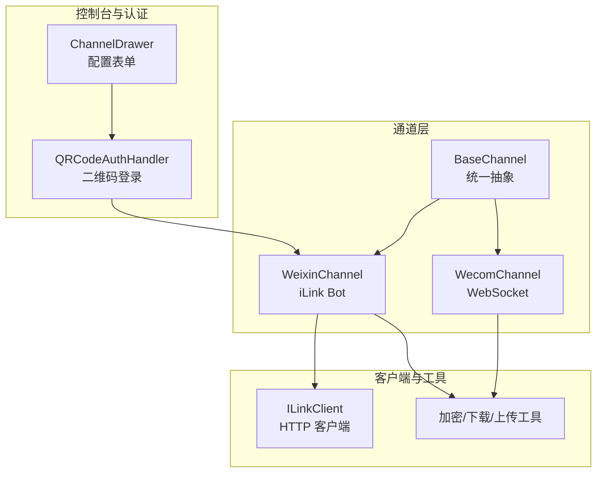
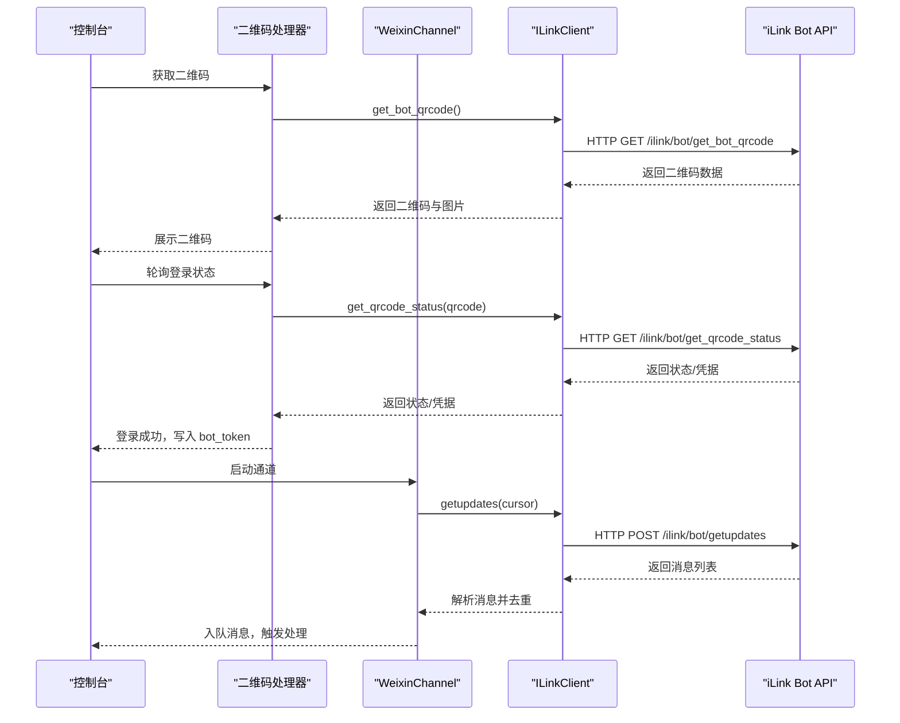
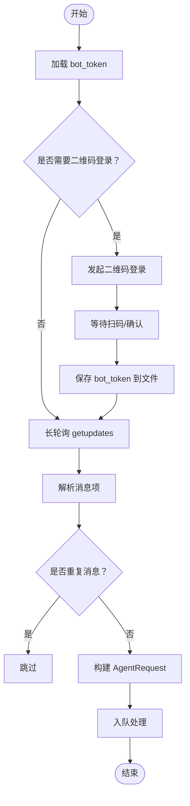
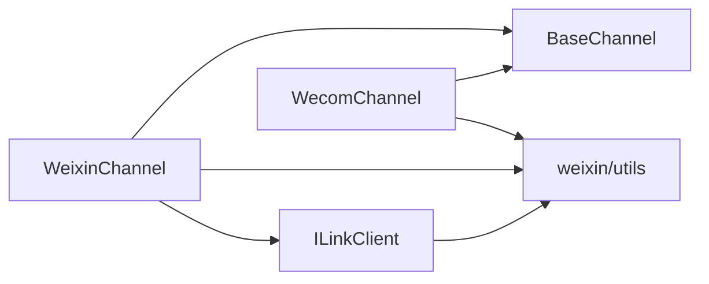

# 微信平台集成

<cite>
**本文引用的文件**
- [channel.py](file://src/qwenpaw/app/channels/weixin/channel.py)
- [client.py](file://src/qwenpaw/app/channels/weixin/client.py)
- [utils.py](file://src/qwenpaw/app/channels/weixin/utils.py)
- [base.py](file://src/qwenpaw/app/channels/base.py)
- [ChannelDrawer.tsx](file://console/src/pages/Control/Channels/components/ChannelDrawer.tsx)
- [qrcode_auth_handler.py](file://src/qwenpaw/app/channels/qrcode_auth_handler.py)
- [channel.py](file://src/qwenpaw/app/channels/wecom/channel.py)
- [utils.py](file://src/qwenpaw/app/channels/wecom/utils.py)
- [schema.py](file://src/qwenpaw/app/channels/schema.py)
</cite>

## 目录
1. [简介](#简介)
2. [项目结构](#项目结构)
3. [核心组件](#核心组件)
4. [架构总览](#架构总览)
5. [详细组件分析](#详细组件分析)
6. [依赖分析](#依赖分析)
7. [性能考虑](#性能考虑)
8. [故障排查指南](#故障排查指南)
9. [结论](#结论)
10. [附录](#附录)

## 简介
本文件面向微信平台集成，系统性阐述微信公众号/企业微信（WeCom）在本项目中的实现方式与使用方法。重点覆盖以下方面：
- 微信公众号（iLink Bot）的配置流程、服务器验证与消息接收设置
- 微信特有的消息格式、事件类型与消息加解密机制
- 回调URL配置、Token验证与消息签名验证流程
- 完整的配置参数说明（如 bot_token、base_url、media_dir 等）与安全配置要求
- 微信消息类型映射关系与多媒体内容处理
- API 调用限制与频率控制策略
- 微信支付、小程序等高级功能的集成建议与安全注意事项

## 项目结构
微信相关通道位于应用通道层，采用“通道抽象 + 具体实现”的分层设计：
- 通道基类：统一请求构建、去重、会话管理、渲染与发送流程
- 微信公众号通道：基于 iLink Bot 的 HTTP API，支持长轮询接收与文本/图片/语音/文件/视频消息
- 企业微信通道：基于 WebSocket SDK，支持文本/图片/语音/文件/视频消息与流式回复
- 工具模块：通用 AES 加解密、HTTP 请求头构造、媒体下载与上传辅助
- 控制台与认证：二维码登录、状态轮询、配置表单与凭据持久化

图表来源
- [base.py](file://src/qwenpaw/app/channels/base.py)
- [channel.py](file://src/qwenpaw/app/channels/weixin/channel.py)
- [client.py](file://src/qwenpaw/app/channels/weixin/client.py)
- [utils.py](file://src/qwenpaw/app/channels/weixin/utils.py)
- [ChannelDrawer.tsx](file://console/src/pages/Control/Channels/components/ChannelDrawer.tsx)
- [qrcode_auth_handler.py](file://src/qwenpaw/app/channels/qrcode_auth_handler.py)

章节来源
- [base.py](file://src/qwenpaw/app/channels/base.py)
- [channel.py](file://src/qwenpaw/app/channels/weixin/channel.py)
- [client.py](file://src/qwenpaw/app/channels/weixin/client.py)
- [utils.py](file://src/qwenpaw/app/channels/weixin/utils.py)
- [ChannelDrawer.tsx](file://console/src/pages/Control/Channels/components/ChannelDrawer.tsx)
- [qrcode_auth_handler.py](file://src/qwenpaw/app/channels/qrcode_auth_handler.py)

## 核心组件
- WeixinChannel：微信公众号 iLink Bot 通道，负责长轮询接收消息、去重、会话解析、内容构建与发送
- ILinkClient：微信公众号 HTTP 客户端，封装 QR 码登录、消息拉取、发送、媒体下载/上传、打字指示等接口
- WeComChannel：企业微信通道，负责 WebSocket 接收消息、媒体下载、流式回复与欢迎语
- BaseChannel：通道基类，提供统一的请求构建、时间去抖、会话管理、渲染与发送流程
- 加密工具：AES-ECB 加解密、请求头构造、媒体下载/上传辅助
- 控制台与认证：二维码登录流程、凭据持久化、配置表单

章节来源
- [channel.py](file://src/qwenpaw/app/channels/weixin/channel.py)
- [client.py](file://src/qwenpaw/app/channels/weixin/client.py)
- [utils.py](file://src/qwenpaw/app/channels/weixin/utils.py)
- [base.py](file://src/qwenpaw/app/channels/base.py)
- [channel.py](file://src/qwenpaw/app/channels/wecom/channel.py)
- [utils.py](file://src/qwenpaw/app/channels/wecom/utils.py)
- [ChannelDrawer.tsx](file://console/src/pages/Control/Channels/components/ChannelDrawer.tsx)
- [qrcode_auth_handler.py](file://src/qwenpaw/app/channels/qrcode_auth_handler.py)

## 架构总览
微信公众号与企业微信的集成采用“通道 + 客户端 + 工具”的分层架构：
- 通道层：解析原生消息、构建统一请求、去重与会话管理
- 客户端层：封装 HTTP/WebSocket API，处理认证、轮询、媒体下载/上传
- 工具层：加密解密、请求头生成、媒体处理
- 控制台层：二维码登录、配置表单、凭据持久化

图表来源
- [qrcode_auth_handler.py](file://src/qwenpaw/app/channels/qrcode_auth_handler.py)
- [client.py](file://src/qwenpaw/app/channels/weixin/client.py)
- [channel.py](file://src/qwenpaw/app/channels/weixin/channel.py)

## 详细组件分析

### WeixinChannel（微信公众号 iLink Bot）
- 配置参数
  - enabled：是否启用
  - bot_token：iLink Bot 访问令牌
  - bot_token_file：令牌持久化文件路径
  - base_url：iLink API 基础地址
  - bot_prefix：消息前缀
  - media_dir：媒体文件本地缓存目录
  - dm_policy/group_policy：私聊/群聊策略
  - allow_from/deny_message：白名单与拒绝提示
- 关键能力
  - 长轮询接收消息：getupdates，支持游标续传
  - 去重：基于 context_token 或唯一标识
  - 会话解析：区分私聊/群聊，生成 session_id
  - 内容构建：文本、图片（CDN+AES-128-ECB）、语音（ASR 文本）、文件、视频
  - 媒体下载：根据 encrypt_query_param 与 aes_key 下载并解密
  - 打字指示：通过 getconfig 获取 typing_ticket 并发送
  - 发送消息：sendmessage/send_text/send_file/send_image/send_video
- 安全要点
  - 使用 X-WECHAT-UIN 请求头进行防重放
  - 令牌持久化到文件，避免明文硬编码
  - AES-ECB 解密需安装 pycryptodome

图表来源
- [channel.py](file://src/qwenpaw/app/channels/weixin/channel.py)
- [client.py](file://src/qwenpaw/app/channels/weixin/client.py)
- [utils.py](file://src/qwenpaw/app/channels/weixin/utils.py)

章节来源
- [channel.py](file://src/qwenpaw/app/channels/weixin/channel.py)
- [client.py](file://src/qwenpaw/app/channels/weixin/client.py)
- [utils.py](file://src/qwenpaw/app/channels/weixin/utils.py)

### ILinkClient（微信公众号 HTTP 客户端）
- 认证流程
  - 获取二维码：get_bot_qrcode
  - 轮询状态：get_qrcode_status/wait_for_login
  - 使用 Bearer Token 调用后续 API
- 消息接口
  - getupdates：长轮询拉取消息
  - sendmessage：发送消息（文本/图片/文件/视频）
  - send_text/send_file/send_image/send_video：便捷方法
- 媒体接口
  - download_media：下载并解密 CDN 媒体
  - getuploadurl/upload_media：上传并返回下载参数
- 请求头
  - AuthorizationType/ilink_bot_token
  - Authorization: Bearer <bot_token>
  - X-WECHAT-UIN: base64(random_uint32) — 防重放

章节来源
- [client.py](file://src/qwenpaw/app/channels/weixin/client.py)
- [utils.py](file://src/qwenpaw/app/channels/weixin/utils.py)

### WeComChannel（企业微信）
- 配置参数
  - bot_id/secret：机器人 ID 与密钥
  - bot_prefix/welcome_text：消息前缀与欢迎语
  - media_dir：媒体缓存目录
  - dm_policy/group_policy/allow_from/deny_message：访问控制
  - max_reconnect_attempts：最大重连次数
- 关键能力
  - WebSocket 接收消息：SDK 事件转为统一消息
  - 媒体下载：download_file，支持 AES 解密
  - 流式回复：reply_stream，配合 processing 指示
  - 上传媒体：分块上传（init/chunk/finish），支持图片压缩
- 安全要点
  - WebSocket 长连接，注意断线重连与鉴权
  - 图片上传限制 2MB，提供压缩策略

章节来源
- [channel.py](file://src/qwenpaw/app/channels/wecom/channel.py)
- [utils.py](file://src/qwenpaw/app/channels/wecom/utils.py)

### BaseChannel（通道基类）
- 统一职责
  - 构建 AgentRequest：从内容部件组装消息
  - 时间去抖：合并无文本消息，待有文本时一次性发送
  - 会话管理：resolve_session_id、to_handle_from_target
  - 渲染与发送：MessageRenderer、on_event_message_completed
  - 访问控制：allowlist/deny_message、mention 策略
- 与通道的关系
  - WeixinChannel/WeComChannel 继承 BaseChannel，复用统一流程

章节来源
- [base.py](file://src/qwenpaw/app/channels/base.py)

### 控制台与二维码登录
- 控制台表单
  - 微信公众号：二维码登录、bot_token、bot_token_file、media_dir
  - 企业微信：bot_id、secret、welcome_text、media_dir
- 二维码登录
  - 获取二维码：/channels/qrcode/fetch?channel=weixin
  - 轮询状态：/channels/qrcode/poll?token=...
  - 成功后写入凭据并持久化

章节来源
- [ChannelDrawer.tsx](file://console/src/pages/Control/Channels/components/ChannelDrawer.tsx)
- [qrcode_auth_handler.py](file://src/qwenpaw/app/channels/qrcode_auth_handler.py)

## 依赖分析
- 组件耦合
  - WeixinChannel 依赖 ILinkClient 与 utils（加密/下载/上传）
  - WeComChannel 依赖 utils（加密/下载/上传/图片压缩）
  - 两者均继承 BaseChannel，共享统一的请求构建与发送流程
- 外部依赖
  - pycryptodome：AES-ECB 加解密
  - httpx：HTTP 客户端
  - aibot（企业微信）：WebSocket SDK
- 潜在循环依赖
  - 通道与工具之间为单向依赖，无循环

图表来源
- [channel.py](file://src/qwenpaw/app/channels/weixin/channel.py)
- [client.py](file://src/qwenpaw/app/channels/weixin/client.py)
- [utils.py](file://src/qwenpaw/app/channels/weixin/utils.py)
- [channel.py](file://src/qwenpaw/app/channels/wecom/channel.py)
- [utils.py](file://src/qwenpaw/app/channels/wecom/utils.py)
- [base.py](file://src/qwenpaw/app/channels/base.py)

章节来源
- [channel.py](file://src/qwenpaw/app/channels/weixin/channel.py)
- [client.py](file://src/qwenpaw/app/channels/weixin/client.py)
- [utils.py](file://src/qwenpaw/app/channels/weixin/utils.py)
- [channel.py](file://src/qwenpaw/app/channels/wecom/channel.py)
- [utils.py](file://src/qwenpaw/app/channels/wecom/utils.py)
- [base.py](file://src/qwenpaw/app/channels/base.py)

## 性能考虑
- 长轮询与去重
  - WeixinChannel 使用 getupdates 长轮询，结合 context_token 去重，避免重复处理
  - 去重集合上限为 2000，防止内存膨胀
- 媒体处理
  - CDN 媒体下载后缓存至本地 media_dir，避免重复下载
  - AES-ECB 解密在下载完成后进行，减少网络传输开销
- 企业微信上传
  - 分块上传（512KB/片），降低单次上传失败风险
  - 图片压缩策略，满足 2MB 上传限制
- 会话与渲染
  - BaseChannel 的时间去抖与内容合并，减少无效请求与渲染压力

## 故障排查指南
- 二维码登录失败
  - 确认网络可达 iLink API 基础地址
  - 检查二维码状态轮询是否超时（默认 300 秒）
  - 查看日志中“QR code login failed”异常
- 令牌丢失或过期
  - 检查 bot_token_file 是否存在且可写
  - 确认 Authorization 头是否正确设置
- 媒体下载失败
  - 确认 encrypt_query_param 与 aes_key 正确传递
  - 检查 pycryptodome 是否安装
- 企业微信上传失败
  - 检查 x-encrypted-param 响应头是否存在
  - 确认分块上传流程（init/chunk/finish）是否完整
- 访问被拒绝
  - 检查 allow_from 白名单与策略（dm_policy/group_policy）
  - 群聊需满足 mention 策略（可选）

章节来源
- [channel.py](file://src/qwenpaw/app/channels/weixin/channel.py)
- [client.py](file://src/qwenpaw/app/channels/weixin/client.py)
- [utils.py](file://src/qwenpaw/app/channels/weixin/utils.py)
- [channel.py](file://src/qwenpaw/app/channels/wecom/channel.py)
- [utils.py](file://src/qwenpaw/app/channels/wecom/utils.py)

## 结论
本项目对微信平台的集成采用“通道 + 客户端 + 工具”的清晰分层设计，既保证了微信公众号与企业微信的差异化适配，又通过基类统一了消息处理流程。通过二维码登录、令牌持久化、媒体下载/上传与 AES 加解密等机制，实现了安全、稳定的微信消息收发能力。建议在生产环境中：
- 严格管理 bot_token 与密钥，使用环境变量或安全存储
- 合理配置媒体目录与缓存策略，避免磁盘空间不足
- 关注 API 调用限制与频率控制，必要时增加限流与重试策略
- 对于企业微信，关注 2MB 图片上传限制与分块上传流程

## 附录

### 微信公众号配置参数说明
- enabled：是否启用通道
- bot_token：iLink Bot 访问令牌
- bot_token_file：令牌持久化文件路径（默认工作目录下 weixin_bot_token）
- base_url：iLink API 基础地址（默认 https://ilinkai.weixin.qq.com）
- bot_prefix：消息前缀
- media_dir：媒体文件本地缓存目录（默认工作目录下 media）
- dm_policy/group_policy：私聊/群聊策略（open/受限）
- allow_from/deny_message：白名单与拒绝提示
- 二维码登录：通过控制台或 /channels/qrcode 接口完成

章节来源
- [channel.py](file://src/qwenpaw/app/channels/weixin/channel.py)
- [ChannelDrawer.tsx](file://console/src/pages/Control/Channels/components/ChannelDrawer.tsx)
- [qrcode_auth_handler.py](file://src/qwenpaw/app/channels/qrcode_auth_handler.py)

### 企业微信配置参数说明
- enabled：是否启用通道
- bot_id/secret：机器人 ID 与密钥
- bot_prefix：消息前缀
- welcome_text：进入聊天时的欢迎语
- media_dir：媒体文件本地缓存目录
- dm_policy/group_policy/allow_from/deny_message：访问控制
- max_reconnect_attempts：最大重连次数

章节来源
- [channel.py](file://src/qwenpaw/app/channels/wecom/channel.py)
- [ChannelDrawer.tsx](file://console/src/pages/Control/Channels/components/ChannelDrawer.tsx)

### 微信消息类型与映射关系
- 文本：文本内容直接拼接
- 图片：CDN 地址 + AES-128-ECB 解密，生成本地路径
- 语音：使用 ASR 文本作为消息内容
- 文件/视频：CDN 地址 + AES 解密，生成本地路径
- 企业微信：支持混合消息（mixed），按 msgtype 分别处理

章节来源
- [channel.py](file://src/qwenpaw/app/channels/weixin/channel.py)
- [channel.py](file://src/qwenpaw/app/channels/wecom/channel.py)

### 微信支付与小程序集成建议
- 支付：建议通过企业微信或公众号侧的支付组件对接，本项目未直接提供支付接口
- 小程序：可通过企业微信的网页授权与 OAuth2 流程接入，本项目未直接提供小程序通道
- 安全：严格管理 app_id/app_secret/aes_key，避免泄露；对回调进行签名校验与参数校验

[本节为通用建议，不直接分析具体文件]