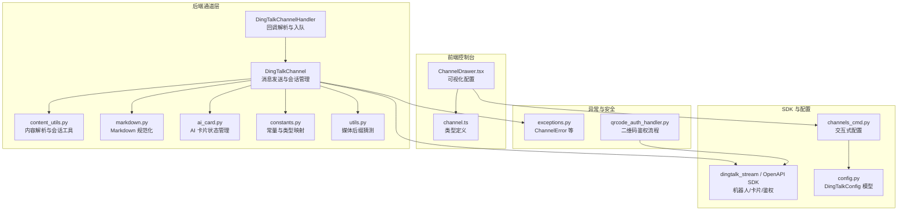
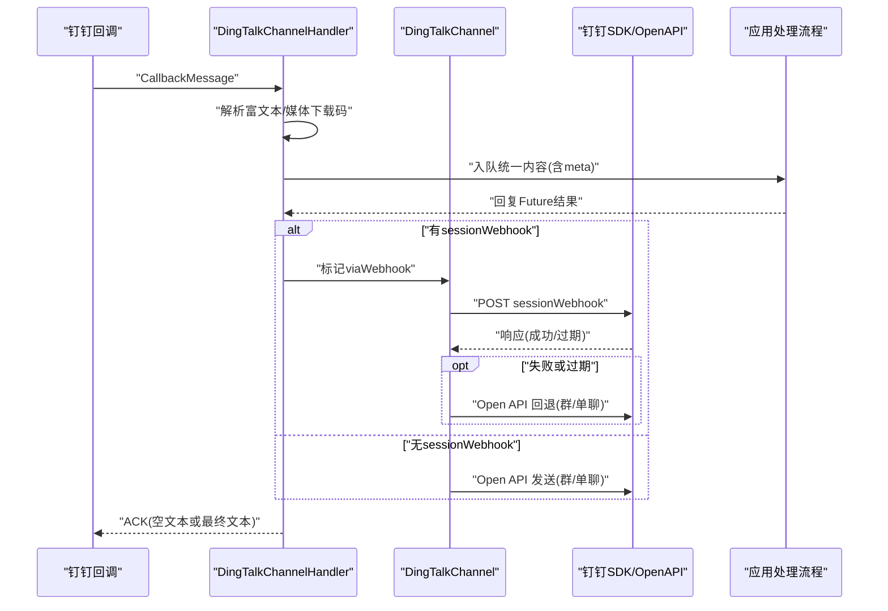
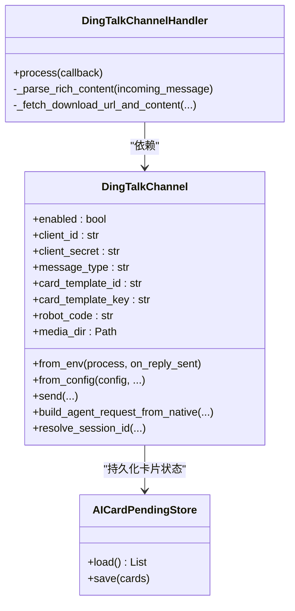
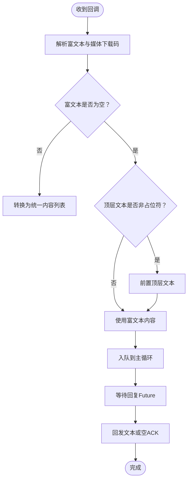
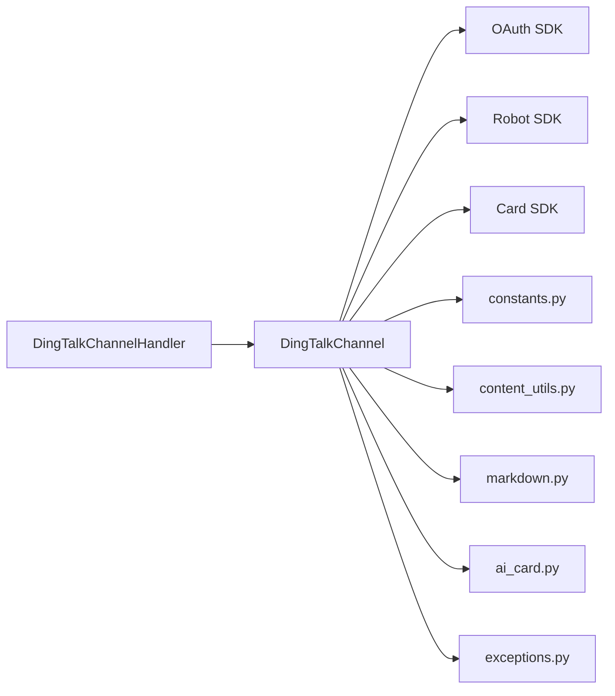

# 钉钉平台集成

<cite>
**本文引用的文件**
- [channel.py](file://src/qwenpaw/app/channels/dingtalk/channel.py)
- [handler.py](file://src/qwenpaw/app/channels/dingtalk/handler.py)
- [constants.py](file://src/qwenpaw/app/channels/dingtalk/constants.py)
- [content_utils.py](file://src/qwenpaw/app/channels/dingtalk/content_utils.py)
- [markdown.py](file://src/qwenpaw/app/channels/dingtalk/markdown.py)
- [utils.py](file://src/qwenpaw/app/channels/dingtalk/utils.py)
- [ai_card.py](file://src/qwenpaw/app/channels/dingtalk/ai_card.py)
- [config.py](file://src/qwenpaw/config/config.py)
- [exceptions.py](file://src/qwenpaw/exceptions.py)
- [ChannelDrawer.tsx](file://console/src/pages/Control/Channels/components/ChannelDrawer.tsx)
- [channel.ts](file://console/src/api/types/channel.ts)
- [channels_cmd.py](file://src/qwenpaw/cli/channels_cmd.py)
- [qrcode_auth_handler.py](file://src/qwenpaw/app/channels/qrcode_auth_handler.py)
</cite>

## 目录
1. [简介](#简介)
2. [项目结构](#项目结构)
3. [核心组件](#核心组件)
4. [架构总览](#架构总览)
5. [详细组件分析](#详细组件分析)
6. [依赖关系分析](#依赖关系分析)
7. [性能考虑](#性能考虑)
8. [故障排查指南](#故障排查指南)
9. [结论](#结论)
10. [附录](#附录)

## 简介
本文件面向在钉钉平台集成与部署“QwenPaw”的技术与非技术读者，系统性阐述钉钉机器人的配置流程、企业应用创建与机器人密钥获取方法；文档化钉钉特有的消息格式转换、Markdown 渲染与富文本处理机制；详解钉钉回调 URL 配置、事件订阅设置与消息验证流程；提供完整的配置参数说明（如 app_key、app_secret、agent_id 等）与环境变量设置；解释钉钉消息类型映射关系（文本、图片、文件、富文本等）；给出错误码对照与常见问题解决方案；并包含性能优化建议与安全配置最佳实践。

## 项目结构
钉钉通道位于后端服务的“通道层”，负责将钉钉回调消息转换为统一的 Agent 请求，再由运行时处理并回发到钉钉。前端控制台提供可视化配置入口，CLI 提供交互式配置能力，SDK 客户端封装了钉钉 Open API 的调用。

图表来源
- [channel.py](file://src/qwenpaw/app/channels/dingtalk/channel.py)
- [handler.py](file://src/qwenpaw/app/channels/dingtalk/handler.py)
- [content_utils.py](file://src/qwenpaw/app/channels/dingtalk/content_utils.py)
- [markdown.py](file://src/qwenpaw/app/channels/dingtalk/markdown.py)
- [ai_card.py](file://src/qwenpaw/app/channels/dingtalk/ai_card.py)
- [constants.py](file://src/qwenpaw/app/channels/dingtalk/constants.py)
- [utils.py](file://src/qwenpaw/app/channels/dingtalk/utils.py)
- [config.py](file://src/qwenpaw/config/config.py)
- [exceptions.py](file://src/qwenpaw/exceptions.py)
- [ChannelDrawer.tsx](file://console/src/pages/Control/Channels/components/ChannelDrawer.tsx)
- [channel.ts](file://console/src/api/types/channel.ts)
- [channels_cmd.py](file://src/qwenpaw/cli/channels_cmd.py)
- [qrcode_auth_handler.py](file://src/qwenpaw/app/channels/qrcode_auth_handler.py)

章节来源
- [channel.py](file://src/qwenpaw/app/channels/dingtalk/channel.py)
- [handler.py](file://src/qwenpaw/app/channels/dingtalk/handler.py)
- [config.py](file://src/qwenpaw/config/config.py)

## 核心组件
- DingTalkChannel：钉钉通道主类，负责从环境或配置加载参数、建立 SDK 客户端、管理会话 Webhook、发送消息（支持 sessionWebhook 与 Open API 回退）、令牌缓存与去重、AI 卡片状态持久化等。
- DingTalkChannelHandler：钉钉流回调处理器，解析富文本、提取媒体下载链接、构建统一内容列表、入队到主循环、等待回复并回发。
- 内容工具：将钉钉类型映射为统一内容类型，解析会话标识与 Webhook 参数，生成下载 URL。
- Markdown 规范化：确保列表与代码块在钉钉渲染正确。
- AI 卡片：维护卡片实例状态，崩溃恢复，流式更新与最终态处理。
- 常量与类型映射：消息类型映射、会话 ID 截断长度、卡片流最小间隔等。
- 工具函数：媒体后缀猜测、数据 URL 解析等。

章节来源
- [channel.py](file://src/qwenpaw/app/channels/dingtalk/channel.py)
- [handler.py](file://src/qwenpaw/app/channels/dingtalk/handler.py)
- [content_utils.py](file://src/qwenpaw/app/channels/dingtalk/content_utils.py)
- [markdown.py](file://src/qwenpaw/app/channels/dingtalk/markdown.py)
- [ai_card.py](file://src/qwenpaw/app/channels/dingtalk/ai_card.py)
- [constants.py](file://src/qwenpaw/app/channels/dingtalk/constants.py)
- [utils.py](file://src/qwenpaw/app/channels/dingtalk/utils.py)

## 架构总览
下图展示从钉钉回调到统一内容入队、再到回复发送的整体流程，包括 sessionWebhook 与 Open API 的双路径选择与回退策略。

图表来源
- [handler.py](file://src/qwenpaw/app/channels/dingtalk/handler.py)
- [channel.py](file://src/qwenpaw/app/channels/dingtalk/channel.py)

## 详细组件分析

### 钉钉通道类（DingTalkChannel）
职责与关键点：
- 环境与配置加载：支持从环境变量与配置对象两种方式初始化，涵盖启用开关、客户端凭据、消息类型、卡片模板、机器人编码、媒体目录、策略与白名单等。
- 会话 Webhook 管理：存储/加载/失效 Webhook，支持键路由（dingtalk:sw:会话ID、dingtalk:webhook:URL、直接URL），并持久化到磁盘以便重启后恢复。
- 发送路径选择：优先使用 sessionWebhook；若失败或过期则回退至 Open API；支持多消息合并与批量 Future 设置。
- 令牌缓存：按实例级缓存访问令牌，避免频繁请求。
- 去重与并发：基于消息 ID 的去重集合，线程安全；流式场景提前 ACK，防止重复投递风暴。
- AI 卡片：维护活动卡片状态，崩溃恢复，流式更新与最终态处理。

图表来源
- [channel.py](file://src/qwenpaw/app/channels/dingtalk/channel.py)
- [handler.py](file://src/qwenpaw/app/channels/dingtalk/handler.py)
- [ai_card.py](file://src/qwenpaw/app/channels/dingtalk/ai_card.py)

章节来源
- [channel.py](file://src/qwenpaw/app/channels/dingtalk/channel.py)

### 钉钉回调处理器（DingTalkChannelHandler）
职责与关键点：
- 将钉钉回调消息转为统一内容列表：优先解析富文本 richText，其次处理顶层文本；当富文本不含文本且顶层文本非占位符时，将顶层文本前置以保留完整语义。
- 媒体下载与内容拼装：根据 downloadCode 获取下载 URL，映射为统一内容类型（图片/视频/音频/文件），并附带文件名提示。
- 入队与回复：构造 native 字典（包含 channel_id、sender_id、content_parts、meta 等），通过主线程安全接口入队；等待 Future 结果并回发文本或空 ACK。

图表来源
- [handler.py](file://src/qwenpaw/app/channels/dingtalk/handler.py)

章节来源
- [handler.py](file://src/qwenpaw/app/channels/dingtalk/handler.py)

### 内容解析与会话工具
- 类型映射：将钉钉 msgtype/picture/voice 等映射为统一内容类型（image/audio 等）。
- 会话 ID：从 conversation_id 取末 N 位作为短会话 ID，便于定时任务与主动推送。
- Webhook 参数：从 URL 中提取 session 参数用于日志追踪。
- 数据 URL 解析：兼容 data URL 与 base64 字符串，提取二进制与 MIME。

章节来源
- [content_utils.py](file://src/qwenpaw/app/channels/dingtalk/content_utils.py)
- [constants.py](file://src/qwenpaw/app/channels/dingtalk/constants.py)

### Markdown 渲染与富文本处理
- 列表间距：确保编号列表前有空行，避免被钉钉合并渲染。
- 代码块缩进：移除围栏前多余缩进，保证渲染正确。
- 代码行前缀：可选地对代码块内每行加前缀，规避特殊渲染问题。
- 统一规范化：按顺序执行上述步骤，输出适配钉钉渲染的 Markdown 文本。

章节来源
- [markdown.py](file://src/qwenpaw/app/channels/dingtalk/markdown.py)

### AI 卡片状态管理
- 状态机：处理中/输入中/完成/失败，终端态不再保存。
- 活动卡片：记录卡片实例 ID、访问令牌、会话 ID、账户 ID、创建与最后更新时间、最后流式内容。
- 持久化：崩溃后恢复 pending_cards，避免重复或丢失状态。

章节来源
- [ai_card.py](file://src/qwenpaw/app/channels/dingtalk/ai_card.py)

## 依赖关系分析
- 外部 SDK：dingtalk_stream（流回调）、alibabacloud_dingtalk.*（OAuth/Robot/Card）。
- 统一模型：agentscope_runtime 的内容类型与 Agent 请求模型。
- 异常体系：ChannelError 用于通道通信错误，便于上层捕获与告警。

图表来源
- [channel.py](file://src/qwenpaw/app/channels/dingtalk/channel.py)
- [handler.py](file://src/qwenpaw/app/channels/dingtalk/handler.py)
- [constants.py](file://src/qwenpaw/app/channels/dingtalk/constants.py)
- [content_utils.py](file://src/qwenpaw/app/channels/dingtalk/content_utils.py)
- [markdown.py](file://src/qwenpaw/app/channels/dingtalk/markdown.py)
- [ai_card.py](file://src/qwenpaw/app/channels/dingtalk/ai_card.py)
- [exceptions.py](file://src/qwenpaw/exceptions.py)

章节来源
- [channel.py](file://src/qwenpaw/app/channels/dingtalk/channel.py)
- [handler.py](file://src/qwenpaw/app/channels/dingtalk/handler.py)

## 性能考虑
- 流式回传优化：在流式生成期间提前 ACK，避免钉钉重试风暴；流结束后统一释放去重集合，确保幂等。
- 令牌缓存：按实例缓存访问令牌，减少 OAuth 请求频率。
- Webhook 优先：优先使用 sessionWebhook，降低 Open API 调用次数；失败或过期时再回退。
- 媒体上传：统一映射为 image/voice/video/file，避免不必要的类型转换与二次上传。
- 去重与合并：同一会话的消息在消费队列中合并，减少重复处理。

章节来源
- [channel.py](file://src/qwenpaw/app/channels/dingtalk/channel.py)
- [handler.py](file://src/qwenpaw/app/channels/dingtalk/handler.py)

## 故障排查指南
常见问题与定位要点：
- 无法获取访问令牌：检查 client_id/client_secret 是否正确，确认网络可达性与 SDK 返回体。
- Webhook 过期或发送失败：通道会自动失效并尝试 Open API 回退；若仍失败，检查 conversation_id 是否存在。
- AI 卡片流异常：关注 401 未授权与 unknownError，可能由模板键不匹配导致；通道会自动刷新令牌并重试。
- 重复消息：通道基于消息 ID 去重；若出现重复，检查回调去重逻辑与重试策略。
- 错误码与异常：统一通过 ChannelError 抛出，可在 details 中查看通道名与原始错误信息。

章节来源
- [channel.py](file://src/qwenpaw/app/channels/dingtalk/channel.py)
- [exceptions.py](file://src/qwenpaw/exceptions.py)

## 结论
本集成方案以钉钉流回调为核心入口，结合统一内容模型与 Open API 回退机制，实现了稳定、可扩展的多消息与富媒体发送能力。通过会话 Webhook 管理、令牌缓存、AI 卡片状态持久化与流式优化，兼顾性能与可靠性。配合前端可视化配置与 CLI 交互式配置，降低了部署与运维门槛。

## 附录

### 钉钉机器人配置与密钥获取
- 企业内部机器人（推荐）：在钉钉开发者后台创建“企业内部机器人”，获取机器人编码（robot_code）与密钥。
- 企业应用（可选）：若需更高权限或事件订阅，创建企业应用，获取 app_key/app_secret。
- 二维码登录（可选）：用于设备注册与轮询状态，参考二维码鉴权流程。

章节来源
- [qrcode_auth_handler.py](file://src/qwenpaw/app/channels/qrcode_auth_handler.py)

### 回调 URL 配置与事件订阅
- 回调 URL：在钉钉机器人或应用设置中填写回调地址，确保可被公网访问。
- 事件订阅：如需接收更多事件（如审批、用户变更等），在应用设置中开启相应订阅。
- 消息验证：回调接入时需进行签名验证（具体实现依据钉钉平台要求）。

章节来源
- [handler.py](file://src/qwenpaw/app/channels/dingtalk/handler.py)

### 配置参数说明与环境变量
- 控制台配置项（ChannelDrawer.tsx）：
  - client_id：机器人编码或企业应用 ID
  - client_secret：机器人密钥或企业应用 Secret
  - message_type：消息类型（markdown/card）
  - 其他：bot_prefix、dm_policy、group_policy、require_mention、card_template_id/key、media_dir、card_auto_layout 等
- 配置模型（DingTalkConfig）：
  - 继承基础通道配置，新增 client_id、client_secret、message_type、card_template_id、card_template_key、robot_code、media_dir、card_auto_layout
- 环境变量（from_env）：
  - DINGTALK_CHANNEL_ENABLED：是否启用
  - DINGTALK_CLIENT_ID / DINGTALK_CLIENT_SECRET：凭据
  - DINGTALK_MESSAGE_TYPE：消息类型
  - DINGTALK_CARD_TEMPLATE_ID / DINGTALK_CARD_TEMPLATE_KEY：卡片模板参数
  - DINGTALK_ROBOT_CODE：机器人编码（可与 client_id 相同）
  - DINGTALK_MEDIA_DIR：媒体目录
  - DINGTALK_DM_POLICY / DINGTALK_GROUP_POLICY：私聊/群聊策略
  - DINGTALK_REQUIRE_MENTION：是否需要@机器人
  - DINGTALK_CARD_AUTO_LAYOUT：卡片自动布局
  - DINGTALK_ALLOW_FROM：允许来源（逗号分隔）
  - DINGTALK_DENY_MESSAGE：拒绝消息提示
  - DINGTALK_BOT_PREFIX：机器人前缀
  - DINGTALK_TOKEN_TTL_SECONDS：令牌缓存时长（秒）

章节来源
- [ChannelDrawer.tsx](file://console/src/pages/Control/Channels/components/ChannelDrawer.tsx)
- [channel.ts](file://console/src/api/types/channel.ts)
- [config.py](file://src/qwenpaw/config/config.py)
- [channel.py](file://src/qwenpaw/app/channels/dingtalk/channel.py)

### 消息类型映射关系
- 钉钉消息类型 → 统一内容类型
  - picture → image
  - voice → audio
  - 其他 → file
- 会话类型
  - conversationType=2 → group
  - 其他 → dm

章节来源
- [constants.py](file://src/qwenpaw/app/channels/dingtalk/constants.py)
- [content_utils.py](file://src/qwenpaw/app/channels/dingtalk/content_utils.py)

### 错误码对照与常见问题
- 访问令牌相关：401/403 → 未授权；429 → 配额超限；其他 → 未知错误
- AI 卡片：401 → 令牌刷新后重试；unknownError → 模板键不匹配
- Webhook：发送失败或过期 → 自动失效并回退 Open API
- 重复消息：去重逻辑生效 → 忽略重复消息
- 异常抛出：统一使用 ChannelError，details 包含 channel 名称与原始错误

章节来源
- [exceptions.py](file://src/qwenpaw/exceptions.py)
- [channel.py](file://src/qwenpaw/app/channels/dingtalk/channel.py)

### 安全配置最佳实践
- 凭据保护：client_id/client_secret 存储于受控环境变量或密钥管理服务，避免明文写入配置文件。
- 白名单策略：dm_policy/group_policy 使用 allowlist 并配置 allow_from，限制来源。
- 仅@触发：require_mention 在群聊中启用，降低无关打扰。
- 令牌轮换：定期刷新访问令牌，避免过期导致发送失败。
- 回调签名：对接收回调进行签名验证，确保来源可信。

章节来源
- [channel.py](file://src/qwenpaw/app/channels/dingtalk/channel.py)
- [handler.py](file://src/qwenpaw/app/channels/dingtalk/handler.py)