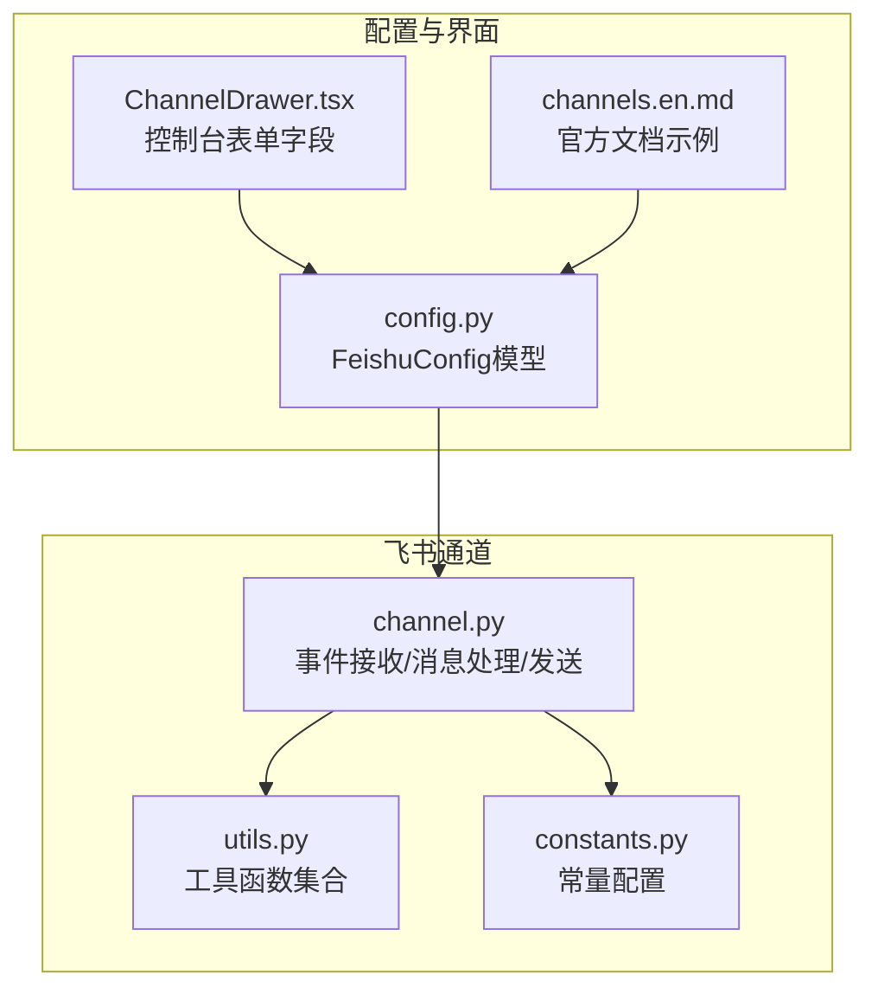
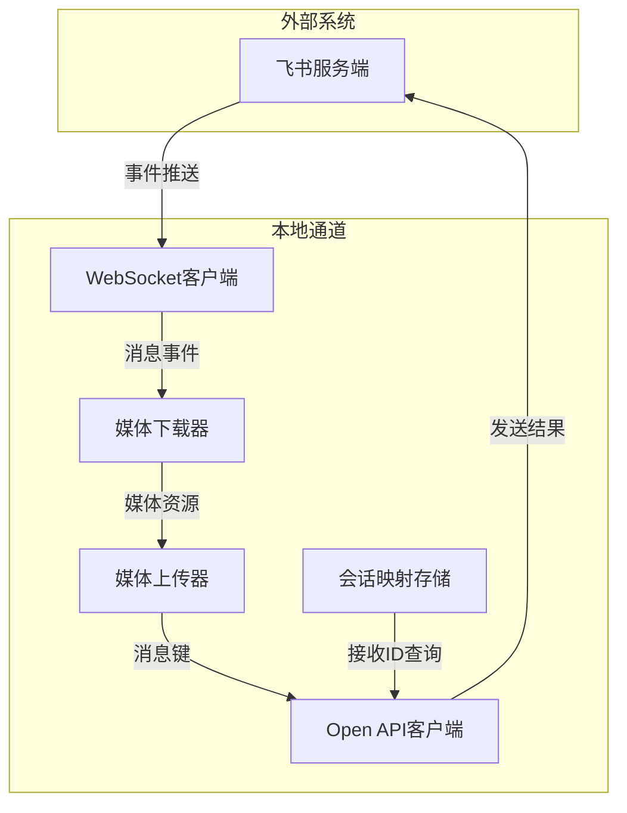
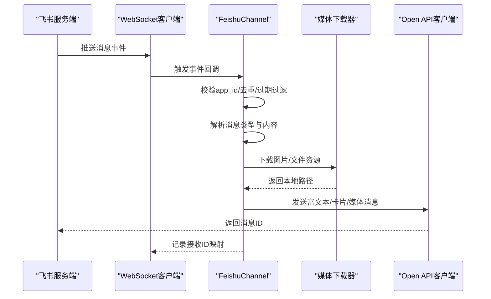
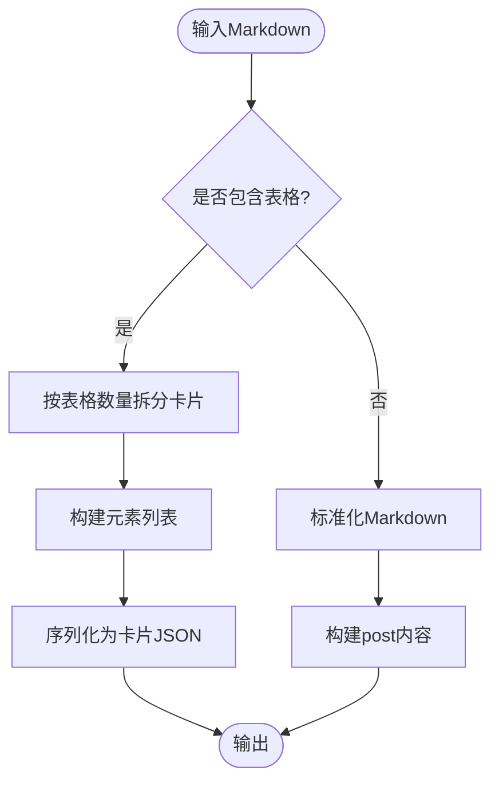
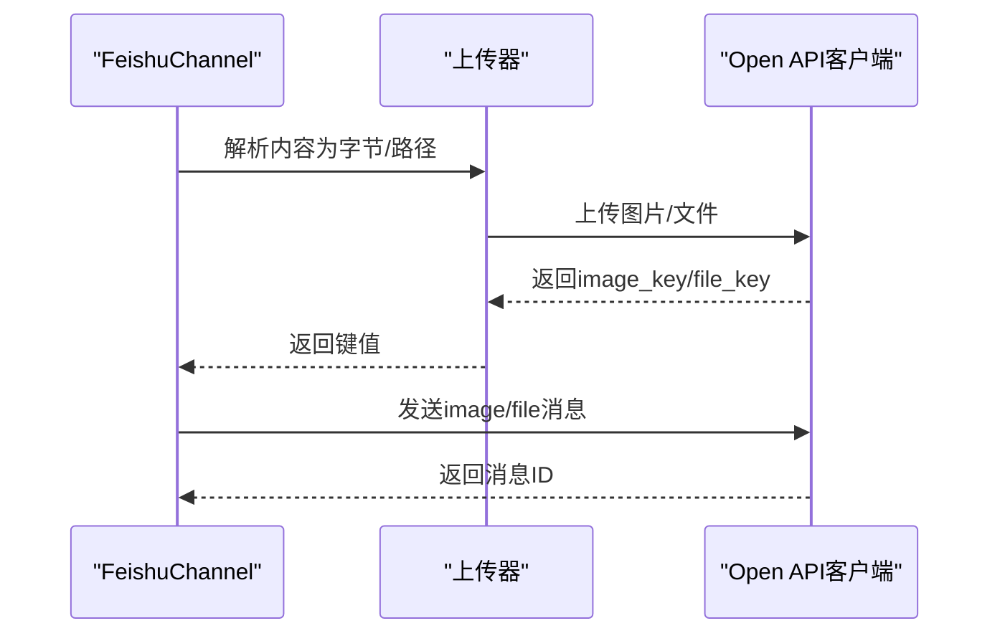
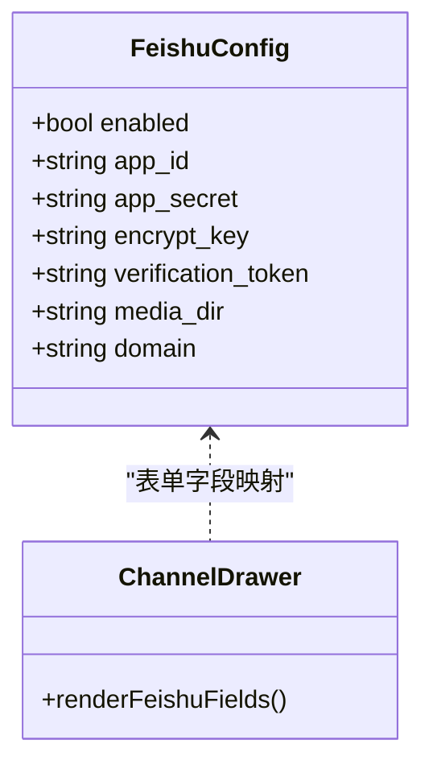
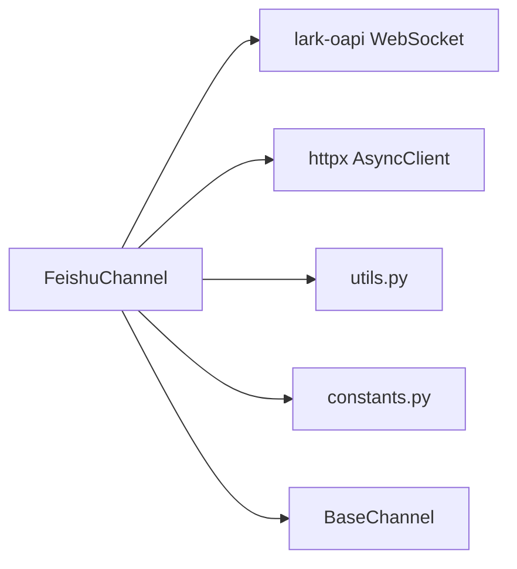

# 飞书平台集成

<cite>
**本文档引用的文件**
- [channel.py](file://src/qwenpaw/app/channels/feishu/channel.py)
- [constants.py](file://src/qwenpaw/app/channels/feishu/constants.py)
- [utils.py](file://src/qwenpaw/app/channels/feishu/utils.py)
- [config.py](file://src/qwenpaw/config/config.py)
- [ChannelDrawer.tsx](file://console/src/pages/Control/Channels/components/ChannelDrawer.tsx)
- [channels.en.md](file://website/public/docs/channels.en.md)
</cite>

## 目录
1. [简介](#简介)
2. [项目结构](#项目结构)
3. [核心组件](#核心组件)
4. [架构总览](#架构总览)
5. [详细组件分析](#详细组件分析)
6. [依赖关系分析](#依赖关系分析)
7. [性能考虑](#性能考虑)
8. [故障排查指南](#故障排查指南)
9. [结论](#结论)
10. [附录](#附录)

## 简介
本文件面向飞书平台集成，系统性说明飞书机器人的创建与配置、应用权限与机器人密钥管理、消息卡片与富文本渲染机制、事件驱动架构与消息处理流程、回调验证、配置参数与安全要求、消息类型转换与多媒体支持、API限制与速率控制策略，以及调试工具与常见问题解决方案。文档基于仓库中的飞书通道实现进行技术解读，帮助开发者快速完成飞书平台的对接与运维。

## 项目结构
飞书集成位于应用通道模块中，采用“通道 + 工具函数 + 常量”的分层组织方式：
- 通道实现：负责事件接收、消息解析、发送与持久化
- 工具函数：提供会话ID生成、显示名拼接、Markdown/表格解析、文件扩展检测等辅助能力
- 常量定义：统一管理文件大小限制、去重缓存上限、WebSocket重连参数等

**图表来源**
- [channel.py:158-2265](file://src/qwenpaw/app/channels/feishu/channel.py#L158-L2265)
- [utils.py:1-364](file://src/qwenpaw/app/channels/feishu/utils.py#L1-L364)
- [constants.py:1-29](file://src/qwenpaw/app/channels/feishu/constants.py#L1-L29)
- [config.py:80-92](file://src/qwenpaw/config/config.py#L80-L92)
- [ChannelDrawer.tsx:445-487](file://console/src/pages/Control/Channels/components/ChannelDrawer.tsx#L445-L487)
- [channels.en.md:208-237](file://website/public/docs/channels.en.md#L208-L237)

**章节来源**
- [channel.py:158-2265](file://src/qwenpaw/app/channels/feishu/channel.py#L158-L2265)
- [utils.py:1-364](file://src/qwenpaw/app/channels/feishu/utils.py#L1-L364)
- [constants.py:1-29](file://src/qwenpaw/app/channels/feishu/constants.py#L1-L29)
- [config.py:80-92](file://src/qwenpaw/config/config.py#L80-L92)
- [ChannelDrawer.tsx:445-487](file://console/src/pages/Control/Channels/components/ChannelDrawer.tsx#L445-L487)
- [channels.en.md:208-237](file://website/public/docs/channels.en.md#L208-L237)

## 核心组件
- FeishuChannel：飞书通道主类，封装WebSocket长连接接收事件、Open API发送消息、媒体下载与上传、会话映射与去重等能力
- 工具模块：会话ID短尾截取、发送者显示名、JSON键提取、文件扩展检测、Post消息文本抽取、Markdown表格解析、交互式卡片构建
- 常量模块：令牌刷新提前时间、文件上传上限、消息去重缓存上限、昵称缓存上限、会话ID后缀长度、过期消息阈值、WebSocket重连参数等

**章节来源**
- [channel.py:158-2265](file://src/qwenpaw/app/channels/feishu/channel.py#L158-L2265)
- [utils.py:1-364](file://src/qwenpaw/app/channels/feishu/utils.py#L1-L364)
- [constants.py:1-29](file://src/qwenpaw/app/channels/feishu/constants.py#L1-L29)

## 架构总览
飞书通道采用“WebSocket事件接收 + Open API消息发送”的双通道模式：
- 事件接收：通过lark-oapi SDK建立WebSocket长连接，注册事件处理器接收IM消息事件
- 消息发送：使用Open API创建消息，支持post（富文本/交互式卡片）、image、file、media、audio等类型
- 会话管理：将聊天ID或用户ID映射为会话ID，持久化接收ID以支持定时任务与主动发送
- 媒体处理：下载/上传图片与文件，自动检测扩展名，限制最大文件大小

**图表来源**
- [channel.py:1969-2265](file://src/qwenpaw/app/channels/feishu/channel.py#L1969-L2265)
- [channel.py:1317-1429](file://src/qwenpaw/app/channels/feishu/channel.py#L1317-L1429)
- [channel.py:1208-1282](file://src/qwenpaw/app/channels/feishu/channel.py#L1208-L1282)

## 详细组件分析

### 事件驱动与消息处理
- 事件过滤：校验事件app_id一致性，避免跨实例误投；丢弃超过阈值的陈旧重试消息
- 消息解析：根据消息类型（text/post/image/file/media/audio）提取文本与媒体键，下载图片与文件到本地目录
- 引用回复：解析parent_id与root_id，拉取被引用消息内容并前置到当前消息
- 允许列表与@校验：支持群组/私聊策略、白名单、是否必须@机器人
- 会话ID生成：从chat_id或open_id派生短会话ID，便于定时任务查找

**图表来源**
- [channel.py:547-895](file://src/qwenpaw/app/channels/feishu/channel.py#L547-L895)
- [channel.py:927-1054](file://src/qwenpaw/app/channels/feishu/channel.py#L927-L1054)
- [channel.py:1208-1282](file://src/qwenpaw/app/channels/feishu/channel.py#L1208-L1282)

**章节来源**
- [channel.py:547-895](file://src/qwenpaw/app/channels/feishu/channel.py#L547-L895)
- [channel.py:927-1054](file://src/qwenpaw/app/channels/feishu/channel.py#L927-L1054)
- [channel.py:1208-1282](file://src/qwenpaw/app/channels/feishu/channel.py#L1208-L1282)

### 富文本与交互式卡片
- 富文本渲染：将Markdown转换为飞书post内容，确保代码块前换行以避免解析异常
- 表格解析：支持GFM表格解析为飞书原生表格组件，否则降级为Markdown
- 交互式卡片：当文本包含表格时自动拆分为多段卡片，每段最多包含固定数量的表格
- 文本预处理：标题转粗体、表格单元去除强调标记，提升渲染一致性

**图表来源**
- [utils.py:169-364](file://src/qwenpaw/app/channels/feishu/utils.py#L169-L364)

**章节来源**
- [utils.py:169-364](file://src/qwenpaw/app/channels/feishu/utils.py#L169-L364)

### 多媒体内容支持与上传
- 图片上传：读取二进制数据，调用SDK上传为image_key，再以image消息类型发送
- 文件上传：根据扩展名选择doc/xls/ppt等类型，限制最大30MB，返回file_key后以file消息类型发送
- URL/本地路径：支持HTTP/HTTPS/file协议，自动下载到媒体目录
- 扩展检测：基于魔数识别常见格式，确保文件名正确

**图表来源**
- [channel.py:1317-1429](file://src/qwenpaw/app/channels/feishu/channel.py#L1317-L1429)
- [channel.py:1586-1718](file://src/qwenpaw/app/channels/feishu/channel.py#L1586-L1718)

**章节来源**
- [channel.py:1317-1429](file://src/qwenpaw/app/channels/feishu/channel.py#L1317-L1429)
- [channel.py:1586-1718](file://src/qwenpaw/app/channels/feishu/channel.py#L1586-L1718)
- [utils.py:58-75](file://src/qwenpaw/app/channels/feishu/utils.py#L58-L75)

### 配置参数与安全要求
- 必填参数：app_id、app_secret（启用通道时必需）
- 可选参数：domain（"feishu"/"lark"）、encrypt_key（事件加密）、verification_token（事件校验）、media_dir（媒体目录）
- 控制台表单：提供region、app_id、app_secret、encrypt_key、verification_token、media_dir等字段
- 官方文档示例：展示agent.json中启用与配置方式，提示安装依赖lark-oapi

**图表来源**
- [config.py:80-92](file://src/qwenpaw/config/config.py#L80-L92)
- [ChannelDrawer.tsx:445-487](file://console/src/pages/Control/Channels/components/ChannelDrawer.tsx#L445-L487)

**章节来源**
- [config.py:80-92](file://src/qwenpaw/config/config.py#L80-L92)
- [ChannelDrawer.tsx:445-487](file://console/src/pages/Control/Channels/components/ChannelDrawer.tsx#L445-L487)
- [channels.en.md:208-237](file://website/public/docs/channels.en.md#L208-L237)

### 回调验证与事件解密
- 事件处理器：通过lark-oapi的EventDispatcherHandler注册IM消息事件回调
- 加密与校验：可配置encrypt_key与verification_token，用于事件解密与签名验证
- 域名适配：根据domain选择中国版或国际版域名

**章节来源**
- [channel.py:1969-2021](file://src/qwenpaw/app/channels/feishu/channel.py#L1969-L2021)

## 依赖关系分析
- 第三方依赖：lark-oapi（WebSocket与IM API），httpx（HTTP客户端）
- 内部依赖：BaseChannel基类、ContentType枚举、工具函数与常量
- 并发模型：WebSocket线程内运行独立事件循环，主线程通过run_coroutine_threadsafe调度异步处理

**图表来源**
- [channel.py:104-151](file://src/qwenpaw/app/channels/feishu/channel.py#L104-L151)
- [channel.py:1969-2265](file://src/qwenpaw/app/channels/feishu/channel.py#L1969-L2265)

**章节来源**
- [channel.py:104-151](file://src/qwenpaw/app/channels/feishu/channel.py#L104-L151)
- [channel.py:1969-2265](file://src/qwenpaw/app/channels/feishu/channel.py#L1969-L2265)

## 性能考虑
- 去重与过期：维护消息ID去重队列，丢弃超过阈值的陈旧重试消息，降低重复处理开销
- 缓存策略：昵称缓存与接收ID映射，减少Contact API与磁盘IO
- 重连退避：WebSocket初始重连延迟1秒，最大60秒，指数退避，避免频繁重试
- 文件大小限制：统一30MB上限，防止大文件占用带宽与内存
- 会话ID短尾：仅保留末N位，缩短字符串处理与存储成本

**章节来源**
- [constants.py:1-29](file://src/qwenpaw/app/channels/feishu/constants.py#L1-L29)
- [channel.py:566-580](file://src/qwenpaw/app/channels/feishu/channel.py#L566-L580)
- [channel.py:1208-1282](file://src/qwenpaw/app/channels/feishu/channel.py#L1208-L1282)

## 故障排查指南
- 启用失败：检查lark-oapi是否安装，确认app_id与app_secret是否配置
- 事件不达：核对domain设置（feishu/lark），检查encrypt_key与verification_token是否匹配
- 媒体下载失败：检查网络可达性与URL有效性，确认媒体目录权限
- 文件上传失败：确认文件未超限（30MB），检查file_type映射与文件名
- 会话无法回复：确保用户已首次对话，或在dispatch.meta中显式设置feishu_receive_id
- 连接中断：查看WebSocket健康监控日志，确认重连机制是否正常工作

**章节来源**
- [channel.py:2178-2231](file://src/qwenpaw/app/channels/feishu/channel.py#L2178-L2231)
- [channel.py:2044-2176](file://src/qwenpaw/app/channels/feishu/channel.py#L2044-L2176)
- [channel.py:1375-1377](file://src/qwenpaw/app/channels/feishu/channel.py#L1375-L1377)

## 结论
飞书通道通过事件驱动与Open API相结合的方式，实现了稳定的消息收发与富文本/多媒体支持。其设计重点在于事件过滤与去重、会话映射持久化、媒体资源处理与WebSocket健康保障。配合完善的配置项与控制台表单，开发者可以快速完成飞书平台的集成与运维。

## 附录

### 飞书消息类型转换规则
- 文本：直接作为post内容发送
- 富文本：转换为post（md）或交互式卡片（含表格时拆分）
- 图片：上传为image_key后以image消息发送
- 文件/视频/音频：上传为file_key后以file/media/audio消息发送
- 引用回复：拉取被引用消息内容并前置到当前文本

**章节来源**
- [channel.py:1503-1537](file://src/qwenpaw/app/channels/feishu/channel.py#L1503-L1537)
- [channel.py:1586-1718](file://src/qwenpaw/app/channels/feishu/channel.py#L1586-L1718)
- [channel.py:1055-1196](file://src/qwenpaw/app/channels/feishu/channel.py#L1055-L1196)

### API限制与速率控制
- 文件上传上限：30MB
- 令牌刷新提前：60秒
- 消息去重上限：1000条
- 昵称缓存上限：500个
- 会话ID后缀长度：8字符
- 过期消息阈值：20秒
- WebSocket重连：初始1秒，最大60秒，指数退避

**章节来源**
- [constants.py:1-29](file://src/qwenpaw/app/channels/feishu/constants.py#L1-L29)

### 调试工具与使用建议
- 控制台表单：在控制台中填写region、app_id、app_secret、encrypt_key、verification_token、media_dir等参数
- 日志定位：关注WebSocket连接状态、事件过滤、媒体下载/上传、发送结果与错误码
- 媒体目录：确保media_dir存在且具备读写权限，便于调试与复现

**章节来源**
- [ChannelDrawer.tsx:445-487](file://console/src/pages/Control/Channels/components/ChannelDrawer.tsx#L445-L487)
- [channel.py:2178-2231](file://src/qwenpaw/app/channels/feishu/channel.py#L2178-L2231)