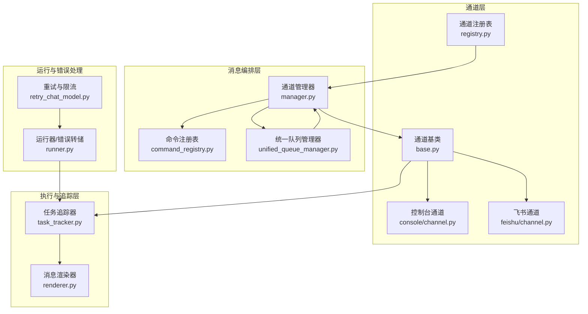
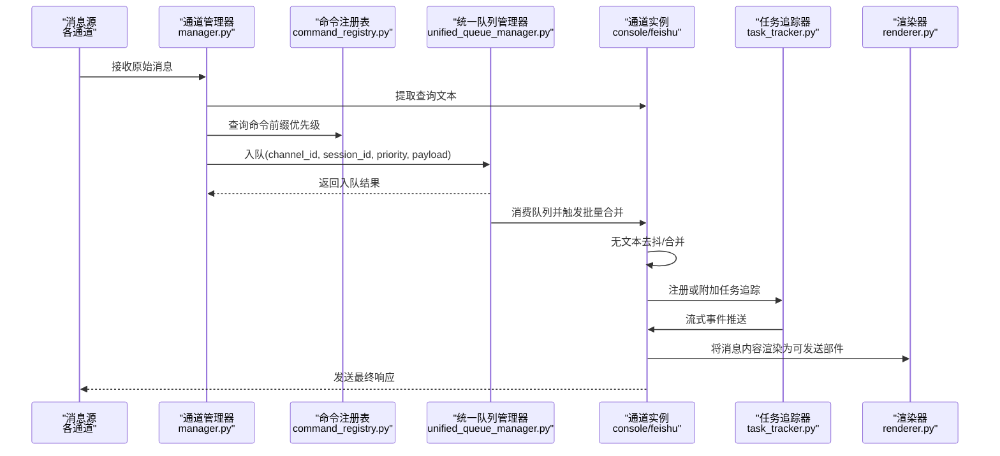
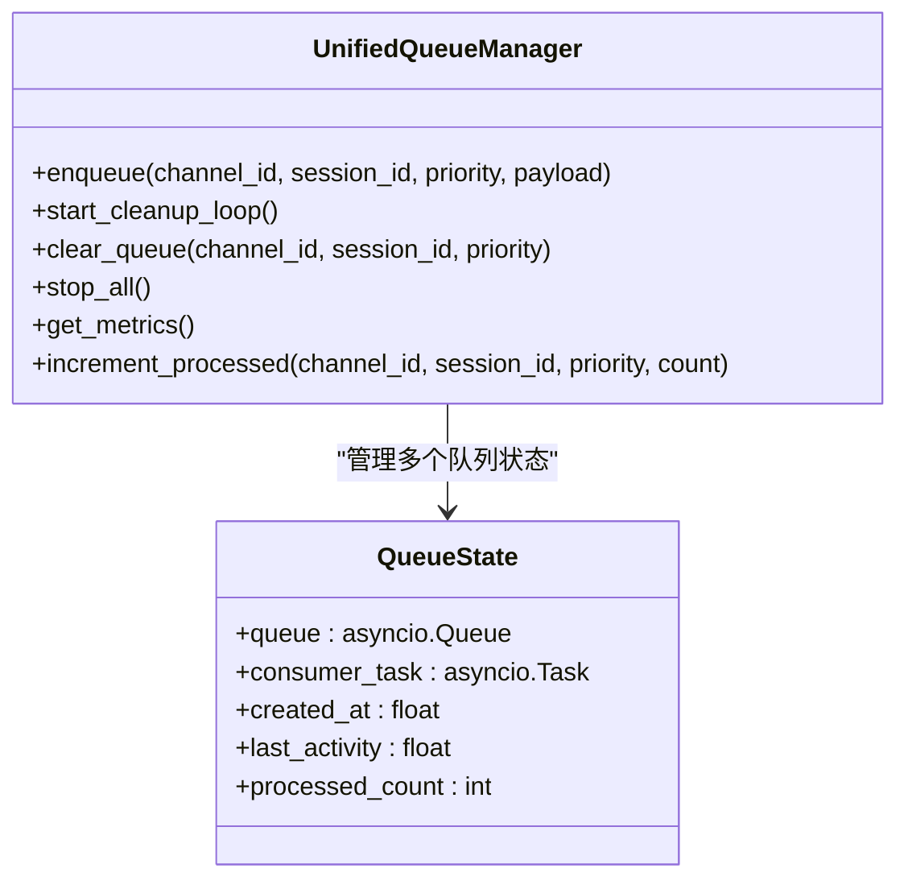
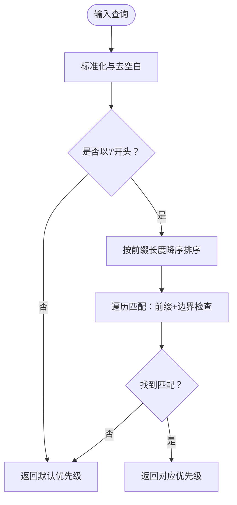
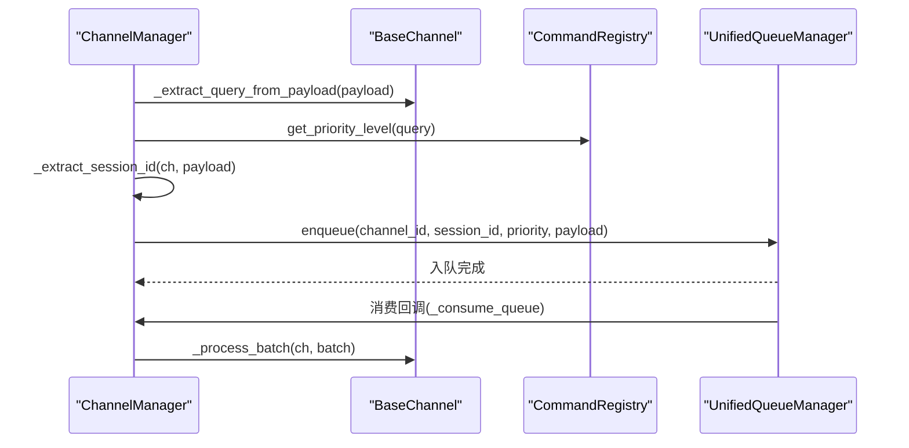
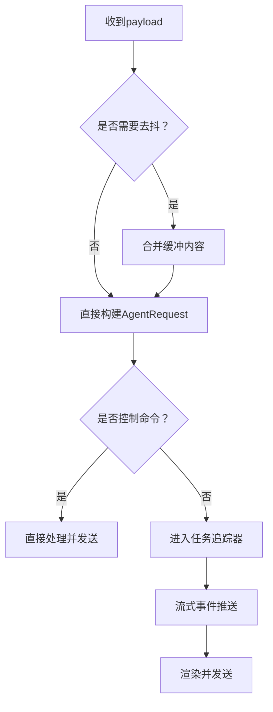
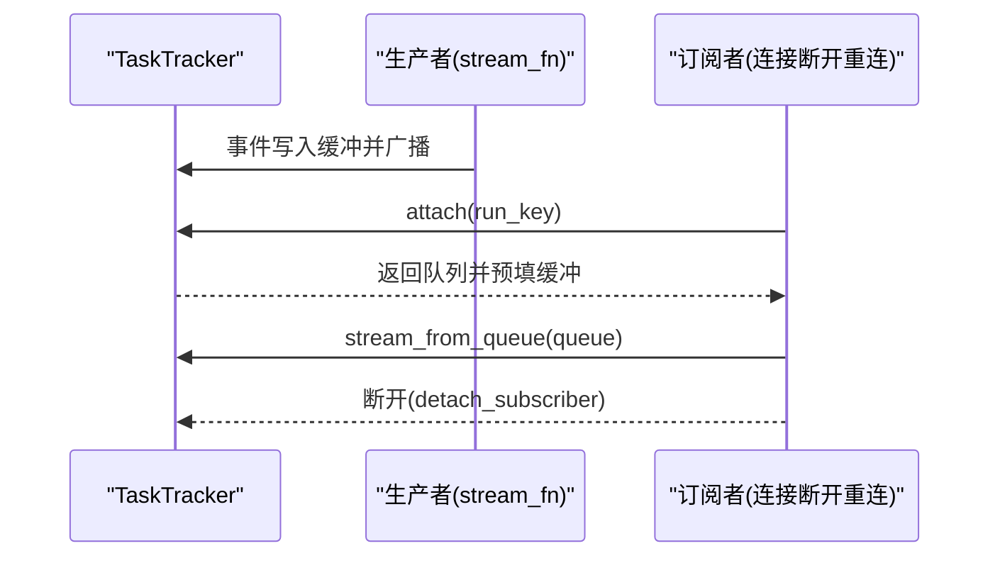
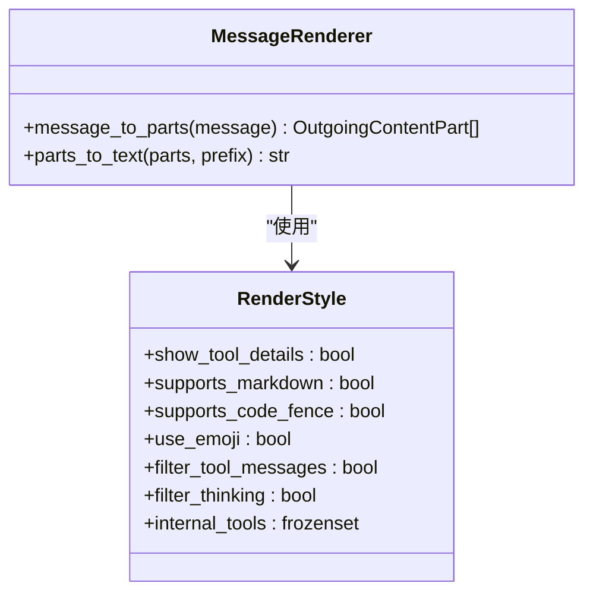
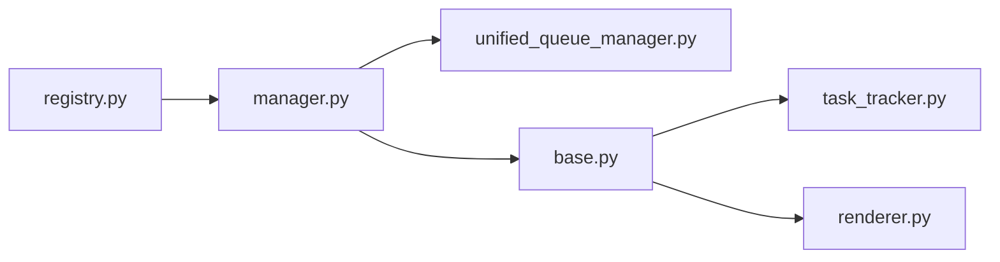

# 消息处理流程

<cite>
**本文档引用的文件**
- [unified_queue_manager.py](file://src/qwenpaw/app/channels/unified_queue_manager.py)
- [command_registry.py](file://src/qwenpaw/app/channels/command_registry.py)
- [manager.py](file://src/qwenpaw/app/channels/manager.py)
- [base.py](file://src/qwenpaw/app/channels/base.py)
- [registry.py](file://src/qwenpaw/app/channels/registry.py)
- [task_tracker.py](file://src/qwenpaw/app/runner/task_tracker.py)
- [renderer.py](file://src/qwenpaw/app/channels/renderer.py)
- [console/channel.py](file://src/qwenpaw/app/channels/console/channel.py)
- [feishu/channel.py](file://src/qwenpaw/app/channels/feishu/channel.py)
- [retry_chat_model.py](file://src/qwenpaw/providers/retry_chat_model.py)
- [runner.py](file://src/qwenpaw/app/runner/runner.py)
</cite>

## 目录
1. [简介](#简介)
2. [项目结构](#项目结构)
3. [核心组件](#核心组件)
4. [架构总览](#架构总览)
5. [详细组件分析](#详细组件分析)
6. [依赖分析](#依赖分析)
7. [性能考虑](#性能考虑)
8. [故障排查指南](#故障排查指南)
9. [结论](#结论)

## 简介
本文件面向QwenPaw的消息处理子系统，系统性阐述从“消息接收、解析、路由、排队、批处理、渲染与发送”的完整链路。重点覆盖以下主题：
- 统一队列管理器：按通道/会话/优先级隔离的动态消费者模型、空闲清理与指标监控
- 命令注册表：命令前缀匹配与优先级映射、控制命令识别
- 批量合并与去重：时间抖动缓冲、无文本内容合并、会话级去重键
- 消息标准化与渲染：内容类型统一、Markdown/媒体适配、工具调用输出过滤
- 会话管理与状态跟踪：会话ID解析、聊天对象创建、任务追踪与取消
- 异步架构与错误处理：事件流式传输、重试与退避、错误转储与恢复

## 项目结构
消息处理相关代码主要集中在应用层通道模块与运行器模块中，采用“通道抽象 + 统一队列 + 任务追踪”的分层设计。

图表来源
- [registry.py:190-195](file://src/qwenpaw/app/channels/registry.py#L190-L195)
- [manager.py:447-478](file://src/qwenpaw/app/channels/manager.py#L447-L478)
- [unified_queue_manager.py:60-118](file://src/qwenpaw/app/channels/unified_queue_manager.py#L60-L118)
- [task_tracker.py:30-41](file://src/qwenpaw/app/runner/task_tracker.py#L30-L41)
- [renderer.py:78-86](file://src/qwenpaw/app/channels/renderer.py#L78-L86)
- [runner.py:559-594](file://src/qwenpaw/app/runner/runner.py#L559-L594)
- [retry_chat_model.py:124-160](file://src/qwenpaw/providers/retry_chat_model.py#L124-L160)

章节来源
- [registry.py:190-195](file://src/qwenpaw/app/channels/registry.py#L190-L195)
- [manager.py:447-478](file://src/qwenpaw/app/channels/manager.py#L447-L478)
- [unified_queue_manager.py:60-118](file://src/qwenpaw/app/channels/unified_queue_manager.py#L60-L118)
- [task_tracker.py:30-41](file://src/qwenpaw/app/runner/task_tracker.py#L30-L41)
- [renderer.py:78-86](file://src/qwenpaw/app/channels/renderer.py#L78-L86)
- [runner.py:559-594](file://src/qwenpaw/app/runner/runner.py#L559-L594)
- [retry_chat_model.py:124-160](file://src/qwenpaw/providers/retry_chat_model.py#L124-L160)

## 核心组件
- 统一队列管理器（UnifiedQueueManager）：以三元键（通道ID、会话ID、优先级）构建独立队列，按需创建消费者，支持空闲清理与指标导出。
- 命令注册表（CommandRegistry）：将命令前缀映射到优先级级别，支持“控制命令”快速判定与默认优先级回退。
- 通道管理器（ChannelManager）：负责消息入队、优先级提取、会话ID标准化、批量合并与消费。
- 通道基类（BaseChannel）：定义消息到请求的转换、无文本内容去抖、事件流式处理、错误回调与发送接口。
- 任务追踪器（TaskTracker）：为每个会话维护事件缓冲与订阅者队列，支持重连重放与任务取消。
- 渲染器（MessageRenderer）：将消息内容转换为可发送的内容部件，支持Markdown、代码块、媒体与工具调用输出过滤。

章节来源
- [unified_queue_manager.py:60-118](file://src/qwenpaw/app/channels/unified_queue_manager.py#L60-L118)
- [command_registry.py:23-63](file://src/qwenpaw/app/channels/command_registry.py#L23-L63)
- [manager.py:68-85](file://src/qwenpaw/app/channels/manager.py#L68-L85)
- [base.py:70-127](file://src/qwenpaw/app/channels/base.py#L70-L127)
- [task_tracker.py:30-41](file://src/qwenpaw/app/runner/task_tracker.py#L30-L41)
- [renderer.py:78-86](file://src/qwenpaw/app/channels/renderer.py#L78-L86)

## 架构总览
消息在系统中的流转路径如下：

图表来源
- [manager.py:255-348](file://src/qwenpaw/app/channels/manager.py#L255-L348)
- [command_registry.py:175-218](file://src/qwenpaw/app/channels/command_registry.py#L175-L218)
- [unified_queue_manager.py:119-164](file://src/qwenpaw/app/channels/unified_queue_manager.py#L119-L164)
- [base.py:374-536](file://src/qwenpaw/app/channels/base.py#L374-L536)
- [renderer.py:87-102](file://src/qwenpaw/app/channels/renderer.py#L87-L102)

## 详细组件分析

### 统一队列管理器（按通道/会话/优先级隔离）
- 隔离策略：QueueKey=(channel_id, session_id, priority)，确保同一键内严格串行，不同键并发执行。
- 动态消费者：首次入队时创建消费者任务，避免固定工作池带来的资源浪费。
- 批量合并：消费循环中对同键消息进行队列排空合并，减少下游压力。
- 空闲清理：后台定时扫描空队列，超时后取消消费者并释放资源。
- 指标监控：提供队列数量、大小、处理计数、年龄与空闲时长等信息。

图表来源
- [unified_queue_manager.py:60-118](file://src/qwenpaw/app/channels/unified_queue_manager.py#L60-L118)
- [unified_queue_manager.py:119-164](file://src/qwenpaw/app/channels/unified_queue_manager.py#L119-L164)
- [unified_queue_manager.py:274-428](file://src/qwenpaw/app/channels/unified_queue_manager.py#L274-L428)
- [unified_queue_manager.py:430-498](file://src/qwenpaw/app/channels/unified_queue_manager.py#L430-L498)

章节来源
- [unified_queue_manager.py:60-118](file://src/qwenpaw/app/channels/unified_queue_manager.py#L60-L118)
- [unified_queue_manager.py:119-164](file://src/qwenpaw/app/channels/unified_queue_manager.py#L119-L164)
- [unified_queue_manager.py:274-428](file://src/qwenpaw/app/channels/unified_queue_manager.py#L274-L428)
- [unified_queue_manager.py:430-498](file://src/qwenpaw/app/channels/unified_queue_manager.py#L430-L498)

### 命令注册表（命令前缀匹配与优先级）
- 双重注册：支持名称（如“critical”）或数值（灵活扩展）两种方式。
- 匹配算法：按前缀长度降序排序，逐个尝试匹配；要求前缀后紧接空白或结束，避免误匹配。
- 控制命令：用于区分紧急控制指令与普通对话，决定是否绕过任务追踪直接处理。

图表来源
- [command_registry.py:175-218](file://src/qwenpaw/app/channels/command_registry.py#L175-L218)
- [command_registry.py:136-174](file://src/qwenpaw/app/channels/command_registry.py#L136-L174)

章节来源
- [command_registry.py:23-63](file://src/qwenpaw/app/channels/command_registry.py#L23-L63)
- [command_registry.py:136-174](file://src/qwenpaw/app/channels/command_registry.py#L136-L174)
- [command_registry.py:175-218](file://src/qwenpaw/app/channels/command_registry.py#L175-L218)

### 通道管理器（入队、会话ID标准化、批量合并）
- 入队流程：从消息中提取查询文本与会话ID，计算优先级，交由统一队列管理器入队。
- 会话ID标准化：优先使用payload已有的session_id，否则委托通道的去抖键生成。
- 批量合并：消费循环中对同键队列进行排空合并，提升吞吐并降低重复请求。

图表来源
- [manager.py:255-348](file://src/qwenpaw/app/channels/manager.py#L255-L348)
- [manager.py:362-446](file://src/qwenpaw/app/channels/manager.py#L362-L446)
- [base.py:697-725](file://src/qwenpaw/app/channels/base.py#L697-L725)

章节来源
- [manager.py:255-348](file://src/qwenpaw/app/channels/manager.py#L255-L348)
- [manager.py:362-446](file://src/qwenpaw/app/channels/manager.py#L362-L446)
- [base.py:697-725](file://src/qwenpaw/app/channels/base.py#L697-L725)

### 通道基类（消息到请求转换、去抖与事件流）
- 请求构建：将原生消息转换为AgentRequest，统一输入结构，便于后续处理。
- 无文本去抖：若内容不含文本且非音频，先缓存至会话缓冲区，待出现文本时合并发送。
- 事件流：通过_process产生事件流，按对象类型分发到消息完成/响应回调，最后触发完成回调。
- 控制命令分支：若非控制命令，进入任务追踪；否则直接处理，保证低延迟。

图表来源
- [base.py:726-758](file://src/qwenpaw/app/channels/base.py#L726-L758)
- [base.py:759-864](file://src/qwenpaw/app/channels/base.py#L759-L864)
- [base.py:374-536](file://src/qwenpaw/app/channels/base.py#L374-L536)

章节来源
- [base.py:726-758](file://src/qwenpaw/app/channels/base.py#L726-L758)
- [base.py:759-864](file://src/qwenpaw/app/channels/base.py#L759-L864)
- [base.py:374-536](file://src/qwenpaw/app/channels/base.py#L374-L536)

### 任务追踪器（事件缓冲、重连重放、任务取消）
- 运行状态：每个会话一个运行状态，包含任务Future、订阅者队列与事件缓冲。
- 订阅与重放：新订阅者加入时，先向其推送缓冲事件，再实时推送新事件。
- 取消与清理：支持请求停止（取消任务），完成后清理运行状态并移除订阅者。

图表来源
- [task_tracker.py:99-208](file://src/qwenpaw/app/runner/task_tracker.py#L99-L208)
- [task_tracker.py:210-231](file://src/qwenpaw/app/runner/task_tracker.py#L210-L231)

章节来源
- [task_tracker.py:99-208](file://src/qwenpaw/app/runner/task_tracker.py#L99-L208)
- [task_tracker.py:210-231](file://src/qwenpaw/app/runner/task_tracker.py#L210-L231)

### 渲染器（内容标准化与格式适配）
- 内容类型映射：将消息内容映射为文本、图片、视频、音频、文件、拒绝等部件。
- 工具调用输出：支持过滤内部工具输出、仅展示媒体内容或摘要预览。
- Markdown与代码块：根据样式配置输出Markdown与代码块，兼容不同渠道能力。

图表来源
- [renderer.py:78-86](file://src/qwenpaw/app/channels/renderer.py#L78-L86)
- [renderer.py:87-102](file://src/qwenpaw/app/channels/renderer.py#L87-L102)
- [renderer.py:298-350](file://src/qwenpaw/app/channels/renderer.py#L298-L350)

章节来源
- [renderer.py:78-86](file://src/qwenpaw/app/channels/renderer.py#L78-L86)
- [renderer.py:87-102](file://src/qwenpaw/app/channels/renderer.py#L87-L102)
- [renderer.py:298-350](file://src/qwenpaw/app/channels/renderer.py#L298-L350)

### 通道实现示例（控制台与飞书）
- 控制台通道：将消息打印到终端，支持媒体文件本地化与前端推送。
- 飞书通道：基于WebSocket接收事件，Open API发送消息，维护接收ID映射与去重阈值。

章节来源
- [console/channel.py:63-190](file://src/qwenpaw/app/channels/console/channel.py#L63-L190)
- [console/channel.py:255-277](file://src/qwenpaw/app/channels/console/channel.py#L255-L277)
- [console/channel.py:332-448](file://src/qwenpaw/app/channels/console/channel.py#L332-L448)
- [feishu/channel.py:158-200](file://src/qwenpaw/app/channels/feishu/channel.py#L158-L200)

## 依赖分析
- 通道注册表与通道管理器：通过注册表加载可用通道类，管理器持有通道实例并注入统一处理函数。
- 通道管理器与统一队列管理器：管理器负责入队与消费回调，队列管理器负责消费者生命周期与清理。
- 通道基类与任务追踪器：通道基类在非控制命令场景下通过任务追踪器进行任务注册与事件流式推送。
- 渲染器与通道：通道在发送前使用渲染器将消息内容标准化为可发送部件。

图表来源
- [registry.py:190-195](file://src/qwenpaw/app/channels/registry.py#L190-L195)
- [manager.py:447-478](file://src/qwenpaw/app/channels/manager.py#L447-L478)
- [unified_queue_manager.py:60-118](file://src/qwenpaw/app/channels/unified_queue_manager.py#L60-L118)
- [base.py:70-127](file://src/qwenpaw/app/channels/base.py#L70-L127)
- [task_tracker.py:30-41](file://src/qwenpaw/app/runner/task_tracker.py#L30-L41)
- [renderer.py:78-86](file://src/qwenpaw/app/channels/renderer.py#L78-L86)

章节来源
- [registry.py:190-195](file://src/qwenpaw/app/channels/registry.py#L190-L195)
- [manager.py:447-478](file://src/qwenpaw/app/channels/manager.py#L447-L478)
- [unified_queue_manager.py:60-118](file://src/qwenpaw/app/channels/unified_queue_manager.py#L60-L118)
- [base.py:70-127](file://src/qwenpaw/app/channels/base.py#L70-L127)
- [task_tracker.py:30-41](file://src/qwenpaw/app/runner/task_tracker.py#L30-L41)
- [renderer.py:78-86](file://src/qwenpaw/app/channels/renderer.py#L78-L86)

## 性能考虑
- 动态消费者与空闲清理：避免固定线程池造成的资源浪费，空闲队列自动回收，降低内存占用。
- 批量合并：同键消息排空合并，减少下游调用次数与网络开销。
- 无文本去抖：对无文本消息进行缓冲合并，避免频繁触发上游逻辑。
- 事件缓冲与订阅：任务追踪器的事件缓冲与订阅者队列，支持断点重连与低延迟重放。
- 渲染与过滤：通过渲染器的样式配置与工具输出过滤，减少冗余内容传输。

## 故障排查指南
- 入队失败或超时：统一队列管理器在入队时有超时保护，日志会记录队列满与超时警告，检查队列容量与消费者处理速度。
- 消费者异常退出：统一队列管理器捕获异常并记录，随后清理队列状态；检查消费者回调与通道实现。
- 任务追踪异常：任务追踪器在生产者异常时写入错误事件并清理运行状态；检查通道事件流与渲染器输出。
- 错误转储与重试：运行器在处理异常时生成调试转储文件，并在重试/限流场景中记录Retry-After头与退避策略；结合重试模型与速率限制器定位问题。

章节来源
- [unified_queue_manager.py:145-157](file://src/qwenpaw/app/channels/unified_queue_manager.py#L145-L157)
- [unified_queue_manager.py:256-263](file://src/qwenpaw/app/channels/unified_queue_manager.py#L256-L263)
- [task_tracker.py:183-200](file://src/qwenpaw/app/runner/task_tracker.py#L183-L200)
- [runner.py:559-594](file://src/qwenpaw/app/runner/runner.py#L559-L594)
- [retry_chat_model.py:124-160](file://src/qwenpaw/providers/retry_chat_model.py#L124-L160)

## 结论
QwenPaw的消息处理体系通过“通道抽象 + 统一队列 + 任务追踪 + 渲染适配”的分层设计，实现了高并发、可扩展、可观测的消息处理链路。统一队列管理器提供了严格的会话与优先级隔离、动态消费者与空闲清理；命令注册表保障了控制命令的快速识别与优先级分配；通道基类与任务追踪器共同完成了消息到事件流的转换与重连重放；渲染器则确保了跨渠道的内容一致性与格式适配。整体架构在保证低延迟的同时，兼顾了稳定性与可维护性。