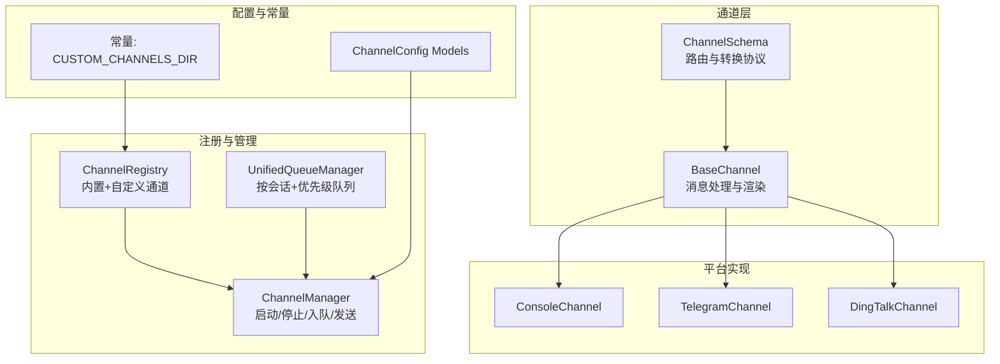
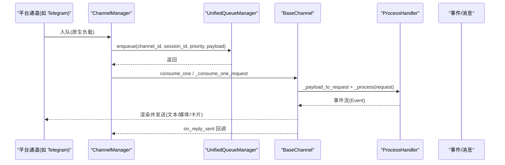
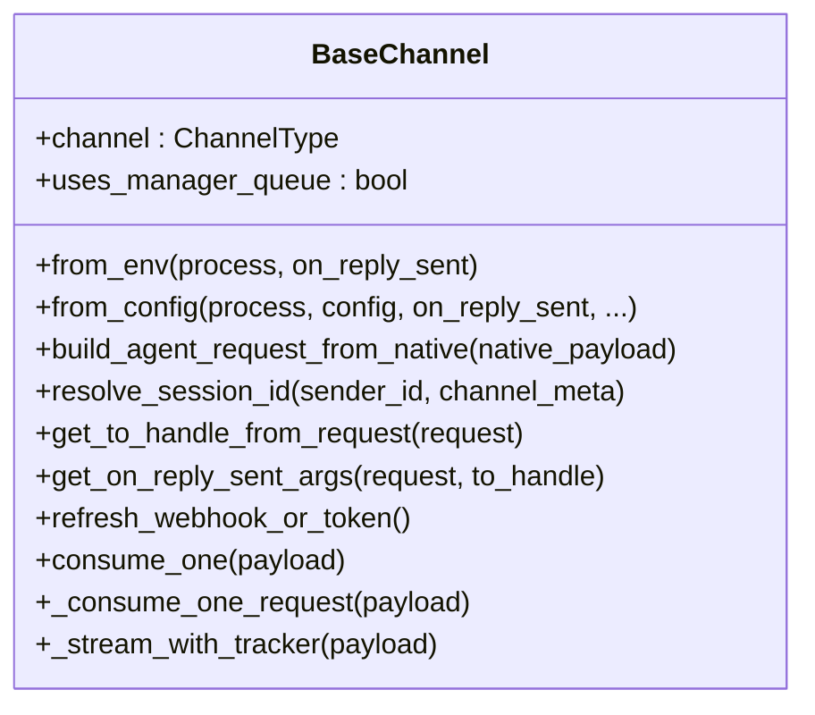
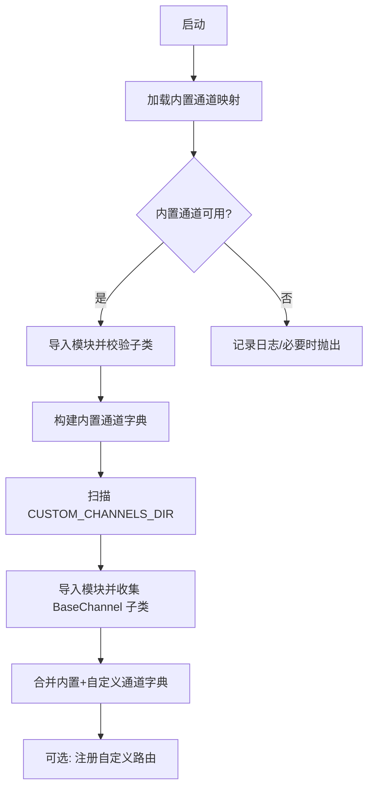
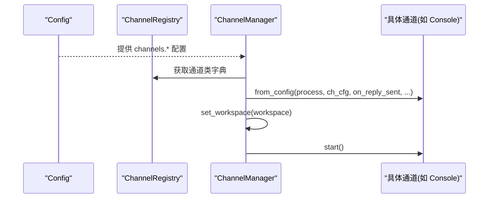
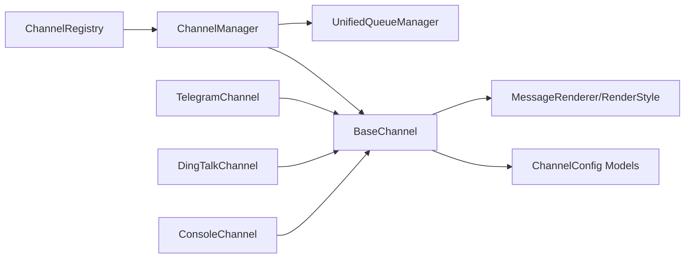

# 自定义通道开发

<cite>
**本文引用的文件**
- [src/qwenpaw/app/channels/base.py](file://src/qwenpaw/app/channels/base.py)
- [src/qwenpaw/app/channels/registry.py](file://src/qwenpaw/app/channels/registry.py)
- [src/qwenpaw/app/channels/manager.py](file://src/qwenpaw/app/channels/manager.py)
- [src/qwenpaw/app/channels/schema.py](file://src/qwenpaw/app/channels/schema.py)
- [src/qwenpaw/app/channels/unified_queue_manager.py](file://src/qwenpaw/app/channels/unified_queue_manager.py)
- [src/qwenpaw/app/channels/console/channel.py](file://src/qwenpaw/app/channels/console/channel.py)
- [src/qwenpaw/app/channels/telegram/channel.py](file://src/qwenpaw/app/channels/telegram/channel.py)
- [src/qwenpaw/app/channels/dingtalk/channel.py](file://src/qwenpaw/app/channels/dingtalk/channel.py)
- [src/qwenpaw/config/config.py](file://src/qwenpaw/config/config.py)
- [src/qwenpaw/constant.py](file://src/qwenpaw/constant.py)
- [website/public/docs/channels.en.md](file://website/public/docs/channels.en.md)
</cite>

## 目录
1. [简介](#简介)
2. [项目结构](#项目结构)
3. [核心组件](#核心组件)
4. [架构总览](#架构总览)
5. [详细组件分析](#详细组件分析)
6. [依赖关系分析](#依赖关系分析)
7. [性能考量](#性能考量)
8. [故障排查指南](#故障排查指南)
9. [结论](#结论)
10. [附录](#附录)

## 简介
本指南面向希望在 QwenPaw 中开发“自定义通道”的开发者，提供从架构到实现细节的完整开发框架与接口规范。你将学会如何继承 BaseChannel 基类、实现必要的抽象方法、通过通道注册表扩展系统、定义配置参数与初始化流程、实现消息处理接口与内容类型支持、规范响应格式、管理通道生命周期与状态监控、处理错误与异常、进行测试与调试，并掌握安全、性能与可扩展性设计的最佳实践。

## 项目结构
QwenPaw 的通道子系统位于 src/qwenpaw/app/channels 目录下，采用“基类 + 多平台实现 + 注册表 + 统一队列管理 + 管理器”的分层架构：
- 基类与协议：BaseChannel、ChannelSchema（统一消息路由与转换）
- 平台通道：Console、Telegram、DingTalk 等
- 注册表：内置通道与自定义通道发现与加载
- 队列与管理：UnifiedQueueManager + ChannelManager
- 配置：各平台通道的 Pydantic 模型与通用通道配置基类
- 常量：自定义通道目录等运行时常量

图表来源
- [src/qwenpaw/app/channels/base.py:70-127](file://src/qwenpaw/app/channels/base.py#L70-L127)
- [src/qwenpaw/app/channels/schema.py:12-71](file://src/qwenpaw/app/channels/schema.py#L12-L71)
- [src/qwenpaw/app/channels/registry.py:18-195](file://src/qwenpaw/app/channels/registry.py#L18-L195)
- [src/qwenpaw/app/channels/unified_queue_manager.py:60-118](file://src/qwenpaw/app/channels/unified_queue_manager.py#L60-L118)
- [src/qwenpaw/app/channels/manager.py:68-116](file://src/qwenpaw/app/channels/manager.py#L68-L116)
- [src/qwenpaw/config/config.py:39-200](file://src/qwenpaw/config/config.py#L39-L200)
- [src/qwenpaw/constant.py:186-188](file://src/qwenpaw/constant.py#L186-L188)

章节来源
- [src/qwenpaw/app/channels/base.py:70-127](file://src/qwenpaw/app/channels/base.py#L70-L127)
- [src/qwenpaw/app/channels/registry.py:18-195](file://src/qwenpaw/app/channels/registry.py#L18-L195)
- [src/qwenpaw/app/channels/manager.py:68-116](file://src/qwenpaw/app/channels/manager.py#L68-L116)
- [src/qwenpaw/app/channels/unified_queue_manager.py:60-118](file://src/qwenpaw/app/channels/unified_queue_manager.py#L60-L118)
- [src/qwenpaw/config/config.py:39-200](file://src/qwenpaw/config/config.py#L39-L200)
- [src/qwenpaw/constant.py:186-188](file://src/qwenpaw/constant.py#L186-L188)

## 核心组件
- BaseChannel：所有通道的抽象基类，定义统一的消息处理流程、内容类型支持、会话解析、去抖动合并、权限策略、事件流输出、生命周期钩子等。
- ChannelManager：负责通道实例的创建、启动、停止、统一入队与出队、任务跟踪与取消、对外发送接口。
- UnifiedQueueManager：基于 (channel_id, session_id, priority) 的动态队列与消费者模型，支持并发隔离、自动清理与监控指标。
- ChannelRegistry：内置通道映射与自定义通道扫描，支持模块级路由钩子注册。
- ChannelSchema：定义 ChannelAddress 路由键与 ChannelMessageConverter 协议，统一消息收发转换。
- 各平台通道：如 Console、Telegram、DingTalk 等，继承 BaseChannel 并实现特定的 build_agent_request_from_native、发送与接收逻辑。

章节来源
- [src/qwenpaw/app/channels/base.py:70-127](file://src/qwenpaw/app/channels/base.py#L70-L127)
- [src/qwenpaw/app/channels/manager.py:68-116](file://src/qwenpaw/app/channels/manager.py#L68-L116)
- [src/qwenpaw/app/channels/unified_queue_manager.py:60-118](file://src/qwenpaw/app/channels/unified_queue_manager.py#L60-L118)
- [src/qwenpaw/app/channels/registry.py:18-195](file://src/qwenpaw/app/channels/registry.py#L18-L195)
- [src/qwenpaw/app/channels/schema.py:12-71](file://src/qwenpaw/app/channels/schema.py#L12-L71)

## 架构总览
通道系统以“统一消息流 + 动态队列 + 可插拔通道”为核心，消息从平台通道解析为 AgentRequest，经统一处理器生成事件流，再由通道将事件渲染为平台消息或媒体内容。

图表来源
- [src/qwenpaw/app/channels/manager.py:39-66](file://src/qwenpaw/app/channels/manager.py#L39-L66)
- [src/qwenpaw/app/channels/unified_queue_manager.py:119-164](file://src/qwenpaw/app/channels/unified_queue_manager.py#L119-L164)
- [src/qwenpaw/app/channels/base.py:659-758](file://src/qwenpaw/app/channels/base.py#L659-L758)

章节来源
- [src/qwenpaw/app/channels/manager.py:39-66](file://src/qwenpaw/app/channels/manager.py#L39-L66)
- [src/qwenpaw/app/channels/unified_queue_manager.py:119-164](file://src/qwenpaw/app/channels/unified_queue_manager.py#L119-L164)
- [src/qwenpaw/app/channels/base.py:659-758](file://src/qwenpaw/app/channels/base.py#L659-L758)

## 详细组件分析

### BaseChannel 基类与继承要求
- 必须实现的接口
  - from_env：从环境变量创建通道实例
  - from_config：从配置对象创建通道实例
  - build_agent_request_from_native：将平台原生负载解析为 AgentRequest（使用运行时内容类型）
- 可选覆盖点
  - resolve_session_id：自定义会话键（默认 channel:sender_id）
  - get_to_handle_from_request：自定义发送目标（默认 user_id）
  - get_on_reply_sent_args：回调参数（默认 to_handle, session_id）
  - refresh_webhook_or_token：刷新令牌或 webhook（部分平台需要）
  - consume_one/_consume_one_request：消息消费主流程（默认支持去抖动与批量合并）
- 内容类型与渲染
  - 支持 Text/Image/Video/Audio/File/Refusal 等内容类型
  - 使用 MessageRenderer 与 RenderStyle 控制工具消息与思考内容过滤
- 权限与策略
  - dm_policy/group_policy/allow_from/deny_message/require_mention
- 事件流与错误处理
  - _stream_with_tracker：统一事件流输出（SSE），捕获异常并触发错误回调
  - on_event_message_completed/on_event_response：消息完成与响应事件钩子
- 去抖动与合并
  - _apply_no_text_debounce：无文本消息缓冲，待有文本时合并
  - merge_native_items/merge_requests：原生负载与请求的合并策略

图表来源
- [src/qwenpaw/app/channels/base.py:70-127](file://src/qwenpaw/app/channels/base.py#L70-L127)
- [src/qwenpaw/app/channels/base.py:538-556](file://src/qwenpaw/app/channels/base.py#L538-L556)
- [src/qwenpaw/app/channels/base.py:604-619](file://src/qwenpaw/app/channels/base.py#L604-L619)
- [src/qwenpaw/app/channels/base.py:659-758](file://src/qwenpaw/app/channels/base.py#L659-L758)

章节来源
- [src/qwenpaw/app/channels/base.py:70-127](file://src/qwenpaw/app/channels/base.py#L70-L127)
- [src/qwenpaw/app/channels/base.py:538-556](file://src/qwenpaw/app/channels/base.py#L538-L556)
- [src/qwenpaw/app/channels/base.py:604-619](file://src/qwenpaw/app/channels/base.py#L604-L619)
- [src/qwenpaw/app/channels/base.py:659-758](file://src/qwenpaw/app/channels/base.py#L659-L758)

### 通道注册表与扩展机制
- 内置通道映射：通过 _BUILTIN_SPECS 将通道键映射到模块与类名
- 自定义通道发现：扫描 CUSTOM_CHANNELS_DIR，导入模块并收集继承自 BaseChannel 的类
- 路由钩子：支持自定义通道模块导出路由注册函数 register_app_routes(app)，在应用启动时挂载 API 路由
- 缓存与线程安全：内置通道缓存与锁，避免重复加载

图表来源
- [src/qwenpaw/app/channels/registry.py:45-78](file://src/qwenpaw/app/channels/registry.py#L45-L78)
- [src/qwenpaw/app/channels/registry.py:97-129](file://src/qwenpaw/app/channels/registry.py#L97-L129)
- [src/qwenpaw/app/channels/registry.py:135-188](file://src/qwenpaw/app/channels/registry.py#L135-L188)
- [src/qwenpaw/constant.py:186-188](file://src/qwenpaw/constant.py#L186-L188)

章节来源
- [src/qwenpaw/app/channels/registry.py:45-78](file://src/qwenpaw/app/channels/registry.py#L45-L78)
- [src/qwenpaw/app/channels/registry.py:97-129](file://src/qwenpaw/app/channels/registry.py#L97-L129)
- [src/qwenpaw/app/channels/registry.py:135-188](file://src/qwenpaw/app/channels/registry.py#L135-L188)
- [src/qwenpaw/constant.py:186-188](file://src/qwenpaw/constant.py#L186-L188)

### 配置参数定义与初始化流程
- 通用通道配置基类 BaseChannelConfig：enabled、bot_prefix、filter_tool_messages、filter_thinking、dm_policy、group_policy、allow_from、deny_message、require_mention
- 各平台配置模型：ConsoleConfig、TelegramConfig、DingTalkConfig、FeishuConfig 等，均继承 BaseChannelConfig
- 初始化流程
  - ChannelManager.from_config：读取可用通道列表，遍历注册表，按通道键查找配置，调用通道类的 from_config 构造实例
  - ChannelManager.from_env：读取可用通道列表，调用通道类的 from_env 构造实例
  - set_workspace：注入工作区上下文（聊天管理器、任务跟踪器）

图表来源
- [src/qwenpaw/app/channels/manager.py:110-213](file://src/qwenpaw/app/channels/manager.py#L110-L213)
- [src/qwenpaw/config/config.py:39-200](file://src/qwenpaw/config/config.py#L39-L200)

章节来源
- [src/qwenpaw/app/channels/manager.py:110-213](file://src/qwenpaw/app/channels/manager.py#L110-L213)
- [src/qwenpaw/config/config.py:39-200](file://src/qwenpaw/config/config.py#L39-L200)

### 消息处理接口与内容类型支持
- 输入转换：build_agent_request_from_native 将平台原生负载解析为 AgentRequest，使用运行时 Message/Content 类型
- 输出渲染：_stream_with_tracker 将事件序列化为 JSON（或 SSE 字符串），并根据事件类型调用 on_event_message_completed/on_event_response
- 内容类型：TextContent、ImageContent、VideoContent、AudioContent、FileContent、RefusalContent
- 去抖动与合并：_apply_no_text_debounce 与 merge_native_items/merge_requests，确保多片段输入的正确聚合
- 平台差异：如 Telegram 支持媒体下载与分片发送；DingTalk 支持会话 webhook 与 AI 卡交互

章节来源
- [src/qwenpaw/app/channels/base.py:569-619](file://src/qwenpaw/app/channels/base.py#L569-L619)
- [src/qwenpaw/app/channels/base.py:446-536](file://src/qwenpaw/app/channels/base.py#L446-L536)
- [src/qwenpaw/app/channels/telegram/channel.py:140-238](file://src/qwenpaw/app/channels/telegram/channel.py#L140-L238)
- [src/qwenpaw/app/channels/dingtalk/channel.py:319-347](file://src/qwenpaw/app/channels/dingtalk/channel.py#L319-L347)

### 生命周期管理、状态监控与错误处理
- 生命周期：start()/stop() 由 ChannelManager 在启动/停止阶段调用
- 状态监控：UnifiedQueueManager 提供队列指标（总数、每个队列的大小、处理计数、空闲时长等）
- 错误处理：_stream_with_tracker 捕获异常并触发 _on_consume_error；允许上层通过 on_reply_sent 回调感知最终状态

章节来源
- [src/qwenpaw/app/channels/manager.py:479-526](file://src/qwenpaw/app/channels/manager.py#L479-L526)
- [src/qwenpaw/app/channels/unified_queue_manager.py:430-472](file://src/qwenpaw/app/channels/unified_queue_manager.py#L430-L472)
- [src/qwenpaw/app/channels/base.py:497-536](file://src/qwenpaw/app/channels/base.py#L497-L536)

### 开发示例与最佳实践
- 新平台接入步骤
  - 在 CUSTOM_CHANNELS_DIR 下创建通道模块，实现 from_env/from_config 与 build_agent_request_from_native
  - 如需额外 HTTP 路由，在模块中导出 register_app_routes(app) 钩子
  - 在通道类中覆盖 resolve_session_id/get_to_handle_from_request 等以适配平台特性
  - 在配置文件中启用通道并填写凭据（参考各平台文档）
- 测试与调试
  - 使用 ConsoleChannel 进行端到端验证（打印输出、媒体解析）
  - 利用 ChannelManager 的 send_text/send_event 接口进行主动推送测试
  - 通过 UnifiedQueueManager.get_metrics 观察队列状态
- 安全与性能
  - 权限控制：合理设置 dm_policy/group_policy/allow_from/require_mention
  - 媒体处理：限制上传大小、使用本地缓存目录、及时清理
  - 队列背压：合理设置队列容量与超时，避免阻塞
  - 去抖动：对无文本输入的场景进行缓冲合并，减少平台 API 调用

章节来源
- [src/qwenpaw/app/channels/registry.py:135-188](file://src/qwenpaw/app/channels/registry.py#L135-L188)
- [src/qwenpaw/app/channels/manager.py:630-711](file://src/qwenpaw/app/channels/manager.py#L630-L711)
- [src/qwenpaw/app/channels/unified_queue_manager.py:430-472](file://src/qwenpaw/app/channels/unified_queue_manager.py#L430-L472)
- [website/public/docs/channels.en.md:1-800](file://website/public/docs/channels.en.md#L1-L800)

## 依赖关系分析
- 组件耦合
  - ChannelManager 依赖 ChannelRegistry 获取通道类，依赖 UnifiedQueueManager 进行入队与消费
  - BaseChannel 依赖 MessageRenderer/RenderStyle 控制输出样式，依赖配置与工作区上下文
  - 各平台通道继承 BaseChannel 并实现平台特有逻辑
- 外部依赖
  - 平台 SDK（如 Telegram、DingTalk）用于消息收发与媒体处理
  - aiohttp/asyncio 用于异步网络与任务调度

图表来源
- [src/qwenpaw/app/channels/registry.py:18-195](file://src/qwenpaw/app/channels/registry.py#L18-L195)
- [src/qwenpaw/app/channels/manager.py:68-116](file://src/qwenpaw/app/channels/manager.py#L68-L116)
- [src/qwenpaw/app/channels/unified_queue_manager.py:60-118](file://src/qwenpaw/app/channels/unified_queue_manager.py#L60-L118)
- [src/qwenpaw/app/channels/base.py:70-127](file://src/qwenpaw/app/channels/base.py#L70-L127)
- [src/qwenpaw/config/config.py:39-200](file://src/qwenpaw/config/config.py#L39-L200)

章节来源
- [src/qwenpaw/app/channels/registry.py:18-195](file://src/qwenpaw/app/channels/registry.py#L18-L195)
- [src/qwenpaw/app/channels/manager.py:68-116](file://src/qwenpaw/app/channels/manager.py#L68-L116)
- [src/qwenpaw/app/channels/unified_queue_manager.py:60-118](file://src/qwenpaw/app/channels/unified_queue_manager.py#L60-L118)
- [src/qwenpaw/app/channels/base.py:70-127](file://src/qwenpaw/app/channels/base.py#L70-L127)
- [src/qwenpaw/config/config.py:39-200](file://src/qwenpaw/config/config.py#L39-L200)

## 性能考量
- 队列并发与隔离：按 (channel_id, session_id, priority) 分离队列，避免跨会话串扰
- 去抖动与合并：减少平台 API 调用次数，提升吞吐
- 超时与背压：入队设置超时，防止无限阻塞；队列满时告警
- 监控指标：队列长度、处理计数、空闲时长，便于容量规划与问题定位

## 故障排查指南
- 通道未加载
  - 检查是否在可用通道列表中启用；查看注册表日志；确认自定义通道模块路径已加入 sys.path
- 消息未到达
  - 检查 ChannelManager 的入队回调是否设置；确认 UnifiedQueueManager 的消费者任务是否运行
  - 查看队列指标与清理日志
- 权限被拒绝
  - 核对 dm_policy/group_policy/allow_from/require_mention 配置
- 媒体发送失败
  - 检查文件大小限制、本地路径解析、代理设置
- 异常与错误
  - 查看 _stream_with_tracker 的异常日志；确认 on_reply_sent 回调是否触发

章节来源
- [src/qwenpaw/app/channels/registry.py:97-129](file://src/qwenpaw/app/channels/registry.py#L97-L129)
- [src/qwenpaw/app/channels/manager.py:349-361](file://src/qwenpaw/app/channels/manager.py#L349-L361)
- [src/qwenpaw/app/channels/unified_queue_manager.py:376-428](file://src/qwenpaw/app/channels/unified_queue_manager.py#L376-L428)
- [src/qwenpaw/app/channels/base.py:497-536](file://src/qwenpaw/app/channels/base.py#L497-L536)

## 结论
通过遵循 BaseChannel 的接口规范、利用 ChannelRegistry 的扩展机制、借助 UnifiedQueueManager 的高性能队列模型与 ChannelManager 的统一生命周期管理，开发者可以快速、安全、稳定地为 QwenPaw 添加新的平台通道。建议在开发过程中重视配置参数的标准化、权限控制与媒体处理的健壮性，并结合监控指标持续优化性能与稳定性。

## 附录
- 平台配置参考文档：见 website/public/docs/channels.en.md
- 常量与自定义通道目录：CUSTOM_CHANNELS_DIR

章节来源
- [website/public/docs/channels.en.md:1-800](file://website/public/docs/channels.en.md#L1-L800)
- [src/qwenpaw/constant.py:186-188](file://src/qwenpaw/constant.py#L186-L188)