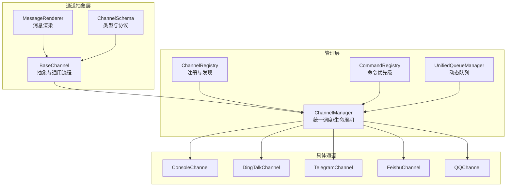
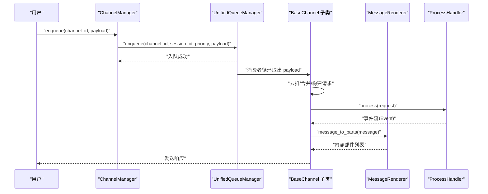
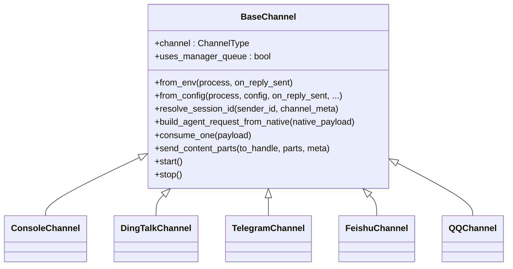
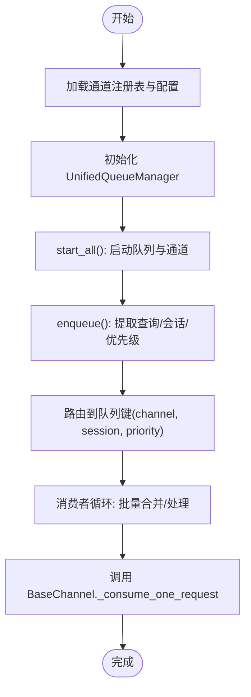
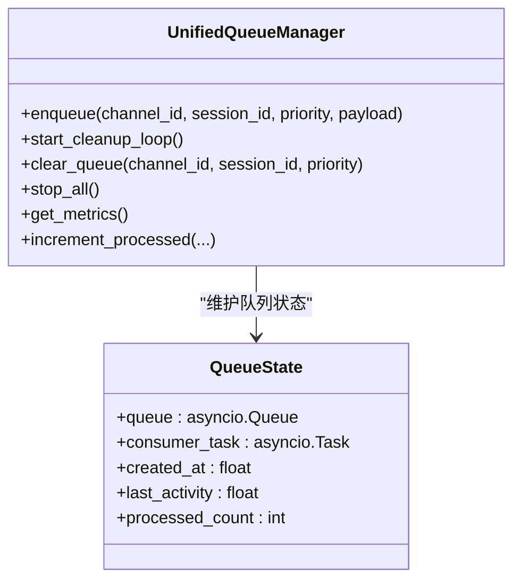
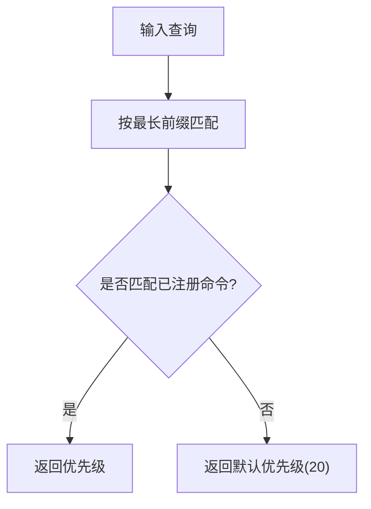
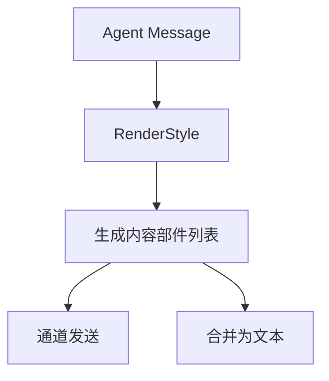
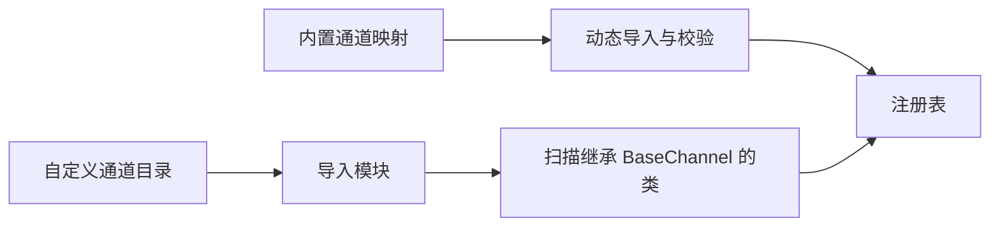
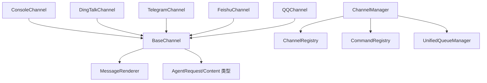

# 通道架构设计

<cite>
**本文档引用的文件**
- [base.py](file://src/qwenpaw/app/channels/base.py)
- [manager.py](file://src/qwenpaw/app/channels/manager.py)
- [registry.py](file://src/qwenpaw/app/channels/registry.py)
- [unified_queue_manager.py](file://src/qwenpaw/app/channels/unified_queue_manager.py)
- [schema.py](file://src/qwenpaw/app/channels/schema.py)
- [command_registry.py](file://src/qwenpaw/app/channels/command_registry.py)
- [renderer.py](file://src/qwenpaw/app/channels/renderer.py)
- [utils.py](file://src/qwenpaw/app/channels/utils.py)
- [console/channel.py](file://src/qwenpaw/app/channels/console/channel.py)
- [dingtalk/channel.py](file://src/qwenpaw/app/channels/dingtalk/channel.py)
- [telegram/channel.py](file://src/qwenpaw/app/channels/telegram/channel.py)
- [feishu/channel.py](file://src/qwenpaw/app/channels/feishu/channel.py)
- [qq/channel.py](file://src/qwenpaw/app/channels/qq/channel.py)
</cite>

## 目录
1. [简介](#简介)
2. [项目结构](#项目结构)
3. [核心组件](#核心组件)
4. [架构总览](#架构总览)
5. [详细组件分析](#详细组件分析)
6. [依赖关系分析](#依赖关系分析)
7. [性能考量](#性能考量)
8. [故障排查指南](#故障排查指南)
9. [结论](#结论)
10. [附录](#附录)

## 简介
本技术文档系统性阐述 QwenPaw 的通道（Channel）架构设计，聚焦于通道抽象层、统一管理与路由、队列与并发控制、消息渲染与发送、以及扩展性与最佳实践。文档以 BaseChannel 基类为核心，结合 ChannelManager 的统一调度、通道注册表与命令优先级体系，构建出高内聚、低耦合、可扩展的多通道通信框架。

## 项目结构
通道相关代码主要位于 src/qwenpaw/app/channels 目录下，采用“按功能域分层 + 按通道类型模块化”的组织方式：
- 抽象层：base.py 定义 BaseChannel 抽象与通用处理流程
- 管理层：manager.py 负责通道实例化、统一队列与消费者、生命周期管理
- 注册表：registry.py 提供内置与自定义通道的发现与注册
- 队列系统：unified_queue_manager.py 实现基于会话与优先级的动态队列
- 协议与模式：schema.py 定义通道类型与消息转换协议
- 命令优先级：command_registry.py 提供控制命令识别与优先级映射
- 渲染器：renderer.py 将消息内容转换为各通道可发送的内容部件
- 工具集：utils.py 提供文本切分、文件 URL 解析等通用能力
- 具体通道：console、dingtalk、telegram、feishu、qq 等子目录下的具体实现

图示来源
- [base.py:70-127](file://src/qwenpaw/app/channels/base.py#L70-L127)
- [manager.py:68-114](file://src/qwenpaw/app/channels/manager.py#L68-L114)
- [registry.py:190-195](file://src/qwenpaw/app/channels/registry.py#L190-L195)
- [unified_queue_manager.py:60-78](file://src/qwenpaw/app/channels/unified_queue_manager.py#L60-L78)
- [schema.py:12-48](file://src/qwenpaw/app/channels/schema.py#L12-L48)
- [command_registry.py:23-41](file://src/qwenpaw/app/channels/command_registry.py#L23-L41)
- [console/channel.py:63-75](file://src/qwenpaw/app/channels/console/channel.py#L63-L75)
- [dingtalk/channel.py:112-126](file://src/qwenpaw/app/channels/dingtalk/channel.py#L112-L126)
- [telegram/channel.py:1-200](file://src/qwenpaw/app/channels/telegram/channel.py#L1-L200)
- [feishu/channel.py:158-167](file://src/qwenpaw/app/channels/feishu/channel.py#L158-L167)
- [qq/channel.py:1-200](file://src/qwenpaw/app/channels/qq/channel.py#L1-L200)

章节来源
- [base.py:70-127](file://src/qwenpaw/app/channels/base.py#L70-L127)
- [manager.py:68-114](file://src/qwenpaw/app/channels/manager.py#L68-L114)
- [registry.py:190-195](file://src/qwenpaw/app/channels/registry.py#L190-L195)

## 核心组件
- BaseChannel 抽象层：定义统一的消息处理流程、会话解析、去抖与合并、渲染器集成、回调注入与工作区注入等
- ChannelManager 统一管理：负责通道实例化、队列与消费者启动、入队与出队、生命周期管理、事件派发
- UnifiedQueueManager 动态队列：以 (channel_id, session_id, priority_level) 为键的三元组队列，支持按会话与优先级隔离、自动清理空闲队列
- CommandRegistry 命令优先级：将控制命令映射到优先级级别，用于消息路由与批处理
- MessageRenderer 消息渲染：将 Agent 消息转换为各通道可发送的内容部件，并支持过滤与样式控制
- ChannelRegistry 通道注册表：内置通道与自定义通道的发现与注册，支持插件式扩展

章节来源
- [base.py:70-127](file://src/qwenpaw/app/channels/base.py#L70-L127)
- [manager.py:68-114](file://src/qwenpaw/app/channels/manager.py#L68-L114)
- [unified_queue_manager.py:60-78](file://src/qwenpaw/app/channels/unified_queue_manager.py#L60-L78)
- [command_registry.py:23-41](file://src/qwenpaw/app/channels/command_registry.py#L23-L41)
- [renderer.py:78-86](file://src/qwenpaw/app/channels/renderer.py#L78-L86)
- [registry.py:190-195](file://src/qwenpaw/app/channels/registry.py#L190-L195)

## 架构总览
通道架构采用“抽象基类 + 统一管理 + 动态队列 + 命令优先级”的设计，形成清晰的职责边界与解耦关系：
- BaseChannel 定义统一的消息处理契约（构建请求、消费、渲染、发送），并提供去抖、合并、会话解析等通用能力
- ChannelManager 负责从配置或环境变量加载通道、注入统一的 process 处理器、设置队列回调、启动/停止通道与队列
- UnifiedQueueManager 以 QueueKey 为维度创建队列与消费者任务，支持同键严格串行、不同键并发执行、空闲自动清理
- CommandRegistry 将用户输入中的控制命令识别并映射到优先级，影响入队时的路由策略
- 具体通道（Console/DingTalk/Telegram/Feishu/QQ）继承 BaseChannel，实现原生消息到 AgentRequest 的转换与发送逻辑

图示来源
- [manager.py:349-361](file://src/qwenpaw/app/channels/manager.py#L349-L361)
- [unified_queue_manager.py:119-164](file://src/qwenpaw/app/channels/unified_queue_manager.py#L119-L164)
- [base.py:659-696](file://src/qwenpaw/app/channels/base.py#L659-L696)
- [renderer.py:87-102](file://src/qwenpaw/app/channels/renderer.py#L87-L102)

## 详细组件分析

### BaseChannel 抽象层
- 设计模式与职责
  - 抽象工厂：from_env/from_config 提供多种实例化入口
  - 模板方法：consume_one/_consume_one_request/_stream_with_tracker 等定义处理流程骨架
  - 策略模式：RenderStyle 控制渲染行为；去抖/合并策略通过子类覆盖
  - 观察者回调：on_reply_sent 回调在回复发送后触发
- 关键能力
  - 会话解析：resolve_session_id 将 sender_id 与 meta 映射为 session_id
  - 去抖与合并：_apply_no_text_debounce 合并无文本内容；merge_native_items/merge_requests 合并批量消息
  - 渲染与发送：_message_to_content_parts/message_to_parts 将消息转换为内容部件；send_content_parts 发送
  - 工作区注入：set_workspace 注入 TaskTracker/ChatManager，支持取消与跟踪
- 生命周期
  - start/stop：通道启动/停止（部分通道需要长连接或线程）
  - refresh_webhook_or_token：令牌/回调刷新钩子（部分通道实现）

图示来源
- [base.py:70-127](file://src/qwenpaw/app/channels/base.py#L70-L127)
- [console/channel.py:63-75](file://src/qwenpaw/app/channels/console/channel.py#L63-L75)
- [dingtalk/channel.py:112-126](file://src/qwenpaw/app/channels/dingtalk/channel.py#L112-L126)
- [telegram/channel.py:1-200](file://src/qwenpaw/app/channels/telegram/channel.py#L1-L200)
- [feishu/channel.py:158-167](file://src/qwenpaw/app/channels/feishu/channel.py#L158-L167)
- [qq/channel.py:1-200](file://src/qwenpaw/app/channels/qq/channel.py#L1-L200)

章节来源
- [base.py:70-127](file://src/qwenpaw/app/channels/base.py#L70-L127)
- [base.py:537-556](file://src/qwenpaw/app/channels/base.py#L537-L556)
- [base.py:557-568](file://src/qwenpaw/app/channels/base.py#L557-L568)
- [base.py:619-631](file://src/qwenpaw/app/channels/base.py#L619-L631)
- [base.py:659-696](file://src/qwenpaw/app/channels/base.py#L659-L696)
- [base.py:759-800](file://src/qwenpaw/app/channels/base.py#L759-L800)

### ChannelManager 统一管理机制
- 通道实例化
  - from_env：从环境变量加载可用通道与注册表
  - from_config：从配置对象加载通道，支持过滤工具消息、思考内容等渲染选项
- 统一队列与消费者
  - start_all：初始化 UnifiedQueueManager，启动清理循环，为每个通道设置 enqueue 回调并启动通道
  - _consume_queue：每队列消费者循环，支持批合并（同一队列键内）
- 入队与路由
  - enqueue：线程安全入队，提取查询文本进行优先级分类，使用 _extract_session_id 保证会话一致性
  - _enqueue_with_timeout：带超时保护，避免阻塞
- 生命周期管理
  - stop_all：取消待处理入队任务、停止队列管理器、停止通道
  - replace_channel：热替换单个通道（新通道先 start，再锁内交换并停止旧通道）
- 事件派发
  - send_event/send_text：根据通道类型将事件或纯文本发送给指定目标

图示来源
- [manager.py:447-478](file://src/qwenpaw/app/channels/manager.py#L447-L478)
- [manager.py:349-361](file://src/qwenpaw/app/channels/manager.py#L349-L361)
- [manager.py:362-446](file://src/qwenpaw/app/channels/manager.py#L362-L446)

章节来源
- [manager.py:68-114](file://src/qwenpaw/app/channels/manager.py#L68-L114)
- [manager.py:108-213](file://src/qwenpaw/app/channels/manager.py#L108-L213)
- [manager.py:447-526](file://src/qwenpaw/app/channels/manager.py#L447-L526)
- [manager.py:571-630](file://src/qwenpaw/app/channels/manager.py#L571-L630)
- [manager.py:630-711](file://src/qwenpaw/app/channels/manager.py#L630-L711)

### UnifiedQueueManager 动态队列系统
- 队列键与隔离
  - QueueKey = (channel_id, session_id, priority_level)，确保相同键严格串行，不同键并发执行
- 动态创建与清理
  - _get_or_create_queue：首次入队时创建队列与消费者任务
  - start_cleanup_loop：后台定时清理空闲且长时间未活动的队列
- 并发与监控
  - _run_consumer：消费者循环，委托外部 consumer_fn 处理
  - get_metrics：返回队列总数、每个队列的大小、处理计数、年龄与空闲时间
- 处理统计
  - increment_processed：处理完成后更新计数与最后活跃时间

图示来源
- [unified_queue_manager.py:60-78](file://src/qwenpaw/app/channels/unified_queue_manager.py#L60-L78)
- [unified_queue_manager.py:119-164](file://src/qwenpaw/app/channels/unified_queue_manager.py#L119-L164)
- [unified_queue_manager.py:274-290](file://src/qwenpaw/app/channels/unified_queue_manager.py#L274-L290)
- [unified_queue_manager.py:376-428](file://src/qwenpaw/app/channels/unified_queue_manager.py#L376-L428)
- [unified_queue_manager.py:430-471](file://src/qwenpaw/app/channels/unified_queue_manager.py#L430-L471)
- [unified_queue_manager.py:473-498](file://src/qwenpaw/app/channels/unified_queue_manager.py#L473-L498)

章节来源
- [unified_queue_manager.py:60-78](file://src/qwenpaw/app/channels/unified_queue_manager.py#L60-L78)
- [unified_queue_manager.py:119-164](file://src/qwenpaw/app/channels/unified_queue_manager.py#L119-L164)
- [unified_queue_manager.py:274-290](file://src/qwenpaw/app/channels/unified_queue_manager.py#L274-L290)
- [unified_queue_manager.py:376-428](file://src/qwenpaw/app/channels/unified_queue_manager.py#L376-L428)
- [unified_queue_manager.py:430-471](file://src/qwenpaw/app/channels/unified_queue_manager.py#L430-L471)
- [unified_queue_manager.py:473-498](file://src/qwenpaw/app/channels/unified_queue_manager.py#L473-L498)

### CommandRegistry 命令优先级体系
- 优先级命名与数值
  - critical(0)、high(10)、normal(20)、low(30)，支持灵活扩展
- 命令注册
  - register_command 支持名称或直接数值两种方式
  - 默认控制命令预置（如 /stop、/daemon 系列）
- 查询与匹配
  - is_control_command：判断是否为已注册命令前缀
  - get_priority_level：返回对应优先级，未知则返回默认值

图示来源
- [command_registry.py:136-174](file://src/qwenpaw/app/channels/command_registry.py#L136-L174)
- [command_registry.py:175-218](file://src/qwenpaw/app/channels/command_registry.py#L175-L218)

章节来源
- [command_registry.py:23-41](file://src/qwenpaw/app/channels/command_registry.py#L23-L41)
- [command_registry.py:90-135](file://src/qwenpaw/app/channels/command_registry.py#L90-L135)
- [command_registry.py:136-174](file://src/qwenpaw/app/channels/command_registry.py#L136-L174)
- [command_registry.py:175-218](file://src/qwenpaw/app/channels/command_registry.py#L175-L218)

### MessageRenderer 消息渲染与发送
- 渲染风格
  - RenderStyle 控制是否显示工具详情、是否过滤工具消息/思考内容、是否支持 Markdown/代码围栏/Emoji
- 内容部件生成
  - message_to_parts：将消息内容转换为 Text/Image/Video/Audio/File/Refusal 等部件
  - parts_to_text：将部件合并为文本（含媒体回退）
- 通道适配
  - 不同通道通过 Renderer 的 style 控制输出格式，满足各平台能力差异

图示来源
- [renderer.py:78-86](file://src/qwenpaw/app/channels/renderer.py#L78-L86)
- [renderer.py:87-102](file://src/qwenpaw/app/channels/renderer.py#L87-L102)
- [renderer.py:352-384](file://src/qwenpaw/app/channels/renderer.py#L352-L384)

章节来源
- [renderer.py:37-48](file://src/qwenpaw/app/channels/renderer.py#L37-L48)
- [renderer.py:87-102](file://src/qwenpaw/app/channels/renderer.py#L87-L102)
- [renderer.py:352-384](file://src/qwenpaw/app/channels/renderer.py#L352-L384)

### 通道注册表与扩展性
- 内置通道
  - 通过 _BUILTIN_SPECS 映射通道名到模块与类名，统一加载并校验类型
- 自定义通道
  - 从 CUSTOM_CHANNELS_DIR 动态导入模块，扫描继承自 BaseChannel 的类并注册
- 路由钩子
  - register_custom_channel_routes：允许自定义通道挂载 API 路由（需以 /api/ 开头）

图示来源
- [registry.py:20-36](file://src/qwenpaw/app/channels/registry.py#L20-L36)
- [registry.py:45-78](file://src/qwenpaw/app/channels/registry.py#L45-L78)
- [registry.py:97-129](file://src/qwenpaw/app/channels/registry.py#L97-L129)
- [registry.py:135-188](file://src/qwenpaw/app/channels/registry.py#L135-L188)

章节来源
- [registry.py:20-36](file://src/qwenpaw/app/channels/registry.py#L20-L36)
- [registry.py:45-78](file://src/qwenpaw/app/channels/registry.py#L45-L78)
- [registry.py:97-129](file://src/qwenpaw/app/channels/registry.py#L97-L129)
- [registry.py:135-188](file://src/qwenpaw/app/channels/registry.py#L135-L188)

### 具体通道实现要点
- ConsoleChannel
  - 输出到终端，支持颜色、前缀、媒体文件路径解析
  - 支持 proactive send（推送前端存储）
- DingTalkChannel
  - 支持会话 Webhook 与卡片交互，去抖与合并策略关闭（由队列合并）
  - 存储 sessionWebhook 以便后续主动发送
- TelegramChannel
  - Bot API 与轮询，支持媒体下载与远程 URL 解析
  - 文本分片与大小限制处理
- FeishuChannel
  - WebSocket 接收 + Open API 发送，支持富媒体与去重
- QQChannel
  - WebSocket 事件驱动，心跳与断线重连，意图与消息类型映射

章节来源
- [console/channel.py:63-75](file://src/qwenpaw/app/channels/console/channel.py#L63-L75)
- [console/channel.py:192-204](file://src/qwenpaw/app/channels/console/channel.py#L192-L204)
- [console/channel.py:255-277](file://src/qwenpaw/app/channels/console/channel.py#L255-L277)
- [dingtalk/channel.py:112-126](file://src/qwenpaw/app/channels/dingtalk/channel.py#L112-L126)
- [dingtalk/channel.py:307-318](file://src/qwenpaw/app/channels/dingtalk/channel.py#L307-L318)
- [dingtalk/channel.py:319-347](file://src/qwenpaw/app/channels/dingtalk/channel.py#L319-L347)
- [telegram/channel.py:1-200](file://src/qwenpaw/app/channels/telegram/channel.py#L1-L200)
- [feishu/channel.py:158-167](file://src/qwenpaw/app/channels/feishu/channel.py#L158-L167)
- [qq/channel.py:1-200](file://src/qwenpaw/app/channels/qq/channel.py#L1-L200)

## 依赖关系分析
- 组件耦合
  - BaseChannel 依赖 MessageRenderer 与 RenderStyle，依赖 AgentRequest/Content 类型
  - ChannelManager 依赖 ChannelRegistry、CommandRegistry、UnifiedQueueManager
  - 各通道依赖 BaseChannel 与各自平台 SDK
- 外部依赖
  - 各通道依赖第三方 SDK（如 DingTalk/Telegram/Feishu/QQ）
  - UnifiedQueueManager 依赖 asyncio 队列与任务
- 循环依赖
  - 未见循环依赖；模块间通过接口与回调解耦

图示来源
- [base.py:24-38](file://src/qwenpaw/app/channels/base.py#L24-L38)
- [manager.py:21-25](file://src/qwenpaw/app/channels/manager.py#L21-L25)
- [registry.py:12-13](file://src/qwenpaw/app/channels/registry.py#L12-L13)
- [unified_queue_manager.py:26-38](file://src/qwenpaw/app/channels/unified_queue_manager.py#L26-L38)
- [console/channel.py:23-44](file://src/qwenpaw/app/channels/console/channel.py#L23-L44)
- [dingtalk/channel.py:56-96](file://src/qwenpaw/app/channels/dingtalk/channel.py#L56-L96)
- [telegram/channel.py:26-44](file://src/qwenpaw/app/channels/telegram/channel.py#L26-L44)
- [feishu/channel.py:29-48](file://src/qwenpaw/app/channels/feishu/channel.py#L29-L48)
- [qq/channel.py:28-47](file://src/qwenpaw/app/channels/qq/channel.py#L28-L47)

章节来源
- [base.py:24-38](file://src/qwenpaw/app/channels/base.py#L24-L38)
- [manager.py:21-25](file://src/qwenpaw/app/channels/manager.py#L21-L25)
- [registry.py:12-13](file://src/qwenpaw/app/channels/registry.py#L12-L13)
- [unified_queue_manager.py:26-38](file://src/qwenpaw/app/channels/unified_queue_manager.py#L26-L38)

## 性能考量
- 队列与并发
  - 使用三元组队列键实现细粒度并发隔离，避免跨会话/跨优先级阻塞
  - 空闲队列自动清理减少内存占用
- 去抖与批合并
  - 无文本内容去抖合并，降低无效渲染与网络开销
  - 同队列键内批合并，减少重复构建请求与上下文切换
- 文本与媒体处理
  - 文本分片与媒体 URL 解析，避免超限与网络失败
- 异步与超时
  - 入队超时保护与消费者循环异常处理，提升稳定性
- 最佳实践
  - 合理设置优先级，将紧急控制命令置于更高优先级
  - 通道侧实现幂等与去重（如消息 ID 去重）
  - 使用工作区注入 TaskTracker，支持取消与资源回收

[本节为通用指导，无需特定文件引用]

## 故障排查指南
- 入队失败或超时
  - 检查队列满与超时日志，确认队列最大容量与消费者处理速度
  - 参考：[unified_queue_manager.py:145-157](file://src/qwenpaw/app/channels/unified_queue_manager.py#L145-L157)
- 通道无法启动
  - 确认 from_env/from_config 参数正确，检查第三方 SDK 初始化
  - 参考：[manager.py:108-213](file://src/qwenpaw/app/channels/manager.py#L108-L213)
- 响应未发送或延迟
  - 检查 on_reply_sent 回调是否被调用，通道 send_content_parts 是否正确
  - 参考：[base.py:511-514](file://src/qwenpaw/app/channels/base.py#L511-L514)
- 去抖导致消息缺失
  - 确认去抖策略与会话键解析逻辑，必要时调整 debounce_seconds
  - 参考：[base.py:659-696](file://src/qwenpaw/app/channels/base.py#L659-L696)
- 命令优先级不生效
  - 检查 CommandRegistry 注册与 is_control_command 匹配
  - 参考：[command_registry.py:136-174](file://src/qwenpaw/app/channels/command_registry.py#L136-L174)

章节来源
- [unified_queue_manager.py:145-157](file://src/qwenpaw/app/channels/unified_queue_manager.py#L145-L157)
- [manager.py:108-213](file://src/qwenpaw/app/channels/manager.py#L108-L213)
- [base.py:511-514](file://src/qwenpaw/app/channels/base.py#L511-L514)
- [base.py:659-696](file://src/qwenpaw/app/channels/base.py#L659-L696)
- [command_registry.py:136-174](file://src/qwenpaw/app/channels/command_registry.py#L136-L174)

## 结论
QwenPaw 的通道架构通过抽象基类、统一管理、动态队列与命令优先级体系，实现了多通道的高内聚与低耦合。该设计具备良好的扩展性（自定义通道）、可观测性（队列指标）、稳定性（超时与清理）与可维护性（职责分离）。遵循本文档的开发与优化建议，可进一步提升通道系统的性能与可靠性。

[本节为总结，无需特定文件引用]

## 附录
- 通道类型与路由
  - ChannelType 为字符串，内置通道类型集合见 schema.py
  - ChannelAddress 提供统一路由标识（kind/id/extra）
- 工具函数
  - split_text：文本分片，保持代码围栏完整性
  - file_url_to_local_path：本地文件 URL 解析
  - make_process_from_runner：从 Runner 构造 ProcessHandler

章节来源
- [schema.py:12-48](file://src/qwenpaw/app/channels/schema.py#L12-L48)
- [schema.py:51-71](file://src/qwenpaw/app/channels/schema.py#L51-L71)
- [utils.py:18-76](file://src/qwenpaw/app/channels/utils.py#L18-L76)
- [utils.py:78-119](file://src/qwenpaw/app/channels/utils.py#L78-L119)
- [utils.py:121-134](file://src/qwenpaw/app/channels/utils.py#L121-L134)