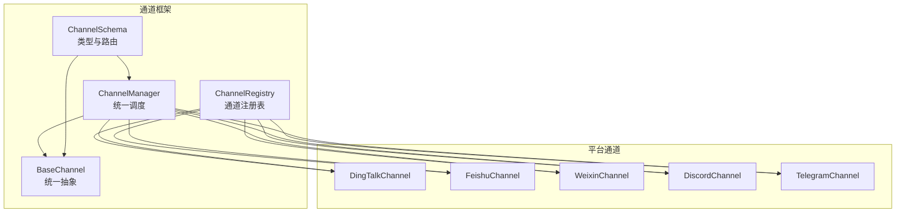
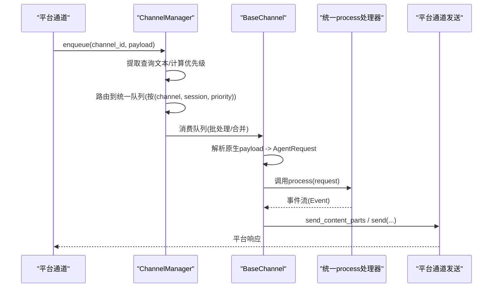
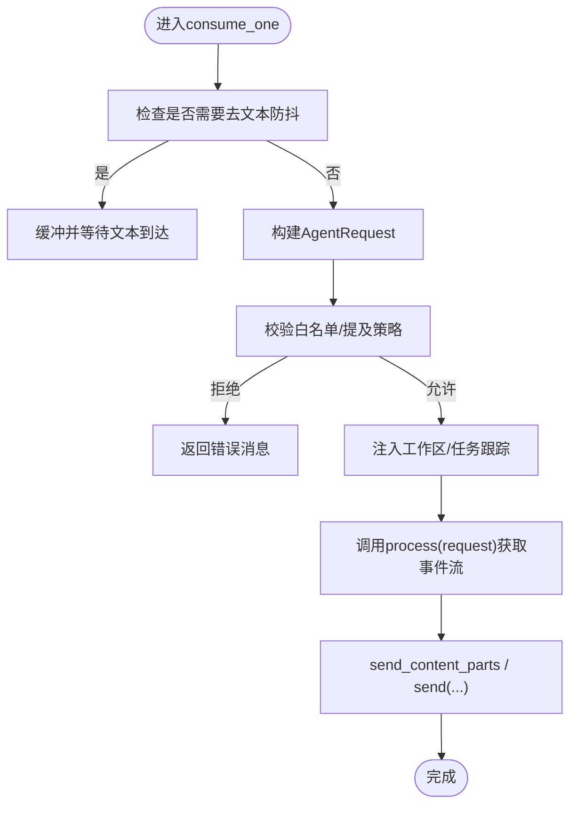
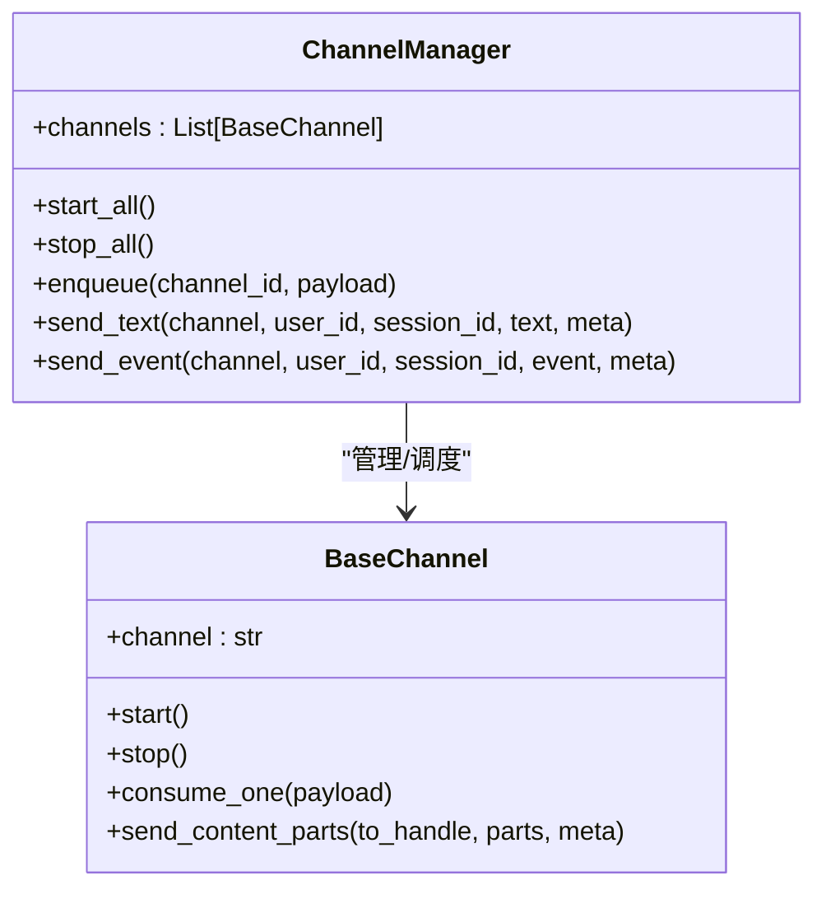
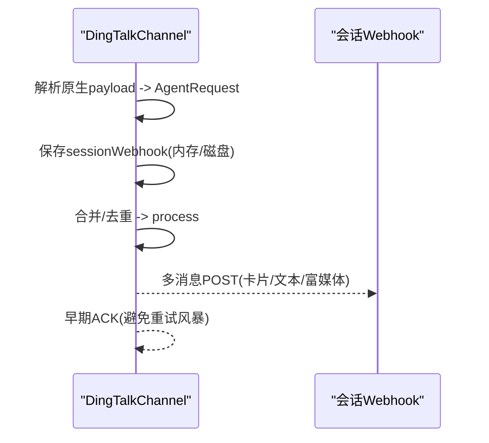
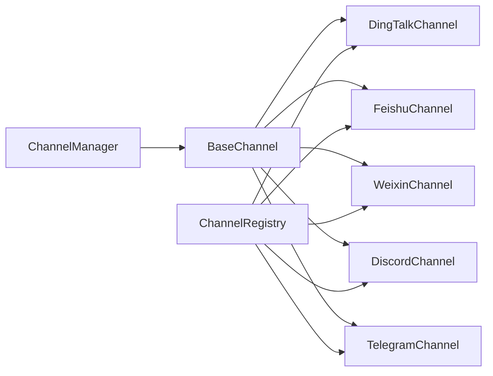
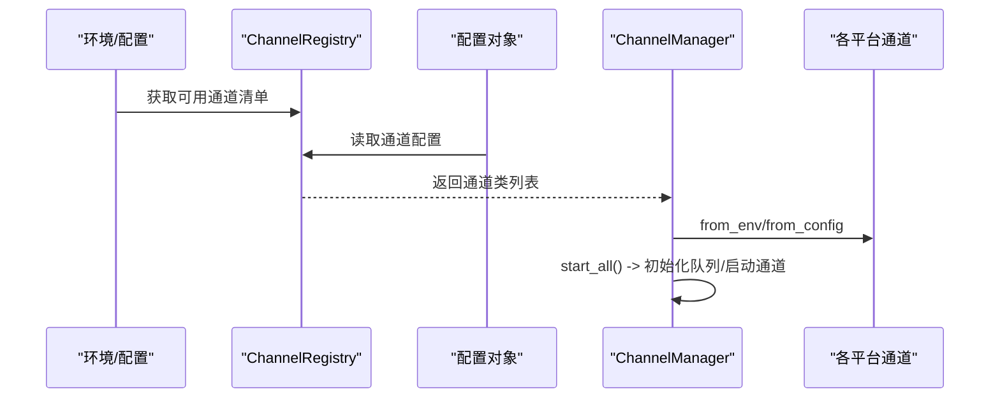

# 通道系统

<cite>
**本文引用的文件**
- [src\qwenpaw\app\channels\__init__.py](file://src\qwenpaw\app\channels\__init__.py)
- [src\qwenpaw\app\channels\base.py](file://src\qwenpaw\app\channels\base.py)
- [src\qwenpaw\app\channels\manager.py](file://src\qwenpaw\app\channels\manager.py)
- [src\qwenpaw\app\channels\registry.py](file://src\qwenpaw\app\channels\registry.py)
- [src\qwenpaw\app\channels\schema.py](file://src\qwenpaw\app\channels\schema.py)
- [src\qwenpaw\app\channels\dingtalk\channel.py](file://src\qwenpaw\app\channels\dingtalk\channel.py)
- [src\qwenpaw\app\channels\feishu\channel.py](file://src\qwenpaw\app\channels\feishu\channel.py)
- [src\qwenpaw\app\channels\weixin\channel.py](file://src\qwenpaw\app\channels\weixin\channel.py)
- [src\qwenpaw\app\channels\discord_\channel.py](file://src\qwenpaw\app\channels\discord_\channel.py)
- [src\qwenpaw\app\channels\telegram\channel.py](file://src\qwenpaw\app\channels\telegram\channel.py)
</cite>

## 目录
1. [引言](#引言)
2. [项目结构](#项目结构)
3. [核心组件](#核心组件)
4. [架构总览](#架构总览)
5. [详细组件分析](#详细组件分析)
6. [依赖分析](#依赖分析)
7. [性能考量](#性能考量)
8. [故障排查指南](#故障排查指南)
9. [结论](#结论)
10. [附录](#附录)

## 引言
本文件面向QwenPaw通道系统，系统性阐述通道架构设计、消息路由机制与平台集成策略，覆盖钉钉、飞书、微信、Discord、Telegram等即时通讯平台的集成实现与配置方法；解释消息处理流程、内容转换与格式适配；给出通道注册、认证配置、消息监听与响应发送的完整流程；并提供新平台集成的开发指南与最佳实践，以及各平台功能差异、限制与兼容性考虑。

## 项目结构
通道系统位于src/qwenpaw/app/channels目录下，采用“基类统一抽象 + 多平台具体实现 + 注册表管理 + 统一队列调度”的分层架构：
- 基类与协议：定义统一的消息模型、渲染器、会话解析与发送接口
- 平台通道：各平台独立模块，负责接入SDK或HTTP API、解析原生消息、构建AgentRequest、发送响应
- 管理器：统一启动/停止、队列调度、批量合并、优先级控制
- 注册表：内置通道清单与自定义通道发现
- Schema：通道类型标识与路由协议

图表来源
- [src\qwenpaw\app\channels\base.py](file://src\qwenpaw\app\channels\base.py)
- [src\qwenpaw\app\channels\manager.py](file://src\qwenpaw\app\channels\manager.py)
- [src\qwenpaw\app\channels\registry.py](file://src\qwenpaw\app\channels\registry.py)
- [src\qwenpaw\app\channels\schema.py](file://src\qwenpaw\app\channels\schema.py)

章节来源
- [src\qwenpaw\app\channels\__init__.py](file://src\qwenpaw\app\channels\__init__.py)
- [src\qwenpaw\app\channels\registry.py](file://src\qwenpaw\app\channels\registry.py)
- [src\qwenpaw\app\channels\schema.py](file://src\qwenpaw\app\channels\schema.py)

## 核心组件
- BaseChannel：统一抽象所有通道的输入输出、会话解析、内容合并、去重与事件流处理，提供从原生payload到AgentRequest的转换能力，并通过渲染器控制输出格式
- ChannelManager：统一生命周期管理、队列与批处理、优先级调度、工作区注入、事件派发回调
- ChannelRegistry：内置通道清单与自定义通道扫描，按可用性筛选启用
- ChannelSchema：通道类型标识、路由地址模型与消息转换协议

章节来源
- [src\qwenpaw\app\channels\base.py](file://src\qwenpaw\app\channels\base.py)
- [src\qwenpaw\app\channels\manager.py](file://src\qwenpaw\app\channels\manager.py)
- [src\qwenpaw\app\channels\registry.py](file://src\qwenpaw\app\channels\registry.py)
- [src\qwenpaw\app\channels\schema.py](file://src\qwenpaw\app\channels\schema.py)

## 架构总览
通道系统以ChannelManager为中心，通过统一队列与批处理逻辑，将来自不同平台的消息进行去重、合并与优先级排序后交由BaseChannel消费；BaseChannel再将原生消息转换为AgentRequest，经统一的process处理器生成事件流，最终通过各通道的send_*方法回写到对应平台。

图表来源
- [src\qwenpaw\app\channels\manager.py](file://src\qwenpaw\app\channels\manager.py)
- [src\qwenpaw\app\channels\base.py](file://src\qwenpaw\app\channels\base.py)

## 详细组件分析

### 基类与通用机制（BaseChannel）
- 输入输出与内容模型：统一使用运行时内容类型（文本、图片、视频、音频、文件、拒绝），并通过渲染器控制输出细节
- 会话解析：提供resolve_session_id默认策略（基于channel:sender_id），子类可覆盖以适配平台特性
- 批量合并：merge_native_items与merge_requests用于同会话多消息合并，减少重复请求
- 去重与防抖：基于message_id或时间窗口的去重，以及针对“无文本”消息的缓冲合并策略
- 控制命令：在CommandRegistry中识别控制命令，绕过任务跟踪直接响应
- 工作区集成：注入Workspace以支持任务跟踪、聊天管理与会话创建

图表来源
- [src\qwenpaw\app\channels\base.py](file://src\qwenpaw\app\channels\base.py)

章节来源
- [src\qwenpaw\app\channels\base.py](file://src\qwenpaw\app\channels\base.py)

### 通道管理器（ChannelManager）
- 启动/停止：统一初始化队列管理器、设置enqueue回调、启动各通道
- 队列与批处理：按(channel, session, priority)键入队，消费时整批拉取并合并
- 优先级：根据命令识别结果动态调整优先级，保障控制命令快速响应
- 工作区注入：向各通道注入Workspace与命令注册表
- 事件派发：提供send_event/send_text统一入口，按通道目标句柄发送

图表来源
- [src\qwenpaw\app\channels\manager.py](file://src\qwenpaw\app\channels\manager.py)
- [src\qwenpaw\app\channels\base.py](file://src\qwenpaw\app\channels\base.py)

章节来源
- [src\qwenpaw\app\channels\manager.py](file://src\qwenpaw\app\channels\manager.py)

### 通道注册表（ChannelRegistry）
- 内置通道清单：包含imessage、discord、dingtalk、feishu、qq、telegram、mattermost、mqtt、console、matrix、voice、wecom、xiaoyi、weixin、onebot等
- 自定义通道：扫描CUSTOM_CHANNELS_DIR，加载自定义通道类并注册
- 必需通道：console通道失败将抛出异常，确保最小可用性

章节来源
- [src\qwenpaw\app\channels\registry.py](file://src\qwenpaw\app\channels\registry.py)

### 通道类型与路由（ChannelSchema）
- ChannelType：通道类型字符串，支持插件通道自定义键
- ChannelAddress：统一路由模型(kind/id/extra)，替代分散的meta键
- 协议：ChannelMessageConverter定义native到AgentRequest的转换与发送协议

章节来源
- [src\qwenpaw\app\channels\schema.py](file://src\qwenpaw\app\channels\schema.py)

### 钉钉（DingTalk）通道
- 接入方式：Stream回调+会话Webhook；支持卡片与Markdown混合输出
- 会话与去重：基于conversation_id短ID；消息ID去重；支持sessionWebhook持久化
- 回复机制：单次回复或通过Webhook多条推送；支持早期ACK避免重试风暴
- 存储：卡片状态、媒体目录、会话Webhook映射（内存+磁盘）

图表来源
- [src\qwenpaw\app\channels\dingtalk\channel.py](file://src\qwenpaw\app\channels\dingtalk\channel.py)

章节来源
- [src\qwenpaw\app\channels\dingtalk\channel.py](file://src\qwenpaw\app\channels\dingtalk\channel.py)

### 飞书（Feishu）通道
- 接入方式：WebSocket长连接收事件，Open API发送消息；支持富文本、图片、文件、音视频
- 会话与去重：group会话使用chat_id短ID；p2p使用open_id；消息ID去重与过期清理
- 安全与兼容：pkg_resources兼容补丁；时钟偏移补偿；昵称缓存优化
- 交互式内容：支持富文本块拆分与拼接

章节来源
- [src\qwenpaw\app\channels\feishu\channel.py](file://src\qwenpaw\app\channels\feishu\channel.py)

### 微信（Weixin iLink Bot）通道
- 接入方式：HTTP API长轮询接收消息，HTTP API发送；支持文本、图片、语音（ASR）、文件、视频
- 认证：支持bot_token直连或二维码登录（持久化token文件）
- 会话与去重：私聊/群聊区分；context_token去重；typing指示器与上下文缓存
- 媒体下载：CDN加密资源解密下载至本地媒体目录

章节来源
- [src\qwenpaw\app\channels\weixin\channel.py](file://src\qwenpaw\app\channels\weixin\channel.py)

### Discord 通道
- 接入方式：discord.py客户端，带消息内容意图；支持文本、图片、视频、音频、文件
- 会话与去重：基于message_id去重；支持提及检测与白名单策略
- 发送策略：文本自动分片（保留代码块闭合）、媒体作为附件上传
- 目标解析：支持按channel_id或user_id解析目标DM

章节来源
- [src\qwenpaw\app\channels\discord_\channel.py](file://src\qwenpaw\app\channels\discord_\channel.py)

### Telegram 通道
- 接入方式：python-telegram-bot Application轮询；支持文本、图片、视频、音频、文件
- 会话与去重：基于chat_id；媒体仅消息触发立即处理；typing指示循环
- 发送策略：HTML转义与降级、超长文本分片、文件大小限制与错误分类处理
- 目标解析：chat_id或thread_id

章节来源
- [src\qwenpaw\app\channels\telegram\channel.py](file://src\qwenpaw\app\channels\telegram\channel.py)

## 依赖分析
- 低耦合高内聚：各平台通道继承BaseChannel，共享统一的输入输出协议与队列调度
- 可扩展性：通过ChannelRegistry发现自定义通道，无需修改核心框架
- 外部依赖：各平台SDK/HTTP库按需引入，避免CLI启动阻塞

图表来源
- [src\qwenpaw\app\channels\base.py](file://src\qwenpaw\app\channels\base.py)
- [src\qwenpaw\app\channels\manager.py](file://src\qwenpaw\app\channels\manager.py)
- [src\qwenpaw\app\channels\registry.py](file://src\qwenpaw\app\channels\registry.py)

章节来源
- [src\qwenpaw\app\channels\registry.py](file://src\qwenpaw\app\channels\registry.py)
- [src\qwenpaw\app\channels\manager.py](file://src\qwenpaw\app\channels\manager.py)

## 性能考量
- 队列与批处理：统一队列按会话聚合，减少平台API调用次数
- 去重与防抖：消息ID去重与“无文本”缓冲，降低无效请求与重复渲染
- 分片与限流：Discord/Telegram文本分片与错误分类处理，提升稳定性
- 任务跟踪：工作区注入支持取消与并发控制，避免资源泄漏

## 故障排查指南
- 通道未启动：检查ChannelRegistry可用性与环境变量；确认required通道（如console）可用
- 消息未达：核对ChannelManager队列状态与超时日志；检查CommandRegistry优先级判定
- 平台鉴权失败：核对各平台token/密钥配置；关注平台401刷新与重试策略
- 媒体发送失败：检查文件大小限制、URL有效性与网络代理；查看平台错误码与降级路径
- 会话错乱：确认resolve_session_id实现与会话键一致性；避免跨实例事件混流

章节来源
- [src\qwenpaw\app\channels\manager.py](file://src\qwenpaw\app\channels\manager.py)
- [src\qwenpaw\app\channels\dingtalk\channel.py](file://src\qwenpaw\app\channels\dingtalk\channel.py)
- [src\qwenpaw\app\channels\feishu\channel.py](file://src\qwenpaw\app\channels\feishu\channel.py)
- [src\qwenpaw\app\channels\weixin\channel.py](file://src\qwenpaw\app\channels\weixin\channel.py)
- [src\qwenpaw\app\channels\discord_\channel.py](file://src\qwenpaw\app\channels\discord_\channel.py)
- [src\qwenpaw\app\channels\telegram\channel.py](file://src\qwenpaw\app\channels\telegram\channel.py)

## 结论
QwenPaw通道系统通过统一抽象与调度，实现了多平台消息的标准化接入与高效处理。平台通道遵循统一协议，具备良好的可扩展性与稳定性；管理器提供批处理、优先级与工作区集成，满足复杂场景需求。建议在新增平台时遵循现有模式，最小化侵入式改动，充分利用BaseChannel与ChannelManager的能力。

## 附录

### 通道注册与启动流程

图表来源
- [src\qwenpaw\app\channels\registry.py](file://src\qwenpaw\app\channels\registry.py)
- [src\qwenpaw\app\channels\manager.py](file://src\qwenpaw\app\channels\manager.py)

### 配置要点与最佳实践
- 通道开关：通过enabled字段与环境变量控制启用
- 白名单与策略：dm_policy/group_policy/require_mention/allow_from/deny_message
- 输出控制：show_tool_details/filter_tool_messages/filter_thinking
- 平台特有：token/密钥/域名/媒体目录/代理等参数按平台通道配置类设置
- 新平台开发：继承BaseChannel，实现from_env/from_config/build_agent_request_from_native/send_content_parts，注册到ChannelRegistry

章节来源
- [src\qwenpaw\app\channels\base.py](file://src\qwenpaw\app\channels\base.py)
- [src\qwenpaw\app\channels\registry.py](file://src\qwenpaw\app\channels\registry.py)
- [src\qwenpaw\app\channels\dingtalk\channel.py](file://src\qwenpaw\app\channels\dingtalk\channel.py)
- [src\qwenpaw\app\channels\feishu\channel.py](file://src\qwenpaw\app\channels\feishu\channel.py)
- [src\qwenpaw\app\channels\weixin\channel.py](file://src\qwenpaw\app\channels\weixin\channel.py)
- [src\qwenpaw\app\channels\discord_\channel.py](file://src\qwenpaw\app\channels\discord_\channel.py)
- [src\qwenpaw\app\channels\telegram\channel.py](file://src\qwenpaw\app\channels\telegram\channel.py)