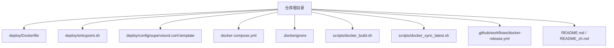
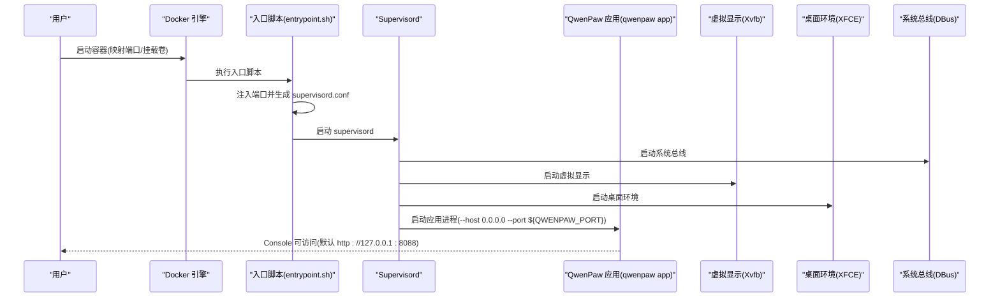
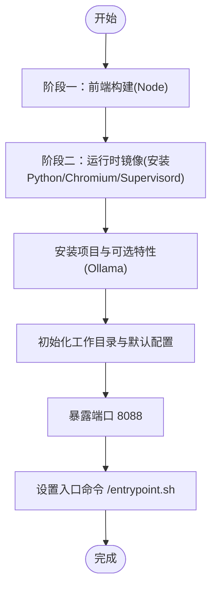
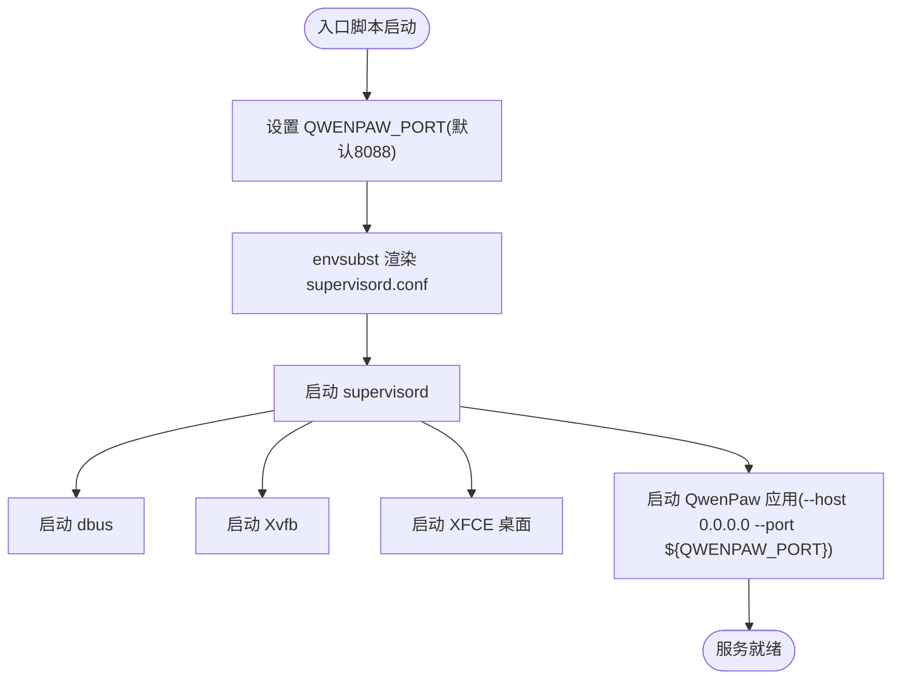
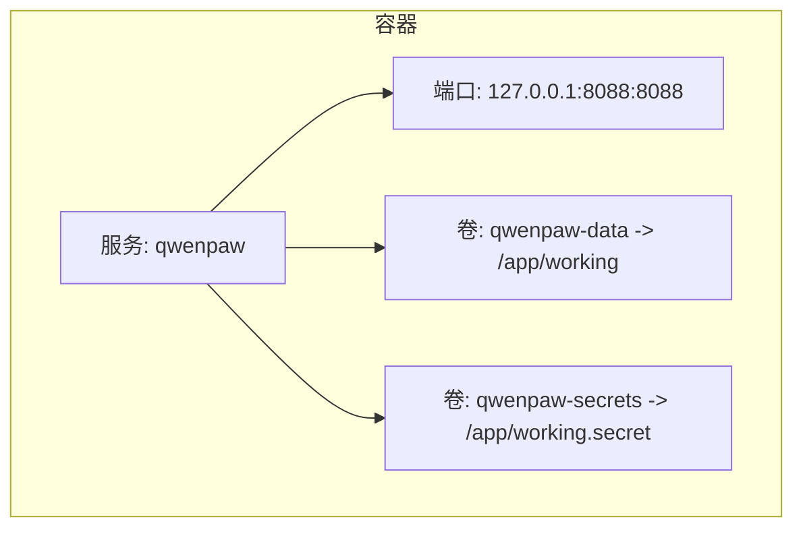
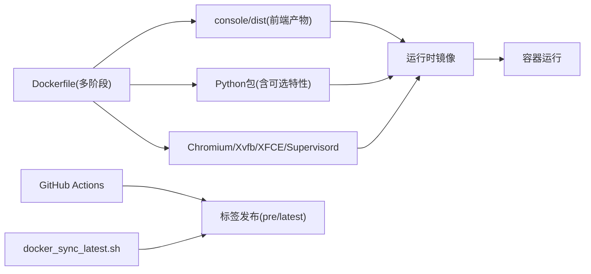

# Docker部署

<cite>
**本文引用的文件**
- [deploy/Dockerfile](file://deploy/Dockerfile)
- [docker-compose.yml](file://docker-compose.yml)
- [deploy/entrypoint.sh](file://deploy/entrypoint.sh)
- [deploy/config/supervisord.conf.template](file://deploy/config/supervisord.conf.template)
- [.dockerignore](file://.dockerignore)
- [scripts/docker_build.sh](file://scripts/docker_build.sh)
- [scripts/README.md](file://scripts/README.md)
- [scripts/docker_sync_latest.sh](file://scripts/docker_sync_latest.sh)
- [.github/workflows/docker-release.yml](file://.github/workflows/docker-release.yml)
- [README.md](file://README.md)
- [README_zh.md](file://README_zh.md)
- [website/public/docs/security.en.md](file://website/public/docs/security.en.md)
- [website/public/docs/config.en.md](file://website/public/docs/config.en.md)
- [src/qwenpaw/envs/store.py](file://src/qwenpaw/envs/store.py)
- [src/qwenpaw/agents/skills_manager.py](file://src/qwenpaw/agents/skills_manager.py)
</cite>

## 目录
1. [简介](#简介)
2. [项目结构](#项目结构)
3. [核心组件](#核心组件)
4. [架构总览](#架构总览)
5. [组件详解](#组件详解)
6. [依赖关系分析](#依赖关系分析)
7. [性能与镜像优化](#性能与镜像优化)
8. [监控与日志管理](#监控与日志管理)
9. [故障排查指南](#故障排查指南)
10. [结论](#结论)
11. [附录](#附录)

## 简介
本文件面向运维与开发人员，系统性阐述 QwenPaw 的 Docker 部署方案，覆盖镜像构建流程、容器配置与启动机制、docker-compose 参数、网络与数据持久化策略、安全加固要点，以及生产级最佳实践与排障方法。读者可据此在本地或云环境中稳定、安全地运行 QwenPaw。

## 项目结构
与 Docker 部署直接相关的目录与文件如下：
- 构建与运行
  - deploy/Dockerfile：多阶段构建，前端构建与后端打包一体化
  - deploy/entrypoint.sh：容器入口脚本，动态注入端口并启动 supervisord
  - deploy/config/supervisord.conf.template：Supervisord 进程模板，统一管理应用、虚拟显示与桌面环境
  - docker-compose.yml：服务编排示例，含卷与端口映射
  - .dockerignore：排除无关文件，减少镜像体积
  - scripts/docker_build.sh：一键构建脚本，支持通道过滤与额外参数透传
  - scripts/docker_sync_latest.sh：将 pre 标签同步为 latest 的自动化脚本
  - .github/workflows/docker-release.yml：CI 多架构构建与标签推送
  - README.md / README_zh.md：官方文档中的 Docker 部署说明与网络连接建议

图示来源
- [deploy/Dockerfile:1-103](file://deploy/Dockerfile#L1-L103)
- [deploy/entrypoint.sh:1-10](file://deploy/entrypoint.sh#L1-L10)
- [deploy/config/supervisord.conf.template:1-40](file://deploy/config/supervisord.conf.template#L1-L40)
- [docker-compose.yml:1-23](file://docker-compose.yml#L1-L23)
- [.dockerignore:1-59](file://.dockerignore#L1-L59)
- [scripts/docker_build.sh:1-32](file://scripts/docker_build.sh#L1-L32)
- [scripts/docker_sync_latest.sh:1-76](file://scripts/docker_sync_latest.sh#L1-L76)
- [.github/workflows/docker-release.yml:74-88](file://.github/workflows/docker-release.yml#L74-L88)
- [README.md:230-272](file://README.md#L230-L272)
- [README_zh.md:246-384](file://README_zh.md#L246-L384)

章节来源
- [deploy/Dockerfile:1-103](file://deploy/Dockerfile#L1-L103)
- [docker-compose.yml:1-23](file://docker-compose.yml#L1-L23)
- [.dockerignore:1-59](file://.dockerignore#L1-L59)
- [scripts/docker_build.sh:1-32](file://scripts/docker_build.sh#L1-L32)
- [scripts/docker_sync_latest.sh:1-76](file://scripts/docker_sync_latest.sh#L1-L76)
- [.github/workflows/docker-release.yml:74-88](file://.github/workflows/docker-release.yml#L74-L88)
- [README.md:230-272](file://README.md#L230-L272)
- [README_zh.md:246-384](file://README_zh.md#L246-L384)

## 核心组件
- 多阶段 Dockerfile
  - 阶段一：前端构建（console）并产出静态资源
  - 阶段二：运行时镜像（Node、Python、Chromium、Supervisord 等），安装应用并初始化工作目录
- 入口脚本与进程管理
  - entrypoint.sh：根据环境变量替换 supervisord 模板，生成最终配置并启动 supervisord
  - supervisord.conf.template：统一管理 dbus、Xvfb、XFCE 桌面与应用进程，确保无头图形环境可用
- 数据与配置持久化
  - 通过命名卷 qwenpaw-data 与 qwenpaw-secrets 分离工作目录与敏感配置，实现跨重启持久化
- 网络与访问控制
  - 默认仅监听 127.0.0.1:8088，避免外网直连；支持通过环境变量启用 Web 登录认证
- 安全与合规
  - 提供工具守卫、文件守卫与技能扫描等安全能力；支持通过环境变量启用登录认证

章节来源
- [deploy/Dockerfile:1-103](file://deploy/Dockerfile#L1-L103)
- [deploy/entrypoint.sh:1-10](file://deploy/entrypoint.sh#L1-L10)
- [deploy/config/supervisord.conf.template:1-40](file://deploy/config/supervisord.conf.template#L1-L40)
- [docker-compose.yml:1-23](file://docker-compose.yml#L1-L23)
- [README.md:230-272](file://README.md#L230-L272)
- [website/public/docs/security.en.md:565-687](file://website/public/docs/security.en.md#L565-L687)

## 架构总览
下图展示容器启动到服务可用的关键流程与组件交互：

图示来源
- [deploy/entrypoint.sh:1-10](file://deploy/entrypoint.sh#L1-L10)
- [deploy/config/supervisord.conf.template:1-40](file://deploy/config/supervisord.conf.template#L1-L40)
- [deploy/Dockerfile:94-102](file://deploy/Dockerfile#L94-L102)

## 组件详解

### Dockerfile 多阶段构建
- 阶段一：前端构建
  - 基于 Node 运行时镜像，复制 console 并执行安装与构建，输出静态资源
- 阶段二：运行时镜像
  - 安装 Python、pip、venv、build-essential、supervisord、vim、gettext、Chromium 及其依赖
  - 配置无沙箱模式以适配容器环境，并设置 PLAYWRIGHT_* 环境变量
  - 创建 Python 虚拟环境，安装项目与可选特性（如 Ollama）
  - 初始化工作目录与默认配置，暴露 8088 端口，设置入口命令为 /entrypoint.sh

图示来源
- [deploy/Dockerfile:1-103](file://deploy/Dockerfile#L1-L103)

章节来源
- [deploy/Dockerfile:1-103](file://deploy/Dockerfile#L1-L103)

### 入口脚本与进程管理
- 入口脚本职责
  - 设置默认端口（未指定则使用 8088），通过 envsubst 将端口注入 supervisord 模板
  - 生成最终配置并启动 supervisord
- Supervisord 管理的进程
  - dbus：系统总线
  - xvfb：虚拟显示，用于无头图形渲染
  - xfce：桌面环境，配合显示与窗口管理
  - app：QwenPaw 应用，监听 0.0.0.0，端口来自环境变量

图示来源
- [deploy/entrypoint.sh:1-10](file://deploy/entrypoint.sh#L1-L10)
- [deploy/config/supervisord.conf.template:1-40](file://deploy/config/supervisord.conf.template#L1-L40)

章节来源
- [deploy/entrypoint.sh:1-10](file://deploy/entrypoint.sh#L1-L10)
- [deploy/config/supervisord.conf.template:1-40](file://deploy/config/supervisord.conf.template#L1-L40)

### docker-compose 编排
- 服务名称与镜像
  - 服务名为 qwenpaw，镜像为 agentscope/qwenpaw:latest
- 重启策略
  - restart: always，异常退出自动重启
- 端口映射
  - 仅映射到 127.0.0.1:8088:8088，避免外网直连
- 卷挂载
  - qwenpaw-data -> /app/working（持久化配置、记忆、技能等）
  - qwenpaw-secrets -> /app/working.secret（持久化 providers.json 与 envs.json）
- 环境变量
  - 可选启用 Web 登录认证（QWENPAW_AUTH_ENABLED、QWENPAW_AUTH_USERNAME、QWENPAW_AUTH_PASSWORD）

图示来源
- [docker-compose.yml:1-23](file://docker-compose.yml#L1-L23)

章节来源
- [docker-compose.yml:1-23](file://docker-compose.yml#L1-L23)

### 网络配置与访问控制
- 默认监听
  - 应用监听 0.0.0.0，但 docker-compose 仅将端口映射到 127.0.0.1，避免外网直连
- 主机网络访问
  - 若容器内需要访问宿主机服务（如 Ollama/LM Studio），可采用两种方式：
    - 显式主机绑定：通过 --add-host=host.docker.internal:host-gateway，容器内使用 http://host.docker.internal:<port>
    - Linux 主机网络：--network=host，容器共享宿主机网络（不推荐用于生产）
- Web 登录认证
  - 通过设置 QWENPAW_AUTH_ENABLED=true 启用；可预设管理员账号以实现自动化部署

章节来源
- [README.md:246-271](file://README.md#L246-L271)
- [README_zh.md:246-384](file://README_zh.md#L246-L384)
- [website/public/docs/security.en.md:565-687](file://website/public/docs/security.en.md#L565-L687)

### 数据持久化与目录结构
- 工作目录与敏感目录
  - 工作目录：/app/working（默认卷 qwenpaw-data）
  - 敏感目录：/app/working.secret（默认卷 qwenpaw-secrets）
- 目录内容
  - config.json：全局配置
  - workspaces/default/：默认智能体工作区（agent.json、chats.json、jobs.json、skills/、memory/ 等）
  - skill_pool/：本地共享技能池
  - providers.json：模型提供商配置与 API Key
  - envs.json：环境变量持久化
- 环境变量
  - QWENPAW_WORKING_DIR、QWENPAW_SECRET_DIR 等可自定义路径

章节来源
- [website/public/docs/config.en.md:16-47](file://website/public/docs/config.en.md#L16-L47)
- [src/qwenpaw/envs/store.py:223-262](file://src/qwenpaw/envs/store.py#L223-L262)

### 环境变量与配置注入
- 端口与通道过滤
  - QWENPAW_PORT：应用端口（默认 8088）
  - QWENPAW_DISABLED_CHANNELS / QWENPAW_ENABLED_CHANNELS：渠道白名单/黑名单（构建期注入）
- 安全与认证
  - QWENPAW_AUTH_ENABLED、QWENPAW_AUTH_USERNAME、QWENPAW_AUTH_PASSWORD：启用并预设管理员
- 技能与环境变量
  - 技能配置可基于 require_envs 将特定键注入为环境变量，缺失时记录告警
  - Console 环境变量管理：支持列出、设置、删除与加载到进程环境

章节来源
- [deploy/Dockerfile:14-25](file://deploy/Dockerfile#L14-L25)
- [deploy/entrypoint.sh:5-8](file://deploy/entrypoint.sh#L5-L8)
- [src/qwenpaw/agents/skills_manager.py:590-631](file://src/qwenpaw/agents/skills_manager.py#L590-L631)
- [src/qwenpaw/envs/store.py:223-262](file://src/qwenpaw/envs/store.py#L223-L262)

## 依赖关系分析
- 构建期依赖
  - console 前端构建产物被复制进运行时镜像，避免提交 dist 目录
  - Python 包安装包含可选特性（如 Ollama），由构建参数控制
- 运行期依赖
  - Chromium 与 Xvfb/XFCE 组合提供无头图形能力
  - Supervisord 统一管理多个进程生命周期
- CI/CD 依赖
  - GitHub Actions 使用 buildx 多架构构建并推送标签
  - docker-sync-latest 脚本将 pre 标签同步为 latest

图示来源
- [deploy/Dockerfile:1-103](file://deploy/Dockerfile#L1-L103)
- [.github/workflows/docker-release.yml:74-88](file://.github/workflows/docker-release.yml#L74-L88)
- [scripts/docker_sync_latest.sh:1-76](file://scripts/docker_sync_latest.sh#L1-L76)

章节来源
- [deploy/Dockerfile:1-103](file://deploy/Dockerfile#L1-L103)
- [.github/workflows/docker-release.yml:74-88](file://.github/workflows/docker-release.yml#L74-L88)
- [scripts/docker_sync_latest.sh:1-76](file://scripts/docker_sync_latest.sh#L1-L76)

## 性能与镜像优化
- 多阶段构建
  - 将前端构建与后端打包分离，减少最终镜像体积
- 层缓存与清理
  - apt 包安装后清理缓存与索引，降低体积
  - .dockerignore 排除测试、IDE、构建中间件与非必要文件
- 构建参数
  - 通过 QWENPAW_DISABLED_CHANNELS / QWENPAW_ENABLED_CHANNELS 控制渠道集合，按需裁剪
- 多架构与分发
  - 使用 buildx 构建 amd64/arm64 并推送至 ACR 与 Docker Hub
  - 通过 imagetools 将 pre 标签同步为 latest，简化版本管理

章节来源
- [deploy/Dockerfile:27-68](file://deploy/Dockerfile#L27-L68)
- [.dockerignore:1-59](file://.dockerignore#L1-L59)
- [scripts/docker_build.sh:7-10](file://scripts/docker_build.sh#L7-L10)
- [.github/workflows/docker-release.yml:74-88](file://.github/workflows/docker-release.yml#L74-L88)
- [scripts/docker_sync_latest.sh:60-76](file://scripts/docker_sync_latest.sh#L60-L76)

## 监控与日志管理
- 日志位置
  - supervisord 与各子进程的标准输出/错误日志位于 /var/log 下（由模板配置）
- 查看方式
  - docker logs -f <container> 或进入容器查看 /var/log 目录
- 建议
  - 在生产环境接入集中式日志收集（如 Fluent Bit/Fluentd/Elastic Stack）以采集 /var/log 下的日志
  - 结合容器健康检查与重启策略，确保服务高可用

章节来源
- [deploy/config/supervisord.conf.template:1-40](file://deploy/config/supervisord.conf.template#L1-L40)

## 故障排查指南
- 无法访问 Console
  - 检查端口映射是否正确（仅 127.0.0.1:8088），确认防火墙与安全组未拦截
  - 如需外网访问，评估安全风险并谨慎开放
- 容器内访问宿主机服务失败
  - 使用 --add-host=host.docker.internal:host-gateway，并在 Console 模型设置中将 Base URL 指向 host.docker.internal:<port>
  - Linux 可考虑 --network=host，但需注意端口冲突
- Web 登录认证问题
  - 确认已设置 QWENPAW_AUTH_ENABLED=true
  - 若使用预设管理员，确保同时设置了用户名与密码
  - 忘记密码可通过 CLI 重置
- 渠道不可用
  - 检查构建参数是否将对应渠道加入黑名单（QWENPAW_DISABLED_CHANNELS）
  - 或在构建时通过 QWENPAW_ENABLED_CHANNELS 指定白名单
- 图形相关报错
  - 确认容器内已安装并启用 Chromium、Xvfb 与 XFCE；入口脚本已正确渲染 supervisord 配置

章节来源
- [README.md:246-271](file://README.md#L246-L271)
- [README_zh.md:246-384](file://README_zh.md#L246-L384)
- [website/public/docs/security.en.md:565-687](file://website/public/docs/security.en.md#L565-L687)
- [deploy/Dockerfile:20-25](file://deploy/Dockerfile#L20-L25)
- [deploy/entrypoint.sh:5-8](file://deploy/entrypoint.sh#L5-L8)
- [deploy/config/supervisord.conf.template:23-39](file://deploy/config/supervisord.conf.template#L23-L39)

## 结论
通过多阶段 Dockerfile、Supervisord 统一进程管理、命名卷持久化与严格的网络隔离，QwenPaw 在容器环境中实现了稳定、可维护且易于扩展的部署方案。结合官方文档的安全与配置指引，可在生产环境中进一步强化访问控制与日志审计，确保系统安全与可观测性。

## 附录

### docker-compose.yml 参数速查
- 版本：使用 3.8
- 服务
  - image：agentscope/qwenpaw:latest
  - container_name：qwenpaw
  - restart：always
  - ports：127.0.0.1:8088:8088（仅本机访问）
  - volumes：
    - qwenpaw-data -> /app/working
    - qwenpaw-secrets -> /app/working.secret
  - environment（可选）：
    - QWENPAW_AUTH_ENABLED=true
    - QWENPAW_AUTH_USERNAME=admin
    - QWENPAW_AUTH_PASSWORD=yourpassword

章节来源
- [docker-compose.yml:1-23](file://docker-compose.yml#L1-L23)

### 构建与发布脚本
- 一键构建
  - 脚本：scripts/docker_build.sh
  - 功能：支持通道过滤与额外 docker build 参数透传
- 标签同步
  - 脚本：scripts/docker_sync_latest.sh
  - 功能：将 pre 标签同步为 latest
- CI 发布
  - 工作流：.github/workflows/docker-release.yml
  - 功能：多架构构建并推送版本与 pre 标签

章节来源
- [scripts/docker_build.sh:1-32](file://scripts/docker_build.sh#L1-L32)
- [scripts/docker_sync_latest.sh:1-76](file://scripts/docker_sync_latest.sh#L1-L76)
- [.github/workflows/docker-release.yml:74-88](file://.github/workflows/docker-release.yml#L74-L88)