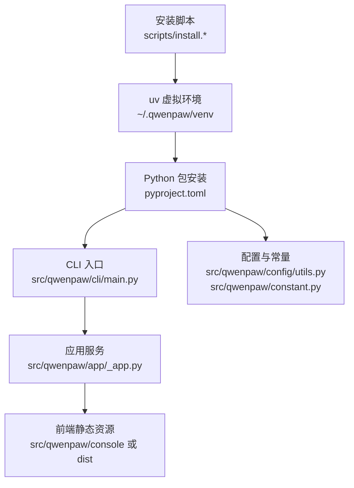
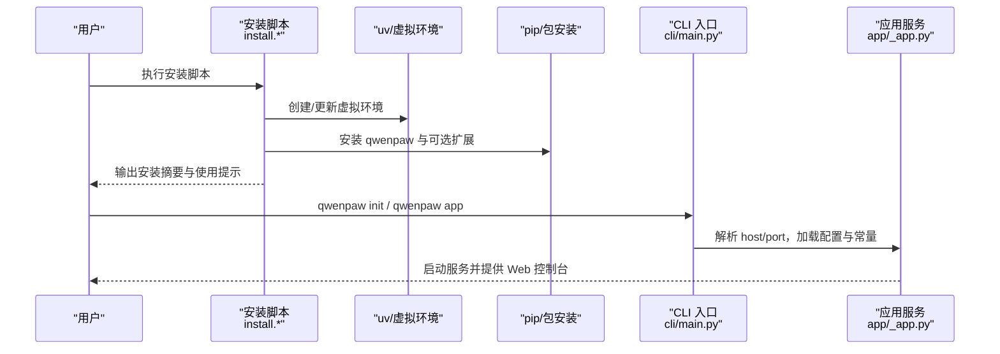
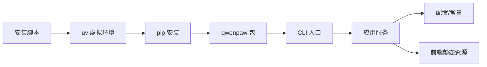

# 本地部署

<cite>
**本文引用的文件**
- [README.md](file://README.md)
- [scripts/README.md](file://scripts/README.md)
- [scripts/install.sh](file://scripts/install.sh)
- [scripts/install.ps1](file://scripts/install.ps1)
- [scripts/install.bat](file://scripts/install.bat)
- [pyproject.toml](file://pyproject.toml)
- [setup.py](file://setup.py)
- [deploy/Dockerfile](file://deploy/Dockerfile)
- [deploy/entrypoint.sh](file://deploy/entrypoint.sh)
- [src/qwenpaw/__version__.py](file://src/qwenpaw/__version__.py)
- [src/qwenpaw/cli/main.py](file://src/qwenpaw/cli/main.py)
- [src/qwenpaw/app/_app.py](file://src/qwenpaw/app/_app.py)
- [src/qwenpaw/constant.py](file://src/qwenpaw/constant.py)
- [src/qwenpaw/config/utils.py](file://src/qwenpaw/config/utils.py)
</cite>

## 目录
1. [简介](#简介)
2. [项目结构](#项目结构)
3. [核心组件](#核心组件)
4. [架构总览](#架构总览)
5. [详细组件分析](#详细组件分析)
6. [依赖分析](#依赖分析)
7. [性能考虑](#性能考虑)
8. [故障排查指南](#故障排查指南)
9. [结论](#结论)
10. [附录](#附录)

## 简介
本文件面向希望在本地或私有环境中部署与运行 QwenPaw 的用户，提供从 Python 环境准备、依赖安装、项目配置到本地开发服务器启动、端口与调试设置、性能优化、资源限制、安全与访问控制、以及常见问题排查的完整指南。内容覆盖 Windows、Linux 和 macOS 平台，并结合仓库内安装脚本与配置模块，帮助你以最小步骤完成部署。

## 项目结构
- 顶层提供多平台安装脚本与构建脚本，便于自动化安装与打包。
- Python 包通过 setuptools 构建，声明了运行时依赖与可选扩展。
- 应用入口由 CLI 提供，FastAPI 作为后端服务框架，支持前端静态资源托管与代理路由。
- 配置与常量模块集中管理工作目录、日志级别、CORS、LLM 限流等运行期参数。

图示来源
- [scripts/install.sh:1-340](file://scripts/install.sh#L1-L340)
- [scripts/install.ps1:1-477](file://scripts/install.ps1#L1-L477)
- [scripts/install.bat:1-557](file://scripts/install.bat#L1-L557)
- [pyproject.toml:1-111](file://pyproject.toml#L1-L111)
- [src/qwenpaw/cli/main.py:1-171](file://src/qwenpaw/cli/main.py#L1-L171)
- [src/qwenpaw/app/_app.py:1-569](file://src/qwenpaw/app/_app.py#L1-L569)
- [src/qwenpaw/constant.py:1-307](file://src/qwenpaw/constant.py#L1-L307)
- [src/qwenpaw/config/utils.py:1-673](file://src/qwenpaw/config/utils.py#L1-L673)

章节来源
- [README.md:104-186](file://README.md#L104-L186)
- [scripts/README.md:1-53](file://scripts/README.md#L1-L53)

## 核心组件
- 安装与环境管理
  - 自动检测并安装 uv，创建隔离 Python 虚拟环境，安装主包与可选扩展。
  - 支持从 PyPI 安装或从源码安装（含前端构建）。
- CLI 与应用服务
  - CLI 提供 app、init、channels、daemon 等子命令；默认监听 127.0.0.1:8088。
  - 应用服务基于 FastAPI，内置 CORS、认证中间件、多代理路由与前端静态资源托管。
- 配置与常量
  - 工作目录、密钥目录、日志级别、CORS、LLM 限流、容器运行标记等通过环境变量与常量模块统一管理。
- 可选扩展
  - 本地模型（llama.cpp、Ollama、Whisper）、桌面应用、Docker 镜像等。

章节来源
- [scripts/install.sh:104-245](file://scripts/install.sh#L104-L245)
- [scripts/install.ps1:193-325](file://scripts/install.ps1#L193-L325)
- [scripts/install.bat:306-459](file://scripts/install.bat#L306-L459)
- [src/qwenpaw/cli/main.py:146-171](file://src/qwenpaw/cli/main.py#L146-L171)
- [src/qwenpaw/app/_app.py:424-569](file://src/qwenpaw/app/_app.py#L424-L569)
- [src/qwenpaw/constant.py:1-307](file://src/qwenpaw/constant.py#L1-L307)
- [pyproject.toml:75-103](file://pyproject.toml#L75-L103)

## 架构总览
下图展示从安装脚本到应用启动的关键流程与组件交互：

图示来源
- [scripts/install.sh:104-245](file://scripts/install.sh#L104-L245)
- [scripts/install.ps1:193-325](file://scripts/install.ps1#L193-L325)
- [scripts/install.bat:306-459](file://scripts/install.bat#L306-L459)
- [src/qwenpaw/cli/main.py:146-171](file://src/qwenpaw/cli/main.py#L146-L171)
- [src/qwenpaw/app/_app.py:424-569](file://src/qwenpaw/app/_app.py#L424-L569)

## 详细组件分析

### 安装脚本与平台支持
- Linux/macOS
  - 自动选择 PyPI 源（国内镜像或官方源），创建 uv 管理的 Python 3.12 虚拟环境，安装主包与可选扩展。
  - 若未找到 npm，则跳过前端构建；可通过手动安装 Node.js 后重新运行安装脚本启用 Web UI。
- Windows
  - 支持 PowerShell 与 CMD 两种方式；优先从 astral.sh 获取 uv，若不可达则回退到 GitHub Releases。
  - 自动更新用户级 PATH，必要时提示手动配置。
- 可选参数
  - 指定版本、从源码安装、附加可选扩展（如 llamacpp、mlx、ollama、whisper）。

章节来源
- [scripts/install.sh:33-43](file://scripts/install.sh#L33-L43)
- [scripts/install.sh:57-93](file://scripts/install.sh#L57-L93)
- [scripts/install.sh:104-132](file://scripts/install.sh#L104-L132)
- [scripts/install.sh:136-147](file://scripts/install.sh#L136-L147)
- [scripts/install.sh:149-241](file://scripts/install.sh#L149-L241)
- [scripts/install.sh:256-277](file://scripts/install.sh#L256-L277)
- [scripts/install.sh:279-340](file://scripts/install.sh#L279-L340)
- [scripts/install.ps1:85-191](file://scripts/install.ps1#L85-L191)
- [scripts/install.ps1:193-221](file://scripts/install.ps1#L193-L221)
- [scripts/install.ps1:283-325](file://scripts/install.ps1#L283-L325)
- [scripts/install.ps1:333-374](file://scripts/install.ps1#L333-L374)
- [scripts/install.ps1:375-451](file://scripts/install.ps1#L375-L451)
- [scripts/install.bat:16-34](file://scripts/install.bat#L16-L34)
- [scripts/install.bat:305-330](file://scripts/install.bat#L305-L330)
- [scripts/install.bat:331-451](file://scripts/install.bat#L331-L451)
- [scripts/install.bat:469-503](file://scripts/install.bat#L469-L503)
- [scripts/install.bat:504-533](file://scripts/install.bat#L504-L533)

### Python 包与依赖
- 运行时依赖
  - 包含 HTTP 客户端、调度器、浏览器自动化、渠道 SDK、加密与密钥存储、YAML、ONNX 等。
- 可选依赖
  - local、llamacpp、mlx、ollama、whisper、full 等，按需启用。
- 构建与打包
  - 使用 setuptools 动态生成版本号，复制前端静态资源到包内，便于分发。

章节来源
- [pyproject.toml:6-46](file://pyproject.toml#L6-L46)
- [pyproject.toml:75-103](file://pyproject.toml#L75-L103)
- [setup.py:1-5](file://setup.py#L1-L5)
- [deploy/Dockerfile:88-89](file://deploy/Dockerfile#L88-L89)

### CLI 与应用服务
- CLI
  - 支持全局 host/port 参数，默认回退到上次记录值；最终默认 127.0.0.1:8088。
- 应用服务
  - FastAPI 应用，注册 API 路由、代理路由、语音通道路由与自定义通道路由。
  - 前端静态资源托管与 SPA 回退，支持自定义静态目录。
  - 中间件：认证、CORS（按配置启用）、代理上下文。

章节来源
- [src/qwenpaw/cli/main.py:146-171](file://src/qwenpaw/cli/main.py#L146-L171)
- [src/qwenpaw/app/_app.py:424-569](file://src/qwenpaw/app/_app.py#L424-L569)

### 配置与常量
- 工作目录与密钥目录
  - 优先使用 QWENPAW_WORKING_DIR / QWENPAW_SECRET_DIR，否则默认 ~/.qwenpaw 与 ~/.qwenpaw.secret。
- 日志级别
  - 通过 QWENPAW_LOG_LEVEL 控制。
- CORS
  - 通过 QWENPAW_CORS_ORIGINS 设置允许来源列表。
- LLM 限流
  - 最大并发、每分钟查询数、重试次数、退避基线与上限、获取配额超时等。
- 容器运行标记
  - QWENPAW_RUNNING_IN_CONTAINER 控制浏览器执行路径与沙箱行为。
- 渠道过滤
  - QWENPAW_ENABLED_CHANNELS 与 QWENPAW_DISABLED_CHANNELS 控制渠道启用/禁用。

章节来源
- [src/qwenpaw/constant.py:89-121](file://src/qwenpaw/constant.py#L89-L121)
- [src/qwenpaw/constant.py:159-182](file://src/qwenpaw/constant.py#L159-L182)
- [src/qwenpaw/constant.py:215-283](file://src/qwenpaw/constant.py#L215-L283)
- [src/qwenpaw/constant.py:162-166](file://src/qwenpaw/constant.py#L162-L166)
- [src/qwenpaw/constant.py:343-372](file://src/qwenpaw/constant.py#L343-L372)
- [src/qwenpaw/config/utils.py:391-394](file://src/qwenpaw/config/utils.py#L391-L394)

### Docker 部署
- 多阶段构建：先构建前端，再安装 Python 依赖与主包。
- 默认端口 8088，可通过环境变量覆盖；supervisord 管理进程。
- 容器内使用系统 Chromium，避免重复下载。

章节来源
- [deploy/Dockerfile:1-103](file://deploy/Dockerfile#L1-L103)
- [deploy/entrypoint.sh:1-10](file://deploy/entrypoint.sh#L1-L10)

## 依赖分析
- 组件耦合
  - CLI 依赖应用服务初始化流程；应用服务依赖配置与常量模块；安装脚本与 uv/pip 依赖关系明确。
- 外部依赖
  - uv（虚拟环境与包管理）、Node.js（前端构建）、系统浏览器（Playwright/Chromium）。
- 可能的循环依赖
  - 代码中未见循环导入；模块职责清晰。

图示来源
- [scripts/install.sh:104-245](file://scripts/install.sh#L104-L245)
- [src/qwenpaw/cli/main.py:146-171](file://src/qwenpaw/cli/main.py#L146-L171)
- [src/qwenpaw/app/_app.py:424-569](file://src/qwenpaw/app/_app.py#L424-L569)
- [src/qwenpaw/constant.py:1-307](file://src/qwenpaw/constant.py#L1-L307)
- [src/qwenpaw/config/utils.py:1-673](file://src/qwenpaw/config/utils.py#L1-L673)

章节来源
- [pyproject.toml:1-111](file://pyproject.toml#L1-L111)
- [scripts/install.sh:104-245](file://scripts/install.sh#L104-L245)
- [scripts/install.ps1:193-325](file://scripts/install.ps1#L193-L325)
- [scripts/install.bat:306-459](file://scripts/install.bat#L306-L459)

## 性能考虑
- LLM 限流与并发
  - 通过 QWENPAW_LLM_MAX_CONCURRENT、QWENPAW_LLM_MAX_QPM、QWENPAW_LLM_MAX_RETRIES、退避参数等控制请求速率与稳定性。
- 浏览器与截图
  - 在容器内使用系统 Chromium，避免重复下载；可设置 PLAYWRIGHT_CHROMIUM_EXECUTABLE_PATH 指向已有浏览器。
- 日志与资源
  - 通过 QWENPAW_LOG_LEVEL 调整日志级别，减少 IO 压力；合理设置内存保留比例与压缩阈值，降低上下文膨胀。
- 端口与网络
  - 默认仅绑定 127.0.0.1:8088；如需外网访问，请谨慎配置并配合防火墙策略。

章节来源
- [src/qwenpaw/constant.py:215-283](file://src/qwenpaw/constant.py#L215-L283)
- [src/qwenpaw/constant.py:162-178](file://src/qwenpaw/constant.py#L162-L178)
- [src/qwenpaw/app/_app.py:424-569](file://src/qwenpaw/app/_app.py#L424-L569)

## 故障排查指南
- 安装相关
  - uv 无法自动安装：在 Windows 上可手动安装 uv 并将其加入 PATH；在受限网络环境下可改用 GitHub Releases 方式。
  - PATH 未更新：脚本会尝试更新用户级 PATH，若失败请手动添加安装目录至 PATH。
  - 前端构建失败：未安装 npm 时会跳过前端构建；安装 Node.js 后重新运行安装脚本。
- 运行相关
  - 服务未启动或端口占用：确认端口 8088 是否被占用；可通过 CLI 参数或环境变量调整。
  - CORS 问题：设置 QWENPAW_CORS_ORIGINS 以允许特定来源。
  - 渠道不可用：使用 QWENPAW_ENABLED_CHANNELS 或 QWENPAW_DISABLED_CHANNELS 控制渠道。
  - 容器内浏览器：确保容器内可访问系统浏览器或设置 PLAYWRIGHT_CHROMIUM_EXECUTABLE_PATH。
- 常见错误定位
  - 查看应用日志（默认位于工作目录下的日志文件）；必要时提升日志级别进行诊断。

章节来源
- [scripts/install.ps1:420-447](file://scripts/install.ps1#L420-L447)
- [scripts/install.bat:524-533](file://scripts/install.bat#L524-L533)
- [src/qwenpaw/constant.py:215-218](file://src/qwenpaw/constant.py#L215-L218)
- [src/qwenpaw/constant.py:343-372](file://src/qwenpaw/constant.py#L343-L372)
- [src/qwenpaw/constant.py:162-178](file://src/qwenpaw/constant.py#L162-L178)
- [src/qwenpaw/config/utils.py:645-673](file://src/qwenpaw/config/utils.py#L645-L673)

## 结论
通过仓库提供的安装脚本与配置模块，你可以快速在 Windows、Linux 与 macOS 上完成 QwenPaw 的本地部署。建议遵循以下最佳实践：
- 使用安装脚本自动创建隔离环境并安装依赖；
- 首次运行前执行初始化命令，按需配置模型与渠道；
- 启动后通过 Web 控制台进行进一步配置；
- 在生产环境中谨慎开放端口并配置访问控制与认证；
- 根据硬件与 API 配额合理设置 LLM 限流与并发参数，保障稳定性与成本控制。

## 附录

### 平台安装脚本使用方法
- Linux/macOS
  - 一键安装：参考安装脚本帮助输出，支持指定版本、从源码安装与附加可选扩展。
- Windows
  - PowerShell：支持从源码安装、指定版本与可选扩展；若自动安装 uv 失败，可手动安装后重试。
  - CMD：与 PowerShell 类似，支持相同参数与回退逻辑。

章节来源
- [scripts/install.sh:72-89](file://scripts/install.sh#L72-L89)
- [scripts/install.ps1:42-62](file://scripts/install.ps1#L42-L62)
- [scripts/install.bat:76-94](file://scripts/install.bat#L76-L94)

### 本地开发服务器启动与调试
- 启动
  - 初始化：qwenpaw init（或 qwenpaw init --defaults）
  - 启动：qwenpaw app
- 端口与主机
  - CLI 支持 --host 与 --port 参数；默认回退到上次记录值；最终默认 127.0.0.1:8088。
- 调试
  - 设置 QWENPAW_LOG_LEVEL 提升日志级别；查看应用日志文件定位问题。

章节来源
- [README.md:104-116](file://README.md#L104-L116)
- [src/qwenpaw/cli/main.py:146-171](file://src/qwenpaw/cli/main.py#L146-L171)
- [src/qwenpaw/constant.py:159-160](file://src/qwenpaw/constant.py#L159-L160)

### 性能优化与资源限制
- LLM 限流与并发
  - 通过环境变量设置最大并发、每分钟查询数、重试次数与退避参数。
- 浏览器与截图
  - 在容器内使用系统 Chromium，避免重复下载；可设置 PLAYWRIGHT_CHROMIUM_EXECUTABLE_PATH。
- 日志与资源
  - 调整日志级别；合理设置上下文压缩与保留比例。

章节来源
- [src/qwenpaw/constant.py:215-283](file://src/qwenpaw/constant.py#L215-L283)
- [src/qwenpaw/constant.py:162-178](file://src/qwenpaw/constant.py#L162-L178)

### 安全配置与访问控制
- Web 认证
  - 可通过环境变量启用登录保护（参见项目文档）。
- 渠道访问控制
  - 使用 QWENPAW_ENABLED_CHANNELS 与 QWENPAW_DISABLED_CHANNELS 控制渠道启用/禁用。
- 防火墙与端口
  - 默认仅监听 127.0.0.1:8088；如需外网访问，请配置防火墙与反向代理。

章节来源
- [README.md:382-392](file://README.md#L382-L392)
- [src/qwenpaw/constant.py:343-372](file://src/qwenpaw/constant.py#L343-L372)
- [src/qwenpaw/app/_app.py:436-446](file://src/qwenpaw/app/_app.py#L436-L446)

### 常见安装问题与解决方案
- uv 未找到或安装失败
  - 手动安装 uv 并加入 PATH；Windows 上可使用 GitHub Releases 回退方案。
- PATH 未更新
  - 脚本会尝试更新用户级 PATH；若失败请手动添加安装目录。
- 前端构建失败
  - 未安装 npm 时会跳过；安装 Node.js 后重新运行安装脚本。
- 端口占用
  - 更换端口或释放占用端口；通过 CLI 参数或环境变量调整。

章节来源
- [scripts/install.ps1:150-152](file://scripts/install.ps1#L150-L152)
- [scripts/install.ps1:420-447](file://scripts/install.ps1#L420-L447)
- [scripts/install.bat:524-533](file://scripts/install.bat#L524-L533)
- [scripts/install.sh:187-191](file://scripts/install.sh#L187-L191)