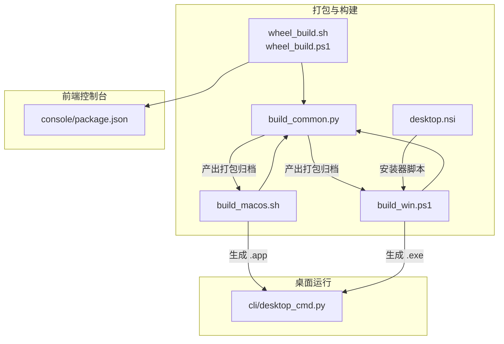
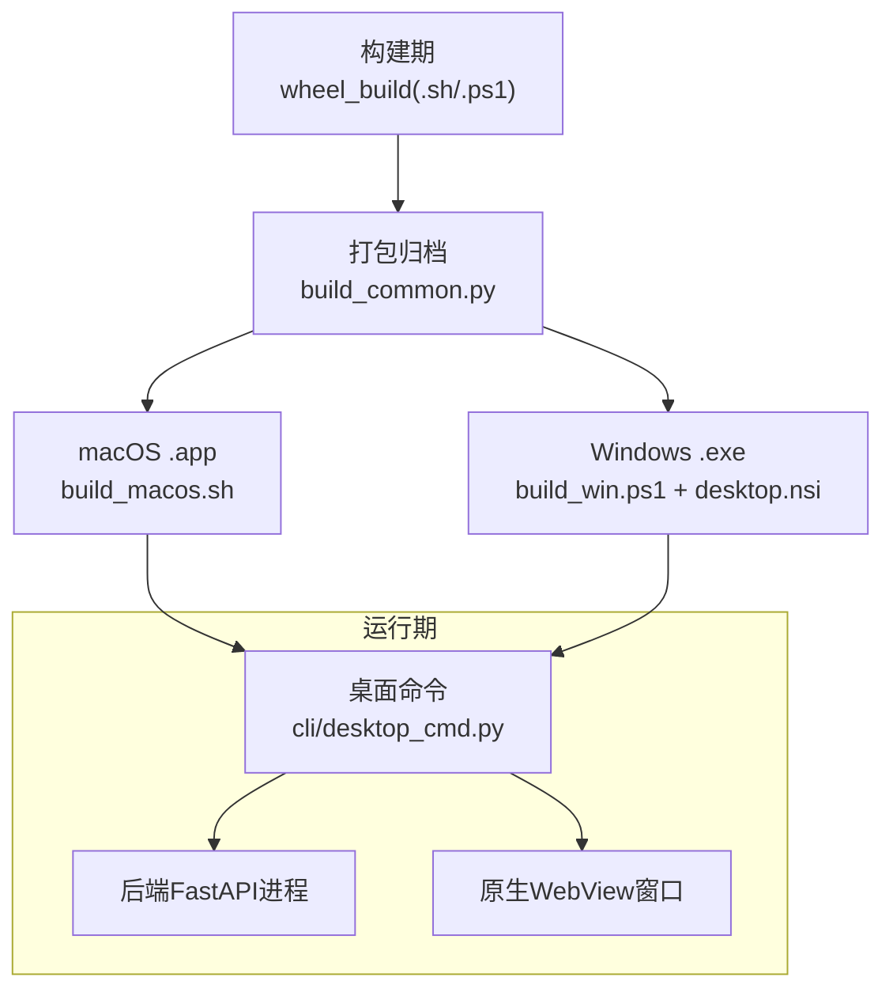
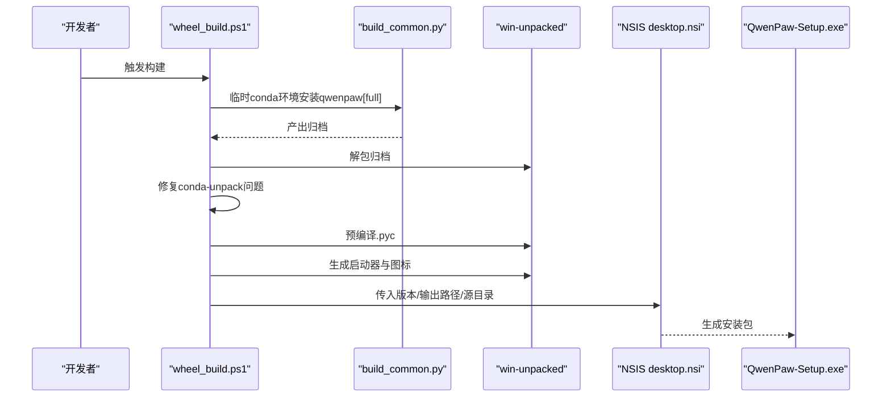
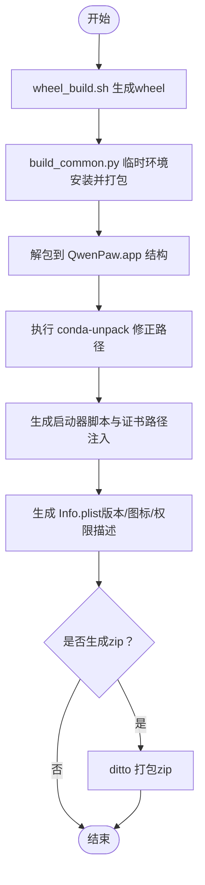
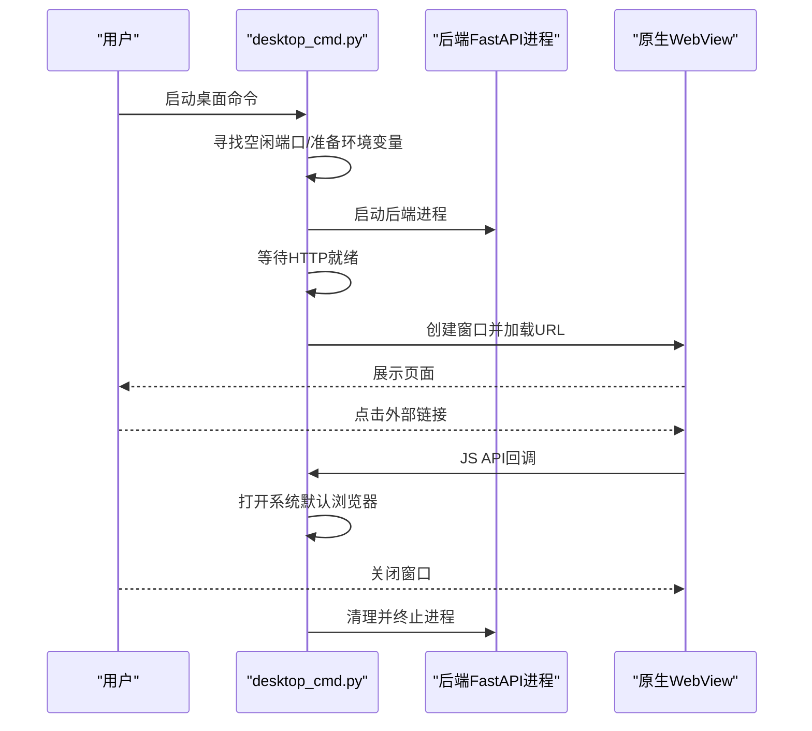
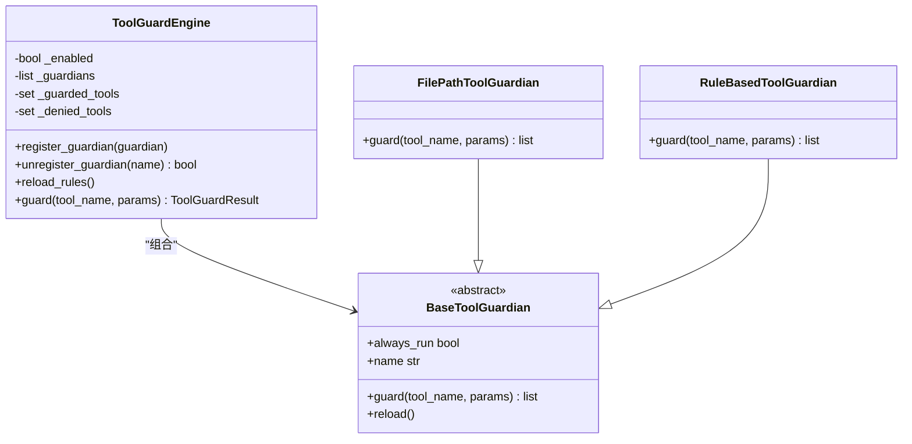
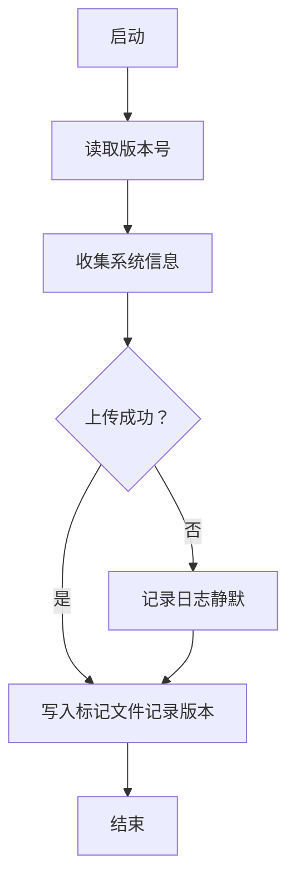
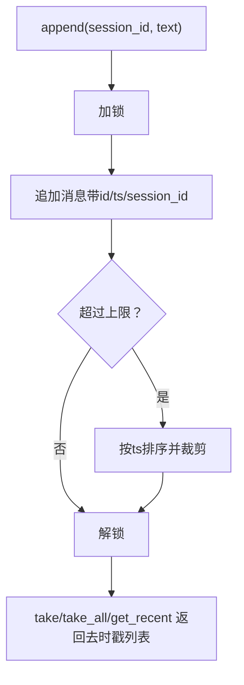
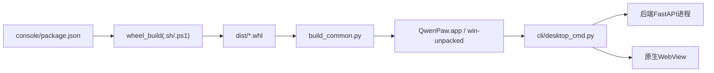

# 桌面应用

<cite>
**本文引用的文件**
- [scripts/pack/README.md](file://scripts/pack/README.md)
- [scripts/pack/build_common.py](file://scripts/pack/build_common.py)
- [scripts/pack/build_macos.sh](file://scripts/pack/build_macos.sh)
- [scripts/pack/build_win.ps1](file://scripts/pack/build_win.ps1)
- [scripts/pack/desktop.nsi](file://scripts/pack/desktop.nsi)
- [scripts/wheel_build.sh](file://scripts/wheel_build.sh)
- [scripts/wheel_build.ps1](file://scripts/wheel_build.ps1)
- [src/qwenpaw/cli/desktop_cmd.py](file://src/qwenpaw/cli/desktop_cmd.py)
- [src/qwenpaw/utils/telemetry.py](file://src/qwenpaw/utils/telemetry.py)
- [src/qwenpaw/security/tool_guard/engine.py](file://src/qwenpaw/security/tool_guard/engine.py)
- [src/qwenpaw/app/console_push_store.py](file://src/qwenpaw/app/console_push_store.py)
- [src/qwenpaw/constant.py](file://src/qwenpaw/constant.py)
- [src/qwenpaw/__version__.py](file://src/qwenpaw/__version__.py)
- [console/package.json](file://console/package.json)
- [website/public/docs/desktop.zh.md](file://website/public/docs/desktop.zh.md)
</cite>

## 目录
1. [简介](#简介)
2. [项目结构](#项目结构)
3. [核心组件](#核心组件)
4. [架构总览](#架构总览)
5. [详细组件分析](#详细组件分析)
6. [依赖关系分析](#依赖关系分析)
7. [性能考量](#性能考量)
8. [故障排查指南](#故障排查指南)
9. [结论](#结论)
10. [附录](#附录)

## 简介
本文件面向QwenPaw桌面应用的部署与运维，系统化阐述跨平台打包、安装与分发流程；说明基于原生WebView的桌面运行模式；覆盖自动更新与版本管理策略；提供图标与启动体验优化建议；解释权限与安全配置；并给出性能监控、崩溃上报与用户反馈收集的实践路径。

## 项目结构
桌面应用的打包与运行涉及以下关键路径：
- 打包脚本与模板：scripts/pack 下的构建脚本、NSIS安装器模板与通用打包逻辑
- 前端控制台：console 目录下的React/Vite前端工程，随wheel打包进应用
- 桌面运行入口：src/qwenpaw/cli/desktop_cmd.py，负责启动后端FastAPI并在原生WebView中打开页面
- 平台产物：Windows（NSIS安装包）、macOS（.app与可选zip）

**图表来源**
- [scripts/pack/build_common.py:1-321](file://scripts/pack/build_common.py#L1-L321)
- [scripts/pack/build_macos.sh:1-184](file://scripts/pack/build_macos.sh#L1-L184)
- [scripts/pack/build_win.ps1:1-325](file://scripts/pack/build_win.ps1#L1-L325)
- [scripts/pack/desktop.nsi:1-57](file://scripts/pack/desktop.nsi#L1-L57)
- [scripts/wheel_build.sh:1-28](file://scripts/wheel_build.sh#L1-L28)
- [scripts/wheel_build.ps1:1-41](file://scripts/wheel_build.ps1#L1-L41)
- [console/package.json:1-62](file://console/package.json#L1-L62)
- [src/qwenpaw/cli/desktop_cmd.py:1-270](file://src/qwenpaw/cli/desktop_cmd.py#L1-L270)

**章节来源**
- [scripts/pack/README.md:1-93](file://scripts/pack/README.md#L1-L93)
- [scripts/pack/build_common.py:1-321](file://scripts/pack/build_common.py#L1-L321)
- [scripts/pack/build_macos.sh:1-184](file://scripts/pack/build_macos.sh#L1-L184)
- [scripts/pack/build_win.ps1:1-325](file://scripts/pack/build_win.ps1#L1-L325)
- [scripts/pack/desktop.nsi:1-57](file://scripts/pack/desktop.nsi#L1-L57)
- [scripts/wheel_build.sh:1-28](file://scripts/wheel_build.sh#L1-L28)
- [scripts/wheel_build.ps1:1-41](file://scripts/wheel_build.ps1#L1-L41)
- [console/package.json:1-62](file://console/package.json#L1-L62)
- [src/qwenpaw/cli/desktop_cmd.py:1-270](file://src/qwenpaw/cli/desktop_cmd.py#L1-L270)

## 核心组件
- 打包与分发
  - 通用打包：通过临时conda环境安装qwenpaw[full]，再使用conda-pack生成归档，供各平台复用
  - Windows：将归档解包、生成VBS/BAT启动器、调用NSIS生成.exe安装包
  - macOS：将归档解包到.app结构，生成Info.plist与图标，可选生成zip
  - 前端：构建console前端并将dist复制到src/qwenpaw/console，随wheel一并打包
- 桌面运行
  - 启动后端FastAPI子进程并监听空闲端口
  - 使用原生WebView创建窗口加载该URL，提供JS API处理外部链接
  - 支持日志级别、SSL证书路径注入与优雅退出
- 自动更新与版本管理
  - 版本号来自src/qwenpaw/__version__.py
  - 构建脚本优先使用该版本，否则回退到打包环境元数据
  - 发布制品命名遵循dist/QwenPaw-Setup-<version>.exe（Windows）与QwenPaw-<version>-macOS.zip（macOS）
- 权限与安全
  - macOS Info.plist声明最低系统版本与桌面文件访问描述
  - 工具调用守卫引擎可按规则与路径策略进行前置校验
  - 证书路径注入确保HTTPS连接可用
- 性能与可观测性
  - Windows预编译.py为.pyc提升启动速度
  - macOS/Windows均支持将stdout/stderr重定向至日志文件
  - 内存消息推送存储用于会话级消息聚合与去重

**章节来源**
- [scripts/pack/build_common.py:1-321](file://scripts/pack/build_common.py#L1-L321)
- [scripts/pack/build_macos.sh:1-184](file://scripts/pack/build_macos.sh#L1-L184)
- [scripts/pack/build_win.ps1:1-325](file://scripts/pack/build_win.ps1#L1-L325)
- [scripts/wheel_build.sh:1-28](file://scripts/wheel_build.sh#L1-L28)
- [scripts/wheel_build.ps1:1-41](file://scripts/wheel_build.ps1#L1-L41)
- [src/qwenpaw/cli/desktop_cmd.py:1-270](file://src/qwenpaw/cli/desktop_cmd.py#L1-L270)
- [src/qwenpaw/__version__.py:1-3](file://src/qwenpaw/__version__.py#L1-L3)
- [src/qwenpaw/constant.py:159-161](file://src/qwenpaw/constant.py#L159-L161)
- [src/qwenpaw/security/tool_guard/engine.py:1-238](file://src/qwenpaw/security/tool_guard/engine.py#L1-L238)
- [src/qwenpaw/app/console_push_store.py:1-97](file://src/qwenpaw/app/console_push_store.py#L1-L97)

## 架构总览
桌面应用采用“打包归档 + 原生WebView承载”的轻量架构：构建期将前端与后端打包为独立归档，运行期在原生窗口内加载本地HTTP服务，避免Electron重量级依赖。

**图表来源**
- [scripts/wheel_build.sh:1-28](file://scripts/wheel_build.sh#L1-L28)
- [scripts/wheel_build.ps1:1-41](file://scripts/wheel_build.ps1#L1-L41)
- [scripts/pack/build_common.py:1-321](file://scripts/pack/build_common.py#L1-L321)
- [scripts/pack/build_macos.sh:1-184](file://scripts/pack/build_macos.sh#L1-L184)
- [scripts/pack/build_win.ps1:1-325](file://scripts/pack/build_win.ps1#L1-L325)
- [scripts/pack/desktop.nsi:1-57](file://scripts/pack/desktop.nsi#L1-L57)
- [src/qwenpaw/cli/desktop_cmd.py:1-270](file://src/qwenpaw/cli/desktop_cmd.py#L1-L270)

## 详细组件分析

### 组件A：跨平台打包与安装器（Windows）
- 流程要点
  - 生成wheel（含console前端）
  - 临时conda环境安装qwenpaw[full]，conda-pack产出归档
  - 解包归档到win-unpacked
  - 修复conda-unpack对Windows路径转义的破坏（重新安装受影响包）
  - 预编译Python字节码以加速启动
  - 生成主/调试启动器（.bat）与VBS隐藏控制台
  - 复制icon.ico到环境根目录供NSIS使用
  - 调用NSIS生成.exe安装包
- 关键参数与产物
  - 输出：dist/QwenPaw-Setup-<version>.exe
  - 快捷方式：开始菜单与桌面
  - 调试模式：显示控制台窗口，便于排障

**图表来源**
- [scripts/wheel_build.ps1:1-41](file://scripts/wheel_build.ps1#L1-L41)
- [scripts/pack/build_common.py:1-321](file://scripts/pack/build_common.py#L1-L321)
- [scripts/pack/build_win.ps1:1-325](file://scripts/pack/build_win.ps1#L1-L325)
- [scripts/pack/desktop.nsi:1-57](file://scripts/pack/desktop.nsi#L1-L57)

**章节来源**
- [scripts/pack/build_win.ps1:1-325](file://scripts/pack/build_win.ps1#L1-L325)
- [scripts/pack/desktop.nsi:1-57](file://scripts/pack/desktop.nsi#L1-L57)

### 组件B：跨平台打包与安装器（macOS）
- 流程要点
  - 生成wheel（含console前端）
  - 临时conda环境安装qwenpaw[full]，conda-pack产出归档
  - 解包归档到QwenPaw.app/Contents/{MacOS,Resources}
  - 执行conda-unpack并修正路径
  - 生成启动器脚本，注入SSL证书路径与日志级别
  - 生成Info.plist（包含版本、图标、最低系统版本、权限描述）
  - 可选生成zip用于分发
- 关键参数与产物
  - 输出：dist/QwenPaw.app（可选dist/QwenPaw-<version>-macOS.zip）
  - 首次启动可能因Gatekeeper拦截，需右键打开或系统设置放行

**图表来源**
- [scripts/wheel_build.sh:1-28](file://scripts/wheel_build.sh#L1-L28)
- [scripts/pack/build_common.py:1-321](file://scripts/pack/build_common.py#L1-L321)
- [scripts/pack/build_macos.sh:1-184](file://scripts/pack/build_macos.sh#L1-L184)

**章节来源**
- [scripts/pack/build_macos.sh:1-184](file://scripts/pack/build_macos.sh#L1-L184)

### 组件C：桌面运行与WebView集成
- 核心职责
  - 寻址并绑定本地HTTP端口，启动后端FastAPI子进程
  - 在原生WebView中打开URL，传递JS API（如打开外部链接）
  - 注入日志级别与SSL证书路径，处理Windows控制台缓冲区阻塞
  - 优雅清理后端进程，区分手动终止与异常退出
- 关键行为
  - Windows：后台线程持续读取子进程输出，避免缓冲区阻塞
  - macOS：通过环境变量强制使用打包环境，确保依赖一致

**图表来源**
- [src/qwenpaw/cli/desktop_cmd.py:1-270](file://src/qwenpaw/cli/desktop_cmd.py#L1-L270)

**章节来源**
- [src/qwenpaw/cli/desktop_cmd.py:1-270](file://src/qwenpaw/cli/desktop_cmd.py#L1-L270)

### 组件D：工具调用守卫与安全策略
- 引擎职责
  - 按配置启用/禁用工具调用守卫
  - 默认注册路径与规则两类守护者
  - 对工具调用参数进行扫描与聚合，返回结果与失败记录
- 配置来源
  - 环境变量优先于配置文件
  - 可动态重载规则并刷新受保护/禁止工具集

**图表来源**
- [src/qwenpaw/security/tool_guard/engine.py:1-238](file://src/qwenpaw/security/tool_guard/engine.py#L1-L238)

**章节来源**
- [src/qwenpaw/security/tool_guard/engine.py:1-238](file://src/qwenpaw/security/tool_guard/engine.py#L1-L238)

### 组件E：遥测与版本标记
- 遥测采集
  - 收集安装ID、版本、安装方式、操作系统、架构、GPU检测等信息
  - 上传至指定端点，失败静默
  - 标记文件记录已采集版本列表，避免重复触发
- 版本来源
  - 优先使用src/qwenpaw/__version__.py
  - 构建脚本回退到打包环境元数据

**图表来源**
- [src/qwenpaw/utils/telemetry.py:1-305](file://src/qwenpaw/utils/telemetry.py#L1-L305)
- [src/qwenpaw/__version__.py:1-3](file://src/qwenpaw/__version__.py#L1-L3)

**章节来源**
- [src/qwenpaw/utils/telemetry.py:1-305](file://src/qwenpaw/utils/telemetry.py#L1-L305)
- [src/qwenpaw/__version__.py:1-3](file://src/qwenpaw/__version__.py#L1-L3)

### 组件F：会话消息推送存储
- 设计目标
  - 会话级消息队列，按时间戳与数量上限裁剪
  - 支持取走并清空、获取近期消息、剥离时间戳字段
- 适用场景
  - 控制台通道推送、定时任务文本等

**图表来源**
- [src/qwenpaw/app/console_push_store.py:1-97](file://src/qwenpaw/app/console_push_store.py#L1-L97)

**章节来源**
- [src/qwenpaw/app/console_push_store.py:1-97](file://src/qwenpaw/app/console_push_store.py#L1-L97)

## 依赖关系分析
- 构建链路
  - console前端依赖由console/package.json定义，构建后复制到src/qwenpaw/console
  - wheel_build脚本负责拉取依赖、构建console并打包wheel
  - build_common.py在临时conda环境中安装qwenpaw[full]，确保依赖一致性
- 运行链路
  - desktop_cmd.py启动后端FastAPI子进程，并在原生WebView中展示
  - macOS通过环境变量强制使用打包环境，避免系统Python干扰
  - Windows通过VBS隐藏控制台窗口，提供静默启动体验

**图表来源**
- [console/package.json:1-62](file://console/package.json#L1-L62)
- [scripts/wheel_build.sh:1-28](file://scripts/wheel_build.sh#L1-L28)
- [scripts/wheel_build.ps1:1-41](file://scripts/wheel_build.ps1#L1-L41)
- [scripts/pack/build_common.py:1-321](file://scripts/pack/build_common.py#L1-L321)
- [src/qwenpaw/cli/desktop_cmd.py:1-270](file://src/qwenpaw/cli/desktop_cmd.py#L1-L270)

**章节来源**
- [console/package.json:1-62](file://console/package.json#L1-L62)
- [scripts/wheel_build.sh:1-28](file://scripts/wheel_build.sh#L1-L28)
- [scripts/wheel_build.ps1:1-41](file://scripts/wheel_build.ps1#L1-L41)
- [scripts/pack/build_common.py:1-321](file://scripts/pack/build_common.py#L1-L321)
- [src/qwenpaw/cli/desktop_cmd.py:1-270](file://src/qwenpaw/cli/desktop_cmd.py#L1-L270)

## 性能考量
- 启动速度
  - Windows：预编译Python字节码（.pyc）显著降低首次启动时间
  - macOS：通过环境变量强制使用打包环境，减少系统PATH干扰
- I/O与日志
  - Windows：后台线程持续读取子进程输出，避免缓冲区阻塞
  - macOS：将stdout/stderr重定向至~/.qwenpaw/desktop.log，便于离线诊断
- 资源占用
  - 前端控制台采用现代构建工具链，产物体积可控
  - 原生WebView避免Electron的高内存占用

**章节来源**
- [scripts/pack/build_win.ps1:128-153](file://scripts/pack/build_win.ps1#L128-L153)
- [src/qwenpaw/cli/desktop_cmd.py:158-171](file://src/qwenpaw/cli/desktop_cmd.py#L158-L171)
- [website/public/docs/desktop.zh.md:177-202](file://website/public/docs/desktop.zh.md#L177-L202)

## 故障排查指南
- Windows常见问题
  - 无响应：使用“QwenPaw Desktop (Debug)”查看终端日志
  - WebView2缺失：安装Microsoft WebView2运行时
  - SmartScreen警告：点击“仍要运行”
- macOS常见问题
  - “无法验证开发者”：右键打开或系统设置放行；必要时移除下载隔离属性
  - 首次启动无窗口：检查~/.qwenpaw/desktop.log
  - 权限请求：允许桌面文件访问以正常使用文件相关功能
- 通用建议
  - 使用终端启动方式查看实时日志与完整堆栈
  - 检查SSL证书路径注入是否生效
  - 确认工作目录与配置文件存在

**章节来源**
- [website/public/docs/desktop.zh.md:31-256](file://website/public/docs/desktop.zh.md#L31-L256)
- [scripts/pack/build_win.ps1:297-320](file://scripts/pack/build_win.ps1#L297-L320)
- [scripts/pack/build_macos.sh:89-125](file://scripts/pack/build_macos.sh#L89-L125)

## 结论
QwenPaw桌面应用采用“轻量化WebView + 便携环境”的方案，在保证功能完整性的同时兼顾了跨平台一致性与部署效率。通过统一的打包脚本与安装器模板，实现Windows与macOS的自动化构建与分发；借助工具守卫与遥测机制，强化安全与可观测性。建议在生产发布中补充代码签名与公证（macOS Notarization），以进一步提升用户信任度与系统兼容性。

## 附录
- 版本与发布
  - 版本号来源：src/qwenpaw/__version__.py
  - 发布制品命名：Windows（QwenPaw-Setup-<version>.exe）、macOS（QwenPaw-<version>-macOS.zip）
- 用户手册与FAQ
  - 参考网站文档desktop.zh.md，涵盖安装、启动、权限与常见问题

**章节来源**
- [src/qwenpaw/__version__.py:1-3](file://src/qwenpaw/__version__.py#L1-L3)
- [website/public/docs/desktop.zh.md:1-256](file://website/public/docs/desktop.zh.md#L1-L256)