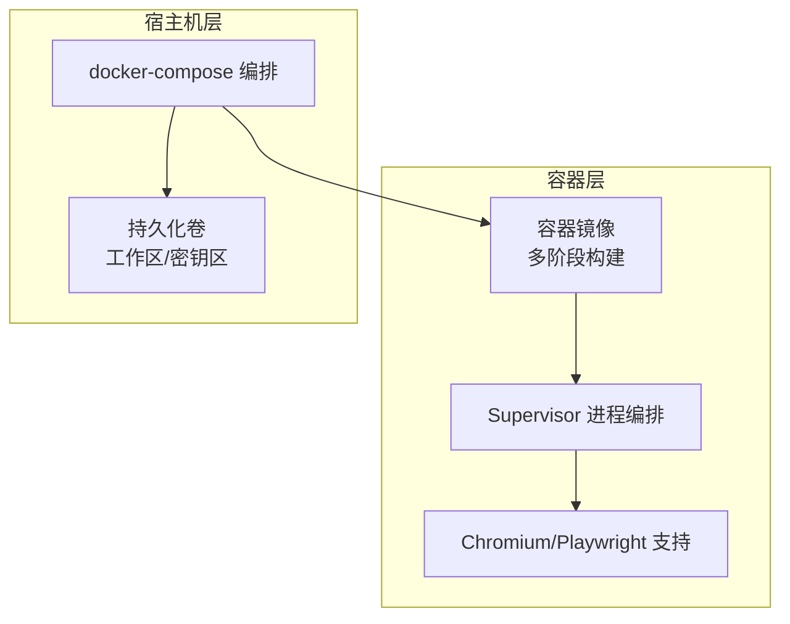
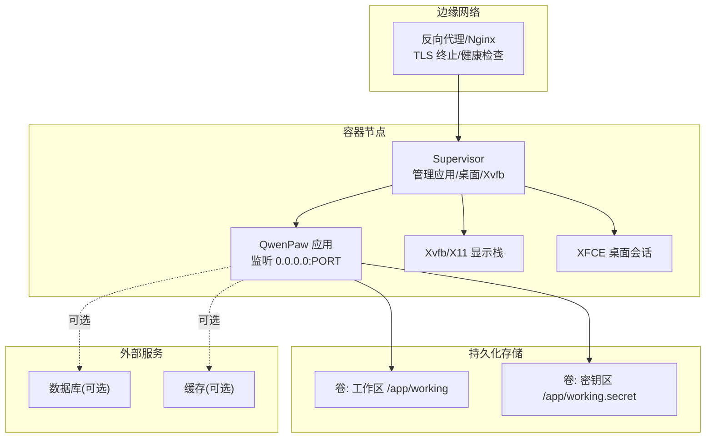
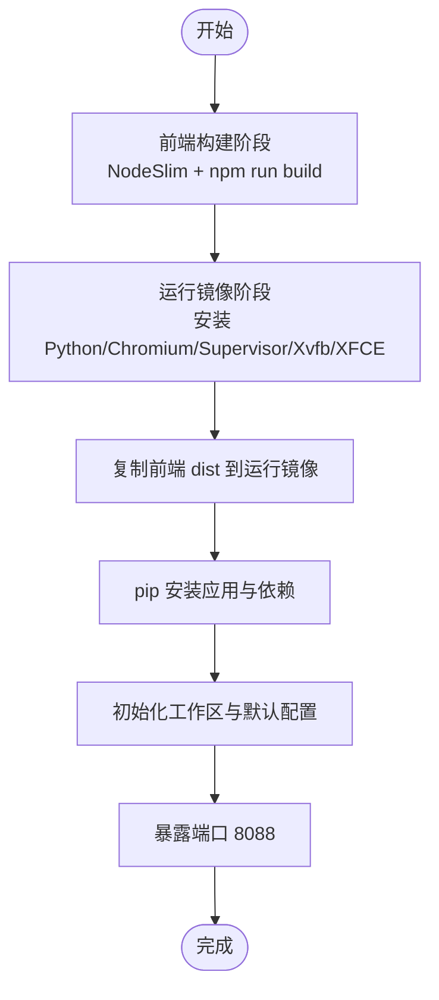
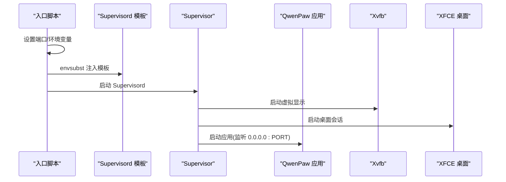
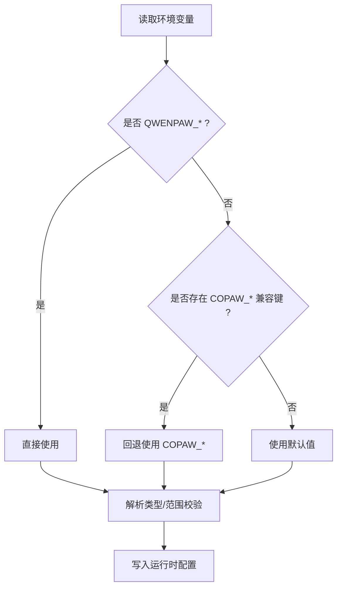
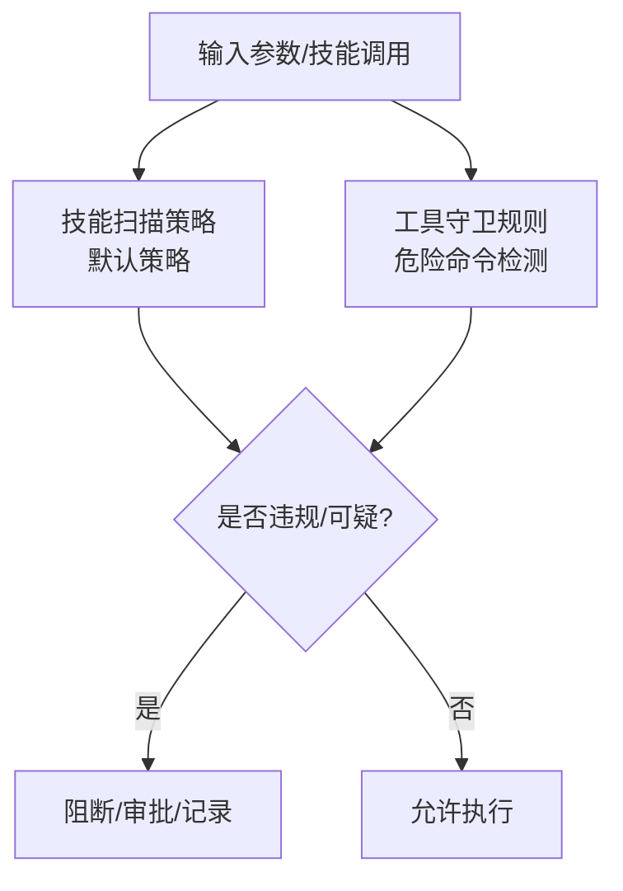
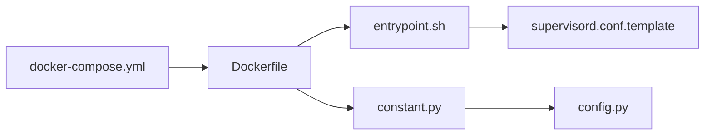

# 生产环境配置

<cite>
**本文引用的文件**
- [Dockerfile](file://deploy/Dockerfile)
- [docker-compose.yml](file://docker-compose.yml)
- [entrypoint.sh](file://deploy/entrypoint.sh)
- [supervisord.conf.template](file://deploy/config/supervisord.conf.template)
- [docker_build.sh](file://scripts/docker_build.sh)
- [config.py](file://src/qwenpaw/config/config.py)
- [constant.py](file://src/qwenpaw/constant.py)
- [default_policy.yaml](file://src/qwenpaw/security/skill_scanner/data/default_policy.yaml)
- [dangerous_shell_commands.yaml](file://src/qwenpaw/security/tool_guard/rules/dangerous_shell_commands.yaml)
- [__main__.py](file://src/qwenpaw/__main__.py)
</cite>

## 目录
1. [简介](#简介)
2. [项目结构](#项目结构)
3. [核心组件](#核心组件)
4. [架构总览](#架构总览)
5. [详细组件分析](#详细组件分析)
6. [依赖分析](#依赖分析)
7. [性能考虑](#性能考虑)
8. [故障排查指南](#故障排查指南)
9. [结论](#结论)
10. [附录](#附录)

## 简介
本文件面向生产环境，系统性阐述 QwenPaw 的部署架构、容器与进程管理、服务暴露与反向代理、安全加固与访问控制、数据库与缓存策略、监控与日志、高可用与灾备、以及运维自动化与发布流程。内容基于仓库内现有配置与实现进行归纳总结，并给出可落地的生产实践建议。

## 项目结构
- 容器镜像构建：多阶段构建前端与后端，集成 Supervisor 进程管理与桌面虚拟显示栈，内置 Chromium 以支持浏览器类工具链。
- 编排与持久化：通过 docker-compose 将工作目录与密钥目录挂载为独立卷，便于升级与备份。
- 进程编排：入口脚本负责将运行时端口注入模板并启动 Supervisor，统一管理应用、虚拟显示与桌面会话。
- 配置体系：通过环境变量与配置文件协同，支持运行时参数覆盖与默认行为收敛。

图表来源
- [Dockerfile:1-103](file://deploy/Dockerfile#L1-L103)
- [docker-compose.yml:1-23](file://docker-compose.yml#L1-L23)
- [entrypoint.sh:1-10](file://deploy/entrypoint.sh#L1-L10)
- [supervisord.conf.template:1-40](file://deploy/config/supervisord.conf.template#L1-L40)

章节来源
- [Dockerfile:1-103](file://deploy/Dockerfile#L1-L103)
- [docker-compose.yml:1-23](file://docker-compose.yml#L1-L23)

## 核心组件
- 容器镜像与构建
  - 多阶段构建前端产物并打包至运行镜像；安装 Python、Chromium、Supervisor、Xvfb、XFCE 桌面环境，满足本地模型与网页自动化需求。
  - 构建参数支持通道白/黑名单，便于裁剪平台能力。
- 进程管理与服务编排
  - 入口脚本将运行端口注入 Supervisor 模板，统一启动应用、虚拟显示与桌面会话。
  - Supervisor 程序定义包含应用、Xvfb、XFCE、DBus，具备自动重启与日志输出。
- 运行时配置与环境变量
  - 基于常量模块集中读取环境变量，支持 QWENPAW_* 与历史 COPAW_* 兼容键。
  - 提供 LLM 并发、速率限制、内存压缩等关键运行参数的环境变量开关。
- 安全策略
  - 技能扫描默认策略与危险命令规则，结合审批流与超时控制，降低执行风险。

章节来源
- [Dockerfile:1-103](file://deploy/Dockerfile#L1-L103)
- [entrypoint.sh:1-10](file://deploy/entrypoint.sh#L1-L10)
- [supervisord.conf.template:1-40](file://deploy/config/supervisord.conf.template#L1-L40)
- [constant.py:1-307](file://src/qwenpaw/constant.py#L1-L307)
- [default_policy.yaml:1-243](file://src/qwenpaw/security/skill_scanner/data/default_policy.yaml#L1-L243)
- [dangerous_shell_commands.yaml:1-187](file://src/qwenpaw/security/tool_guard/rules/dangerous_shell_commands.yaml#L1-L187)

## 架构总览
下图展示生产环境典型拓扑：反向代理位于边缘，负责 TLS 终止与请求转发；容器内由 Supervisor 统一管理应用与桌面会话；工作区与密钥区通过卷持久化；外部可选接入数据库与缓存服务。

图表来源
- [docker-compose.yml:1-23](file://docker-compose.yml#L1-L23)
- [supervisord.conf.template:1-40](file://deploy/config/supervisord.conf.template#L1-L40)
- [Dockerfile:1-103](file://deploy/Dockerfile#L1-L103)

## 详细组件分析

### 容器与镜像构建
- 多阶段构建
  - 前端构建阶段：使用 NodeSlim 基础镜像，拉取 console 源码并执行构建，产物输出到 dist。
  - 运行阶段：复制前端 dist 至运行镜像，安装 Python、Chromium、Supervisor、Xvfb、XFCE 等依赖，启用无沙箱模式以适配容器环境。
- 运行时参数
  - 默认端口 8088，可通过环境变量覆盖。
  - 初始化工作区与默认配置，确保首次启动可用。
- 构建参数
  - 支持通过构建参数控制通道白/黑名单，便于裁剪平台能力。

图表来源
- [Dockerfile:1-103](file://deploy/Dockerfile#L1-L103)

章节来源
- [Dockerfile:1-103](file://deploy/Dockerfile#L1-L103)
- [docker_build.sh:1-32](file://scripts/docker_build.sh#L1-L32)

### 进程管理与服务编排（Supervisor）
- 启动流程
  - 入口脚本设置默认端口并使用 envsubst 注入模板，生成最终配置，随后启动 Supervisor。
- 程序定义
  - 应用程序：监听 0.0.0.0:PORT，自动重启，输出标准与错误日志。
  - Xvfb：虚拟显示，优先级高于桌面会话。
  - XFCE：桌面会话，等待 X11 套接字就绪后启动。
  - DBus：系统总线，保障桌面会话正常运行。
- 日志与可观测性
  - 每个程序输出独立日志文件，便于定位问题。

图表来源
- [entrypoint.sh:1-10](file://deploy/entrypoint.sh#L1-L10)
- [supervisord.conf.template:1-40](file://deploy/config/supervisord.conf.template#L1-L40)

章节来源
- [entrypoint.sh:1-10](file://deploy/entrypoint.sh#L1-L10)
- [supervisord.conf.template:1-40](file://deploy/config/supervisord.conf.template#L1-L40)

### 运行时配置与环境变量
- 工作区与密钥区
  - 工作区目录优先级：历史路径兼容、显式环境变量、默认路径。
  - 密钥区默认为工作区目录的 .secret 后缀。
- 关键运行参数
  - LLM 最大并发、最大 QPM、退避基线与上限、获取信号量超时等，均支持通过环境变量调整。
  - 记忆压缩比例、保留比例、工具结果压缩阈值等，支持运行时调节。
- 开放接口与调试
  - 生产环境默认关闭 OpenAPI 文档接口，避免泄露内部路由。

图表来源
- [constant.py:1-307](file://src/qwenpaw/constant.py#L1-L307)

章节来源
- [constant.py:1-307](file://src/qwenpaw/constant.py#L1-L307)

### 反向代理、SSL 与 HTTPS
- 边缘代理建议
  - 使用 Nginx 在容器外或同机部署反向代理，开启 TLS 终止与健康检查。
  - 将上游指向容器内应用端口（默认 8088），并配置长连接与超时参数。
- 安全建议
  - 强制 HTTPS，禁用弱密码套件与过时协议。
  - 配置 HSTS、CSP、X-Frame-Options 等安全响应头。
  - 限制来源与速率，开启 WAF 规则。
- 本仓库现状
  - 当前 compose 将容器端口映射到 127.0.0.1:8088，未包含反向代理与 SSL 配置示例。生产中应补充边缘代理层。

章节来源
- [docker-compose.yml:1-23](file://docker-compose.yml#L1-L23)

### 数据库连接池、缓存与会话
- 数据库
  - 本仓库未内置数据库服务或连接池代码，如需持久化可在边缘代理后接入外部数据库，并在应用侧按需引入连接池与事务策略。
- 缓存
  - 本仓库未内置缓存组件，可按需引入 Redis/Memcached，并在应用侧实现缓存命中、失效与降级策略。
- 会话
  - 会话管理建议采用安全的 HttpOnly SameSite Cookie 或 JWT 方案，配合边缘代理的 HTTPS 与安全头。

章节来源
- [config.py:1-800](file://src/qwenpaw/config/config.py#L1-L800)
- [constant.py:1-307](file://src/qwenpaw/constant.py#L1-L307)

### 性能监控、日志聚合与告警
- 进程与资源
  - Supervisor 输出标准/错误日志，建议集中采集并建立索引，结合 CPU/内存/磁盘 IO 监控形成告警。
- 应用指标
  - 建议在应用侧埋点 LLM 调用耗时、并发、QPM、错误率等指标，上报至监控系统。
- 日志
  - 结合容器日志与应用日志，统一打标与归档，保留至少 30 天以上。
- 告警
  - 基于阈值与趋势异常触发告警，联动值班与自动恢复预案。

章节来源
- [supervisord.conf.template:1-40](file://deploy/config/supervisord.conf.template#L1-L40)

### 高可用、故障转移与灾备
- 镜像与编排
  - 使用 docker-compose 管理单实例；生产建议以编排平台（如 Swarm/K8s）管理多副本与滚动更新。
- 存储
  - 工作区与密钥区分别挂载为独立卷，升级时可保留配置与密钥。
- 故障转移
  - 通过健康检查与自动重启（Supervisor）提升可用性；边缘代理层实现多实例轮询与故障摘除。
- 灾备
  - 定期备份工作区与密钥区；制定恢复流程与演练计划。

章节来源
- [docker-compose.yml:1-23](file://docker-compose.yml#L1-L23)
- [supervisord.conf.template:1-40](file://deploy/config/supervisord.conf.template#L1-L40)

### 安全加固、访问控制与数据保护
- 访问控制
  - 建议在反向代理层启用认证与授权（如 Basic Auth/OAuth），并限制来源 IP。
- 传输安全
  - 强制 HTTPS，禁用明文通信；TLS 版本与套件按合规要求配置。
- 应用安全
  - 技能扫描默认策略与危险命令规则，结合审批流与超时控制，降低高危操作风险。
- 密钥与敏感信息
  - 密钥区与工作区分离；避免将密钥写入镜像；使用环境变量注入或外部密管系统。

图表来源
- [default_policy.yaml:1-243](file://src/qwenpaw/security/skill_scanner/data/default_policy.yaml#L1-L243)
- [dangerous_shell_commands.yaml:1-187](file://src/qwenpaw/security/tool_guard/rules/dangerous_shell_commands.yaml#L1-L187)

章节来源
- [default_policy.yaml:1-243](file://src/qwenpaw/security/skill_scanner/data/default_policy.yaml#L1-L243)
- [dangerous_shell_commands.yaml:1-187](file://src/qwenpaw/security/tool_guard/rules/dangerous_shell_commands.yaml#L1-L187)
- [constant.py:284-294](file://src/qwenpaw/constant.py#L284-L294)

### 运维自动化、CI/CD 与发布流程
- 构建
  - 使用多阶段 Dockerfile 构建镜像；通过构建参数裁剪通道能力。
- 发布
  - 推送镜像至私有仓库；在编排平台拉起新版本，执行滚动更新。
- 回滚
  - 保留上一个稳定版本标签，快速回滚。
- 自动化
  - CI 中集成单元测试与集成测试；Docker 镜像推送后触发部署流水线。

章节来源
- [Dockerfile:1-103](file://deploy/Dockerfile#L1-L103)
- [docker_build.sh:1-32](file://scripts/docker_build.sh#L1-L32)
- [docker-compose.yml:1-23](file://docker-compose.yml#L1-L23)

## 依赖分析
- 组件耦合
  - 容器镜像与 Supervisor 模板强关联；入口脚本负责模板注入与启动。
  - 运行时配置通过常量模块集中读取环境变量，影响应用行为与安全策略。
- 外部依赖
  - Chromium/Playwright 用于网页自动化；Xvfb/XFCE 用于桌面会话。
  - docker-compose 提供编排与卷管理。

图表来源
- [Dockerfile:1-103](file://deploy/Dockerfile#L1-L103)
- [entrypoint.sh:1-10](file://deploy/entrypoint.sh#L1-L10)
- [supervisord.conf.template:1-40](file://deploy/config/supervisord.conf.template#L1-L40)
- [constant.py:1-307](file://src/qwenpaw/constant.py#L1-L307)
- [config.py:1-800](file://src/qwenpaw/config/config.py#L1-L800)
- [docker-compose.yml:1-23](file://docker-compose.yml#L1-L23)

章节来源
- [Dockerfile:1-103](file://deploy/Dockerfile#L1-L103)
- [entrypoint.sh:1-10](file://deploy/entrypoint.sh#L1-L10)
- [supervisord.conf.template:1-40](file://deploy/config/supervisord.conf.template#L1-L40)
- [constant.py:1-307](file://src/qwenpaw/constant.py#L1-L307)
- [config.py:1-800](file://src/qwenpaw/config/config.py#L1-L800)
- [docker-compose.yml:1-23](file://docker-compose.yml#L1-L23)

## 性能考虑
- LLM 并发与速率限制
  - 通过环境变量控制最大并发与 QPM，避免上游限流导致的抖动。
- 内存与上下文压缩
  - 启用上下文压缩与记忆摘要，减少长对话带来的上下文膨胀。
- 浏览器自动化
  - 使用系统 Chromium 并禁用沙箱，注意容器安全边界；必要时启用只读根文件系统与最小权限。

章节来源
- [constant.py:220-282](file://src/qwenpaw/constant.py#L220-L282)
- [config.py:471-624](file://src/qwenpaw/config/config.py#L471-L624)

## 故障排查指南
- 进程状态
  - 查看 Supervisor 管理的应用、Xvfb、XFCE、DBus 的日志文件，确认启动顺序与依赖就绪。
- 端口与网络
  - 确认容器端口映射与反向代理连通性；检查防火墙与安全组策略。
- 日志与告警
  - 集中采集容器与应用日志，结合监控指标定位异常。
- 安全事件
  - 检查技能扫描与工具守卫的阻断记录，评估误报与漏报并调整策略。

章节来源
- [supervisord.conf.template:1-40](file://deploy/config/supervisord.conf.template#L1-L40)
- [docker-compose.yml:1-23](file://docker-compose.yml#L1-L23)

## 结论
本配置文档基于仓库现有实现，给出了生产环境的部署蓝图与最佳实践建议。建议在现有容器与 Supervisor 编排基础上，补充边缘反向代理、TLS 终止、数据库与缓存接入、完善的监控与告警体系，以及标准化的 CI/CD 与灾备流程，以满足生产级可用性、安全性与可维护性要求。

## 附录
- 快速参考
  - 默认端口：8088（可通过环境变量覆盖）
  - 工作区与密钥区：分别挂载为独立卷
  - 进程管理：Supervisor 统一编排应用、Xvfb、XFCE、DBus
  - 安全策略：技能扫描与工具守卫规则，结合审批与超时控制

章节来源
- [Dockerfile:94-96](file://deploy/Dockerfile#L94-L96)
- [docker-compose.yml:20-22](file://docker-compose.yml#L20-L22)
- [supervisord.conf.template:14-21](file://deploy/config/supervisord.conf.template#L14-L21)
- [default_policy.yaml:1-243](file://src/qwenpaw/security/skill_scanner/data/default_policy.yaml#L1-L243)
- [dangerous_shell_commands.yaml:1-187](file://src/qwenpaw/security/tool_guard/rules/dangerous_shell_commands.yaml#L1-L187)