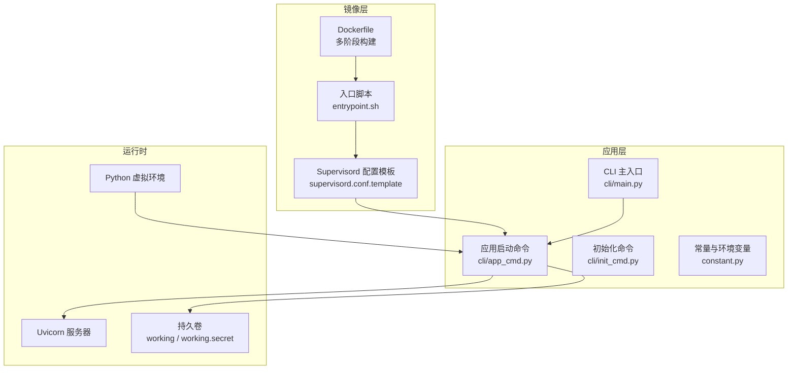
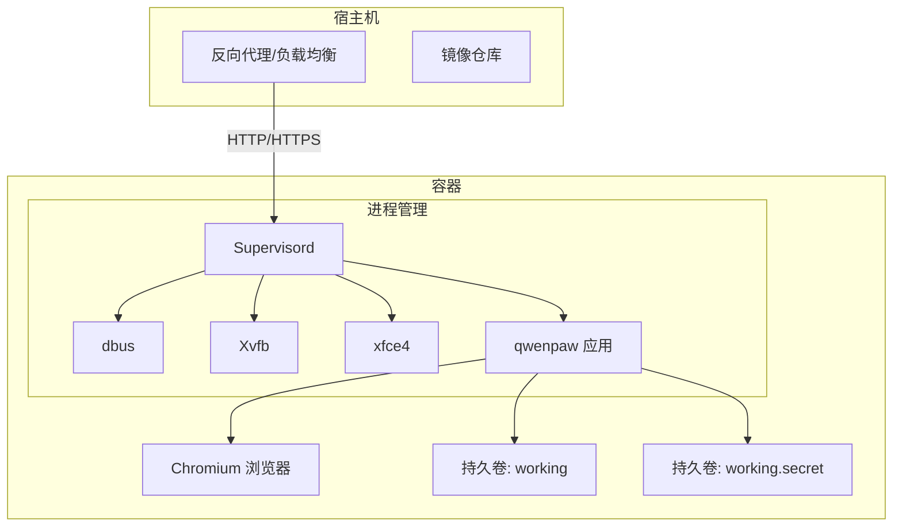
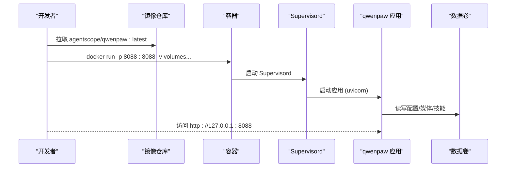
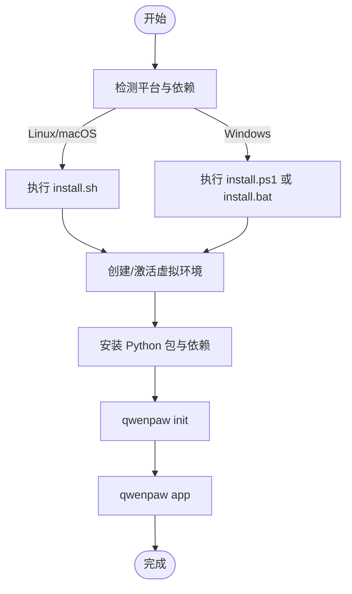
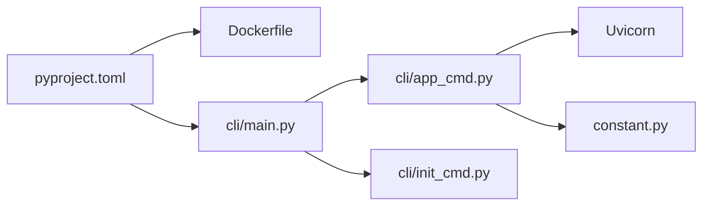

# 部署指南

<cite>
**本文引用的文件**
- [Dockerfile](file://deploy/Dockerfile)
- [入口脚本](file://deploy/entrypoint.sh)
- [Supervisord 配置模板](file://deploy/config/supervisord.conf.template)
- [docker-compose 编排](file://docker-compose.yml)
- [Docker 构建脚本](file://scripts/docker_build.sh)
- [安装器（Linux/macOS）](file://scripts/install.sh)
- [安装器（Windows CMD）](file://scripts/install.bat)
- [安装器（Windows PowerShell）](file://scripts/install.ps1)
- [项目构建配置](file://pyproject.toml)
- [主程序入口](file://src/qwenpaw/cli/main.py)
- [应用启动命令](file://src/qwenpaw/cli/app_cmd.py)
- [初始化命令](file://src/qwenpaw/cli/init_cmd.py)
- [常量与环境变量](file://src/qwenpaw/constant.py)
- [版本信息](file://src/qwenpaw/__version__.py)
- [项目总览](file://README.md)
</cite>

## 目录
1. [简介](#简介)
2. [项目结构](#项目结构)
3. [核心组件](#核心组件)
4. [架构总览](#架构总览)
5. [详细组件分析](#详细组件分析)
6. [依赖关系分析](#依赖关系分析)
7. [性能考虑](#性能考虑)
8. [故障排查指南](#故障排查指南)
9. [结论](#结论)
10. [附录](#附录)

## 简介
本指南面向在生产环境中部署 QwenPaw 的工程团队与运维人员，覆盖以下主题：
- Docker 镜像构建与运行
- 本地部署（pip/脚本安装）
- 桌面应用（Beta）部署
- 生产环境配置要点（端口、日志、认证、CORS、限流）
- 性能优化与资源调优
- 监控与日志采集建议
- 数据库与存储（工作目录、机密目录、持久卷）
- 安全加固与访问控制
- 高可用、故障转移与灾难恢复
- 健康检查与部署验证
- 容器编排、服务发现与负载均衡策略

## 项目结构
QwenPaw 提供多条部署路径：官方 Docker 镜像、脚本安装器、桌面应用以及源码安装。其核心运行时由 Python CLI 驱动，内置 Web 控制台并通过 Uvicorn 启动 FastAPI 应用。

图表来源
- [Dockerfile:1-103](file://deploy/Dockerfile#L1-L103)
- [入口脚本:1-10](file://deploy/entrypoint.sh#L1-L10)
- [Supervisord 配置模板:1-40](file://deploy/config/supervisord.conf.template#L1-L40)
- [主程序入口:1-171](file://src/qwenpaw/cli/main.py#L1-L171)
- [应用启动命令:1-112](file://src/qwenpaw/cli/app_cmd.py#L1-L112)
- [常量与环境变量:1-307](file://src/qwenpaw/constant.py#L1-L307)

章节来源
- [Dockerfile:1-103](file://deploy/Dockerfile#L1-L103)
- [入口脚本:1-10](file://deploy/entrypoint.sh#L1-L10)
- [Supervisord 配置模板:1-40](file://deploy/config/supervisord.conf.template#L1-L40)
- [主程序入口:1-171](file://src/qwenpaw/cli/main.py#L1-L171)
- [应用启动命令:1-112](file://src/qwenpaw/cli/app_cmd.py#L1-L112)
- [常量与环境变量:1-307](file://src/qwenpaw/constant.py#L1-L307)

## 核心组件
- Docker 镜像与运行时
  - 多阶段构建前端产物并打包至镜像；运行时包含 Python、Chromium、Supervisord、Xvfb/xfce4 等，用于支持浏览器自动化与桌面环境。
  - 默认监听端口 8088，可通过环境变量覆盖；通过 Supervisord 管理 dbus、Xvfb、xfce4 与应用进程。
- CLI 与应用启动
  - CLI 支持子命令，其中 app 子命令负责启动 Uvicorn 服务器；init 子命令完成工作目录、配置、技能与心跳查询的初始化。
- 环境变量与配置
  - 通过常量模块集中加载环境变量，支持 QWENPAW_* 与历史 COPAW_* 兼容键；提供日志级别、CORS、限流、内存压缩等运行时参数。
- 安装器与桌面应用
  - 提供 Linux/macOS/Windows 一键安装脚本，自动处理 uv、虚拟环境与依赖；桌面应用提供零配置体验（Beta）。

章节来源
- [Dockerfile:1-103](file://deploy/Dockerfile#L1-L103)
- [入口脚本:1-10](file://deploy/entrypoint.sh#L1-L10)
- [Supervisord 配置模板:1-40](file://deploy/config/supervisord.conf.template#L1-L40)
- [主程序入口:1-171](file://src/qwenpaw/cli/main.py#L1-L171)
- [应用启动命令:1-112](file://src/qwenpaw/cli/app_cmd.py#L1-L112)
- [初始化命令:1-523](file://src/qwenpaw/cli/init_cmd.py#L1-L523)
- [常量与环境变量:1-307](file://src/qwenpaw/constant.py#L1-L307)
- [安装器（Linux/macOS）:1-340](file://scripts/install.sh#L1-L340)
- [安装器（Windows CMD）:1-557](file://scripts/install.bat#L1-L557)
- [安装器（Windows PowerShell）:1-477](file://scripts/install.ps1#L1-L477)

## 架构总览
下图展示生产环境典型部署形态：容器内运行应用与浏览器自动化栈，通过 Supervisord 管理多进程；数据与机密分别挂载到独立持久卷。

图表来源
- [Dockerfile:1-103](file://deploy/Dockerfile#L1-L103)
- [Supervisord 配置模板:1-40](file://deploy/config/supervisord.conf.template#L1-L40)
- [应用启动命令:1-112](file://src/qwenpaw/cli/app_cmd.py#L1-L112)

## 详细组件分析

### Docker 部署
- 镜像构建
  - 多阶段构建前端产物并复制到镜像中；安装 Python、Chromium 及运行所需系统包；启用无沙箱模式以适配容器环境。
  - 构建参数支持通道白名单/黑名单，便于裁剪镜像大小与功能集。
- 运行方式
  - 默认暴露 8088 端口；通过入口脚本替换 Supervisord 模板中的端口变量后启动；Supervisord 管理 dbus、Xvfb、xfce4 与应用进程。
  - docker-compose 示例定义了命名卷与端口映射，并预留了认证与凭据注入示例。
- 与宿主网络交互
  - 如需访问宿主上的模型服务（如 Ollama/LM Studio），可使用 host.docker.internal 或 host 网络模式。

图表来源
- [Dockerfile:1-103](file://deploy/Dockerfile#L1-L103)
- [入口脚本:1-10](file://deploy/entrypoint.sh#L1-L10)
- [Supervisord 配置模板:1-40](file://deploy/config/supervisord.conf.template#L1-L40)
- [应用启动命令:1-112](file://src/qwenpaw/cli/app_cmd.py#L1-L112)

章节来源
- [Dockerfile:1-103](file://deploy/Dockerfile#L1-L103)
- [入口脚本:1-10](file://deploy/entrypoint.sh#L1-L10)
- [Supervisord 配置模板:1-40](file://deploy/config/supervisord.conf.template#L1-L40)
- [docker-compose 编排:1-23](file://docker-compose.yml#L1-L23)
- [Docker 构建脚本:1-32](file://scripts/docker_build.sh#L1-L32)

### 本地部署（pip/脚本安装）
- pip 安装
  - 安装完成后执行初始化与启动命令，即可在本地访问控制台。
- 脚本安装（推荐）
  - 自动下载 uv、创建虚拟环境、安装依赖（含前端资产），并在不同平台提供统一体验。
  - Windows 提供 CMD 与 PowerShell 两种脚本，具备自动下载 uv 的回退逻辑。

图表来源
- [安装器（Linux/macOS）:1-340](file://scripts/install.sh#L1-L340)
- [安装器（Windows CMD）:1-557](file://scripts/install.bat#L1-L557)
- [安装器（Windows PowerShell）:1-477](file://scripts/install.ps1#L1-L477)
- [应用启动命令:1-112](file://src/qwenpaw/cli/app_cmd.py#L1-L112)
- [初始化命令:1-523](file://src/qwenpaw/cli/init_cmd.py#L1-L523)

章节来源
- [安装器（Linux/macOS）:1-340](file://scripts/install.sh#L1-L340)
- [安装器（Windows CMD）:1-557](file://scripts/install.bat#L1-L557)
- [安装器（Windows PowerShell）:1-477](file://scripts/install.ps1#L1-L477)
- [应用启动命令:1-112](file://src/qwenpaw/cli/app_cmd.py#L1-L112)
- [初始化命令:1-523](file://src/qwenpaw/cli/init_cmd.py#L1-L523)

### 桌面应用（Beta）
- 特点
  - 无需手动配置 Python 环境，双击即可运行；首次启动可能需要数秒初始化。
  - macOS 首次打开可能触发系统安全提示，按指引允许即可。
- 使用场景
  - 对命令行不熟悉的用户或快速试用场景。

章节来源
- [项目总览:287-330](file://README.md#L287-L330)

### 生产环境配置要点
- 端口与绑定
  - 默认监听 127.0.0.1:8088；可通过 CLI 参数或环境变量调整。
- 日志级别
  - 通过 --log-level 设置；也可通过环境变量控制。
- CORS 与开发文档
  - 开发模式可开启开放跨域与 OpenAPI 文档，生产应关闭。
- 认证与访问控制
  - 可通过环境变量启用控制台登录保护；结合反向代理实现更严格的访问控制。
- 限流与并发
  - 提供 LLM 最大重试次数、指数退避、并发与 QPM 限制等参数，按供应商配额合理配置。
- 内存与上下文
  - 上下文压缩比例、保留比例、工具结果压缩阈值等参数可调优。

章节来源
- [应用启动命令:1-112](file://src/qwenpaw/cli/app_cmd.py#L1-L112)
- [常量与环境变量:1-307](file://src/qwenpaw/constant.py#L1-L307)
- [项目总览:382-393](file://README.md#L382-L393)

### 数据库与存储管理
- 工作目录与机密目录
  - 工作目录（默认 ~/.qwenpaw）包含配置、技能、媒体与记忆；机密目录独立存放敏感凭据。
  - Docker 场景建议使用独立命名卷（如 qwenpaw-data、qwenpaw-secrets）持久化。
- 备份与恢复
  - 建议定期备份工作目录与机密目录；恢复时确保权限与路径一致。
- 本地模型与浏览器
  - 本地模型目录与浏览器缓存位于工作目录内，注意容量与清理策略。

章节来源
- [常量与环境变量:89-120](file://src/qwenpaw/constant.py#L89-L120)
- [docker-compose 编排:3-23](file://docker-compose.yml#L3-L23)

### 安全加固与访问控制
- 多层安全机制
  - 工具守卫、文件访问守卫、技能安全扫描、本地部署与可选 Web 登录保护。
- 环境变量与凭据
  - 将 API Key 等敏感信息置于机密目录或通过环境变量注入，避免硬编码。
- 网络隔离
  - 生产环境建议仅监听 127.0.0.1 并通过反向代理对外暴露；必要时启用 TLS。

章节来源
- [项目总览:382-393](file://README.md#L382-L393)
- [常量与环境变量:1-307](file://src/qwenpaw/constant.py#L1-L307)

### 高可用、故障转移与灾难恢复
- 多实例与负载均衡
  - 通过反向代理对多个容器实例进行轮询；共享存储（如持久卷）用于配置与数据同步。
- 故障转移
  - 利用容器编排平台的健康检查与重启策略；Supervisord 确保关键进程存活。
- 灾难恢复
  - 定期快照持久卷；在新节点上恢复卷并重新启动容器，验证控制台与各通道连接。

章节来源
- [Supervisord 配置模板:1-40](file://deploy/config/supervisord.conf.template#L1-L40)
- [docker-compose 编排:1-23](file://docker-compose.yml#L1-L23)

### 监控与日志
- 日志采集
  - 建议将容器标准输出接入日志收集系统；关注应用日志与访问日志。
- 健康检查
  - 通过 HTTP 探针访问 / 或 /docs（开发模式）；结合反向代理与容器编排平台的就绪/存活探针。
- 告警
  - 基于日志与指标（CPU/内存/请求延迟/错误率）设置告警。

章节来源
- [应用启动命令:1-112](file://src/qwenpaw/cli/app_cmd.py#L1-L112)
- [常量与环境变量:179-181](file://src/qwenpaw/constant.py#L179-L181)

### 部署验证与运维最佳实践
- 部署验证
  - 初始化后访问控制台，确认模型配置、通道连通性与技能状态。
- 运维最佳实践
  - 固定镜像标签、滚动升级、灰度发布；严格区分开发/测试/生产环境；最小权限原则与最小功能集镜像。

章节来源
- [初始化命令:1-523](file://src/qwenpaw/cli/init_cmd.py#L1-L523)
- [项目总览:104-120](file://README.md#L104-L120)

## 依赖关系分析
- 构建与运行依赖
  - Python 3.10–3.14；依赖项在 pyproject.toml 中声明；可按需启用本地模型、Ollama、Whisper 等可选特性。
- CLI 与应用
  - CLI 主入口按需延迟加载子命令；应用启动命令负责 Uvicorn 运行与日志配置。

图表来源
- [项目构建配置:1-111](file://pyproject.toml#L1-L111)
- [主程序入口:1-171](file://src/qwenpaw/cli/main.py#L1-L171)
- [应用启动命令:1-112](file://src/qwenpaw/cli/app_cmd.py#L1-L112)
- [初始化命令:1-523](file://src/qwenpaw/cli/init_cmd.py#L1-L523)
- [常量与环境变量:1-307](file://src/qwenpaw/constant.py#L1-L307)

章节来源
- [项目构建配置:1-111](file://pyproject.toml#L1-L111)
- [主程序入口:1-171](file://src/qwenpaw/cli/main.py#L1-L171)
- [应用启动命令:1-112](file://src/qwenpaw/cli/app_cmd.py#L1-L112)
- [初始化命令:1-523](file://src/qwenpaw/cli/init_cmd.py#L1-L523)
- [常量与环境变量:1-307](file://src/qwenpaw/constant.py#L1-L307)

## 性能考虑
- 并发与限流
  - 合理设置最大并发与每分钟请求数，避免上游限流导致的抖动。
- 上下文与内存
  - 调整上下文压缩比例与保留比例，平衡准确性与性能。
- 浏览器自动化
  - 在容器中使用无沙箱模式与系统 Chromium，减少下载开销；必要时预热浏览器。

章节来源
- [常量与环境变量:220-283](file://src/qwenpaw/constant.py#L220-L283)

## 故障排查指南
- 容器无法启动
  - 检查 Supervisord 配置与日志；确认端口未被占用；验证持久卷权限。
- 控制台无法访问
  - 确认绑定地址与端口；检查反向代理与防火墙规则；验证 CORS 设置。
- 通道连接异常
  - 核对凭据与网络可达性；在容器中通过 host.docker.internal 访问宿主服务。
- 日志与调试
  - 提升日志级别；隐藏敏感路径访问日志；结合探针与外部监控系统定位问题。

章节来源
- [Supervisord 配置模板:1-40](file://deploy/config/supervisord.conf.template#L1-L40)
- [应用启动命令:1-112](file://src/qwenpaw/cli/app_cmd.py#L1-L112)
- [项目总览:246-270](file://README.md#L246-L270)

## 结论
QwenPaw 提供灵活的部署选项与完善的运行时支撑。生产部署建议采用 Docker 容器化与编排平台，结合反向代理、持久卷与严格的访问控制；通过合理的并发与限流配置、日志与监控体系，保障稳定性与可观测性。

## 附录
- 快速参考
  - Docker 运行：拉取镜像、挂载卷、映射端口、注入环境变量。
  - 本地安装：脚本安装器自动处理 uv 与虚拟环境；初始化后启动应用。
  - 桌面应用：Beta 版本，适合非技术用户快速体验。

章节来源
- [项目总览:230-330](file://README.md#L230-L330)
- [Dockerfile:1-103](file://deploy/Dockerfile#L1-L103)
- [安装器（Linux/macOS）:1-340](file://scripts/install.sh#L1-L340)
- [安装器（Windows CMD）:1-557](file://scripts/install.bat#L1-L557)
- [安装器（Windows PowerShell）:1-477](file://scripts/install.ps1#L1-L477)