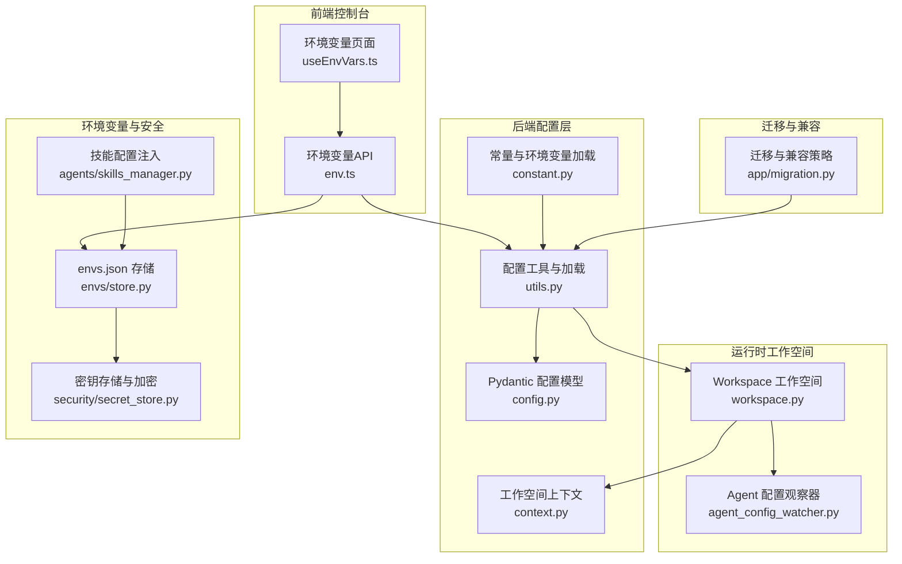
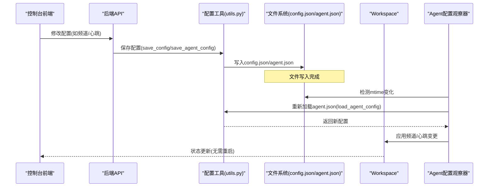
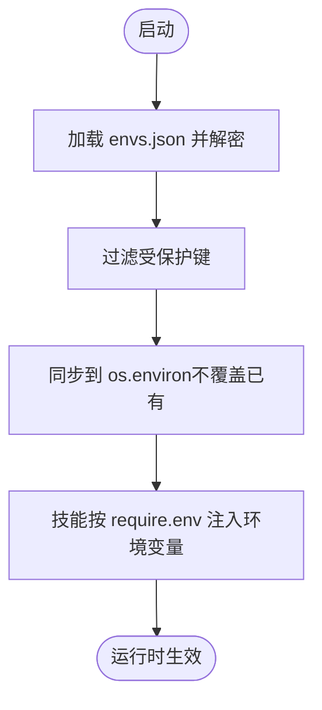
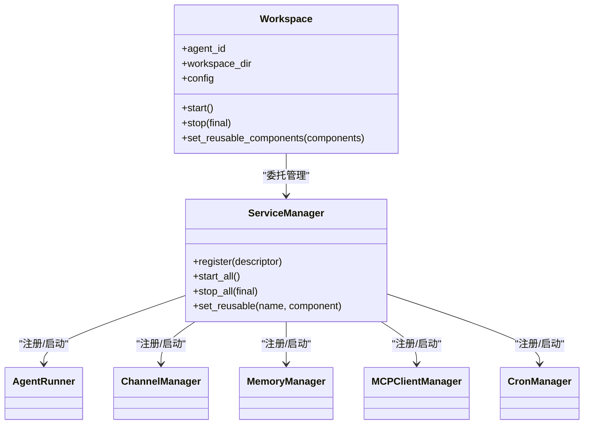
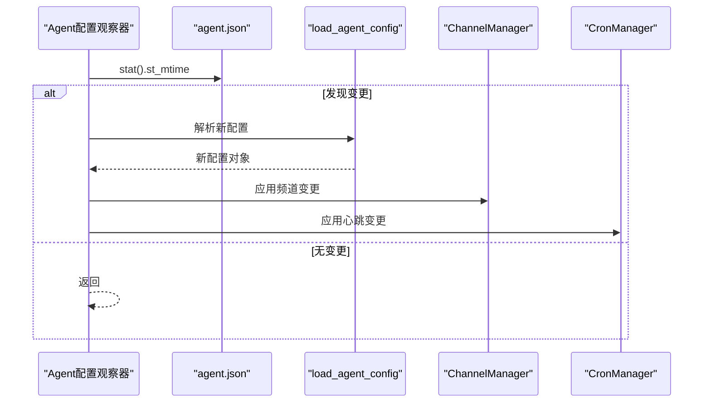
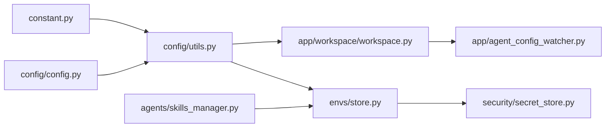

# 配置管理

<cite>
**本文引用的文件**
- [config.py](file://src/qwenpaw/config/config.py)
- [utils.py](file://src/qwenpaw/config/utils.py)
- [context.py](file://src/qwenpaw/config/context.py)
- [constant.py](file://src/qwenpaw/constant.py)
- [workspace.py](file://src/qwenpaw/app/workspace/workspace.py)
- [agent_config_watcher.py](file://src/qwenpaw/app/agent_config_watcher.py)
- [store.py](file://src/qwenpaw/envs/store.py)
- [secret_store.py](file://src/qwenpaw/security/secret_store.py)
- [skills_manager.py](file://src/qwenpaw/agents/skills_manager.py)
- [migration.py](file://src/qwenpaw/app/migration.py)
- [env.ts](file://console/src/api/types/env.ts)
- [env.ts](file://console/src/api/modules/env.ts)
- [useEnvVars.ts](file://console/src/pages/Settings/Environments/useEnvVars.ts)
- [config.zh.md](file://website/public/docs/config.zh.md)
- [channels.en.md](file://website/public/docs/channels.en.md)
- [config.en.md](file://website/public/docs/config.en.md)
- [heartbeat.en.md](file://website/public/docs/heartbeat.en.md)
- [SECURITY.md](file://SECURITY.md)
</cite>

## 目录
1. [简介](#简介)
2. [项目结构](#项目结构)
3. [核心组件](#核心组件)
4. [架构总览](#架构总览)
5. [详细组件分析](#详细组件分析)
6. [依赖分析](#依赖分析)
7. [性能考虑](#性能考虑)
8. [故障排查指南](#故障排查指南)
9. [结论](#结论)
10. [附录](#附录)

## 简介
本文件系统性梳理 QwenPaw 的配置管理体系，覆盖配置文件结构、环境变量注入与持久化、工作空间管理、配置优先级与继承覆盖规则、热重载与一致性保障、配置验证与回滚策略、以及安全与隔离机制。面向不同技术背景的读者，提供从高层到代码级的可视化说明与参考路径。

## 项目结构
QwenPaw 的配置体系由“根配置 + 多工作空间 + 环境变量层 + 安全存储层”构成，前端通过 Console 提供可视化配置入口，后端以 Pydantic 模型驱动配置校验与序列化，并在运行时通过工作空间与观察器实现热重载。

图表来源
- [config.py](file://src/qwenpaw/config/config.py)
- [utils.py](file://src/qwenpaw/config/utils.py)
- [context.py](file://src/qwenpaw/config/context.py)
- [constant.py](file://src/qwenpaw/constant.py)
- [workspace.py](file://src/qwenpaw/app/workspace/workspace.py)
- [agent_config_watcher.py](file://src/qwenpaw/app/agent_config_watcher.py)
- [store.py](file://src/qwenpaw/envs/store.py)
- [secret_store.py](file://src/qwenpaw/security/secret_store.py)
- [skills_manager.py](file://src/qwenpaw/agents/skills_manager.py)
- [migration.py](file://src/qwenpaw/app/migration.py)

章节来源
- [config.py](file://src/qwenpaw/config/config.py)
- [utils.py](file://src/qwenpaw/config/utils.py)
- [workspace.py](file://src/qwenpaw/app/workspace/workspace.py)

## 核心组件
- 配置模型与校验：基于 Pydantic 的配置模型定义了通道、心跳、运行参数、嵌入与内存压缩、工具结果压缩、安全等配置域，并提供默认值与范围约束。
- 配置加载与持久化：统一的加载/保存流程，具备 JSON 修复、字段归一化、备份回退能力。
- 工作空间与热重载：每个 Agent 对应独立工作空间，配置变更通过观察器检测并应用，支持频道与心跳的热更新。
- 环境变量：envs.json 持久化 + 进程注入；受保护键不注入进程；支持批量替换与同步。
- 安全存储：主密钥管理与 Fernet 加密，敏感字段透明加密；密钥可落盘或存 OS Keychain。
- 迁移与兼容：多代理结构迁移、旧版工作区迁移、向后兼容保留字段。

章节来源
- [config.py](file://src/qwenpaw/config/config.py)
- [utils.py](file://src/qwenpaw/config/utils.py)
- [store.py](file://src/qwenpaw/envs/store.py)
- [secret_store.py](file://src/qwenpaw/security/secret_store.py)
- [workspace.py](file://src/qwenpaw/app/workspace/workspace.py)
- [agent_config_watcher.py](file://src/qwenpaw/app/agent_config_watcher.py)
- [migration.py](file://src/qwenpaw/app/migration.py)

## 架构总览
下图展示配置从“磁盘文件/环境变量”到“运行时工作空间”的流转与热重载路径。

图表来源
- [utils.py](file://src/qwenpaw/config/utils.py)
- [agent_config_watcher.py](file://src/qwenpaw/app/agent_config_watcher.py)
- [workspace.py](file://src/qwenpaw/app/workspace/workspace.py)

## 详细组件分析

### 配置文件结构与优先级
- 根配置 config.json
  - 作用：全局代理概览、默认运行参数、默认路由、语言、系统提示文件列表、音频模式、转录提供者等。
  - 位置：由常量决定，默认位于工作目录。
  - 兼容性：保留历史字段以便降级兼容。
- 代理配置 agent.json
  - 作用：单个 Agent 的完整配置，包括通道、MCP、心跳、运行参数、LLM 路由、活跃模型、语言、系统提示文件、工具、安全等。
  - 位置：每个 Agent 的工作空间目录下。
  - 优先级：对新版本而言，以 agent.json 为准；根配置中的默认字段用于兼容旧版本。
- 配置加载优先级
  - agent.json > 根配置默认字段 > 默认值。
  - 通道白名单/黑名单：通过环境变量控制启用/禁用的通道集合，二者同时存在时白名单优先。

章节来源
- [config.py](file://src/qwenpaw/config/config.py)
- [utils.py](file://src/qwenpaw/config/utils.py)
- [constant.py](file://src/qwenpaw/constant.py)

### 环境变量配置与注入
- envs.json 持久化
  - 两层持久化策略：envs.json（磁盘）+ os.environ（进程）。envs.json 使用 Fernet 加密存储。
  - 启动时仅注入“非受保护键”，避免覆盖系统/运行时显式设置。
- 注入规则
  - 受保护键（如工作目录相关）不注入进程，但保留在 envs.json 中。
  - 进程已存在的键不会被覆盖。
- 技能配置注入
  - 技能可通过 SKILL.md 声明 require.env，匹配的配置键会被注入为环境变量；未声明的键仅通过完整 JSON 变量可用。
- 前端管理
  - Console 提供环境变量列表与批量保存接口，后端以 PUT 替换全部键。

图表来源
- [store.py](file://src/qwenpaw/envs/store.py)
- [skills_manager.py](file://src/qwenpaw/agents/skills_manager.py)
- [env.ts](file://console/src/api/modules/env.ts)
- [useEnvVars.ts](file://console/src/pages/Settings/Environments/useEnvVars.ts)

章节来源
- [store.py](file://src/qwenpaw/envs/store.py)
- [skills_manager.py](file://src/qwenpaw/agents/skills_manager.py)
- [env.ts](file://console/src/api/modules/env.ts)
- [useEnvVars.ts](file://console/src/pages/Settings/Environments/useEnvVars.ts)

### 工作空间管理机制
- 每个 Agent 对应一个独立 Workspace，内部包含 Runner、ChannelManager、MemoryManager、MCPClientManager、CronManager 等服务。
- Workspace 在启动前加载 Agent 的 agent.json；支持“可复用组件”热重载，避免完全重启。
- 服务注册采用 ServiceDescriptor，明确初始化顺序与并发策略。

图表来源
- [workspace.py](file://src/qwenpaw/app/workspace/workspace.py)

章节来源
- [workspace.py](file://src/qwenpaw/app/workspace/workspace.py)

### 配置热重载与一致性
- Agent 配置观察器
  - 定期检查 agent.json 的修改时间，解析新配置后应用到频道与心跳。
- 心跳配置
  - 支持 cron 表达式与间隔字符串；activeHours 控制每日运行窗口。
- 一致性保障
  - 观察器在应用变更前确保配置解析成功；失败则记录异常并跳过本次更新。
  - 工作空间停止时可选择是否清理可复用组件，以支持热重载场景。

图表来源
- [agent_config_watcher.py](file://src/qwenpaw/app/agent_config_watcher.py)
- [utils.py](file://src/qwenpaw/config/utils.py)

章节来源
- [agent_config_watcher.py](file://src/qwenpaw/app/agent_config_watcher.py)
- [heartbeat.en.md](file://website/public/docs/heartbeat.en.md)

### 配置验证、错误处理与回滚
- 验证与修复
  - 读取时使用 JSON 修复库尝试修复常见语法问题；若仍失败则备份原文件并回退到默认配置。
- 字段移除策略
  - 校验失败时尝试按错误位置逐级删除字段，再重试验证；若仍失败则备份并回退。
- 备份策略
  - 失败时生成带短 ID 的 .bak 文件，便于人工恢复。
- 运行时错误
  - 观察器解析失败时记录异常日志并跳过更新，避免影响当前实例。

章节来源
- [utils.py](file://src/qwenpaw/config/utils.py)

### 配置迁移、版本兼容与升级策略
- 多代理结构迁移
  - 将旧版单代理配置迁移到新的多代理结构，保留历史字段以便降级兼容。
- 工作区迁移
  - 自动迁移技能、聊天记录、作业等资源至新工作区布局。
- 升级策略
  - 保留根配置中的历史字段，确保旧版本可读取；新版本优先读取 agent.json。
  - 迁移完成后打印关键信息，便于确认迁移结果。

章节来源
- [migration.py](file://src/qwenpaw/app/migration.py)
- [config.py](file://src/qwenpaw/config/config.py)

### 环境隔离、多租户支持与安全保护
- 隔离模型
  - 不将同一实例视为多租户边界；同一实例内的认证调用被视为可信操作员。
  - 推荐“一人一机/一用户”或严格隔离部署。
- 环境变量隔离
  - 受保护键不注入进程，避免跨用户/跨实例污染。
- 密钥安全
  - 主密钥优先存 OS Keychain，失败时落盘；敏感字段透明加密存储。
- 技能与工具安全
  - 技能安装即进入信任边界；建议仅启用可信技能；Console 提供安全配置入口。

章节来源
- [SECURITY.md](file://SECURITY.md)
- [store.py](file://src/qwenpaw/envs/store.py)
- [secret_store.py](file://src/qwenpaw/security/secret_store.py)

## 依赖分析
- 组件耦合
  - 配置工具依赖常量与模型；工作空间依赖配置工具与服务工厂；观察器依赖配置工具与工作空间。
- 外部依赖
  - JSON 修复库、Fernet 加密、OS Keychain（可选）、容器检测。
- 潜在循环
  - 通过延迟导入与模块职责划分避免循环依赖。

图表来源
- [constant.py](file://src/qwenpaw/constant.py)
- [utils.py](file://src/qwenpaw/config/utils.py)
- [workspace.py](file://src/qwenpaw/app/workspace/workspace.py)
- [agent_config_watcher.py](file://src/qwenpaw/app/agent_config_watcher.py)
- [store.py](file://src/qwenpaw/envs/store.py)
- [secret_store.py](file://src/qwenpaw/security/secret_store.py)
- [skills_manager.py](file://src/qwenpaw/agents/skills_manager.py)

## 性能考虑
- 配置读取
  - 使用 JSON 修复与字段归一化减少解析失败成本；缓存默认配置降低空配置开销。
- 热重载
  - 2 秒轮询检测 agent.json 变更，避免频繁 IO；仅在变更时解析与应用。
- 并发与顺序
  - 服务注册明确优先级与并发策略，避免阻塞关键路径。

## 故障排查指南
- 配置损坏
  - 若 config.json/agent.json 无法解析，系统会备份并回退默认配置；检查备份文件定位问题。
- 热重载不生效
  - 确认观察器正常运行且 agent.json 变更被检测；查看日志中解析异常信息。
- 环境变量未生效
  - 检查是否为受保护键；确认进程已有同名键未被覆盖；核对 envs.json 是否正确写入。
- 密钥不可用
  - 检查主密钥来源（Keychain/文件）；确认权限与格式正确；必要时重新生成主密钥。

章节来源
- [utils.py](file://src/qwenpaw/config/utils.py)
- [agent_config_watcher.py](file://src/qwenpaw/app/agent_config_watcher.py)
- [store.py](file://src/qwenpaw/envs/store.py)
- [secret_store.py](file://src/qwenpaw/security/secret_store.py)

## 结论
QwenPaw 的配置管理以“模型驱动 + 文件持久化 + 观察器热重载 + 安全存储”为核心，既满足多代理与多工作空间的复杂场景，又通过兼容性与回滚策略保障升级稳定性。结合前端 Console 的可视化配置与受控注入机制，可在保证安全的前提下实现灵活高效的配置管理。

## 附录
- 配置字段参考
  - agent.json 字段清单与说明：[配置文档](file://website/public/docs/config.zh.md)
  - 通道配置字段清单：[频道文档](file://website/public/docs/channels.en.md)
  - 心跳配置说明：[心跳文档](file://website/public/docs/heartbeat.en.md)
- 环境变量 API 类型
  - [EnvVar 类型定义](file://console/src/api/types/env.ts)
  - [环境变量 API](file://console/src/api/modules/env.ts)
  - [环境变量 Hook](file://console/src/pages/Settings/Environments/useEnvVars.ts)