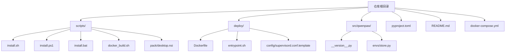
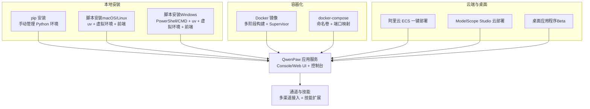
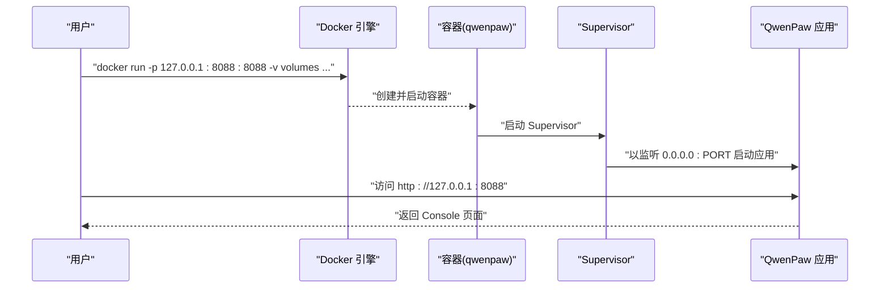
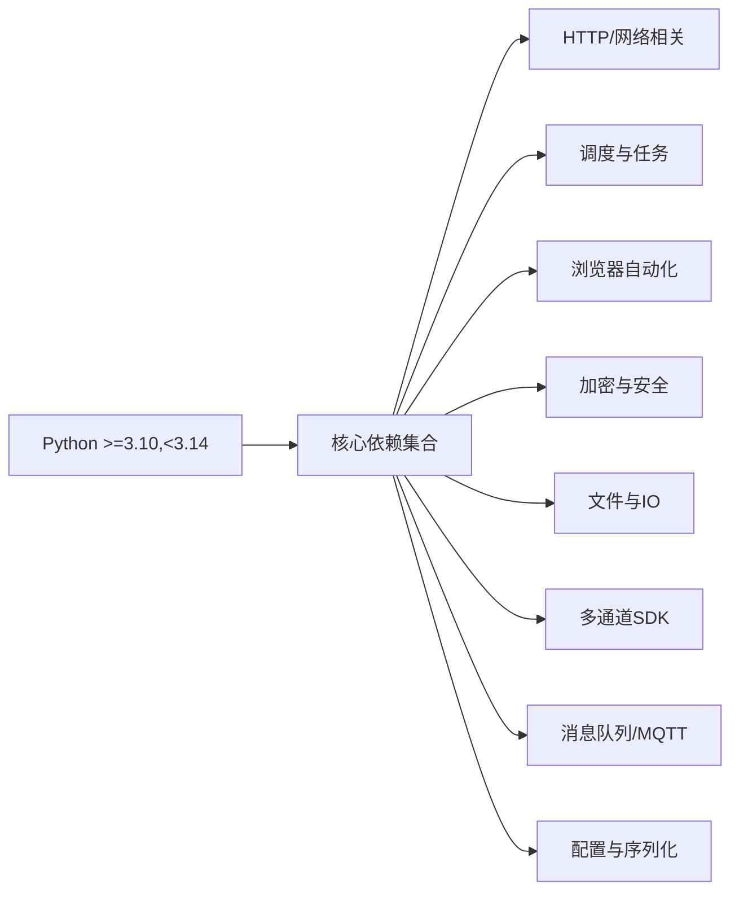

# 安装与部署选项

<cite>
**本文引用的文件**
- [README.md](file://README.md)
- [pyproject.toml](file://pyproject.toml)
- [setup.py](file://setup.py)
- [scripts/README.md](file://scripts/README.md)
- [scripts/install.sh](file://scripts/install.sh)
- [scripts/install.ps1](file://scripts/install.ps1)
- [scripts/install.bat](file://scripts/install.bat)
- [scripts/docker_build.sh](file://scripts/docker_build.sh)
- [deploy/Dockerfile](file://deploy/Dockerfile)
- [deploy/entrypoint.sh](file://deploy/entrypoint.sh)
- [deploy/config/supervisord.conf.template](file://deploy/config/supervisord.conf.template)
- [docker-compose.yml](file://docker-compose.yml)
- [scripts/pack/desktop.nsi](file://scripts/pack/desktop.nsi)
- [src/qwenpaw/__version__.py](file://src/qwenpaw/__version__.py)
- [src/qwenpaw/envs/store.py](file://src/qwenpaw/envs/store.py)
</cite>

## 目录
1. [简介](#简介)
2. [项目结构](#项目结构)
3. [核心组件](#核心组件)
4. [架构总览](#架构总览)
5. [详细组件分析](#详细组件分析)
6. [依赖分析](#依赖分析)
7. [性能考虑](#性能考虑)
8. [故障排查指南](#故障排查指南)
9. [结论](#结论)
10. [附录](#附录)

## 简介
本文件面向不同技术背景与运维需求的用户，系统化梳理 QwenPaw 的六种安装与部署方式：pip 安装、脚本安装（macOS/Linux/Windows）、Docker 部署、阿里云 ECS 一键部署、ModelScope 云部署以及桌面应用程序（Beta）。文档覆盖系统要求、依赖关系、网络环境、配置项（环境变量、端口、存储卷）、适用场景、安装验证步骤、常见问题与生产实践建议，帮助您快速、稳定地完成部署。

## 项目结构
围绕安装与部署的关键目录与文件如下：
- 安装脚本：scripts/install.sh（macOS/Linux）、scripts/install.ps1（PowerShell）、scripts/install.bat（CMD）
- 容器化：deploy/Dockerfile、deploy/entrypoint.sh、deploy/config/supervisord.conf.template、docker-compose.yml
- 打包与构建：scripts/README.md、scripts/docker_build.sh、scripts/pack/desktop.nsi
- 包元数据与入口：pyproject.toml、setup.py、src/qwenpaw/__version__.py
- 环境变量管理：src/qwenpaw/envs/store.py

图表来源
- [scripts/install.sh:1-340](file://scripts/install.sh#L1-L340)
- [scripts/install.ps1:1-477](file://scripts/install.ps1#L1-L477)
- [scripts/install.bat:1-557](file://scripts/install.bat#L1-L557)
- [scripts/docker_build.sh:1-32](file://scripts/docker_build.sh#L1-L32)
- [deploy/Dockerfile:1-103](file://deploy/Dockerfile#L1-L103)
- [deploy/entrypoint.sh:1-10](file://deploy/entrypoint.sh#L1-L10)
- [deploy/config/supervisord.conf.template:1-40](file://deploy/config/supervisord.conf.template#L1-L40)
- [docker-compose.yml:1-23](file://docker-compose.yml#L1-L23)
- [pyproject.toml:1-111](file://pyproject.toml#L1-L111)
- [src/qwenpaw/__version__.py:1-3](file://src/qwenpaw/__version__.py#L1-L3)
- [src/qwenpaw/envs/store.py:220-262](file://src/qwenpaw/envs/store.py#L220-L262)

章节来源
- [README.md:104-120](file://README.md#L104-L120)
- [scripts/README.md:1-53](file://scripts/README.md#L1-L53)

## 核心组件
- 包与入口
  - 包元数据与可选特性在 pyproject.toml 中定义，包含 Python 版本范围、核心依赖、可选 extras（如本地模型后端、Whisper 等）。
  - CLI 入口通过项目脚本映射到 qwenpaw.cli.main:cli。
- 安装脚本
  - 统一通过 uv 创建隔离虚拟环境并安装 QwenPaw 及前端资源；支持从 PyPI 或源码安装，并可指定 extras。
- 容器镜像
  - 多阶段构建：先构建前端，再安装 Python 应用；内置 Supervisor 管理应用与无头浏览器环境；支持通过环境变量控制通道启用/禁用、端口、容器运行标记等。
- 桌面应用
  - 基于打包脚本生成安装包，提供一键启动与浏览器自动打开能力。

章节来源
- [pyproject.toml:1-111](file://pyproject.toml#L1-L111)
- [setup.py:1-5](file://setup.py#L1-L5)
- [scripts/install.sh:1-340](file://scripts/install.sh#L1-L340)
- [scripts/install.ps1:1-477](file://scripts/install.ps1#L1-L477)
- [scripts/install.bat:1-557](file://scripts/install.bat#L1-L557)
- [deploy/Dockerfile:1-103](file://deploy/Dockerfile#L1-L103)
- [deploy/entrypoint.sh:1-10](file://deploy/entrypoint.sh#L1-L10)
- [deploy/config/supervisord.conf.template:1-40](file://deploy/config/supervisord.conf.template#L1-L40)
- [scripts/docker_build.sh:1-32](file://scripts/docker_build.sh#L1-L32)
- [scripts/pack/desktop.nsi:1-57](file://scripts/pack/desktop.nsi#L1-L57)
- [src/qwenpaw/__version__.py:1-3](file://src/qwenpaw/__version__.py#L1-L3)

## 架构总览
下图展示六种安装方式的总体架构与交互关系：

图表来源
- [README.md:104-120](file://README.md#L104-L120)
- [deploy/Dockerfile:1-103](file://deploy/Dockerfile#L1-L103)
- [docker-compose.yml:1-23](file://docker-compose.yml#L1-L23)
- [scripts/install.sh:1-340](file://scripts/install.sh#L1-L340)
- [scripts/install.ps1:1-477](file://scripts/install.ps1#L1-L477)
- [scripts/install.bat:1-557](file://scripts/install.bat#L1-L557)

## 详细组件分析

### 方式一：pip 安装
- 适用场景
  - 已有 Python 环境且希望最小化依赖的用户；便于与现有开发环境集成。
- 系统要求与依赖
  - Python 版本范围：>=3.10,<3.14。
  - 核心依赖由 pyproject.toml 定义，包含 HTTP 客户端、调度器、浏览器自动化、加密与 YAML 等。
- 安装流程
  - 使用 pip 安装 qwenpaw；随后执行初始化与启动命令。
- 配置要点
  - API 密钥需在 Console 或通过初始化流程配置；也可通过环境变量注入。
- 验证步骤
  - 启动后访问本地 Console 地址进行模型与通道配置。
- 常见问题
  - Python 版本不满足或依赖冲突时，优先检查版本范围与第三方库兼容性。

章节来源
- [README.md:104-117](file://README.md#L104-L117)
- [pyproject.toml:6-46](file://pyproject.toml#L6-L46)

### 方式二：脚本安装（macOS/Linux）
- 适用场景
  - 不想手动管理 Python 环境；需要自动下载 uv 并创建隔离环境。
- 系统要求与依赖
  - 支持 Linux/macOS；自动选择 PyPI 镜像（国内/海外）；可选 extras（如本地模型后端）。
- 安装流程
  - 通过 curl 获取安装脚本并执行；支持指定版本、从源码安装、附加 extras。
  - 自动准备前端资源（复制或构建），创建包装器脚本并更新 PATH。
- 配置要点
  - 可通过 --extras 传入多个可选特性；安装完成后在新终端中执行初始化与启动。
- 验证步骤
  - 新终端执行 qwenpaw init 与 qwenpaw app；访问本地 Console。
- 常见问题
  - 网络受限导致镜像选择异常或 uv 下载失败时，按提示手动安装 uv 或更换网络。

章节来源
- [README.md:122-186](file://README.md#L122-L186)
- [scripts/install.sh:1-340](file://scripts/install.sh#L1-L340)
- [pyproject.toml:75-103](file://pyproject.toml#L75-L103)

### 方式三：脚本安装（Windows）
- 适用场景
  - Windows 用户希望零配置安装；支持 PowerShell 与 CMD 两种方式。
- 系统要求与依赖
  - 自动检测并安装 uv（优先 astral.sh，不可达时回退至 GitHub Releases）；自动创建虚拟环境。
- 安装流程
  - PowerShell：通过 iwr 下载并执行安装脚本；支持 -FromSource/-Version/-Extras/-UvPath 等参数。
  - CMD：install.bat 提供相同功能的批处理实现。
- 配置要点
  - 在受限环境中（如企业 LTSC Constrained Language Mode）可能无法自动更新 PATH，需手动配置。
- 验证步骤
  - 新终端执行 qwenpaw init 与 qwenpaw app；访问本地 Console。
- 常见问题
  - PowerShell 执行策略限制、uv 下载失败、PATH 未更新等问题，详见安装脚本中的提示与回退逻辑。

章节来源
- [README.md:144-186](file://README.md#L144-L186)
- [scripts/install.ps1:1-477](file://scripts/install.ps1#L1-L477)
- [scripts/install.bat:1-557](file://scripts/install.bat#L1-L557)

### 方式四：Docker 部署
- 适用场景
  - 需要隔离运行环境、统一配置与持久化存储；便于横向扩展与 CI/CD 集成。
- 系统要求与依赖
  - 需要 Docker 环境；镜像内置 Python、Chromium 与运行时依赖。
- 镜像与运行
  - 多阶段构建：前端构建与应用打包分离；Supervisor 管理 dbus、xvfb、xfce4 与应用进程。
  - 默认暴露 8088 端口；可通过环境变量覆盖；支持通过卷挂载持久化工作目录与密钥目录。
- 网络与服务互通
  - 容器内 localhost 指向容器自身；连接宿主机服务（如 Ollama/LM Studio）时，使用 host.docker.internal 或 host 网络模式。
- 配置要点
  - 环境变量：QWENPAW_PORT、QWENPAW_ENABLED_CHANNELS、QWENPAW_DISABLED_CHANNELS、QWENPAW_RUNNING_IN_CONTAINER 等。
  - 卷：qwenpaw-data（工作目录）、qwenpaw-secrets（密钥目录）。
- 验证步骤
  - 启动后访问 http://127.0.0.1:8088；在 Console 中配置模型与通道。
- 常见问题
  - 端口冲突、容器网络访问宿主机失败、卷权限问题等，按提示调整端口映射与网络模式。

图表来源
- [deploy/Dockerfile:1-103](file://deploy/Dockerfile#L1-L103)
- [deploy/entrypoint.sh:1-10](file://deploy/entrypoint.sh#L1-L10)
- [deploy/config/supervisord.conf.template:1-40](file://deploy/config/supervisord.conf.template#L1-L40)
- [docker-compose.yml:1-23](file://docker-compose.yml#L1-L23)

章节来源
- [README.md:230-272](file://README.md#L230-L272)
- [deploy/Dockerfile:1-103](file://deploy/Dockerfile#L1-L103)
- [deploy/entrypoint.sh:1-10](file://deploy/entrypoint.sh#L1-L10)
- [deploy/config/supervisord.conf.template:1-40](file://deploy/config/supervisord.conf.template#L1-L40)
- [docker-compose.yml:1-23](file://docker-compose.yml#L1-L23)
- [scripts/docker_build.sh:1-32](file://scripts/docker_build.sh#L1-L32)

### 方式五：阿里云 ECS 一键部署
- 适用场景
  - 需要在阿里云 ECS 上快速上线，无需编写部署脚本。
- 流程
  - 通过官方一键部署链接进入实例创建页面，按指引完成部署。
- 验证步骤
  - 部署完成后，通过公网 IP 访问 Console 并完成初始化配置。

章节来源
- [README.md:275-278](file://README.md#L275-L278)

### 方式六：ModelScope 云部署
- 适用场景
  - 无需本地安装，直接在 ModelScope Studio 中一键克隆并启动。
- 流程
  - 在 Studio 中克隆 QwenPaw 项目，设置为非公开，即可在线体验。
- 验证步骤
  - 打开 Studio 提供的在线地址，完成初始化与配置。

章节来源
- [README.md:281-285](file://README.md#L281-L285)

### 方式七：桌面应用程序（Beta）
- 适用场景
  - 不熟悉命令行或希望“双击即用”的用户；提供跨平台安装包。
- 功能与限制
  - 首次启动可能较慢（初始化 Python 环境与加载依赖）；当前处于 Beta 阶段，部分功能可能不稳定。
- 下载与运行
  - 从 GitHub Releases 下载对应平台安装包；首次运行时注意系统安全提示。
- 验证步骤
  - 启动后自动打开浏览器访问 Console；完成初始化与配置。

章节来源
- [README.md:287-330](file://README.md#L287-L330)
- [scripts/pack/desktop.nsi:1-57](file://scripts/pack/desktop.nsi#L1-L57)

## 依赖分析
- Python 版本与核心依赖
  - Python 版本范围：>=3.10,<3.14。
  - 核心依赖涵盖 HTTP 客户端、调度任务、浏览器自动化、加密与 YAML、通道 SDK、MQTT、矩阵、Telegram 等。
- 可选依赖与特性
  - local/ollama/llamacpp/mlx/whisper/full 等 extras，用于启用本地模型后端、Whisper 语音识别等功能。
- 安装脚本与包管理
  - 脚本通过 uv 创建隔离虚拟环境并安装；Docker 镜像内置 Python 与运行时工具链。

图表来源
- [pyproject.toml:6-46](file://pyproject.toml#L6-L46)
- [pyproject.toml:75-103](file://pyproject.toml#L75-L103)

章节来源
- [pyproject.toml:6-46](file://pyproject.toml#L6-L46)
- [pyproject.toml:75-103](file://pyproject.toml#L75-L103)

## 性能考虑
- 本地安装（pip/脚本）
  - 优先使用现代 Python 版本上限以获得更好的性能与兼容性；避免不必要的 extras 以减少安装体积。
- Docker 部署
  - 使用预构建镜像并合理设置卷，避免频繁 I/O；在生产中启用健康检查与日志聚合。
- 桌面应用
  - 首次启动时间受依赖加载影响，建议在空闲时段进行；后续启动更快。
- 通道与浏览器
  - 若启用浏览器自动化通道，确保容器或本地环境具备无头浏览器支持与字体依赖。

## 故障排查指南
- 安装脚本相关
  - macOS/Linux：若前端构建失败，确认 npm 可用；若 uv 下载失败，按提示手动安装 uv 或更换网络。
  - Windows：PowerShell 执行策略限制、Constrained Language Mode 导致 PATH 更新失败时，按脚本提示手动配置。
- Docker 相关
  - 端口冲突：修改映射端口或停止占用进程；容器无法访问宿主机服务：使用 host.docker.internal 或 host 网络模式。
  - 卷权限：确保宿主目录对容器用户可读写。
- 环境变量与密钥
  - 通过 Console 的“环境变量”页面批量维护；或在启动时通过环境变量注入（如 API Key）。
- 常见症状与定位
  - Console 无法访问：检查端口映射与防火墙；应用启动失败：查看容器日志与 Supervisor 状态。
  - 通道无法连接：核对通道配置与凭据；若使用代理，确保网络可达。

章节来源
- [scripts/install.sh:1-340](file://scripts/install.sh#L1-L340)
- [scripts/install.ps1:1-477](file://scripts/install.ps1#L1-L477)
- [scripts/install.bat:1-557](file://scripts/install.bat#L1-L557)
- [deploy/config/supervisord.conf.template:1-40](file://deploy/config/supervisord.conf.template#L1-L40)
- [src/qwenpaw/envs/store.py:220-262](file://src/qwenpaw/envs/store.py#L220-L262)

## 结论
QwenPaw 提供了从本地到云端、从命令行到图形界面的多样化安装与部署路径。对于追求灵活性与可控性的用户，推荐使用 pip 或脚本安装；对于需要标准化与可移植性的团队，Docker 是首选；对于快速试用与云端体验，ModelScope 与 ECS 一键部署可显著降低门槛；桌面应用适合非技术用户。结合本文的系统要求、配置要点与故障排查建议，您可以根据实际场景选择最适合的方案。

## 附录

### 环境变量与配置清单
- 通用
  - QWENPAW_PORT：应用监听端口（默认 8088）
  - QWENPAW_WORKING_DIR：工作目录
  - QWENPAW_SECRET_DIR：密钥目录
  - QWENPAW_ENABLED_CHANNELS / QWENPAW_DISABLED_CHANNELS：通道白名单/黑名单
  - QWENPAW_RUNNING_IN_CONTAINER：容器运行标记
- Docker
  - 通过 -e 或 --env-file 注入 API Key 等敏感配置
  - 通过卷持久化工作目录与密钥目录
- Console
  - 通过 Console 的“环境变量”页面进行批量维护与管理

章节来源
- [deploy/Dockerfile:14-26](file://deploy/Dockerfile#L14-L26)
- [deploy/entrypoint.sh:1-10](file://deploy/entrypoint.sh#L1-L10)
- [deploy/config/supervisord.conf.template:14-21](file://deploy/config/supervisord.conf.template#L14-L21)
- [src/qwenpaw/envs/store.py:220-262](file://src/qwenpaw/envs/store.py#L220-L262)