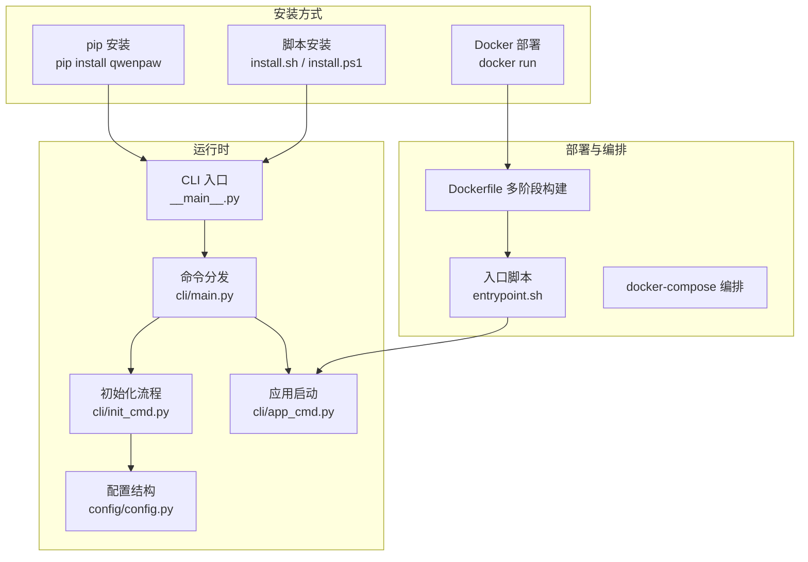
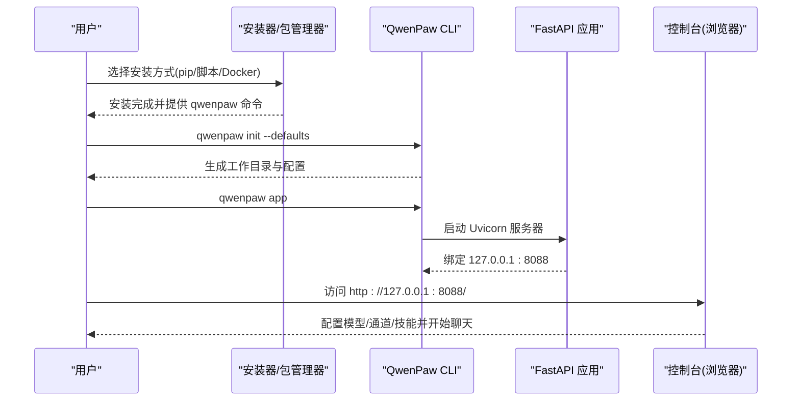
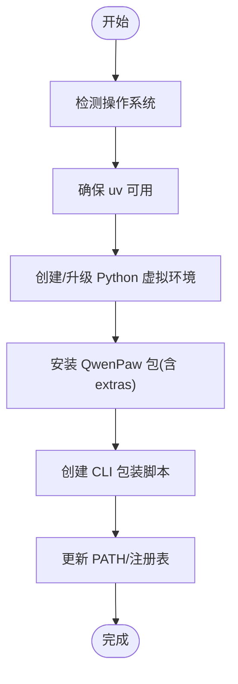
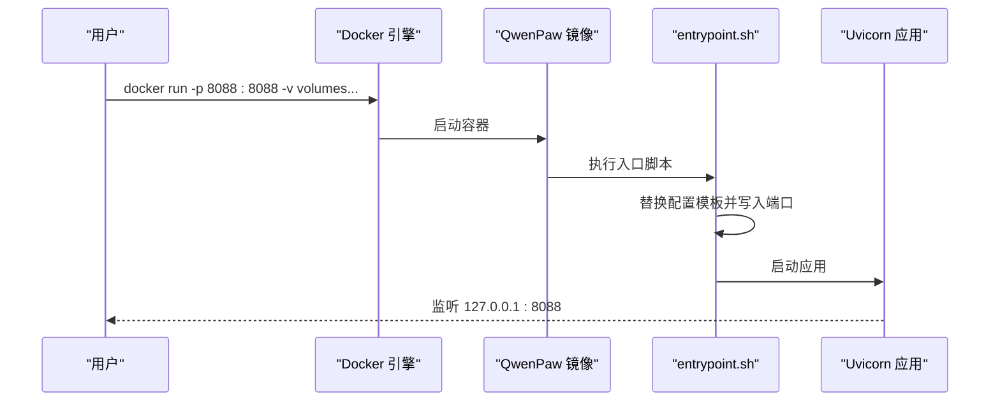
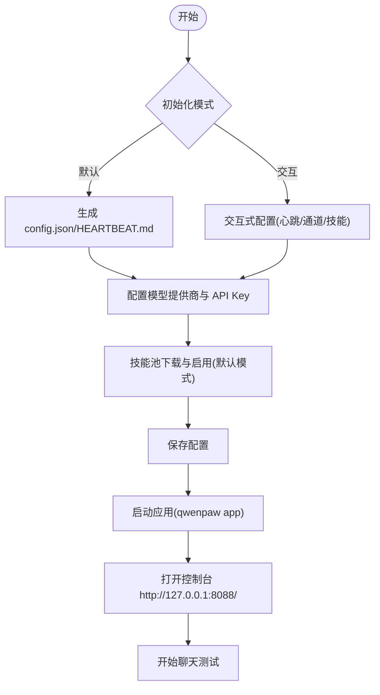
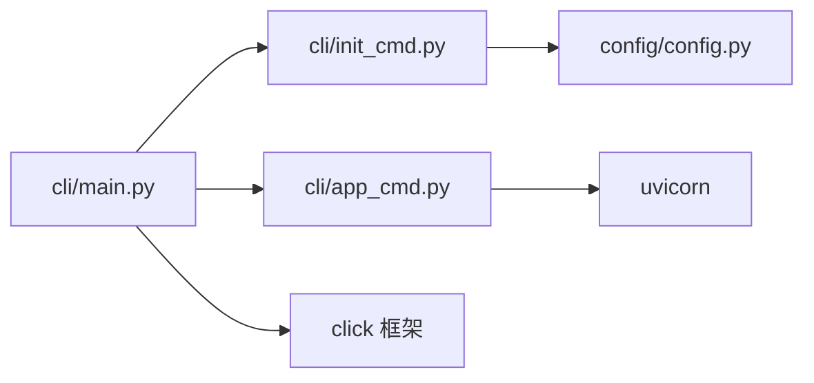

# 快速开始指南

<cite>
**本文引用的文件**
- [README.md](file://README.md)
- [scripts/README.md](file://scripts/README.md)
- [scripts/install.sh](file://scripts/install.sh)
- [scripts/install.ps1](file://scripts/install.ps1)
- [deploy/Dockerfile](file://deploy/Dockerfile)
- [deploy/entrypoint.sh](file://deploy/entrypoint.sh)
- [docker-compose.yml](file://docker-compose.yml)
- [src/qwenpaw/__main__.py](file://src/qwenpaw/__main__.py)
- [src/qwenpaw/cli/main.py](file://src/qwenpaw/cli/main.py)
- [src/qwenpaw/cli/init_cmd.py](file://src/qwenpaw/cli/init_cmd.py)
- [src/qwenpaw/cli/app_cmd.py](file://src/qwenpaw/cli/app_cmd.py)
- [src/qwenpaw/config/config.py](file://src/qwenpaw/config/config.py)
- [website/public/docs/quickstart.en.md](file://website/public/docs/quickstart.en.md)
- [website/public/docs/config.en.md](file://website/public/docs/config.en.md)
</cite>

## 目录
1. [简介](#简介)
2. [项目结构](#项目结构)
3. [核心组件](#核心组件)
4. [架构总览](#架构总览)
5. [详细组件分析](#详细组件分析)
6. [依赖关系分析](#依赖关系分析)
7. [性能考虑](#性能考虑)
8. [故障排除指南](#故障排除指南)
9. [结论](#结论)
10. [附录](#附录)

## 简介
本指南面向首次接触 QwenPaw 的用户，提供三种最简单的安装方式与完整的初始化流程，帮助你在最短时间内完成安装、配置与体验核心功能。无论你是希望本地开发、容器化部署，还是通过脚本一键安装，都能在本指南中找到适合你的路径。

## 项目结构
QwenPaw 采用“Python 后端 + 前端控制台”的架构，核心运行时由 Python CLI 提供，前端控制台通过浏览器访问。安装方式包括 pip、脚本安装与 Docker 三种主流方式；初始化流程涵盖工作目录生成、模型配置、技能与通道设置等关键步骤。

**图表来源**
- [src/qwenpaw/__main__.py:1-7](file://src/qwenpaw/__main__.py#L1-L7)
- [src/qwenpaw/cli/main.py:95-171](file://src/qwenpaw/cli/main.py#L95-L171)
- [src/qwenpaw/cli/init_cmd.py:119-523](file://src/qwenpaw/cli/init_cmd.py#L119-L523)
- [src/qwenpaw/cli/app_cmd.py:15-112](file://src/qwenpaw/cli/app_cmd.py#L15-L112)
- [deploy/Dockerfile:1-103](file://deploy/Dockerfile#L1-L103)
- [deploy/entrypoint.sh:1-10](file://deploy/entrypoint.sh#L1-L10)
- [docker-compose.yml:1-23](file://docker-compose.yml#L1-L23)

**章节来源**
- [README.md:104-273](file://README.md#L104-L273)
- [website/public/docs/quickstart.en.md:1-392](file://website/public/docs/quickstart.en.md#L1-L392)

## 核心组件
- CLI 入口与命令分发：通过 Python 包入口调用 CLI，并按需延迟加载子命令，支持版本输出、主机与端口参数传递。
- 初始化命令：交互式或默认模式生成工作目录、配置文件、心跳查询与技能池，必要时要求安全确认与遥测同意。
- 应用启动命令：基于 Uvicorn 启动 FastAPI 应用，默认监听 127.0.0.1:8088，支持日志级别与访问日志过滤。
- 配置系统：定义全局与代理配置结构，支持多通道、MCP、心跳、运行时参数、安全策略等字段。

**章节来源**
- [src/qwenpaw/__main__.py:1-7](file://src/qwenpaw/__main__.py#L1-L7)
- [src/qwenpaw/cli/main.py:58-171](file://src/qwenpaw/cli/main.py#L58-L171)
- [src/qwenpaw/cli/init_cmd.py:119-523](file://src/qwenpaw/cli/init_cmd.py#L119-L523)
- [src/qwenpaw/cli/app_cmd.py:15-112](file://src/qwenpaw/cli/app_cmd.py#L15-L112)
- [src/qwenpaw/config/config.py:39-200](file://src/qwenpaw/config/config.py#L39-L200)

## 架构总览
下图展示了三种安装方式如何最终指向统一的运行时与控制台界面：

**图表来源**
- [src/qwenpaw/cli/init_cmd.py:119-523](file://src/qwenpaw/cli/init_cmd.py#L119-L523)
- [src/qwenpaw/cli/app_cmd.py:15-112](file://src/qwenpaw/cli/app_cmd.py#L15-L112)
- [README.md:104-118](file://README.md#L104-L118)

## 详细组件分析

### 方式一：pip 安装
- 适用场景：熟悉 Python 的开发者，偏好手动管理虚拟环境与依赖。
- 步骤要点：
  - 安装包后执行初始化与启动命令。
  - 默认监听地址为 127.0.0.1:8088。
- 注意事项：
  - 需要 Python 3.10 ~ 3.13。
  - 可选创建并激活虚拟环境后再安装。
- 初始化与启动命令参考：
  - 初始化：qwenpaw init --defaults
  - 启动：qwenpaw app

**章节来源**
- [README.md:106-117](file://README.md#L106-L117)
- [website/public/docs/quickstart.en.md:25-67](file://website/public/docs/quickstart.en.md#L25-L67)

### 方式二：脚本安装（macOS/Linux/Windows）
- 适用场景：不希望手动配置 Python 环境的用户，脚本自动处理 uv、虚拟环境与依赖。
- 步骤要点：
  - macOS/Linux 使用 install.sh；Windows 使用 install.ps1 或 install.bat。
  - 自动检测 uv 并在缺失时下载安装；自动创建虚拟环境并安装 QwenPaw。
  - 支持 extras（如 Ollama）与指定版本安装。
- 注意事项：
  - Windows LTSC/受限策略可能影响环境变量写入，需手动添加 PATH。
  - 脚本会自动更新 shell 配置文件或注册表（Windows）。
- 初始化与启动命令参考：
  - 初始化：qwenpaw init --defaults
  - 启动：qwenpaw app

**图表来源**
- [scripts/install.sh:104-134](file://scripts/install.sh#L104-L134)
- [scripts/install.sh:136-147](file://scripts/install.sh#L136-L147)
- [scripts/install.sh:216-241](file://scripts/install.sh#L216-L241)
- [scripts/install.sh:256-277](file://scripts/install.sh#L256-L277)
- [scripts/install.sh:279-340](file://scripts/install.sh#L279-L340)
- [scripts/install.ps1:85-193](file://scripts/install.ps1#L85-L193)
- [scripts/install.ps1:195-210](file://scripts/install.ps1#L195-L210)
- [scripts/install.ps1:313-320](file://scripts/install.ps1#L313-L320)
- [scripts/install.ps1:333-373](file://scripts/install.ps1#L333-L373)
- [scripts/install.ps1:375-450](file://scripts/install.ps1#L375-L450)

**章节来源**
- [README.md:122-187](file://README.md#L122-L187)
- [scripts/README.md:1-53](file://scripts/README.md#L1-L53)
- [scripts/install.sh:1-340](file://scripts/install.sh#L1-L340)
- [scripts/install.ps1:1-477](file://scripts/install.ps1#L1-L477)

### 方式三：Docker 部署
- 适用场景：容器化部署、生产环境迁移、隔离环境。
- 步骤要点：
  - 拉取镜像并运行，映射数据卷与端口。
  - 数据卷：工作目录与机密目录分离，便于持久化与安全隔离。
  - 可通过环境变量注入 API 密钥或使用 .env 文件。
- 注意事项：
  - 容器内 localhost 指向容器自身，连接宿主机服务需使用 host.docker.internal 或 host 网络。
  - 镜像内置 Supervisor 管理进程，入口脚本负责替换模板并启动。

**图表来源**
- [deploy/Dockerfile:70-102](file://deploy/Dockerfile#L70-L102)
- [deploy/entrypoint.sh:1-10](file://deploy/entrypoint.sh#L1-L10)
- [docker-compose.yml:9-23](file://docker-compose.yml#L9-L23)
- [README.md:230-272](file://README.md#L230-L272)

**章节来源**
- [README.md:230-272](file://README.md#L230-L272)
- [deploy/Dockerfile:1-103](file://deploy/Dockerfile#L1-L103)
- [deploy/entrypoint.sh:1-10](file://deploy/entrypoint.sh#L1-L10)
- [docker-compose.yml:1-23](file://docker-compose.yml#L1-L23)

### 初始化流程（配置 API 密钥、模型参数、启动服务）
- 初始化命令支持默认模式与交互模式：
  - 默认模式：自动生成配置、复制 MD 文件、下载技能池并启用全部技能。
  - 交互模式：可配置心跳间隔、目标、活跃时段、通道与技能等。
- 模型配置：
  - 云模型：在控制台设置提供商与 API Key，然后在“默认 LLM”中选择具体模型。
  - 本地模型：可在控制台下载 llama.cpp 或连接 Ollama/LM Studio。
- 启动服务：
  - 默认监听 127.0.0.1:8088，可通过 --host/--port 参数调整。
  - 支持日志级别与访问日志过滤，便于调试。

**图表来源**
- [src/qwenpaw/cli/init_cmd.py:119-523](file://src/qwenpaw/cli/init_cmd.py#L119-L523)
- [src/qwenpaw/cli/app_cmd.py:15-112](file://src/qwenpaw/cli/app_cmd.py#L15-L112)
- [README.md:332-344](file://README.md#L332-L344)

**章节来源**
- [src/qwenpaw/cli/init_cmd.py:119-523](file://src/qwenpaw/cli/init_cmd.py#L119-L523)
- [src/qwenpaw/cli/app_cmd.py:15-112](file://src/qwenpaw/cli/app_cmd.py#L15-L112)
- [README.md:332-344](file://README.md#L332-L344)
- [website/public/docs/quickstart.en.md:39-67](file://website/public/docs/quickstart.en.md#L39-L67)
- [website/public/docs/quickstart.en.md:149-177](file://website/public/docs/quickstart.en.md#L149-L177)
- [website/public/docs/quickstart.en.md:196-217](file://website/public/docs/quickstart.en.md#L196-L217)

### 基本使用示例
- 在控制台中完成模型配置后，发送一条消息进行测试。
- 可选：在“控制台 → 通道”中配置钉钉、飞书、QQ 等，实现跨渠道聊天。
- 可选：在“代理 → 技能池/技能”中导入内置技能或自定义技能，扩展能力。

**章节来源**
- [website/public/docs/quickstart.en.md:301-392](file://website/public/docs/quickstart.en.md#L301-L392)

## 依赖关系分析
- CLI 延迟加载：主命令组按需加载子命令模块，减少启动时间。
- 初始化与应用启动：分别对应独立命令，职责清晰。
- 配置系统：全局与代理配置分离，支持多通道、MCP、心跳、运行时参数与安全策略。

**图表来源**
- [src/qwenpaw/cli/main.py:58-171](file://src/qwenpaw/cli/main.py#L58-L171)
- [src/qwenpaw/cli/init_cmd.py:119-523](file://src/qwenpaw/cli/init_cmd.py#L119-L523)
- [src/qwenpaw/cli/app_cmd.py:15-112](file://src/qwenpaw/cli/app_cmd.py#L15-L112)
- [src/qwenpaw/config/config.py:39-200](file://src/qwenpaw/config/config.py#L39-L200)

**章节来源**
- [src/qwenpaw/cli/main.py:58-171](file://src/qwenpaw/cli/main.py#L58-L171)
- [src/qwenpaw/config/config.py:39-200](file://src/qwenpaw/config/config.py#L39-L200)

## 性能考虑
- 默认使用单 worker 以保证稳定性；如需并发请结合部署方案与网络环境评估。
- 日志级别可调，建议在开发阶段使用 debug/trace，生产环境使用 info/warning。
- 控制台访问日志可隐藏特定路径，降低噪音。

**章节来源**
- [src/qwenpaw/cli/app_cmd.py:48-112](file://src/qwenpaw/cli/app_cmd.py#L48-L112)

## 故障排除指南
- Windows LTSC/受限策略导致脚本无法写入 PATH：
  - 手动将 uv 与 QwenPaw bin 目录添加到系统 PATH。
  - 重新打开终端后重试安装或执行命令。
- Docker 容器内无法访问宿主机服务：
  - 使用 host.docker.internal 或 host 网络模式。
  - 确认端口映射与防火墙设置。
- 控制台无法访问或端口冲突：
  - 更改 --port 或在 docker-compose 中修改映射。
  - 确认防火墙放行端口。
- 模型配置无效：
  - 确认 API Key 与 Base URL 正确且网络可达。
  - 如使用本地模型，确认本地服务已启动并可被容器访问。

**章节来源**
- [README.md:158-180](file://README.md#L158-L180)
- [README.md:246-268](file://README.md#L246-L268)
- [website/public/docs/quickstart.en.md:98-124](file://website/public/docs/quickstart.en.md#L98-L124)

## 结论
通过本指南，你可以根据自身需求选择最合适的安装方式，并在几分钟内完成初始化与核心功能体验。建议优先使用默认初始化模式快速验证，随后逐步配置通道、技能与安全策略，以满足更复杂的使用场景。

## 附录
- 工作目录与配置文件位置、环境变量与配置项参考见“配置与工作目录”文档。
- 安装脚本与构建脚本说明见 scripts 文档。

**章节来源**
- [website/public/docs/config.en.md:1-669](file://website/public/docs/config.en.md#L1-L669)
- [scripts/README.md:1-53](file://scripts/README.md#L1-L53)