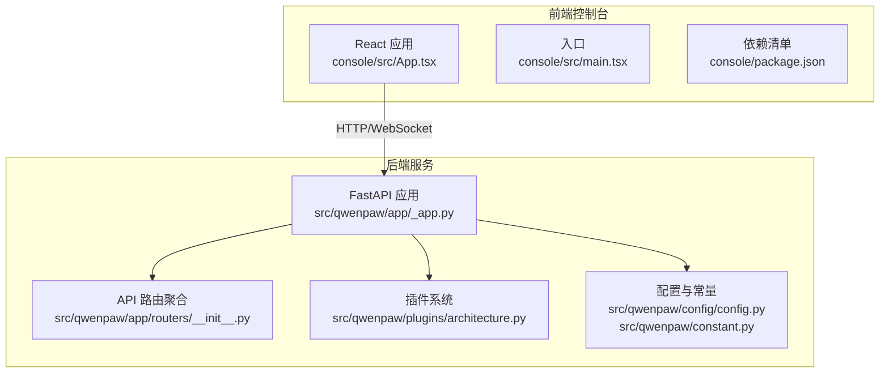
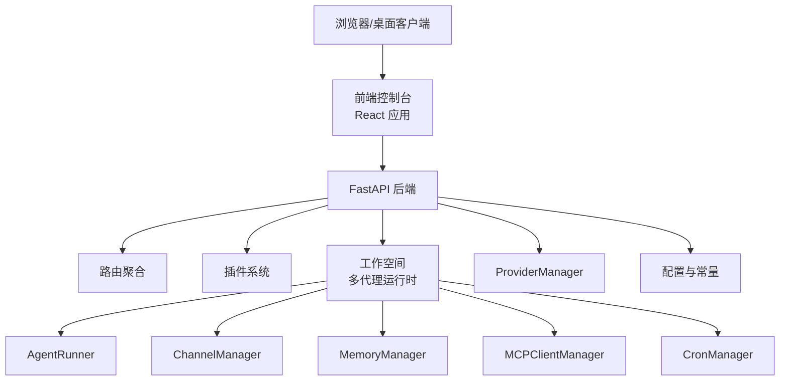
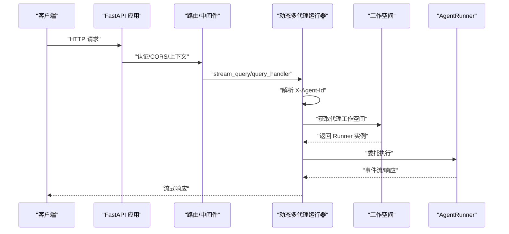
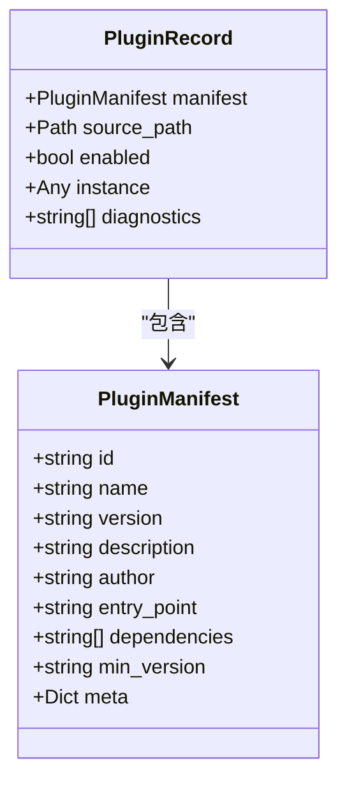
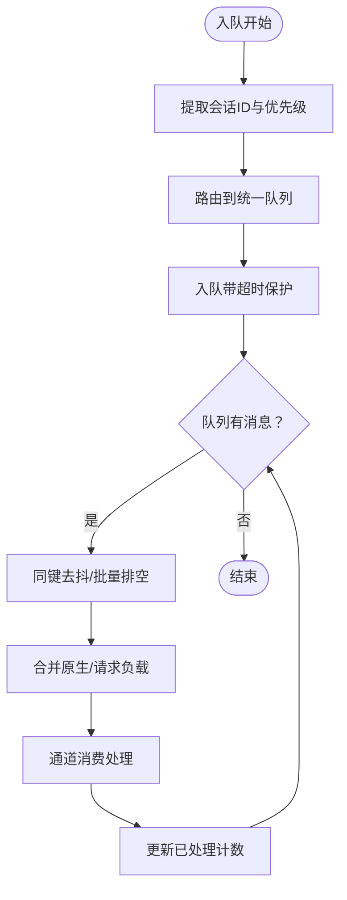
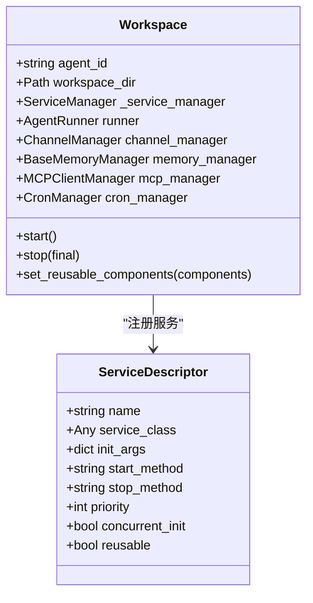
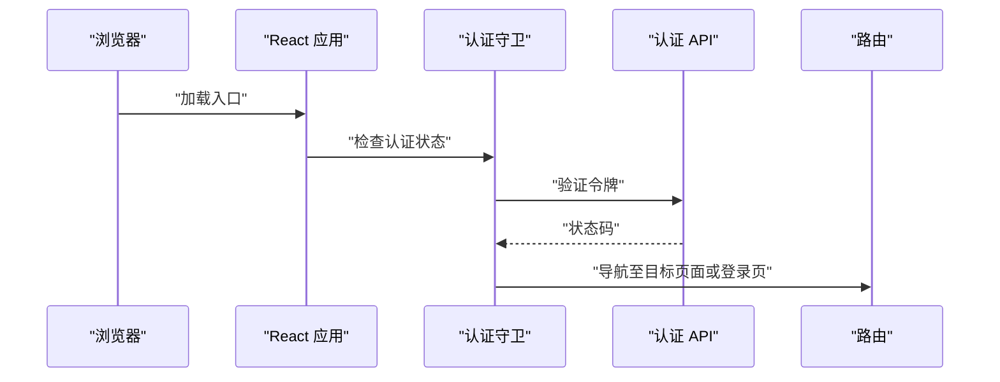
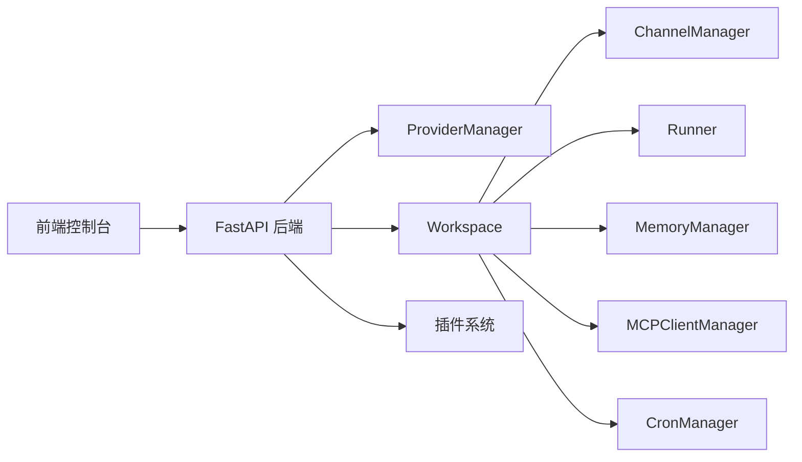

# 技术架构概览

<cite>
**本文档引用的文件**
- [README.md](file://README.md)
- [src/qwenpaw/__init__.py](file://src/qwenpaw/__init__.py)
- [src/qwenpaw/app/_app.py](file://src/qwenpaw/app/_app.py)
- [src/qwenpaw/plugins/architecture.py](file://src/qwenpaw/plugins/architecture.py)
- [src/qwenpaw/app/routers/__init__.py](file://src/qwenpaw/app/routers/__init__.py)
- [src/qwenpaw/agents/__init__.py](file://src/qwenpaw/agents/__init__.py)
- [src/qwenpaw/providers/provider_manager.py](file://src/qwenpaw/providers/provider_manager.py)
- [src/qwenpaw/app/channels/manager.py](file://src/qwenpaw/app/channels/manager.py)
- [src/qwenpaw/app/workspace/workspace.py](file://src/qwenpaw/app/workspace/workspace.py)
- [console/src/App.tsx](file://console/src/App.tsx)
- [console/src/main.tsx](file://console/src/main.tsx)
- [console/package.json](file://console/package.json)
- [src/qwenpaw/config/config.py](file://src/qwenpaw/config/config.py)
- [src/qwenpaw/constant.py](file://src/qwenpaw/constant.py)
</cite>

## 目录
1. [引言](#引言)
2. [项目结构](#项目结构)
3. [核心组件](#核心组件)
4. [架构总览](#架构总览)
5. [详细组件分析](#详细组件分析)
6. [依赖分析](#依赖分析)
7. [性能考虑](#性能考虑)
8. [故障排查指南](#故障排查指南)
9. [结论](#结论)
10. [附录](#附录)

## 引言
本文件面向开发者与架构师，系统化阐述 QwenPaw 的技术架构与设计理念。QwenPaw 采用前后端分离与微服务化思想，通过 FastAPI 提供统一后端服务，React 构建控制台前端，结合插件化扩展机制，形成可扩展、可演进的智能体工作平台。系统围绕代理（Agent）、通道（Channel）、技能（Skill）、模型（Provider）四大核心模块构建，支持多代理协作、多渠道接入、本地与云端模型融合，并内置多层次安全与可观测性能力。

## 项目结构
QwenPaw 代码库采用“Python 后端 + React 前端 + 插件生态”的分层组织方式：
- 后端（Python）：基于 FastAPI 的 Web 服务，负责路由、中间件、生命周期管理、多代理运行时与插件系统集成。
- 前端（React）：控制台 Web 界面，提供代理配置、技能管理、频道设置、模型与环境变量管理等功能。
- 插件（Plugins）：可动态加载的扩展模块，支持提供者注册、控制命令、启动/关闭钩子等。

图表来源
- [src/qwenpaw/app/_app.py:424-569](file://src/qwenpaw/app/_app.py#L424-L569)
- [src/qwenpaw/app/routers/__init__.py:1-60](file://src/qwenpaw/app/routers/__init__.py#L1-L60)
- [src/qwenpaw/plugins/architecture.py:1-55](file://src/qwenpaw/plugins/architecture.py#L1-L55)
- [console/src/App.tsx:1-196](file://console/src/App.tsx#L1-L196)
- [console/src/main.tsx:1-31](file://console/src/main.tsx#L1-L31)
- [console/package.json:1-62](file://console/package.json#L1-L62)

章节来源
- [src/qwenpaw/app/_app.py:424-569](file://src/qwenpaw/app/_app.py#L424-L569)
- [src/qwenpaw/app/routers/__init__.py:1-60](file://src/qwenpaw/app/routers/__init__.py#L1-L60)
- [src/qwenpaw/plugins/architecture.py:1-55](file://src/qwenpaw/plugins/architecture.py#L1-L55)
- [console/src/App.tsx:1-196](file://console/src/App.tsx#L1-L196)
- [console/src/main.tsx:1-31](file://console/src/main.tsx#L1-L31)
- [console/package.json:1-62](file://console/package.json#L1-L62)

## 核心组件
- 表示层（前端控制台）
  - 使用 React + Ant Design 生态，提供国际化、主题切换、路由守卫与认证流程。
  - 通过 API 模块与后端交互，实现代理配置、技能管理、频道设置、模型与环境变量管理等。
- 业务逻辑层（后端服务）
  - FastAPI 应用承载路由、中间件（认证、CORS）、静态资源与 SPA 回退。
  - 多代理运行时：按请求头动态选择代理工作空间，统一处理流式任务。
  - 插件系统：支持插件发现、加载、提供者注册、控制命令与生命周期钩子。
- 数据访问层（配置与存储）
  - 配置与常量：集中管理工作目录、密钥目录、CORS、速率限制、心跳等全局参数。
  - 工作空间：封装代理运行所需的 Runner、ChannelManager、MemoryManager、MCPClientManager、CronManager 等组件。
- 关键模块
  - 代理系统：延迟加载主代理类与模型工厂，避免 CLI 初始化时的重依赖。
  - 通道系统：统一队列与批处理合并，支持多通道并发与优先级调度。
  - 技能系统：技能池初始化与管理，配合工具与记忆模块。
  - 模型系统：ProviderManager 统一管理内置/自定义/插件提供者，支持本地与云端模型。

章节来源
- [src/qwenpaw/app/_app.py:63-151](file://src/qwenpaw/app/_app.py#L63-L151)
- [src/qwenpaw/app/_app.py:238-320](file://src/qwenpaw/app/_app.py#L238-L320)
- [src/qwenpaw/app/workspace/workspace.py:47-123](file://src/qwenpaw/app/workspace/workspace.py#L47-L123)
- [src/qwenpaw/app/channels/manager.py:68-114](file://src/qwenpaw/app/channels/manager.py#L68-L114)
- [src/qwenpaw/agents/__init__.py:18-35](file://src/qwenpaw/agents/__init__.py#L18-L35)
- [src/qwenpaw/providers/provider_manager.py:670-800](file://src/qwenpaw/providers/provider_manager.py#L670-L800)

## 架构总览
QwenPaw 采用“单体后端 + 可插拔扩展 + 前端控制台”的架构模式：
- 单体后端：以 FastAPI 为核心，统一暴露 REST/WS 接口，内置认证、CORS、静态资源与 SPA 回退。
- 微服务化设计：通过多代理运行时与工作空间抽象，实现每个代理的独立运行时与状态隔离；通道系统解耦消息入队与消费。
- 插件化扩展：插件系统在应用生命周期内动态加载，注册提供者、控制命令与钩子，增强系统能力。
- 前后端分离：前端控制台通过 HTTP/WebSocket 与后端通信，支持多语言、主题与路由守卫。

图表来源
- [src/qwenpaw/app/_app.py:424-569](file://src/qwenpaw/app/_app.py#L424-L569)
- [src/qwenpaw/app/workspace/workspace.py:47-123](file://src/qwenpaw/app/workspace/workspace.py#L47-L123)
- [src/qwenpaw/app/channels/manager.py:68-114](file://src/qwenpaw/app/channels/manager.py#L68-L114)
- [src/qwenpaw/providers/provider_manager.py:670-800](file://src/qwenpaw/providers/provider_manager.py#L670-L800)
- [src/qwenpaw/config/config.py:1-200](file://src/qwenpaw/config/config.py#L1-L200)

## 详细组件分析

### 后端应用与多代理运行时
- 动态多代理运行器：根据请求头选择当前代理的工作空间，统一处理流式查询与任务队列。
- 生命周期管理：启动阶段完成迁移、多代理初始化、Provider/本地模型管理器、插件加载与钩子执行；停止阶段执行插件关闭钩子并优雅停机。
- 中间件与路由：认证中间件、CORS 中间件、Agent 上下文中间件；API 路由聚合与代理作用域路由。

图表来源
- [src/qwenpaw/app/_app.py:63-151](file://src/qwenpaw/app/_app.py#L63-L151)
- [src/qwenpaw/app/_app.py:166-423](file://src/qwenpaw/app/_app.py#L166-L423)

章节来源
- [src/qwenpaw/app/_app.py:63-151](file://src/qwenpaw/app/_app.py#L63-L151)
- [src/qwenpaw/app/_app.py:166-423](file://src/qwenpaw/app/_app.py#L166-L423)

### 插件系统架构
- 插件清单与记录：定义插件清单与加载记录，支持诊断信息与启用状态。
- 插件加载：从用户插件目录加载，读取配置并异步注册提供者、控制命令与钩子。
- 运行时助手：向插件注入 ProviderManager 等运行时能力，确保插件生态与核心系统解耦。

图表来源
- [src/qwenpaw/plugins/architecture.py:9-55](file://src/qwenpaw/plugins/architecture.py#L9-L55)

章节来源
- [src/qwenpaw/plugins/architecture.py:1-55](file://src/qwenpaw/plugins/architecture.py#L1-L55)
- [src/qwenpaw/app/_app.py:238-320](file://src/qwenpaw/app/_app.py#L238-L320)

### 通道系统与统一队列
- 通道管理：从配置或环境初始化可用通道，注入统一进程处理器与回调。
- 统一队列：按会话与优先级路由到队列，支持批量合并与超时保护，保证高并发下的稳定性。
- 消费循环：按通道维度拉取消息批次，进行内容合并与处理，更新处理计数。

图表来源
- [src/qwenpaw/app/channels/manager.py:255-348](file://src/qwenpaw/app/channels/manager.py#L255-L348)
- [src/qwenpaw/app/channels/manager.py:362-446](file://src/qwenpaw/app/channels/manager.py#L362-L446)

章节来源
- [src/qwenpaw/app/channels/manager.py:68-114](file://src/qwenpaw/app/channels/manager.py#L68-L114)
- [src/qwenpaw/app/channels/manager.py:255-348](file://src/qwenpaw/app/channels/manager.py#L255-L348)
- [src/qwenpaw/app/channels/manager.py:362-446](file://src/qwenpaw/app/channels/manager.py#L362-L446)

### 工作空间与服务编排
- 工作空间：封装代理运行时的完整组件集合，包括 Runner、ChannelManager、MemoryManager、MCPClientManager、CronManager。
- 服务管理：通过 ServiceDescriptor 声明式注册服务，支持并发初始化、启动顺序与可复用组件热替换。
- 启动/停止：按优先级顺序启动服务，失败时回滚清理；停止时区分最终停止与热重载场景。

图表来源
- [src/qwenpaw/app/workspace/workspace.py:47-123](file://src/qwenpaw/app/workspace/workspace.py#L47-L123)
- [src/qwenpaw/app/workspace/workspace.py:142-290](file://src/qwenpaw/app/workspace/workspace.py#L142-L290)

章节来源
- [src/qwenpaw/app/workspace/workspace.py:47-123](file://src/qwenpaw/app/workspace/workspace.py#L47-L123)
- [src/qwenpaw/app/workspace/workspace.py:142-290](file://src/qwenpaw/app/workspace/workspace.py#L142-L290)

### 前端控制台与认证流程
- 路由与主题：BrowserRouter、ConfigProvider、主题切换与国际化配置。
- 认证守卫：根据后端认证状态与令牌决定是否跳转登录页。
- 入口与样式：根节点渲染与全局样式覆盖。

图表来源
- [console/src/App.tsx:49-104](file://console/src/App.tsx#L49-L104)
- [console/src/App.tsx:170-180](file://console/src/App.tsx#L170-L180)

章节来源
- [console/src/App.tsx:1-196](file://console/src/App.tsx#L1-L196)
- [console/src/main.tsx:1-31](file://console/src/main.tsx#L1-L31)
- [console/package.json:1-62](file://console/package.json#L1-L62)

### 模型提供者与配置
- ProviderManager：统一管理内置/自定义/插件提供者，支持列表、获取信息、激活模型槽位等。
- 配置与常量：集中管理工作目录、密钥目录、CORS、速率限制、心跳、媒体目录等全局参数。
- 渠道配置：各类 IM 渠道的配置模型，支持启用策略、媒体目录、轮询间隔等。

章节来源
- [src/qwenpaw/providers/provider_manager.py:670-800](file://src/qwenpaw/providers/provider_manager.py#L670-L800)
- [src/qwenpaw/config/config.py:1-200](file://src/qwenpaw/config/config.py#L1-L200)
- [src/qwenpaw/constant.py:89-307](file://src/qwenpaw/constant.py#L89-L307)

## 依赖分析
- 组件耦合与内聚
  - 后端应用对插件系统、工作空间与通道管理存在强依赖，但通过接口与服务管理降低耦合度。
  - 前端控制台仅通过 API 与后端交互，保持界面与业务逻辑解耦。
- 直接与间接依赖
  - 插件系统依赖 ProviderManager 注入运行时能力。
  - 工作空间依赖 Runner、ChannelManager、MemoryManager、MCPClientManager、CronManager 等服务。
- 外部依赖与集成点
  - FastAPI 提供路由与中间件；React 提供前端视图与交互；各渠道 SDK 作为外部集成点。
- 接口契约与实现细节
  - 通道消费接口、工作空间服务注册接口、插件清单与记录接口均在对应模块中明确定义。

图表来源
- [src/qwenpaw/app/_app.py:424-569](file://src/qwenpaw/app/_app.py#L424-L569)
- [src/qwenpaw/app/workspace/workspace.py:47-123](file://src/qwenpaw/app/workspace/workspace.py#L47-L123)
- [src/qwenpaw/app/channels/manager.py:68-114](file://src/qwenpaw/app/channels/manager.py#L68-L114)
- [src/qwenpaw/providers/provider_manager.py:670-800](file://src/qwenpaw/providers/provider_manager.py#L670-L800)

章节来源
- [src/qwenpaw/app/_app.py:424-569](file://src/qwenpaw/app/_app.py#L424-L569)
- [src/qwenpaw/app/workspace/workspace.py:47-123](file://src/qwenpaw/app/workspace/workspace.py#L47-L123)
- [src/qwenpaw/app/channels/manager.py:68-114](file://src/qwenpaw/app/channels/manager.py#L68-L114)
- [src/qwenpaw/providers/provider_manager.py:670-800](file://src/qwenpaw/providers/provider_manager.py#L670-L800)

## 性能考虑
- 并发与限流
  - LLM 并发控制与 QPM 限制：通过最大并发与每分钟查询上限防止 429，结合指数退避与抖动避免突发。
  - 通道统一队列：批量合并与超时保护，减少高频消息对下游的冲击。
- 资源管理
  - 工作空间可复用组件：支持热重载场景下的内存与聊天管理复用，降低重启成本。
  - 本地模型管理：提供本地模型服务器的启动与优雅关闭，避免资源泄漏。
- I/O 与网络
  - CORS 与静态资源：合理配置允许来源，避免跨域问题；静态资源 MIME 类型修正提升跨平台兼容性。
- 可观测性
  - 日志级别与文件句柄：启动阶段设置日志级别并写入项目日志文件，便于定位问题。
  - 遥测收集：首次安装或升级时收集匿名使用数据，帮助改进产品体验。

章节来源
- [src/qwenpaw/constant.py:220-282](file://src/qwenpaw/constant.py#L220-L282)
- [src/qwenpaw/app/channels/manager.py:302-348](file://src/qwenpaw/app/channels/manager.py#L302-L348)
- [src/qwenpaw/app/workspace/workspace.py:290-321](file://src/qwenpaw/app/workspace/workspace.py#L290-L321)
- [src/qwenpaw/app/_app.py:209-236](file://src/qwenpaw/app/_app.py#L209-L236)
- [src/qwenpaw/__init__.py:11-32](file://src/qwenpaw/__init__.py#L11-L32)

## 故障排查指南
- 插件加载失败
  - 现象：插件未生效或报错。
  - 排查：查看插件加载日志与诊断信息；确认插件清单与依赖版本；检查插件控制命令注册与优先级。
- 代理启动异常
  - 现象：多代理初始化失败或代理不可用。
  - 排查：检查迁移步骤与默认代理创建；确认工作空间启动顺序与服务注册；查看工作空间启动/停止日志。
- 通道入队/出队阻塞
  - 现象：消息积压或处理延迟。
  - 排查：检查统一队列超时与取消逻辑；核对通道批处理合并策略；确认会话键一致性。
- 认证与路由问题
  - 现象：登录后仍被重定向或 401。
  - 排查：确认认证守卫逻辑与令牌传递；检查路由 basename 与 SPA 回退规则。

章节来源
- [src/qwenpaw/app/_app.py:238-320](file://src/qwenpaw/app/_app.py#L238-L320)
- [src/qwenpaw/app/workspace/workspace.py:322-380](file://src/qwenpaw/app/workspace/workspace.py#L322-L380)
- [src/qwenpaw/app/channels/manager.py:302-348](file://src/qwenpaw/app/channels/manager.py#L302-L348)
- [console/src/App.tsx:49-104](file://console/src/App.tsx#L49-L104)

## 结论
QwenPaw 通过前后端分离与微服务化设计，结合插件化扩展机制，构建了可扩展、可演进的智能体工作平台。其核心在于：
- 明确的分层架构：表示层、业务逻辑层、数据访问层职责清晰；
- 强大的多代理运行时与工作空间抽象：实现代理隔离与组件复用；
- 通道系统的统一队列与批处理：保障高并发稳定性；
- 完备的插件系统与生命周期钩子：支持生态扩展；
- 严格的性能与安全设计：并发控制、速率限制、工具守卫与文件访问控制。

这些设计共同确保了系统在易用性、可扩展性与安全性方面的平衡，适合个人部署与企业场景的多样化需求。

## 附录
- 关键技术选型说明
  - FastAPI：高性能异步框架，提供 OpenAPI 文档、中间件与路由聚合能力，适合作为统一后端服务。
  - React：现代前端框架，配合 Ant Design 提供丰富的 UI 组件与国际化支持，适合构建控制台。
  - 插件系统：支持动态加载与生命周期钩子，降低核心与扩展的耦合度。
- 系统边界与组件关系
  - 前端控制台仅通过 API 与后端交互，边界清晰；
  - 后端通过工作空间抽象隔离多代理运行时，通道系统解耦消息入队与消费；
  - 插件系统在应用生命周期内动态注入能力，不改变核心接口契约。