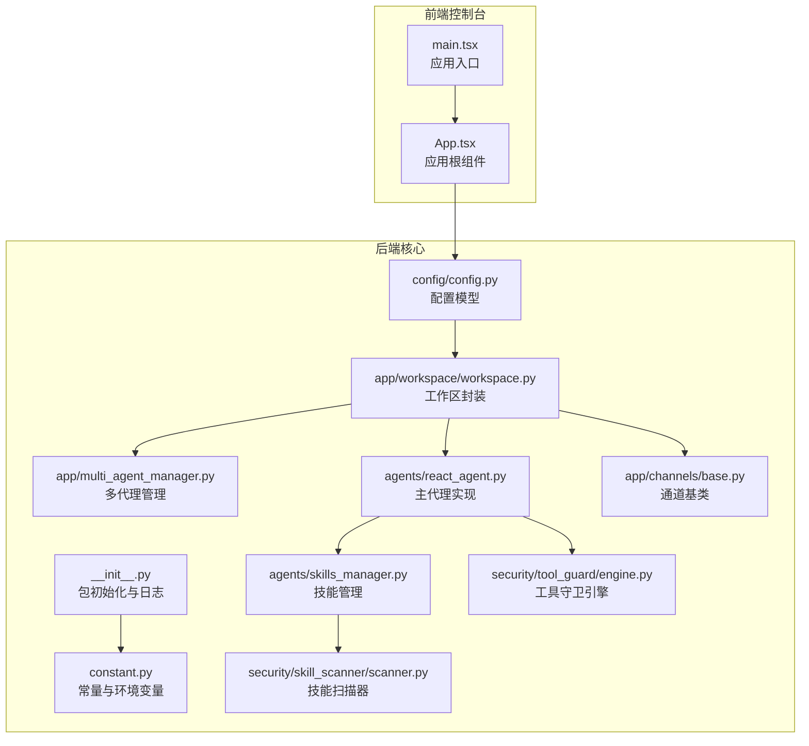
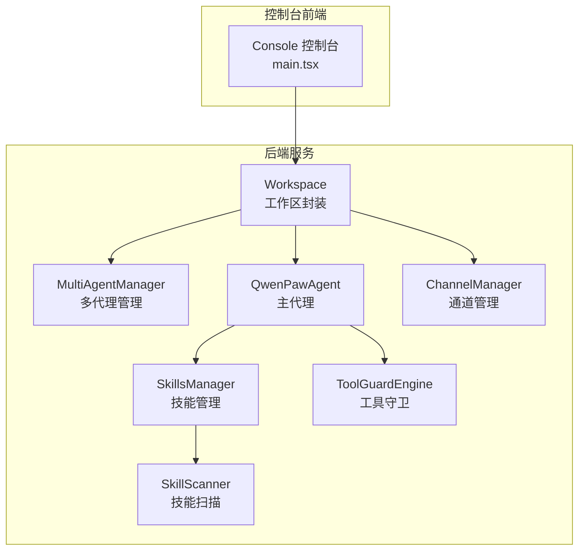
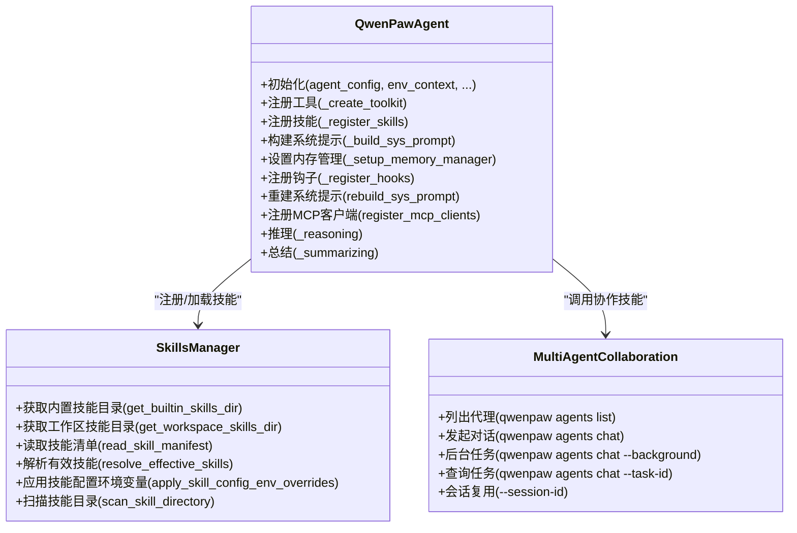
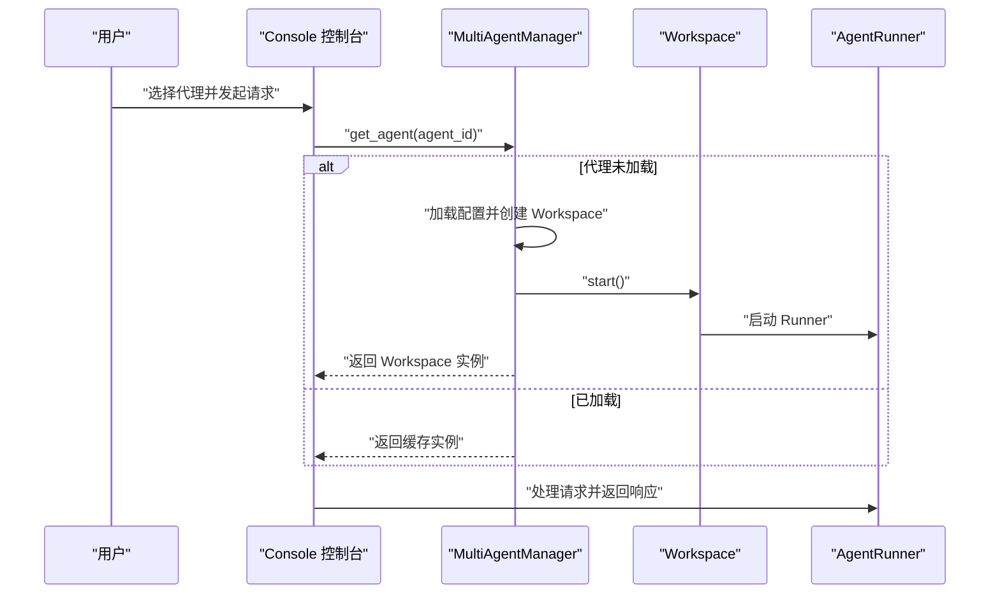
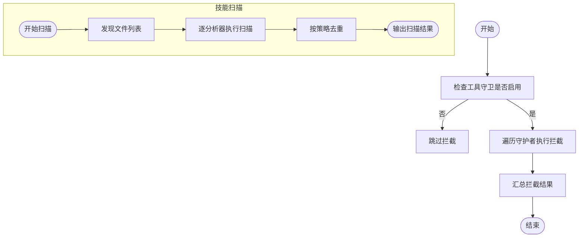
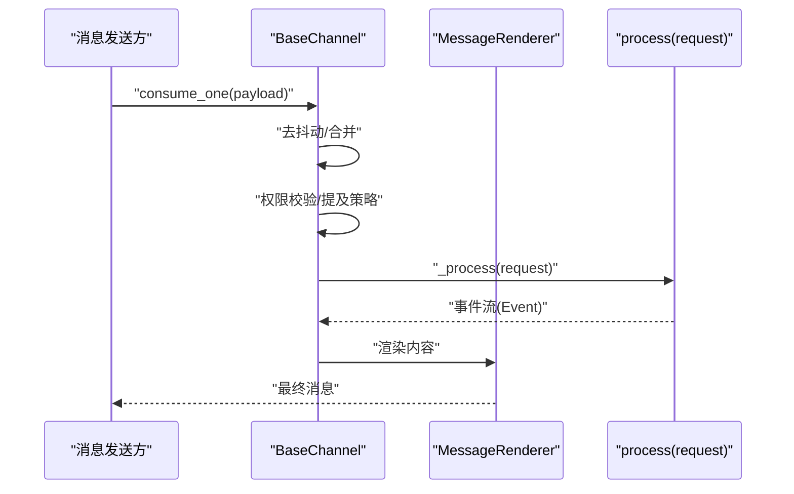
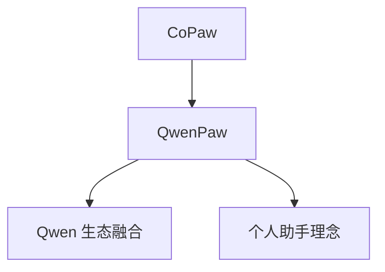
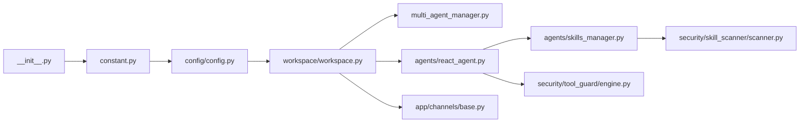

# 项目介绍与特性

<cite>
**本文引用的文件**
- [README.md](file://README.md)
- [__init__.py](file://src/qwenpaw/__init__.py)
- [constant.py](file://src/qwenpaw/constant.py)
- [config.py](file://src/qwenpaw/config/config.py)
- [main.tsx](file://console/src/main.tsx)
- [react_agent.py](file://src/qwenpaw/agents/react_agent.py)
- [skills_manager.py](file://src/qwenpaw/agents/skills_manager.py)
- [multi_agent_manager.py](file://src/qwenpaw/app/multi_agent_manager.py)
- [engine.py](file://src/qwenpaw/security/tool_guard/engine.py)
- [scanner.py](file://src/qwenpaw/security/skill_scanner/scanner.py)
- [base.py](file://src/qwenpaw/app/channels/base.py)
- [workspace.py](file://src/qwenpaw/app/workspace/workspace.py)
- [SKILL.md](file://src/qwenpaw/agents/\\skills/multi_agent_collaboration/SKILL.md)
- [v1.1.0.zh.md](file://website/public/release-notes/v1.1.0.zh.md)
</cite>

## 目录
1. [引言](#引言)
2. [项目结构](#项目结构)
3. [核心组件](#核心组件)
4. [架构总览](#架构总览)
5. [详细组件分析](#详细组件分析)
6. [依赖关系分析](#依赖关系分析)
7. [性能考量](#性能考量)
8. [故障排查指南](#故障排查指南)
9. [结论](#结论)
10. [附录](#附录)

## 引言
QwenPaw 是一个开源、可定制、可扩展的个人 AI 助手平台，致力于为用户提供“随身而行”的智能助理体验。它强调四大核心能力：
- 完全可控的数据隐私保护：内存与个性化完全由用户掌控，可本地部署或云端私有化，避免第三方托管与数据上传。
- 灵活的技能扩展机制：内置调度、PDF/Office 处理、新闻摘要等能力，并支持自定义技能自动加载，避免厂商锁定。
- 强大的多代理协作系统：可创建多个独立代理，每个代理拥有自己的角色与工作空间，启用协作技能实现跨代理通信，共同解决复杂任务。
- 多层次的安全防护体系：工具守卫、文件访问控制、技能安全扫描，确保运行安全。

此外，QwenPaw 支持多通道接入（如钉钉、飞书、微信、Discord、Telegram 等），并提供 Console 网页界面、Docker 镜像、桌面应用等多种安装与运行方式，满足不同技术背景用户的需求。

**章节来源**
- [README.md:31-56](file://README.md#L31-L56)
- [README.md:82-98](file://README.md#L82-L98)

## 项目结构
QwenPaw 采用模块化分层设计：
- 前端控制台（React + TypeScript）位于 console/ 目录，提供聊天、代理配置、技能管理等界面。
- 核心后端（Python）位于 src/qwenpaw/，包含代理、技能、通道、工作区、安全、配置等子系统。
- 部署与打包脚本位于 scripts/，提供 Docker、桌面应用、安装脚本等。
- 文档与官网资源位于 website/，包含发布说明、使用文档与站点资源。

**图示来源**
- [main.tsx:1-31](file://console/src/main.tsx#L1-L31)
- [__init__.py:1-33](file://src/qwenpaw/__init__.py#L1-L33)
- [constant.py:1-307](file://src/qwenpaw/constant.py#L1-L307)
- [config.py:1-800](file://src/qwenpaw/config/config.py#L1-L800)
- [workspace.py:1-389](file://src/qwenpaw/app/workspace/workspace.py#L1-L389)
- [multi_agent_manager.py:1-470](file://src/qwenpaw/app/multi_agent_manager.py#L1-L470)
- [react_agent.py:1-800](file://src/qwenpaw/agents/react_agent.py#L1-L800)
- [skills_manager.py:1-800](file://src/qwenpaw/agents/skills_manager.py#L1-L800)
- [base.py:1-800](file://src/qwenpaw/app/channels/base.py#L1-L800)
- [engine.py:1-238](file://src/qwenpaw/security/tool_guard/engine.py#L1-L238)
- [scanner.py:1-319](file://src/qwenpaw/security/skill_scanner/scanner.py#L1-L319)

**章节来源**
- [README.md:104-186](file://README.md#L104-L186)
- [README.md:230-272](file://README.md#L230-L272)
- [README.md:287-329](file://README.md#L287-L329)

## 核心组件
- 包初始化与日志：负责在导入时加载环境变量、设置日志级别与启动耗时统计。
- 常量与环境变量：集中管理工作目录、媒体目录、插件目录、模型目录、内存目录、CORS、重试与并发限制等。
- 配置系统：定义通道、心跳、嵌入、上下文压缩、工具结果压缩、记忆摘要、代理运行配置、LLM 路由等模型。
- 工作区封装：统一管理 Runner、ChannelManager、MemoryManager、MCPClientManager、CronManager 等组件。
- 多代理管理：支持懒加载、零停机热重载、并发启动、任务跟踪与优雅停止。
- 主代理实现：基于 ReActAgent，集成工具、技能、内存管理、引导钩子与媒体块过滤。
- 技能管理：技能清单、签名校验、冲突处理、环境变量注入、安全扫描。
- 通道基类：统一消息处理、会话合并、去抖动、权限策略与渲染。
- 安全体系：工具守卫引擎（路径与规则守卫）、技能扫描器（模式分析、策略与限额）。

**章节来源**
- [__init__.py:1-33](file://src/qwenpaw/__init__.py#L1-L33)
- [constant.py:28-307](file://src/qwenpaw/constant.py#L28-L307)
- [config.py:39-800](file://src/qwenpaw/config/config.py#L39-L800)
- [workspace.py:47-389](file://src/qwenpaw/app/workspace/workspace.py#L47-L389)
- [multi_agent_manager.py:21-470](file://src/qwenpaw/app/multi_agent_manager.py#L21-L470)
- [react_agent.py:69-800](file://src/qwenpaw/agents/react_agent.py#L69-L800)
- [skills_manager.py:65-800](file://src/qwenpaw/agents/skills_manager.py#L65-L800)
- [base.py:70-800](file://src/qwenpaw/app/channels/base.py#L70-L800)
- [engine.py:53-238](file://src/qwenpaw/security/tool_guard/engine.py#L53-L238)
- [scanner.py:76-319](file://src/qwenpaw/security/skill_scanner/scanner.py#L76-L319)

## 架构总览
QwenPaw 的整体架构围绕“工作区（Workspace）—代理（Agent）—通道（Channel）—技能（Skill）—安全（Security）”展开，形成可扩展、可定制、可协作的个人 AI 助手平台。

**图示来源**
- [main.tsx:1-31](file://console/src/main.tsx#L1-L31)
- [workspace.py:47-389](file://src/qwenpaw/app/workspace/workspace.py#L47-L389)
- [multi_agent_manager.py:21-470](file://src/qwenpaw/app/multi_agent_manager.py#L21-L470)
- [react_agent.py:69-800](file://src/qwenpaw/agents/react_agent.py#L69-L800)
- [skills_manager.py:65-800](file://src/qwenpaw/agents/skills_manager.py#L65-L800)
- [base.py:70-800](file://src/qwenpaw/app/channels/base.py#L70-L800)
- [engine.py:53-238](file://src/qwenpaw/security/tool_guard/engine.py#L53-L238)
- [scanner.py:76-319](file://src/qwenpaw/security/skill_scanner/scanner.py#L76-L319)

## 详细组件分析

### 组件一：主代理与技能系统
- 主代理（QwenPawAgent）继承 ReActAgent，集成工具集、技能注册、系统提示构建、内存管理钩子与媒体块过滤。
- 技能管理（SkillsManager）负责技能清单、签名校验、冲突命名、环境变量注入、安全扫描与并发写锁。
- 多代理协作（multi_agent_collaboration 技能）提供跨代理对话、后台任务与会话复用的最小工作流。

**图示来源**
- [react_agent.py:69-800](file://src/qwenpaw/agents/react_agent.py#L69-L800)
- [skills_manager.py:65-800](file://src/qwenpaw/agents/skills_manager.py#L65-L800)
- [SKILL.md:1-477](file://src/qwenpaw/agents/skills/multi_agent_collaboration/SKILL.md#L1-L477)

**章节来源**
- [react_agent.py:69-800](file://src/qwenpaw/agents/react_agent.py#L69-L800)
- [skills_manager.py:65-800](file://src/qwenpaw/agents/skills_manager.py#L65-L800)
- [SKILL.md:124-291](file://src/qwenpaw/agents/skills/multi_agent_collaboration/SKILL.md#L124-L291)

### 组件二：多代理协作与工作区管理
- 工作区（Workspace）封装 Runner、ChannelManager、MemoryManager、MCPClientManager、CronManager 等，提供统一生命周期管理。
- 多代理管理（MultiAgentManager）支持懒加载、零停机热重载、并发启动、任务跟踪与优雅停止。

**图示来源**
- [multi_agent_manager.py:38-90](file://src/qwenpaw/app/multi_agent_manager.py#L38-L90)
- [workspace.py:322-359](file://src/qwenpaw/app/workspace/workspace.py#L322-L359)

**章节来源**
- [multi_agent_manager.py:21-470](file://src/qwenpaw/app/multi_agent_manager.py#L21-L470)
- [workspace.py:47-389](file://src/qwenpaw/app/workspace/workspace.py#L47-L389)

### 组件三：安全防护体系
- 工具守卫引擎（ToolGuardEngine）聚合路径守卫与规则守卫，支持动态启用/禁用与规则重载。
- 技能扫描器（SkillScanner）通过模式分析器扫描技能包，支持策略化文件分类、限额与重复发现去重。

**图示来源**
- [engine.py:169-226](file://src/qwenpaw/security/tool_guard/engine.py#L169-L226)
- [scanner.py:148-242](file://src/qwenpaw/security/skill_scanner/scanner.py#L148-L242)

**章节来源**
- [engine.py:53-238](file://src/qwenpaw/security/tool_guard/engine.py#L53-L238)
- [scanner.py:76-319](file://src/qwenpaw/security/skill_scanner/scanner.py#L76-L319)

### 组件四：通道与消息处理
- 通道基类（BaseChannel）统一消息转换、会话合并、去抖动、权限策略与渲染，支持多种渠道接入。
- 渲染器（MessageRenderer）根据显示选项与内部工具集合决定消息呈现细节。

**图示来源**
- [base.py:659-800](file://src/qwenpaw/app/channels/base.py#L659-L800)

**章节来源**
- [base.py:70-800](file://src/qwenpaw/app/channels/base.py#L70-L800)

### 概念总览
- 名称演进：CoPaw 正式更名为 QwenPaw，体现与 Qwen 生态融合与“小爪”陪伴理念。
- 安装与运行：支持 pip、脚本安装、Docker、阿里云 ECS、ModelScope、桌面应用等多种方式。
- 安全特性：工具守卫、文件访问控制、技能安全扫描、本地部署、Web 认证等。

**图示来源**
- [v1.1.0.zh.md:1-19](file://website/public/release-notes/v1.1.0.zh.md#L1-L19)

**章节来源**
- [README.md:59-75](file://README.md#L59-L75)
- [README.md:382-393](file://README.md#L382-L393)

## 依赖关系分析
- 包初始化依赖环境变量加载与日志设置，确保在导入阶段即完成基础配置。
- 配置系统贯穿工作区与代理，提供通道、心跳、嵌入、上下文压缩、工具结果压缩、记忆摘要、运行配置与 LLM 路由等。
- 工作区通过服务管理器（ServiceManager）统一注册与启动 Runner、MemoryManager、MCPClientManager、ChannelManager、CronManager 等组件。
- 多代理管理器持有工作区实例，支持零停机热重载与任务跟踪。
- 主代理依赖技能管理器进行技能注册与系统提示构建，同时受工具守卫与技能扫描器保障安全。

**图示来源**
- [__init__.py:1-33](file://src/qwenpaw/__init__.py#L1-L33)
- [constant.py:28-307](file://src/qwenpaw/constant.py#L28-L307)
- [config.py:39-800](file://src/qwenpaw/config/config.py#L39-L800)
- [workspace.py:142-289](file://src/qwenpaw/app/workspace/workspace.py#L142-L289)
- [multi_agent_manager.py:31-90](file://src/qwenpaw/app/multi_agent_manager.py#L31-L90)
- [react_agent.py:89-182](file://src/qwenpaw/agents/react_agent.py#L89-L182)
- [skills_manager.py:306-341](file://src/qwenpaw/agents/skills_manager.py#L306-L341)
- [base.py:70-127](file://src/qwenpaw/app/channels/base.py#L70-L127)
- [engine.py:53-130](file://src/qwenpaw/security/tool_guard/engine.py#L53-L130)
- [scanner.py:76-134](file://src/qwenpaw/security/skill_scanner/scanner.py#L76-L134)

**章节来源**
- [__init__.py:1-33](file://src/qwenpaw/__init__.py#L1-L33)
- [workspace.py:142-289](file://src/qwenpaw/app/workspace/workspace.py#L142-L289)
- [react_agent.py:89-182](file://src/qwenpaw/agents/react_agent.py#L89-L182)
- [skills_manager.py:306-341](file://src/qwenpaw/agents/skills_manager.py#L306-L341)
- [engine.py:53-130](file://src/qwenpaw/security/tool_guard/engine.py#L53-L130)
- [scanner.py:76-134](file://src/qwenpaw/security/skill_scanner/scanner.py#L76-L134)

## 性能考量
- 并发与限流：通过 LLM 最大并发数、每分钟最大查询数、退避与抖动参数，主动防止 429 限流，提升稳定性。
- 上下文压缩：支持上下文压缩阈值与保留比例、工具结果压缩、记忆摘要与搜索，降低 token 使用与延迟。
- 媒体块过滤：在模型不支持多模态时，提前剥离媒体块，减少无效重试与错误开销。
- 零停机热重载：多代理管理器在替换实例时最小化锁占用，后台清理旧实例，保证服务连续性。

**章节来源**
- [constant.py:220-283](file://src/qwenpaw/constant.py#L220-L283)
- [config.py:569-624](file://src/qwenpaw/config/config.py#L569-L624)
- [react_agent.py:675-784](file://src/qwenpaw/agents/react_agent.py#L675-L784)
- [multi_agent_manager.py:208-319](file://src/qwenpaw/app/multi_agent_manager.py#L208-L319)

## 故障排查指南
- 日志与初始化：包初始化阶段若环境变量加载失败，会记录警告并继续运行，便于定位部署问题。
- 工具守卫：可通过环境变量或配置控制开关，必要时仅对特定工具生效，避免误拦截。
- 技能扫描：扫描器支持策略化文件分类与限额，遇到异常文件或过大文件会跳过并记录警告。
- 通道权限：允许白名单/开放策略、提及要求与拒绝消息，确保只对授权用户开放。
- 前端控制台：控制台入口对伪类与潜在不安全警告进行过滤，减少噪音。

**章节来源**
- [__init__.py:11-32](file://src/qwenpaw/__init__.py#L11-L32)
- [engine.py:35-51](file://src/qwenpaw/security/tool_guard/engine.py#L35-L51)
- [scanner.py:248-299](file://src/qwenpaw/security/skill_scanner/scanner.py#L248-L299)
- [base.py:283-305](file://src/qwenpaw/app/channels/base.py#L283-L305)
- [main.tsx:5-28](file://console/src/main.tsx#L5-L28)

## 结论
QwenPaw 以“可控、可扩展、可协作、可安全”为核心，结合多通道接入、多代理协作与多层次安全防护，为个人与团队提供可定制的 AI 助手解决方案。通过模块化架构与零停机热重载能力，QwenPaw 在易用性与工程化之间取得平衡，适合不同技术背景的用户快速上手与深度定制。

## 附录
- 安装与运行：支持 pip、脚本安装、Docker、桌面应用等多种方式，满足本地与云端部署需求。
- 文档与社区：提供中文与英文文档、发布说明与社区生态，持续迭代路线图与贡献指南。

**章节来源**
- [README.md:104-186](file://README.md#L104-L186)
- [README.md:230-272](file://README.md#L230-L272)
- [README.md:287-329](file://README.md#L287-L329)
- [README.md:358-378](file://README.md#L358-L378)
- [README.md:412-432](file://README.md#L412-L432)
- [README.md:458-467](file://README.md#L458-L467)