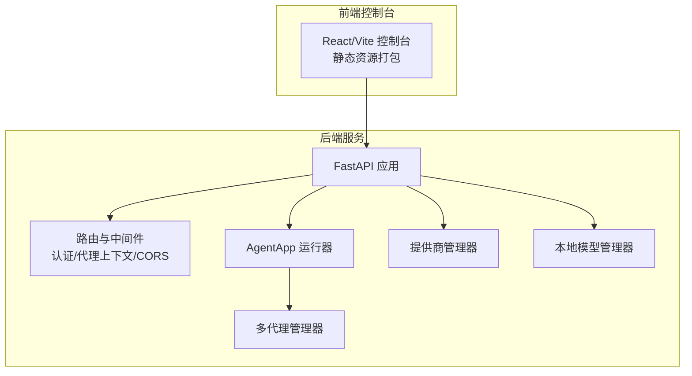
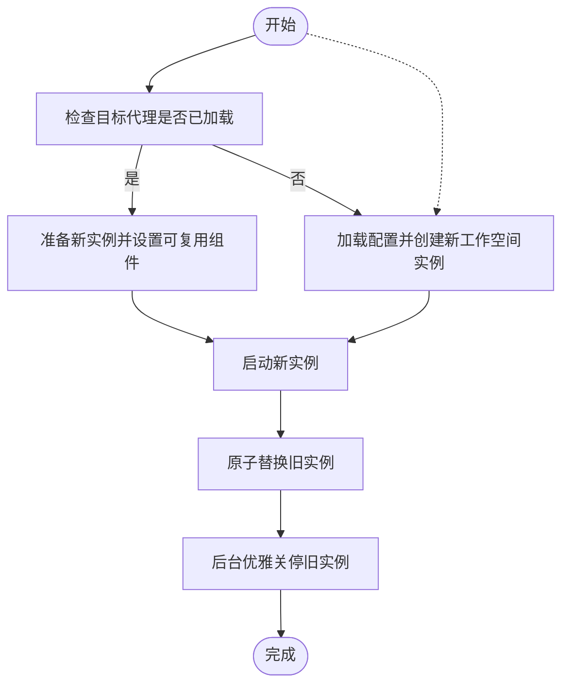
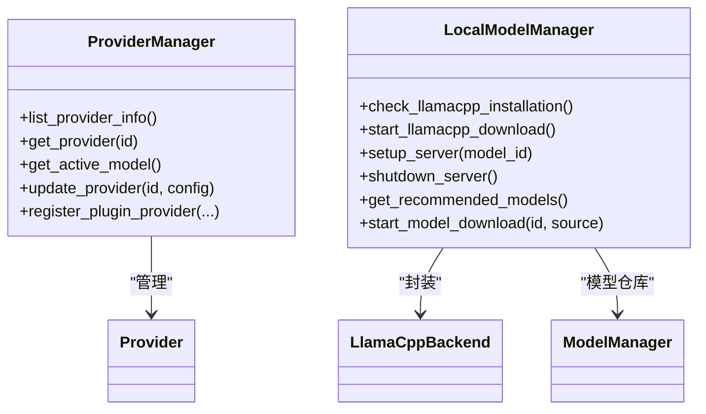
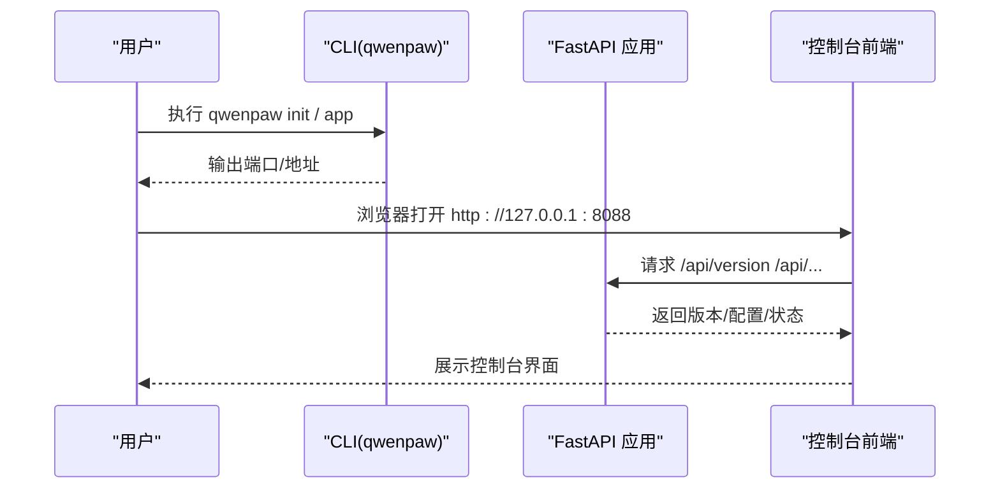
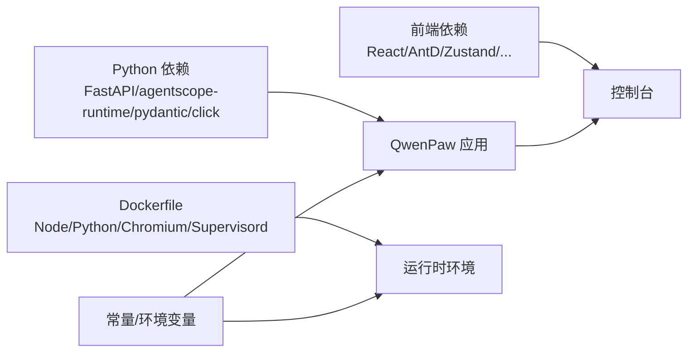

# 项目概述

<cite>
**本文档引用的文件**
- [README.md](file://README.md)
- [src/qwenpaw/__version__.py](file://src/qwenpaw/__version__.py)
- [src/qwenpaw/app/_app.py](file://src/qwenpaw/app/_app.py)
- [src/qwenpaw/cli/main.py](file://src/qwenpaw/cli/main.py)
- [src/qwenpaw/config/config.py](file://src/qwenpaw/config/config.py)
- [src/qwenpaw/constant.py](file://src/qwenpaw/constant.py)
- [src/qwenpaw/app/multi_agent_manager.py](file://src/qwenpaw/app/multi_agent_manager.py)
- [src/qwenpaw/providers/provider_manager.py](file://src/qwenpaw/providers/provider_manager.py)
- [src/qwenpaw/local_models/manager.py](file://src/qwenpaw/local_models/manager.py)
- [console/package.json](file://console/package.json)
- [deploy/Dockerfile](file://deploy/Dockerfile)
</cite>

## 目录
1. [引言](#引言)
2. [项目结构](#项目结构)
3. [核心组件](#核心组件)
4. [架构总览](#架构总览)
5. [详细组件分析](#详细组件分析)
6. [依赖关系分析](#依赖关系分析)
7. [性能考量](#性能考量)
8. [故障排查指南](#故障排查指南)
9. [结论](#结论)
10. [附录](#附录)

## 引言
QwenPaw 是一个面向个人用户的完全可控、可扩展的 AI 助手平台，强调“数据主权、本地优先、多通道连接与技能扩展”。它支持本地部署（数据留在本地）或云端部署（可选），提供统一的 Web 控制台与多渠道接入（如钉钉、飞书、微信、Discord、Telegram 等），并内置多代理协作与安全防护体系。项目愿景是成为用户数字生活的智能温暖伙伴，既易于上手，又具备工程级的可扩展性与安全性。

- 核心能力概览
  - 完全可控：内存与个性化配置由用户掌控；可本地部署或云部署，无第三方托管
  - 技能扩展：内置调度、PDF/Office 处理、新闻摘要等；支持自定义技能自动加载
  - 多代理协作：可创建多个独立代理，启用协作技能实现跨代理沟通
  - 多层安全：工具守卫、文件访问控制、技能安全扫描、本地部署与可选 Web 认证
  - 全渠道覆盖：支持多种即时通讯与语音渠道

- 快速开始路径
  - 一键安装：pip 安装或脚本安装
  - 初始化：qwenpaw init --defaults
  - 启动应用：qwenpaw app
  - 配置模型与渠道后即可在 Console 中聊天，并在各渠道中使用

- 版本与社区
  - 当前版本：1.1.1b1
  - 社区生态：文档网站、多语言文档、发布说明、贡献指南、问题反馈与讨论区

**章节来源**
- [README.md:104-118](file://README.md#L104-L118)
- [README.md:332-344](file://README.md#L332-L344)
- [README.md:412-432](file://README.md#L412-L432)
- [README.md:458-467](file://README.md#L458-L467)
- [src/qwenpaw/__version__.py:1-3](file://src/qwenpaw/__version__.py#L1-L3)

## 项目结构
项目采用前后端分离与模块化设计：
- 前端控制台（console）：基于 React/Vite 的单页应用，打包产物嵌入到后端包内
- 后端服务（FastAPI）：提供 REST API、多代理路由、通道接入、插件系统与运行时管理
- 配置与常量：集中管理工作目录、环境变量、默认行为与全局配置
- 本地模型与提供商：统一管理本地/云端模型提供商、下载与服务生命周期
- 插件与技能：通过插件系统扩展能力，技能池提供可复用的功能模块



**图表来源**
- [src/qwenpaw/app/_app.py:424-569](file://src/qwenpaw/app/_app.py#L424-L569)
- [src/qwenpaw/app/multi_agent_manager.py:21-470](file://src/qwenpaw/app/multi_agent_manager.py#L21-L470)
- [src/qwenpaw/providers/provider_manager.py:670-800](file://src/qwenpaw/providers/provider_manager.py#L670-L800)
- [src/qwenpaw/local_models/manager.py:33-229](file://src/qwenpaw/local_models/manager.py#L33-L229)
- [console/package.json:1-62](file://console/package.json#L1-L62)

**章节来源**
- [src/qwenpaw/app/_app.py:424-569](file://src/qwenpaw/app/_app.py#L424-L569)
- [src/qwenpaw/constant.py:89-120](file://src/qwenpaw/constant.py#L89-L120)
- [console/package.json:1-62](file://console/package.json#L1-L62)

## 核心组件
- 应用入口与生命周期
  - FastAPI 应用负责启动、中间件注册（认证、CORS、代理上下文）、静态资源与路由挂载
  - 生命周期钩子支持插件启动/关闭钩子、本地模型服务优雅关停、多代理统一停止
- 多代理管理
  - 支持按需懒加载、零停机热重载、后台清理旧实例、并发启动与任务追踪
- 提供商管理
  - 统一管理内置/自定义/插件提供商，支持模型发现、连接检查、凭据加密存储
- 本地模型管理
  - 封装 llama.cpp 下载、服务器启停、模型下载与进度管理
- 配置系统
  - 根配置与代理配置分离，支持通道、心跳、运行参数、记忆与嵌入等细粒度配置

**章节来源**
- [src/qwenpaw/app/_app.py:166-423](file://src/qwenpaw/app/_app.py#L166-L423)
- [src/qwenpaw/app/multi_agent_manager.py:21-470](file://src/qwenpaw/app/multi_agent_manager.py#L21-L470)
- [src/qwenpaw/providers/provider_manager.py:670-800](file://src/qwenpaw/providers/provider_manager.py#L670-L800)
- [src/qwenpaw/local_models/manager.py:33-229](file://src/qwenpaw/local_models/manager.py#L33-L229)
- [src/qwenpaw/config/config.py:732-800](file://src/qwenpaw/config/config.py#L732-L800)

## 架构总览
QwenPaw 的整体架构围绕“统一运行器 + 多代理 + 可插拔提供商/技能”的模式构建。后端以 FastAPI 为核心，通过动态运行器将请求路由到对应代理的工作空间；代理内部通过工作空间 Runner 执行对话与任务；提供商管理器统一调度模型调用；本地模型管理器负责本地推理服务；控制台提供可视化配置与调试。

```mermaid
graph TB
Client["客户端/渠道/Web 控制台"] --> API["FastAPI 路由层"]
API --> Auth["认证中间件"]
API --> AgentCtx["代理上下文中间件"]
API --> Routers["API 路由"]
API --> AgentApp["AgentApp 运行器"]
AgentApp --> DynRunner["动态多代理运行器"]
DynRunner --> Manager["多代理管理器"]
Manager --> WS["工作空间 Runner"]
API --> Providers["提供商管理器"]
API --> LocalModels["本地模型管理器"]
subgraph "渠道"
Channels["钉钉/飞书/微信/Discord/Telegram 等"]
end
Client <- --> Channels
```

**图表来源**
- [src/qwenpaw/app/_app.py:424-569](file://src/qwenpaw/app/_app.py#L424-L569)
- [src/qwenpaw/app/_app.py:64-151](file://src/qwenpaw/app/_app.py#L64-L151)
- [src/qwenpaw/app/multi_agent_manager.py:21-90](file://src/qwenpaw/app/multi_agent_manager.py#L21-L90)
- [src/qwenpaw/providers/provider_manager.py:670-751](file://src/qwenpaw/providers/provider_manager.py#L670-L751)
- [src/qwenpaw/local_models/manager.py:33-120](file://src/qwenpaw/local_models/manager.py#L33-L120)

## 详细组件分析

### 组件A：多代理协作系统
- 设计要点
  - 懒加载：仅在首次请求时创建并启动代理工作空间
  - 零停机热重载：新实例先启动，原子替换旧实例，后台清理旧实例
  - 并发启动：批量启动多个代理，失败不影响其他代理
  - 任务追踪：检测活跃任务，避免强制关停导致中断
- 关键流程（零停机热重载）


**图表来源**
- [src/qwenpaw/app/multi_agent_manager.py:208-319](file://src/qwenpaw/app/multi_agent_manager.py#L208-L319)

**章节来源**
- [src/qwenpaw/app/multi_agent_manager.py:21-470](file://src/qwenpaw/app/multi_agent_manager.py#L21-L470)

### 组件B：提供商与本地模型管理
- 提供商管理
  - 内置多家云/本地提供商，支持模型发现、连接检查、凭据加密存储
  - 插件可注册自定义提供商，统一纳入管理
- 本地模型管理
  - 封装 llama.cpp 下载、服务器启停、模型下载与进度管理
  - 提供最大上下文长度等运行时配置持久化



**图表来源**
- [src/qwenpaw/providers/provider_manager.py:670-800](file://src/qwenpaw/providers/provider_manager.py#L670-L800)
- [src/qwenpaw/local_models/manager.py:33-229](file://src/qwenpaw/local_models/manager.py#L33-L229)

**章节来源**
- [src/qwenpaw/providers/provider_manager.py:670-800](file://src/qwenpaw/providers/provider_manager.py#L670-L800)
- [src/qwenpaw/local_models/manager.py:33-229](file://src/qwenpaw/local_models/manager.py#L33-L229)

### 组件C：控制台与安装选项
- 控制台
  - 前端基于 React/Vite，打包产物嵌入后端包，支持 SPA 回退
  - 通过环境变量控制静态资源目录与开发文档开关
- 安装选项
  - pip 安装、脚本安装（macOS/Linux/Windows）、Docker、阿里云 ECS 一键部署、ModelScope Studio、桌面应用（Beta）



**图表来源**
- [src/qwenpaw/cli/main.py:95-171](file://src/qwenpaw/cli/main.py#L95-L171)
- [src/qwenpaw/app/_app.py:506-510](file://src/qwenpaw/app/_app.py#L506-L510)
- [console/package.json:1-62](file://console/package.json#L1-L62)

**章节来源**
- [README.md:104-187](file://README.md#L104-L187)
- [README.md:230-272](file://README.md#L230-L272)
- [README.md:275-285](file://README.md#L275-L285)
- [README.md:287-329](file://README.md#L287-L329)
- [src/qwenpaw/app/_app.py:484-569](file://src/qwenpaw/app/_app.py#L484-L569)

## 依赖关系分析
- 运行时依赖
  - Python 包：FastAPI、agentscope-runtime（引擎）、pydantic（配置校验）、click（CLI）
  - 前端依赖：React、Ant Design、Zustand、Day.js、i18n 等
- 部署依赖
  - Docker 镜像包含 Node、Python、Chromium、Supervisord，支持容器内浏览器自动化与桌面截图
- 环境与配置
  - 工作目录、密钥目录、媒体目录、插件目录、自定义通道目录等通过常量与环境变量统一管理



**图表来源**
- [console/package.json:18-42](file://console/package.json#L18-L42)
- [deploy/Dockerfile:12-103](file://deploy/Dockerfile#L12-L103)
- [src/qwenpaw/constant.py:89-120](file://src/qwenpaw/constant.py#L89-L120)

**章节来源**
- [console/package.json:1-62](file://console/package.json#L1-L62)
- [deploy/Dockerfile:12-103](file://deploy/Dockerfile#L12-L103)
- [src/qwenpaw/constant.py:89-120](file://src/qwenpaw/constant.py#L89-L120)

## 性能考量
- 多代理懒加载与并发启动：减少冷启动开销，提升资源利用率
- 零停机热重载：在不中断现有会话的前提下更新代理配置
- LLM 调用限流与重试：通过并发数、QPM、指数退避与抖动降低 429 风险
- 上下文压缩与记忆检索：通过记忆摘要与阈值策略控制上下文长度，降低延迟
- 本地模型上下文长度配置：可调参数影响推理性能与稳定性

**章节来源**
- [src/qwenpaw/app/multi_agent_manager.py:407-464](file://src/qwenpaw/app/multi_agent_manager.py#L407-L464)
- [src/qwenpaw/config/config.py:471-624](file://src/qwenpaw/config/config.py#L471-L624)
- [src/qwenpaw/local_models/manager.py:101-110](file://src/qwenpaw/local_models/manager.py#L101-L110)

## 故障排查指南
- 控制台无法访问
  - 确认应用已启动且监听端口正确；检查静态资源目录解析逻辑
- Docker 环境无法连接宿主服务
  - 使用 host.docker.internal 或 host networking 方案
- 本地模型服务异常
  - 检查下载进度、服务器状态与上下文长度配置
- 提供商配置错误
  - 校验 base_url、API Key、模型发现与连接检查
- 插件与启动/关闭钩子
  - 查看日志中的启动/关闭钩子执行情况，定位异常回调

**章节来源**
- [src/qwenpaw/app/_app.py:484-569](file://src/qwenpaw/app/_app.py#L484-L569)
- [README.md:246-269](file://README.md#L246-L269)
- [src/qwenpaw/local_models/manager.py:137-160](file://src/qwenpaw/local_models/manager.py#L137-L160)
- [src/qwenpaw/providers/provider_manager.py:736-751](file://src/qwenpaw/providers/provider_manager.py#L736-L751)

## 结论
QwenPaw 以“可控、可扩展、可协作、可安全”为核心理念，结合统一运行器、多代理管理、提供商与本地模型管理、以及丰富的渠道与技能生态，为个人用户提供从本地到云端的灵活部署方案。其模块化设计与工程化的生命周期管理，使其既能满足初学者的快速上手，也能支撑进阶用户的深度定制与扩展。

## 附录
- 快速开始
  - pip 安装：pip install qwenpaw → qwenpaw init --defaults → qwenpaw app
  - 脚本安装：curl ... | bash（支持 extras 与版本选择）
  - Docker：docker pull agentscope/qwenpaw → docker run 映射卷 → 访问 http://127.0.0.1:8088
- 安装选项对比
  - pip：适合已有 Python 环境用户
  - 脚本安装：自动处理 uv、虚拟环境与前端构建
  - Docker：隔离性强，便于团队与 CI/CD
  - 阿里云 ECS：一键部署，适合国内用户
  - ModelScope Studio：无需本地安装，云端体验
  - 桌面应用（Beta）：图形化入口，适合非技术用户
- 基本使用示例
  - 在 Console 中配置模型与渠道，随后在各渠道中进行对话
  - 通过技能扩展实现 PDF/Office 处理、新闻摘要、定时任务等

**章节来源**
- [README.md:104-187](file://README.md#L104-L187)
- [README.md:230-272](file://README.md#L230-L272)
- [README.md:275-285](file://README.md#L275-L285)
- [README.md:287-329](file://README.md#L287-L329)